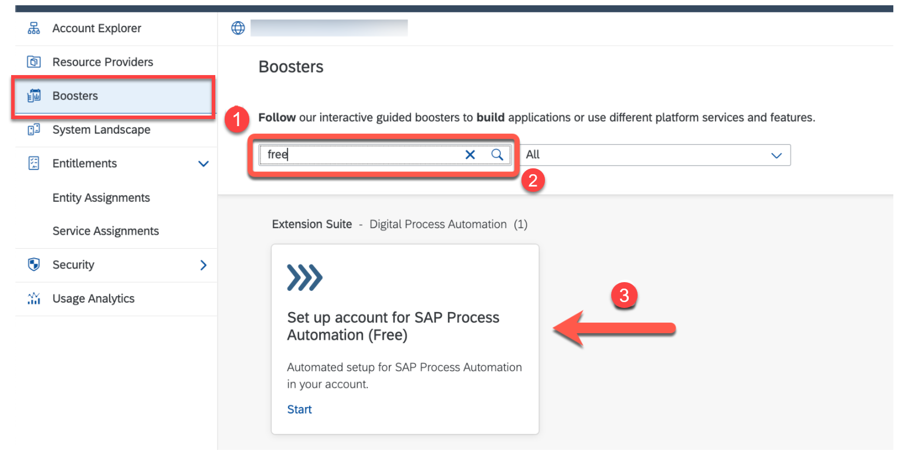
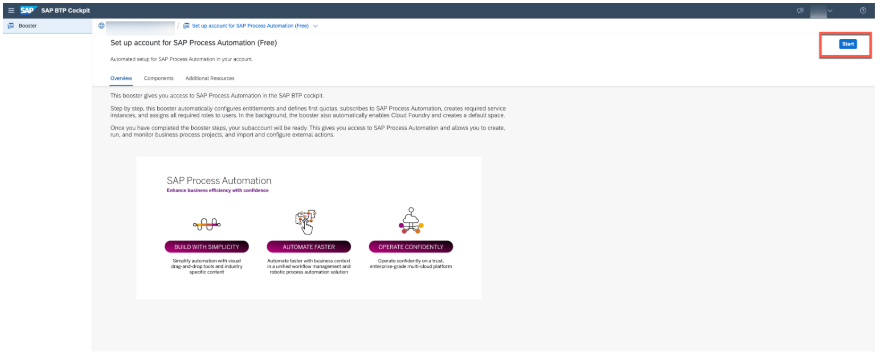
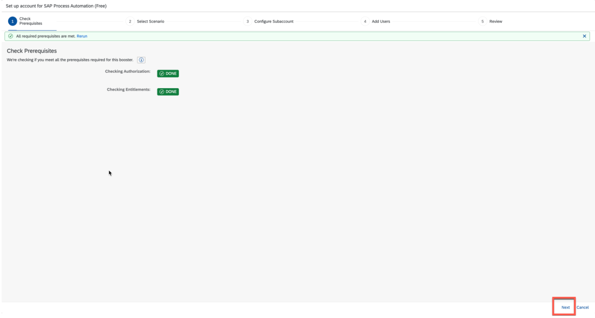
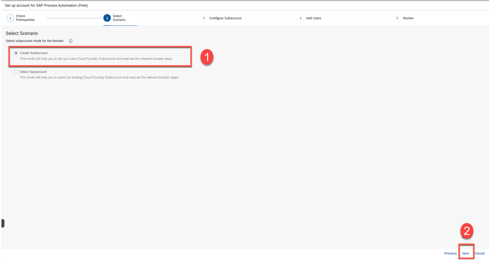
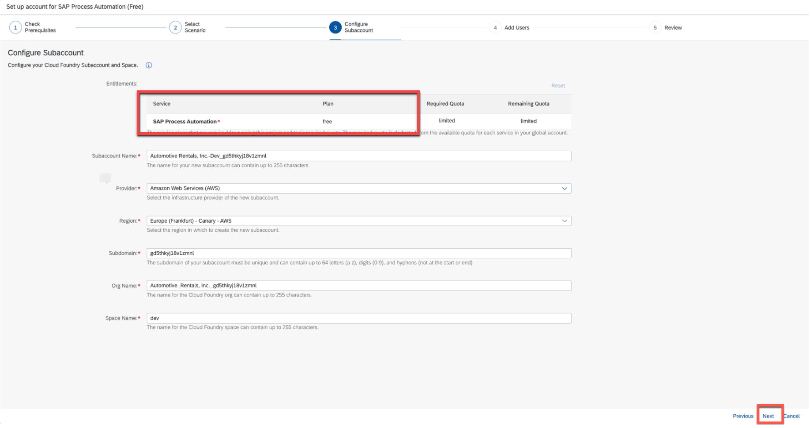
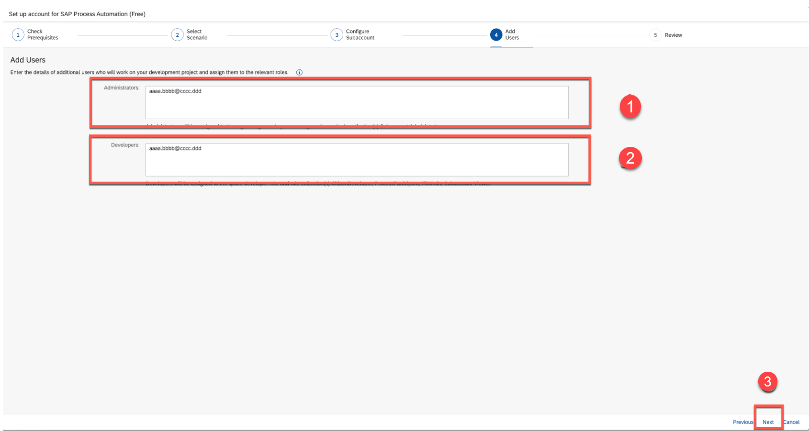
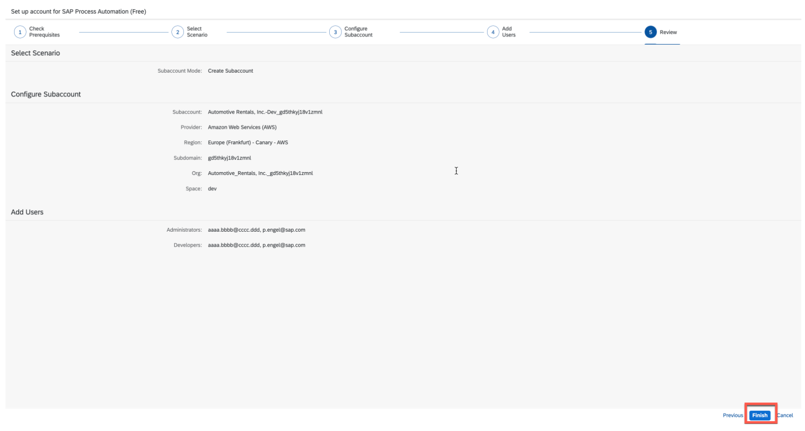
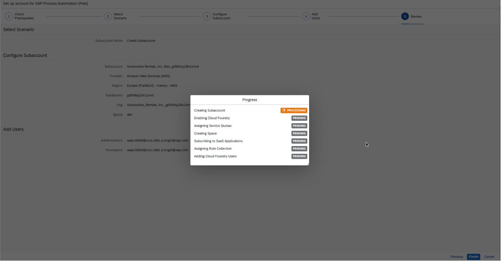
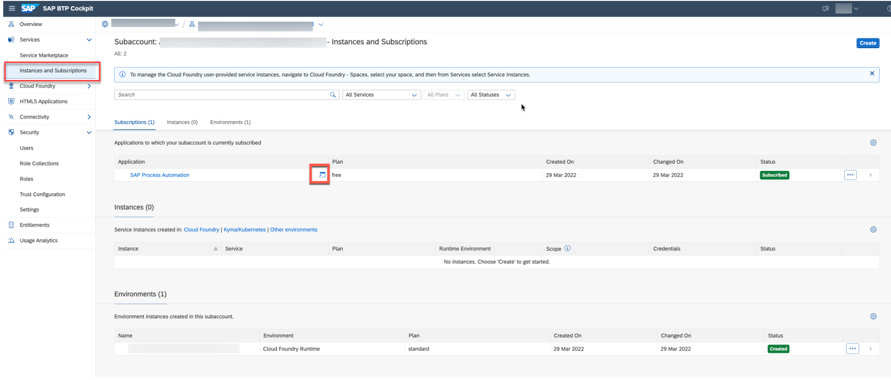
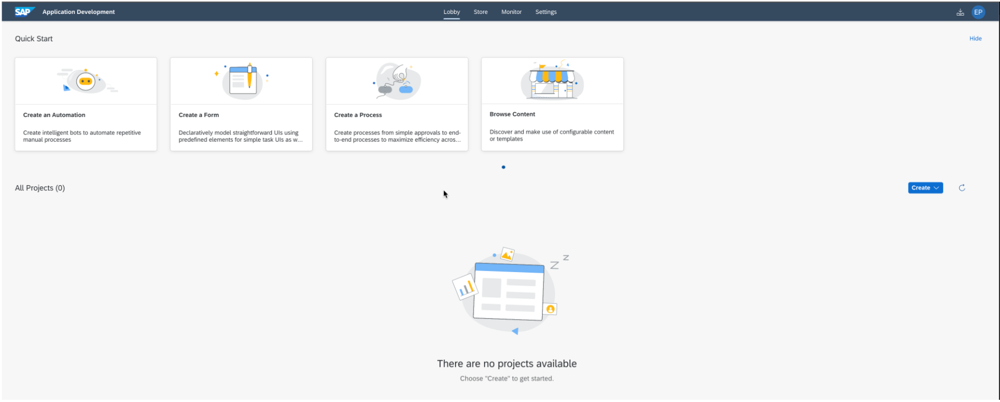

# Subscribe to SAP Process Automation Using Booster in SAP BTP Free Tier
<!-- description --> Activate the SAP Process Automation service in the SAP BTP with booster

## Prerequisites
   [Get an Account on SAP BTP to Try Out Free Tier Service Plans](btp-free-tier-account)

## You will learn
  - How to activate SAP Process Automation in SAP BTP Free Tier

## Intro
SAP Process Automation in the SAP Business Technology Platform combines the capabilities of SAP Workflow Management and SAP Intelligent RPA in an easy-to-use, no-code AI-powered experience. It increases organizations' capacity to drive process automation by empowering business experts to become citizen developers. Leveraging the power of no-code, citizen developers can build, adapt, improve, and innovate business processes with minimum assistance from scarce IT resources.

---

### Creation of SAP BTP Free Tier Account

  SAP Process Automation is available only on SAP BTP Free Tier Account.
  Create a SAP BTP Free Tier Account using the following tutorial: [Get an Account on SAP BTP to Try Out Free Tier Service Plans](btp-free-tier-account)

### Subscribe to SAP Process Automation Booster

1. After successful creation of SAP BTP account using Free Tier, navigate to Boosters and search for **free** to find the **SAP Process Automation** booster. Once the tile is shown, select the tile.

    > Booster is a guided set of automatic instructions to achieve a specific goal. SAP Process Automation automates the onboarding of SAP Process Automation service in your account without the need of any manual configurations. It will configure entitlement, enable SAP Process Automation subscription, and will assign all the relevant role collections to the given users for administrator or developer personas.

    <!-- border -->

2. You will be navigated to the overview page of the booster. Choose **Start**.

    <!-- border -->

3.  The booster tests the prerequisites for the service and your credentials. Once the **Prerequisites** are marked as **DONE** in green, it indicates that the tests have passed successfully. Choose **Next**.

    <!-- border -->

4. In this step you can create a new sub-account or use an existing one. Here, you will create a new sub-account scenario and choose **Next**.

    > You cannot have SAP Process Automation and SAP Intelligent RPA in the same sub-account.

    <!-- border -->

5. System shows you all generated IDs which can be changed or accepted in the next page. The most important point here is that you can see the correct service and plan in the green box then choose **Next**.

    <!-- border -->

6. Maintain users that would be added to the SAP Process Automation service. The users can be added later too.

    <!-- border -->

7. Summary of the booster is shown in the last page for review. After the review, choose **Finish**.

    <!-- border -->  

8. The booster starts the deployment which can take up to five minutes to get the service ready.

    <!-- border -->

9. In the sub-account, choose **Instances and Subscriptions** in the menu.

    You now get an overview on the activated services and you can move directly to the **SAP Process Automation** application by selecting the icon.

    > SAP Process Automation Application Development workbench which will be your one-stop studio to develop, test, deploy and monitor your processes with different skills like decision, automation, forms etc.

    <!-- border -->

10. You will have access to the Application Development studio which is a no-code environment from where you can start your development of the business processes.

    <!-- border -->

    Your are now ready to use SAP Process Automation in SAP BTP Free Tier.

---
