# Release and Deploy the Process to trigger Technical Events
<!-- description --> Release and deploy the Process to retrieve details on an excel spreadsheet

## Prerequisites
- [Subscribe to SAP Process Automation Using Booster in SAP BTP Free Tier](spa-subscribe-booster)
- [Install and Setup the Desktop Agent](spa-setup-desktop-3-0-agent)
- [Agent Management Settings to Execute the Process with an Automation](spa-run-agent-settings)

## You will learn
  - How to release and deploy the business process project

---

### Create the project launcher

Since the automation requires a human intervention, with a popup dialog, the automation has to be executed in attended mode. This means that the user must be present for the automation to run.

You will trigger the automation using the project launcher.

>The project launcher allows you to launch your automation in attended mode in two different ways:
- You can launch your automations manually in attended mode from the agent using the Launch manually from the agent section.
- You can configure events to trigger and launch your automations automatically using the Launch automatically by events section.

In this tutorial, you will manually launch your automation from the agent by adding it in the Launch manually from the agent section of the project launcher.

1. In the **Application Development** page, choose **Create** and **Project Launcher**.

    <!-- border -->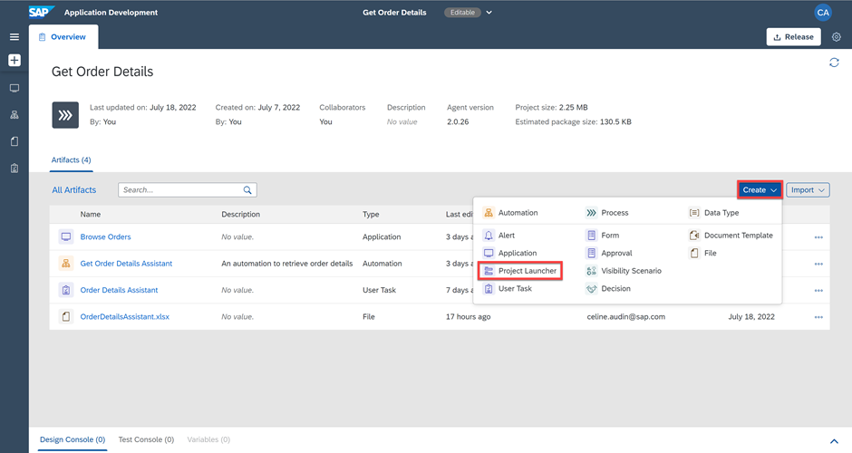

2. In the **Create Project Launcher** window, name the project **Get Order Details** and choose **Create**.

    <!-- border -->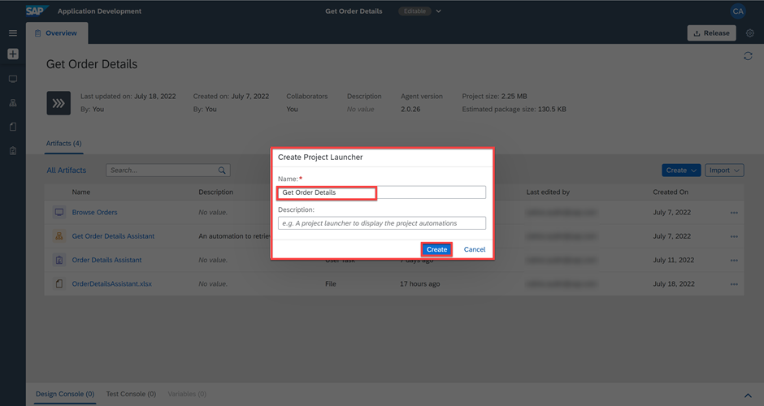

    A project launcher editor opens in the main panel of the Application Development. On the Project Launcher details information right-hand side panel, you can see the automations available in your project.

3. In the **Project Launcher Details**, drag the automation and drop it in the **Launch manually from agent** section of the project launcher.

4. Choose **Save**.

    <!-- border -->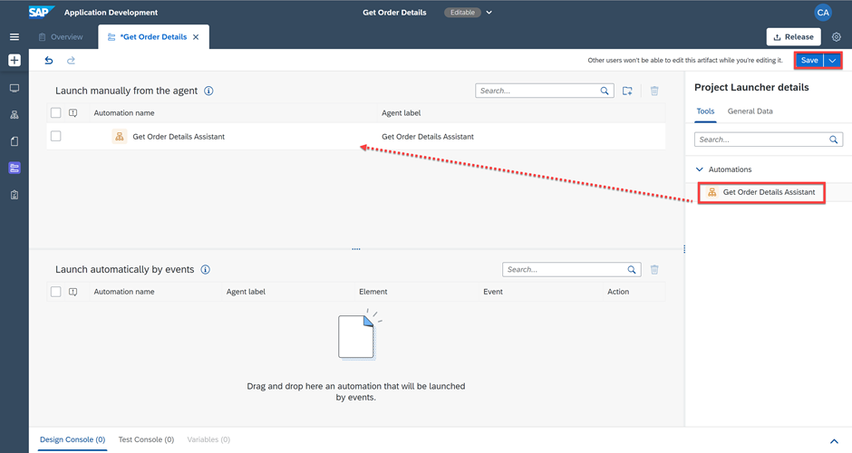

### Release and deploy the business process project

Now you may release and deploy it in attended mode. You need to select this trigger type since the user is asked to perform an action, which is to approve or decline retrieving the order details in an excel spreadsheet.

1. In the Process Builder, choose **Release**.

    <!-- border -->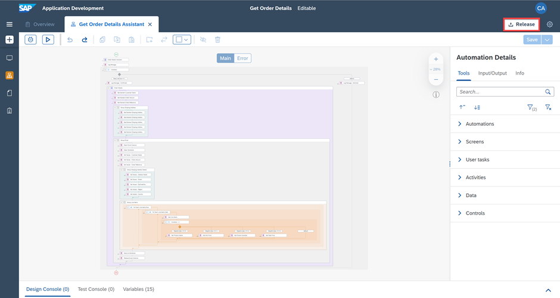

2. Add a **Version Comment** if needed and choose **Release**.

    <!-- border -->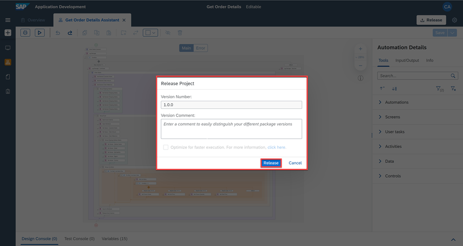

    > ## What's going on?
    > Every time you release, a new version will be created. Versions are incremented automatically based on how you want to store the changes in the repository (that is as major or minor updates or as a patch). Versions use an x.y.z format where x is a major version number, y is minor, and z is the patch number. For instance, if you are releasing your process project for the first time, then the version will start with 1.0.0. The next time you release there will be options to choose from – that is, if the new version is a major, minor, or patch update; version numbers will be automatically updated.

3. The project released successfully and is ready to be deployed.

    <!-- border -->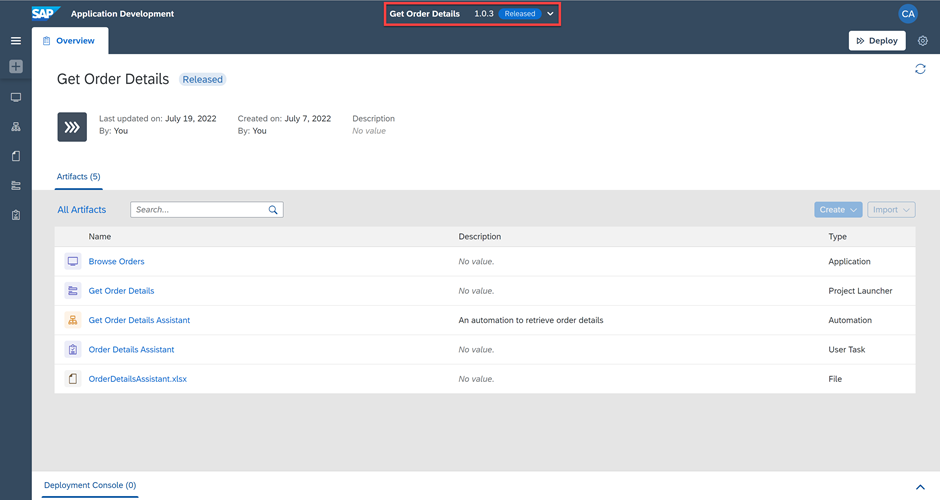

    You can deploy Business Process projects from each released version of the project in the Process Builder or through the Lobby. Deploying the project makes it available for others to use it. Bare in mind that you can only deploy a released version of the project.

4. From the released version of the Business Process project in the Process Builder, choose **Deploy**.

    <!-- border -->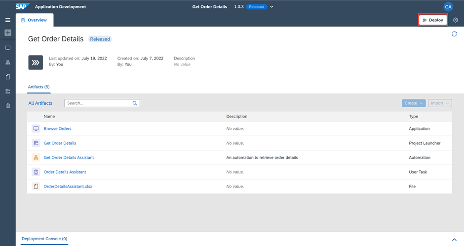

5. Select **Create a Trigger** and then **Next**.

    <!-- border -->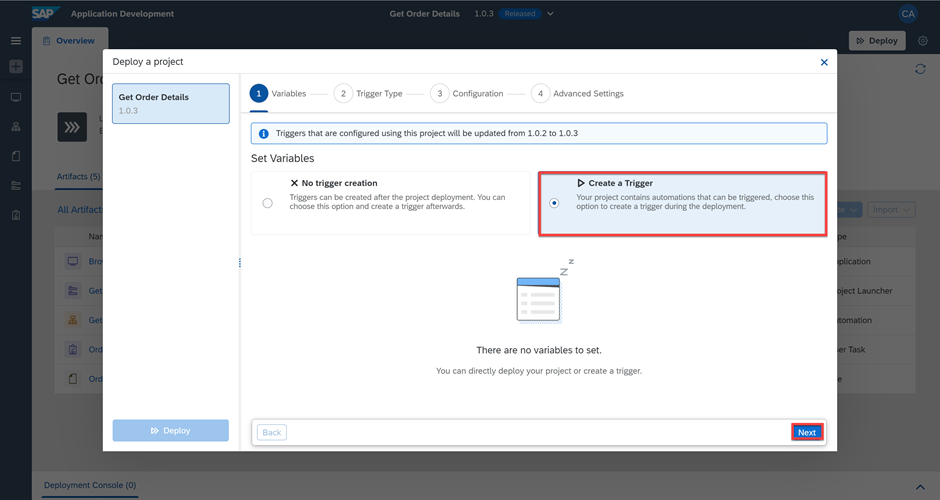

6. Select **Attended** as a trigger type and **Next**.

    <!-- border -->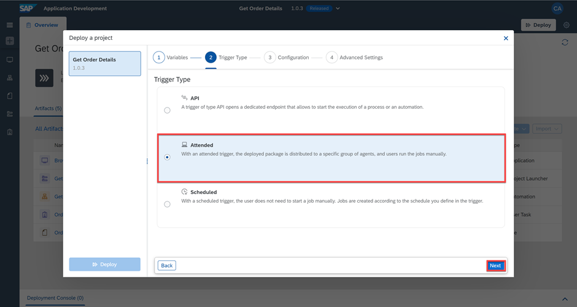

7. Enter the configuration details and choose **Next**.

    <!-- border -->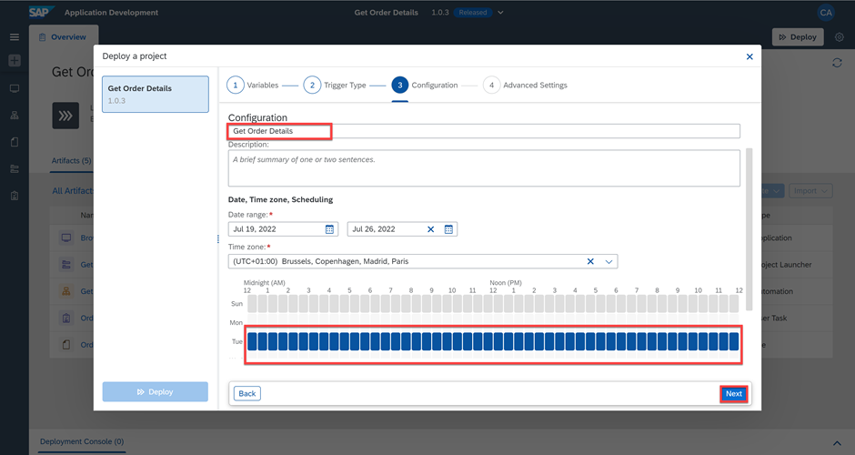

8. You may add an attribute, choose **Confirm** and then **Deploy**.

    <!-- border -->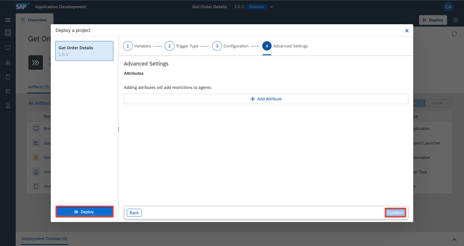

    To Deploy will take a couple of seconds/minutes depending upon how big your project is and how many different skills it has. Any errors during the deployment will be shown in the Design Console.

6. The project deployed successfully and is now ready to be executed.

    <!-- border -->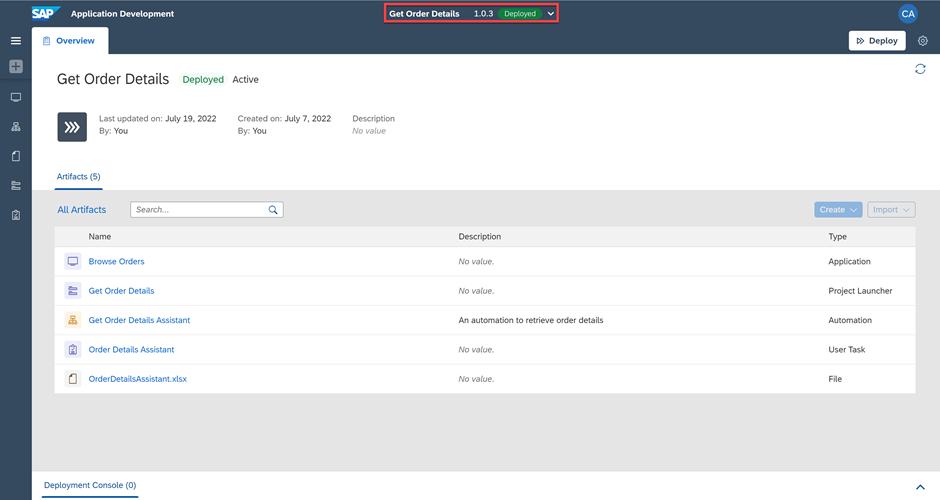

    > You cannot edit released or deployed projects. To continue working on your project, you need to select the Editable option from the list of released versions.

7. Go to your System Tray and choose **Projects**.

    <!-- border -->

8. Your project is ready to be launched in attended mode. Choose **Start**.

    <!-- border -->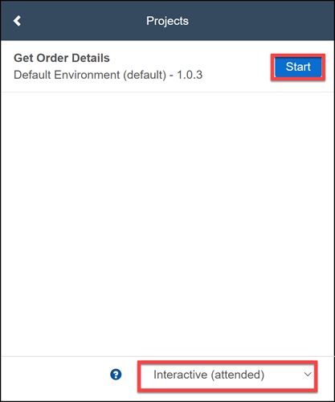

---
