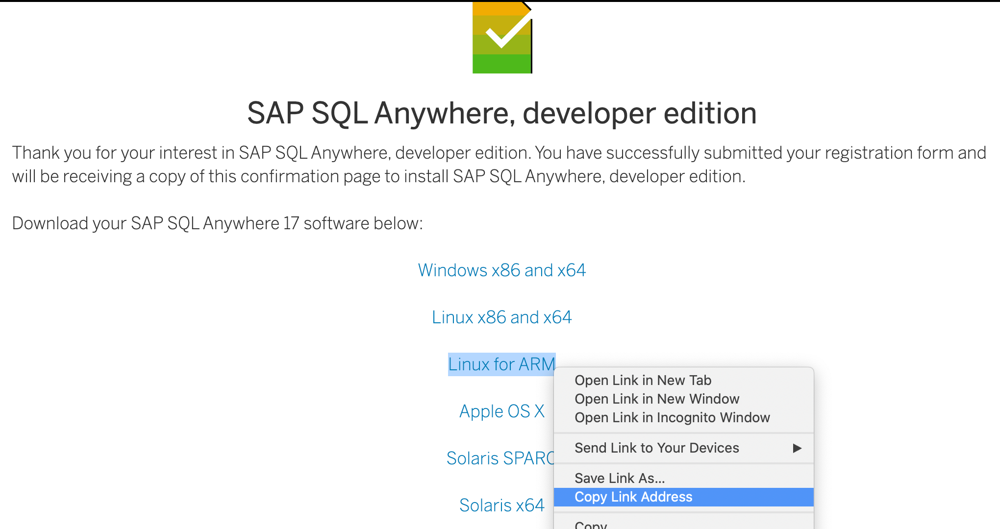
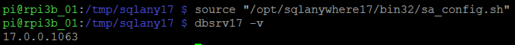

## Prerequisites  
- Raspberry Pi installed with Raspbian operating system (other Linux distributions and other ARMv6 and ARMv7 devices may work as well, but some commands may be different)
- Internet connection from Raspberry Pi
- Terminal access to Raspberry Pi (either through SSH or connected display)

## How-To Details
This How-To tutorial focuses on version 17 of the SAP SQL Anywhere Developer Edition and Raspberry Pi 3 Model B. Other Linux distributions and other ARMv6 and ARMv7 devices should work as well, but some commands may be different.

### Time to Complete
**15 Min**.

---

[ACCORDION-BEGIN [Step 1: ](Prepare your Raspberry Pi board)]
Before running this installation guide you should check that your Raspberry Pi software is up to date with the latest patches. You can follow steps below, or do it in your favorite way.

First download package lists from the repositories and get information on the newest versions of packages and their dependencies.

```sh
sudo apt update
```

Next, upgrade any packages installed on your system that need upgrades.

```sh
sudo apt full-upgrade
```

It can take even up to one hour to finish the previous command depending on the number of packages to be upgraded.


[ACCORDION-END]

[ACCORDION-BEGIN [Step 2: ](Register for SAP SQL Anywhere Developer Edition)]
Register for the SAP SQL Anywhere Developer Edition: <https://www.sap.com/cmp/td/sap-sql-anywhere-developer-edition-free-trial.html>

Once you have received confirmation e-mail, check its content for links to download software packages for different versions, links to documentation and a link to user forums.


[ACCORDION-END]


[ACCORDION-BEGIN [Step 3: ](Download the software)]
Copy the link to SAP SQL Anywhere 17 `Linux for ARM` software from the registration form on the web or the registration confirmation e-mail.


Open a shell on your Raspberry Pi (either through SSH or from the desktop). Download and extract the SQL Anywhere software.

```sh
cd /tmp
wget http://[hostnamefromemail].cloudfront.net/sqla17developer/bin/sqla17developerlinuxarm.tar.gz
tar -xvf sqla17developerlinuxarm.tar.gz
ls sqlany17/
```


[ACCORDION-END]

[ACCORDION-BEGIN [Step 4: ](Run the setup script)]
Go to installation directory and run the `setup` script to create the new installation of the SAP SQL Anywhere.
```sh
cd sqlany17/
sudo ./setup
```

Follow installation prompts to:

 1. Select your location or region
 2. Read and accept the License Agreement
 3. Select an installation type **Create a new installation**
 4. Press **Enter** when requested a registration key. This will install the developer edition
 5. Read and accept the Specific License Terms for SAP SQL Anywhere Developer Edition
 6. Make sure all component options are selected and then **Start Install**
 7. Decide if you want to share product/feature usage to SAP
 8. Answer **No** to check for the updates now. You have downloaded the latest available SQL Anywhere Developer Edition already.
 9. Review the `README` file.

The setup is finished and the following components should be installed:

- `SQL Anywhere Client (32-bit)`
- `SQL Anywhere Server (32-bit)`
- `MobiLink Client (32-bit)`
- Samples

Note the following statement displayed during the installation process
```
To set your SQL Anywhere 17 environment you need to source the
configuration file appropriate to your shell. For example, to use
SQL Anywhere with a bourne-compatible shell, run:

  source "/opt/sqlanywhere17/bin32/sa_config.sh"

Before using the samples for SQL Anywhere 17, source the configuration script
found in the samples directory of the install. For example, run:

  source "/opt/sqlanywhere17/samples/sample_config32.sh"
```


[ACCORDION-END]

[ACCORDION-BEGIN [Step 5: ](Check the installed software)]
The SQL Anywhere executable and libraries are not added to the `PATH` and `LD_LIBRARY_PATH` environment variables automatically. You can add this to the current shell's environment by sourcing the configuration files as mentioned in the previous step before running the database version check.

```sh
source "/opt/sqlanywhere17/bin32/sa_config.sh"
dbsrv17 -v
```




[ACCORDION-END]

---

### Optional


[ACCORDION-BEGIN [Step 6: ](Check SAP SQL Anywhere documentation)]
Check complete documentation: <https://help.sap.com/viewer/product/SAP_SQL_Anywhere/>


[ACCORDION-END]
