## Details
### You will learn  
  - How to create a Git repository on SAP Cloud Platform and synchronize your project in SAP Web IDE with the Git repository on SAP Cloud Platform

---

[ACCORDION-BEGIN [Step 1: ](Open overview screen of cockpit)]

To go to the overview screen of the SAP Cloud Platform cockpit, choose your user ID at the top of the screen.
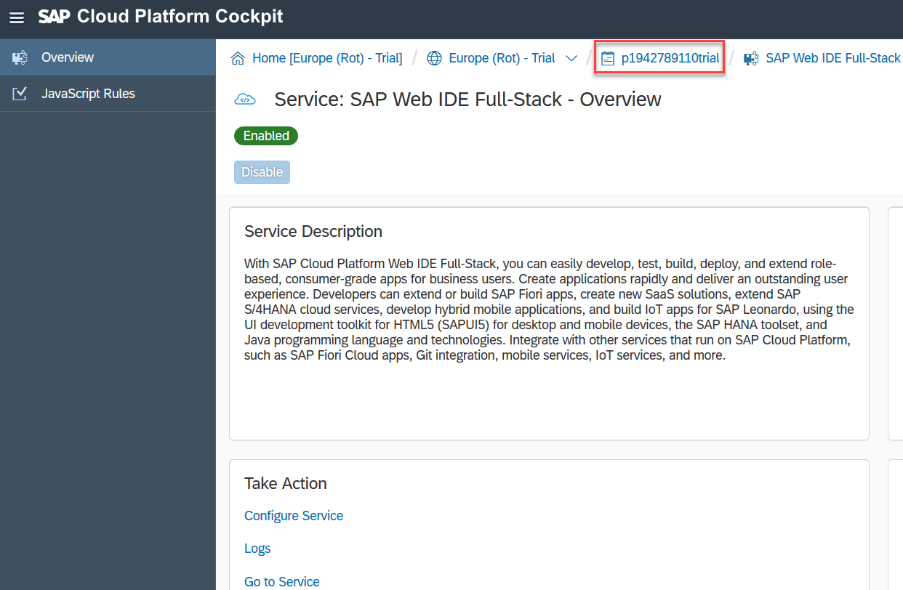

[DONE]

[ACCORDION-END]

[ACCORDION-BEGIN [Step 2: ](Open Git Repositories section)]

In the navigation area on the left, choose **Repositories | Git Repositories**.
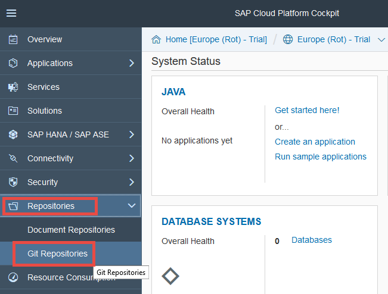

[DONE]

[ACCORDION-END]

[ACCORDION-BEGIN [Step 3: ](Create a new repository)]

Choose **New Repository**, and enter the following details:

Field             | Value
:---------------- | :----------------
Repository Name   | `sampleshop`
Description       | `Repository for Shop app`

Make sure the **Create empty commit** box is selected.
To create your Git repository, choose **OK**.

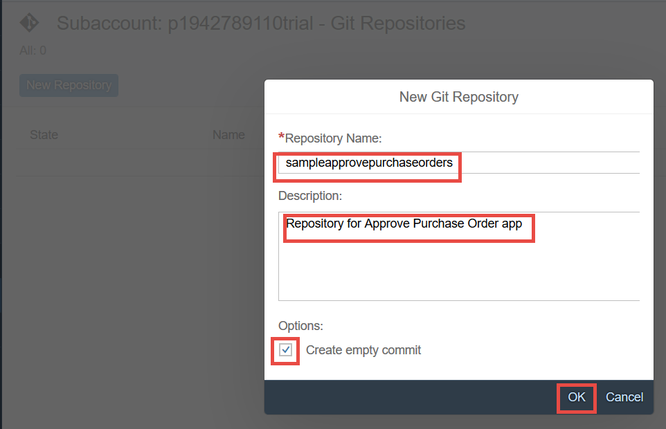

[DONE]

[ACCORDION-END]

[ACCORDION-BEGIN [Step 4: ](Open the repository overview page)]

Choose the **`sampleshop`** repository link to open the repository overview page.

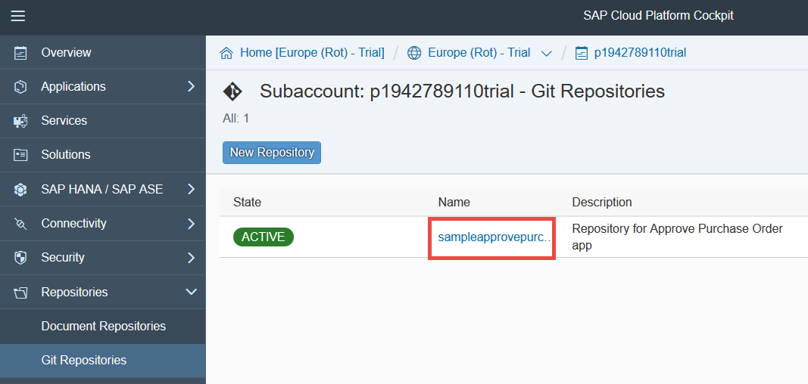

On the repository overview page, copy the repository URL:

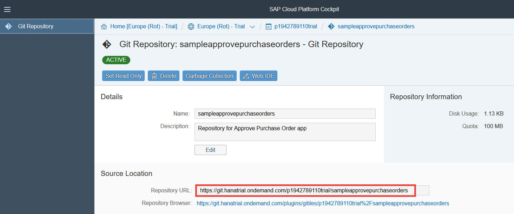

[DONE]

[ACCORDION-END]

[ACCORDION-BEGIN [Step 5: ](Initialize the local repository)]

Open your project in **SAP Web IDE**, right-click the root folder (`sample.shop`) and choose **Git** | **Initialize Local Repository**.

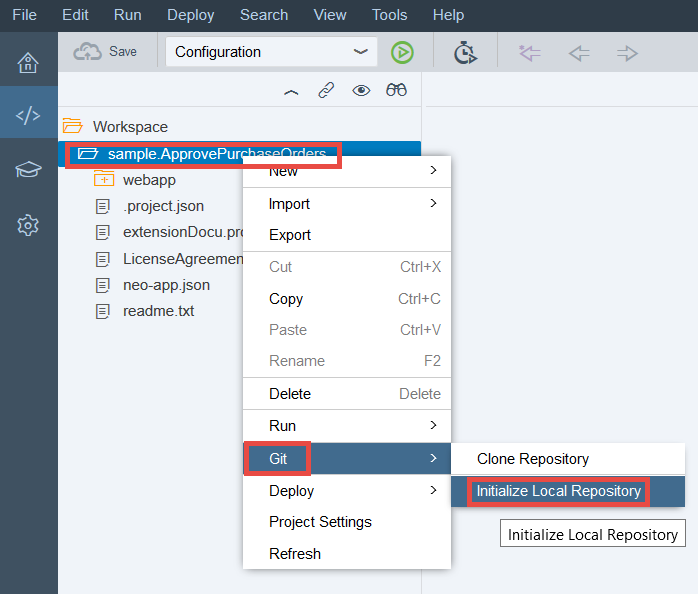

An **alert** appears in the upper right corner of the SAP Web IDE window.
Choose **Set Remote** in the alert.

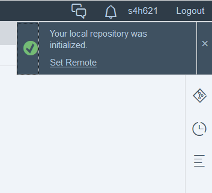

[DONE]

[ACCORDION-END]

[ACCORDION-BEGIN [Step 6: ](Enter a link to the remote repository)]

In the **Configure Git Repository** dialog box, paste the **repository URL** that you copied in step 3 in the URL field by choosing Ctrl + V. Leave the **Add configuration for Gerrit** checkbox deselected and then choose **OK**.

This will initialize your local repository and link it to the Git repository on SAP Cloud Platform.
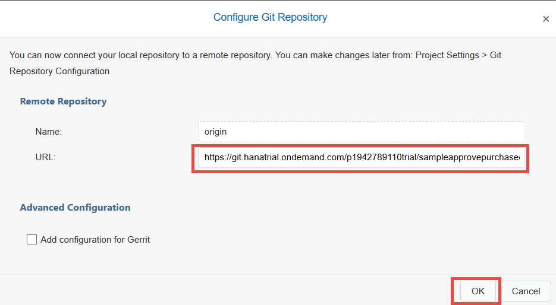

When the **Changes Fetched** dialog box opens, choose **OK**.

[DONE]

[ACCORDION-END]

[ACCORDION-BEGIN [Step 7: ](Open the Git pane)]

Open the Git pane in the right of **SAP Web IDE** and confirm that the correct repository (`sample.shop`) appears at the top of the Git pane.

> If a different Git repository appears, choose your project folder (`sample.shop`) in the left of the SAP Web IDE window.

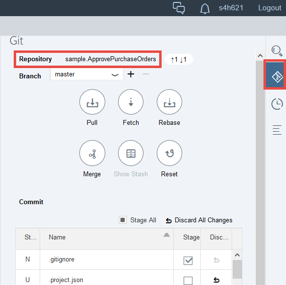

[DONE]

[ACCORDION-END]

[ACCORDION-BEGIN [Step 8: ](Perform a Git merge)]

To merge your local branch with the remote origin/master branch, choose the **Merge** button in the Git pane.
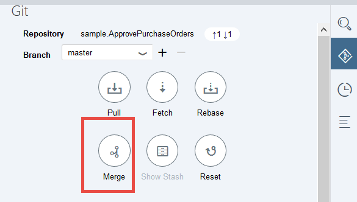

When the **Merge "master"** dialog box opens, make sure the **origin/master** remote branch is selected and choose **OK**.
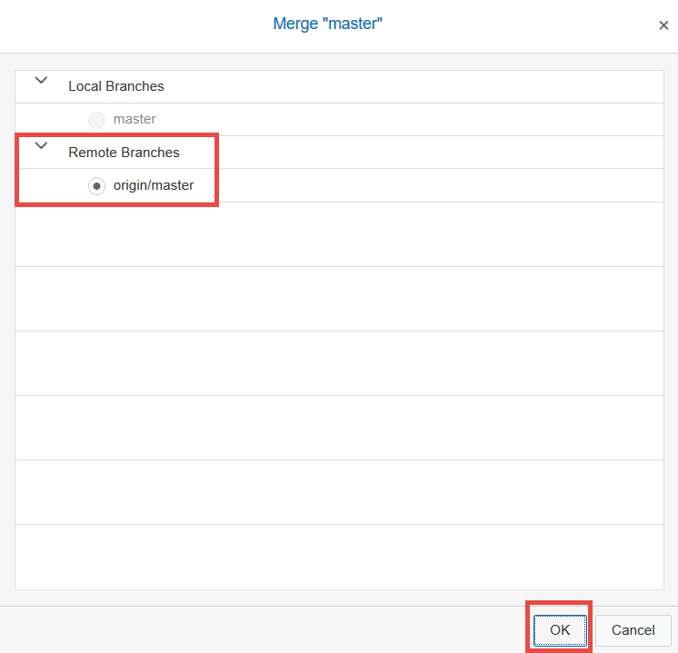

At this point, your Git repository is set up.

In the following steps, you'll commit and push your project files to the Git repository.

[DONE]

[ACCORDION-END]

[ACCORDION-BEGIN [Step 9: ](Stage files)]

Commit all project files by choosing the **Stage All** checkbox.

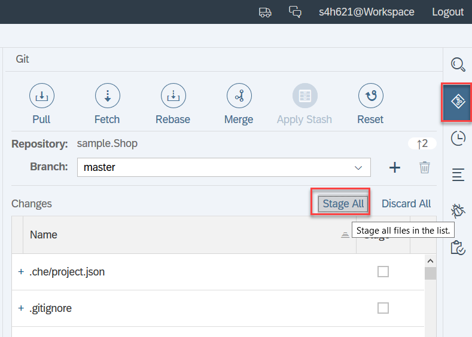

[DONE]

[ACCORDION-END]

[ACCORDION-BEGIN [Step 10: ](Enter a description for the commit)]

Scroll down in the **Git pane** and enter a description like **`initial commit`**.

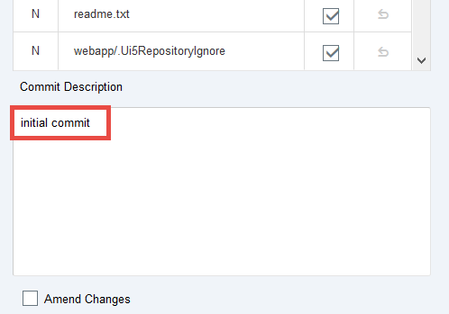

[DONE]

[ACCORDION-END]

[ACCORDION-BEGIN [Step 11: ](Commit and push your changes)]

To add your files to the master branch, choose **Commit and Push** and select **origin/master** from the menu.

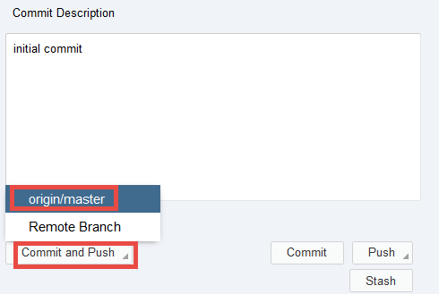

[DONE]

[ACCORDION-END]

[ACCORDION-BEGIN [Step 12: ](Enter user information)]

 If the **User Information** dialog box appears, confirm or enter your Git credentials and choose **OK** to push the changes to the remote repository.

[DONE]

[ACCORDION-END]

[ACCORDION-BEGIN [Step 13: ](View the updated file decorations)]

You'll see a confirmation alert appear briefly just below **Logout** in the top right of the SAP Web IDE window.
You'll also see the decorations change to green dots, which indicate that the files in your project match the versions in the Git repository.

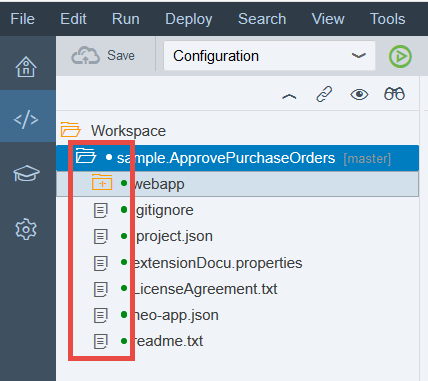

[DONE]

[ACCORDION-END]

[ACCORDION-BEGIN [Step 14: ](Start the deployment to SAP Cloud Platform)]

Now it's time to deploy your app.
Right-click the root folder, `sample.shop`, and choose **Deploy | Deploy to SAP Cloud Platform**.

[DONE]

[ACCORDION-END]

[ACCORDION-BEGIN [Step 15: ](Finalize the deployment to SAP Cloud Platform)]

In the **Deploy Application to SAP Cloud Platform** dialog box, confirm that the **Deploy a new application** and **Activate** checkboxes are selected. Then choose **Deploy**.

Confirm in the popup that you want to use the existing **sample shop** repository.

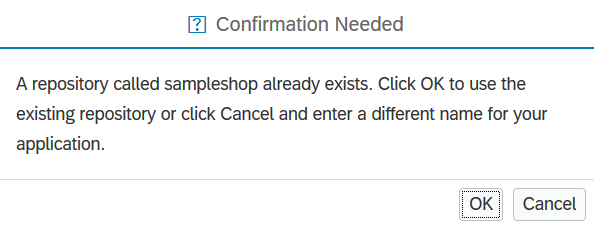

[DONE]

[ACCORDION-END]

[ACCORDION-BEGIN [Step 16: ](Confirm the deployment of your app)]

After the app has been deployed, a success message appears. Close the **Successfully Deployed** dialog box.
You've now prepared everything for the translation step.

[VALIDATE_1]

[ACCORDION-END]
