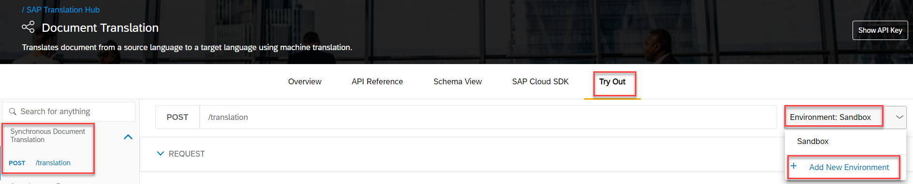
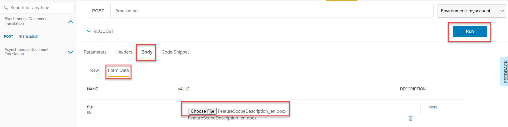

## Prerequisites
- You have created a Free Tier account on SAP Business Technology Platform: [Get an Account on SAP BTP to Try Out Free Tier Service Plans](btp-free-tier-account) or you have your own SAP BTP Enterprise Account.
- You have created the credentials for Document Translation, as described in [Create Service Instance for Document Translation](sth-enable-document-translation).
- You want to translate a document that is not larger than 5 MB because this is the limit for the SAP API Business Hub and contains less than 40.000 characters (document translation API restriction for synchronous API).

## Details
### You will learn
 - How to get started with SAP API Business Hub
 - How to maintain the Document Translation credentials in SAP API Business Hub
 - How to translate a Document in SAP API Business Hub

[ACCORDION-BEGIN [Step 1: ](Navigate to the SAP API Business Hub)]
Follow the link to the [SAP API Business Hub](https://api.sap.com/).

!

[DONE]
[ACCORDION-END]

[ACCORDION-BEGIN [Step 2: ](Log into SAP API Business Hub)]
The SAP API Business Hub offers a test facility for APIs. In order to take advantage of this, you need to log on.

Select **Login** at the top of the page.

!

[DONE]
[ACCORDION-END]

[ACCORDION-BEGIN [Step 3: ](Search for Document Translation API)]
Search for `document translation` to find the Document Translation API and select the Document Translation API.

!

[DONE]
[ACCORDION-END]

[ACCORDION-BEGIN [Step 4: ](Explore the Document Translation API)]
The Document Translation API Reference page shows the two available APIs.

!

Take a minute to explore both APIs.

[DONE]
[ACCORDION-END]

[ACCORDION-BEGIN [Step 5: ](Maintain the API environment)]
The service offers a sandbox system out of the box, but the idea of this tutorial is to show, how to connect your SAP BTP free tier or enterprise account to the SAP API Business Hub.

1. Select the **Try Out** button.

    !

2. Click **Environment: Sandbox** to open the menu and select **+ Add New Environment**

    !

3. In the **Configure Environment** screen, enter a display name for the environment: `myaccount`and select the **Starting URL** corresponding to the region of your SAP BTP account.

    !

4. For client ID and client secret, take the information from the Document Translation credentials as described in [Create Service Instance for Document Translation](sth-enable-document-translation)

    !

5. For subaccount, take the subdomain information from your SAP Business Technology Platform cockpit. For example, on the screen-shot below, the sub-account is `80c353f5trial`.

    !

    Enter your value in SAP Business API Hub.

    !

6. Save your settings for future sessions.

    !

[DONE]
[ACCORDION-END]

[ACCORDION-BEGIN [Step 6: ](Test with your own account)]
Now that your API environment is maintained, you will see the `myaccount` entry.

Select **Synchronous document translation** and **POST /translation**.

!

[DONE]
[ACCORDION-END]

[ACCORDION-BEGIN [Step 7: ](Test an API endpoint)]
You can maintain the languages in the **Parameters** section. Source and Target Language fields are already pre-filled with values for English and German. If you want to try out other language codes, please refer to the available language information [here](https://help.sap.com/viewer/9f73362817cd48339dd8a6acba160f7f/Cloud/en-US/6fc2e5ab04a94da4a0c3d0740a9bb2ff.html).

!

[DONE]
[ACCORDION-END]

[ACCORDION-BEGIN [Step 8: ](Upload a file)]
Go to the **Body** section and select **Form Data**.

**Choose File** to select a document from your file source system (Microsoft Word, Microsoft PowerPoint, Microsoft Excel or other file formats which are mentioned [here](https://help.sap.com/viewer/9f73362817cd48339dd8a6acba160f7f/Cloud/en-US/a2dedd7861624a1a82d7ec7ea431a8e4.html)) and click **Run**.

!

[DONE]
[ACCORDION-END]

[ACCORDION-BEGIN [Step 9: ](View the translation result)]
After some seconds you will see in the **Response Body** section a **Download file** link. Click the link and the translated file will be downloaded.

!

Open the file and verify the translation result.

!

[VALIDATE_1]
[ACCORDION-END]

---
