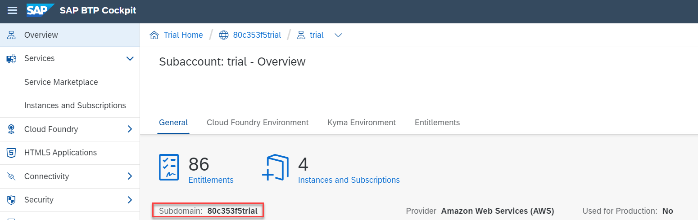

## Prerequisites
- You have created a trial account on SAP Business Technology Platform: [Get a Free Trial Account on SAP Cloud Platform](hcp-create-trial-account)
    - Hint: [Watch the video and learn how to create the account](https://www.youtube.com/watch?v=n5luSQKYvQQ&feature=emb_logo)
- You have created the credentials for Document Translation, as described in [Create Service Instance for Document Translation](sth-enable-document-translation)

## Details
### You will learn
 - How to get started with SAP API Business Hub
 - How to maintain the Document Translation credentials in SAP API Business Hub
 - How to translate a Document in SAP API Business Hub

[ACCORDION-BEGIN [Step 1: ](Navigate to the SAP API Business Hub)]
Follow the link to the [SAP API Business Hub](https://api.sap.com/).

!

[DONE]
[ACCORDION-END]

[ACCORDION-BEGIN [Step 2: ](Log into SAP API Business Hub)]
The SAP API Business Hub offers a test facility for APIs. In order to take advantage of this, you need to log on.

Select **Log On** at the top of the page.

!

[DONE]
[ACCORDION-END]

[ACCORDION-BEGIN [Step 3: ](Search for Document Translation API)]
Search for `document translation` to find the Document Translation API and select the Document Translation API.

!

[DONE]
[ACCORDION-END]

[ACCORDION-BEGIN [Step 4: ](Explore the Document Translation API)]
The Document Translation API detail page shows the two available APIs.

!

Take a minute to explore both APIs.

[DONE]
[ACCORDION-END]

[ACCORDION-BEGIN [Step 5: ](Maintain the API environment)]
The service doesn't offer a sandbox system out of the box, so you have to connect your SAP Business Technology Platform trial account to the SAP API Business Hub.

1. Select the gear wheel symbol to open the **Configure Environments** screen.

    !

2. In the **Configure Environment** screen, enter the display name for the environments: `trial`

    !

3. For client ID and client secret, take the information from the Document Translation credentials as described in [Create Service Instance for Document Translation](sth-enable-document-translation)

    !

4. For subaccount, take the information from your SAP Business Technology Platform cockpit. For example, on the screen-shot below, the sub-account is `f2b0bceetrial`.

    !

    Enter your value in SAP Business API Hub.

    !

5. Save your settings for future sessions.

    !

    Confirm that you want to proceed with the save.

    !

[DONE]
[ACCORDION-END]

[ACCORDION-BEGIN [Step 6: ](Try out)]
Now that your API environment is maintained, you will see the `trial` entry.

Select **Synchronous document translation** and click **Try out**. Please note that the button is only active if you are logged on.

!

[DONE]
[ACCORDION-END]

[ACCORDION-BEGIN [Step 7: ](Test an API endpoint)]
Clicking **Try out** opens any parameters in that section for input.

Source and Target Language fields are already pre-filled with values for English and German. If you want to try out other language codes, please refer to the available language information [here](https://help.sap.com/viewer/9f73362817cd48339dd8a6acba160f7f/Cloud/en-US/6fc2e5ab04a94da4a0c3d0740a9bb2ff.html).

Select a document from your file source system (Microsoft Word, Microsoft PowerPoint, Microsoft Excel or other file formats which are mentioned [here](https://help.sap.com/viewer/9f73362817cd48339dd8a6acba160f7f/Cloud/en-US/a2dedd7861624a1a82d7ec7ea431a8e4.html)) and click **Execute**.

!

[DONE]
[ACCORDION-END]

[ACCORDION-BEGIN [Step 9: ](View the translation result)]
After some seconds you will see in the **Response** section a **Download file** link. Click the link and the translated file will be downloaded.

!

Open the file and verify the translation result.

!

[VALIDATE_1]
[ACCORDION-END]

---
