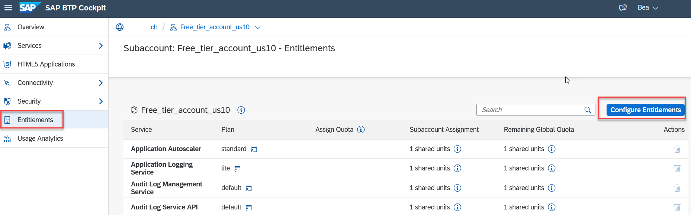

# Set up SAP Translation Hub
<!-- description --> Create a subscription, a service instance and the service binding for SAP Translation Hub using the SAP Business Technology Platform cockpit.

## Prerequisites
 - You have created an account on SAP Business Technology Platform: [Get an Account on SAP BTP to Try Out Free Tier Service Plans](btp-free-tier-account)
 - Please make sure that you are using one of the following Amazon Web Services (AWS) regions:
     - Europe (Frankfurt) cf-eu10
     - or US East (VA) cf-us10 region
     - Description how to create a new subaccount is available [here](https://help.sap.com/docs/SAP_TRANSLATION_HUB/9f73362817cd48339dd8a6acba160f7f/892c6d71f35f414e9aed44bece574e57.html)

## You will learn
- How to create a subscription for SAP Translation Hub
- How to create a service instance and service bindings of SAP Translation Hub
- Which information from the service binding is necessary for the authentication e.g. in SAP Business Accelerator Hub or SAP Enable Now

### Enter your SAP BTP Global account
1. In your web browser, open the [SAP Business Technology Platform cockpit](https://emea.cockpit.btp.cloud.sap/cockpit) and select your global account.

2. Navigate from your global account page to the subaccount you created by clicking on the tile as visible on the example screenshot.

    <!-- border -->
   

   Please make sure that you are using one of the following Amazon Web Services (AWS) regions:
       - Europe (Frankfurt) cf-eu10
       - US East (VA) cf-us10 region

>If you don't have any subaccount in those regions, you can create one using the dropdown menu **Create** and **Subaccount**, located in the top right corner. When creating a subaccount, please make sure that you are using one of the following Amazon Web Services (AWS) regions: Europe (Frankfurt) cf-eu10 or US East (VA) cf-us10 region.

### Assign entitlements
1. In your subaccount account, navigate to **Entitlements**.

2. Click **Edit**, then select **Add Service Plans**. A popover appears with all entitlements available for your directory/subaccount.  

    <!-- border -->
     

3. Select or search for the **`SAP Translation Hub`** service and then select the plan you want to entitle. You can test the service using the **`free`** plan, which entitles you to 500.000 translated characters for Document Translation, and 100.000 translated characters for Software Translation.  

    >Recommendation: We recommend setting up entitlements for an instance and subscription plan from the beginning. You need to enable the subscription plan (application) in order to use the instance plan (API credentials), therefore it is more convenient if you enable them at the same time in this step.

4. Click **Add Service Plans** to exit the popover.  

    <!-- border -->
   

5. Click **Save**.

You have now successfully configured the entitlements for SAP Translation Hub.

### Access service via Service Marketplace
The **Service Marketplace** is where you find the entitled services on SAP BTP. To access it, click **Service Marketplace** on the navigation sidebar and click the tile named `SAP Translation Hub` to access the service. If you don't find it, search for **`translation`**.

   <!-- border -->
  

### Create a subscription to consume SAP Translation Hub via the user interface
If you want to consume the service via the user interface, you need to create a subscription to the application.

1. Select the plan that you want to use ( **`free`** or **`default`** ) and choose **Create**.

    <!-- border -->
   

2. In the dialog, click on **Create**. 

3. In the following dialog, you can click on **View Subscription** to see your application access under **Instances and Subscriptions**. However, before you can use the application, you need to authorize yourself and any user that needs access. 

4. In your subaccount, navigate to **Security**, and then **Role Collections** to select the role collection **`SAP Translation Hub Document Translation`** . Here you can configure which users or user groups get access to the application.

5. In order to add users, click on **Edit**. To add individual users, enter their e-mail addresses under **Users**. You can use **Default identity provider**. You can add more users by using the **+** sign. 

    <!-- border -->
   

6. Click on **Save**. 

7. Navigate back to **Instances and Subscriptions**. You can go to the application by using the shortcut or the menu option. 

    <!--border-->
   

8. **SAP Translation Hub** will open in a new browser tab. You can share this link directly with any user that has been authorized to use the application and use the dropdown menu to switch between the different functions available.

### Create a service instance to consume SAP Translation Hub
If you need API credentials (e.g., to use the service via one of the existing integrations), you need to create an instance.

1. Access the **Service Marketplace** and click on the service **SAP Translation Hub**.

2. Under **Service Plans**, select the plan you want to use ( **`free`** or **`default`** ) and click on the button to **Create** a new instance.

    <!-- border -->
   

3. In the dialog, leave the default values and enter a meaningful name for your new instance, for instance: **`translation`**. Click **Create** Instance (you can ignore the other steps, if you don't need to configure different instance parameters).

    <!-- border -->
   

4. In the following dialog, click **View Instance** to go to the list of your service instances, or navigate yourself to **Instances and Subscriptions**.

You have successfully created a service instance for SAP Translation Hub.

### Create service binding
You are now able to create service bindings for your new service instance. Service bindings are used to generate credentials to enable apps to access and communicate with the service instance.

1. In **Instances and Subscriptions**, click the dots to open the menu and select **Create Service Binding**.

    <!-- border -->
   

2. In the dialog, enter a binding name, such as **`demo-binding`** as the name of your service binding. Click **Create** to create the service binding.

You have successfully created a service binding for your service instance. You can now either view the service binding in the browser or download it.

    <!-- border -->
   

You will need the values of the service bindings, for example, for the following:

- [Enter credentials for Document Translation in SAP Enable Now](https://enablenowexpert.com/?p=714)
