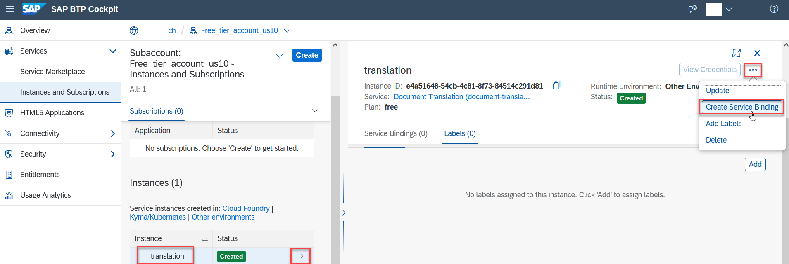

# Create Service Instance for Document Translation
<!-- description --> Create a service instance and the service keys for Document Translation (one of the SAP Translation Hub services) using the SAP Business Technology Platform cockpit.

## Prerequisites
 - You have created an account on SAP Business Technology Platform: [Get an Account on SAP BTP to Try Out Free Tier Service Plans](btp-free-tier-account)
 - Please make sure that you are using one of the following Amazon Web Services (AWS) regions:
     - Europe (Frankfurt) cf-eu10
     - or US East (VA) cf-us10 region
     Description how to create a new subaccount is available [here](https://help.sap.com/docs/SAP_TRANSLATION_HUB/9f73362817cd48339dd8a6acba160f7f/892c6d71f35f414e9aed44bece574e57.html)

## You will learn
- How to create a service instance of Document Translation
- How to create service keys for your service instance
- Which information from the service key is necessary for the authentication e.g. in SAP Business API Hub or SAP Enable Now
---

### Enter your SAP BTP Global account

1. In your web browser, open the [SAP Business Technology Platform cockpit](https://cockpit.eu10.hana.ondemand.com/cockpit).

2. Navigate from your global account page to your created account by clicking on the **Free tier account** as visible on the example screenshot.

    <!-- border -->

    Please make sure that you are using one of the following Amazon Web Services (AWS) regions:
        - Europe (Frankfurt) cf-eu10
        - or US East (VA) cf-us10 region

### Assign entitlements

1. In your subaccount account, navigate to Entitlements.

    <!-- border -->

2. Click Configure Entitlements, then select Add Service Plans.
   A popover appears with all entitlements available for your directory/ subaccount.

3.   Select the Document translation service and then the free plan you want to entitle.

    <!-- border -->

4. Click Add Service Plans to exit the popover.

5. Click Save.

You have now successfully configured the entitlements for document translation.

### Access service via Service Marketplace

The **Service Marketplace** is where you find the entitled services on SAP BTP.

To access it, click **Service Marketplace** on the navigation sidebar and search for **`doc`**. Click the tile named `Document Translation` to access the service.

<!-- border -->

### Create service instance

You will now create an instance of your service.

1. Click on the button to **Create** a new instance.

    <!-- border -->

2. In the dialog, leave the default value for the service and select the **free** service plan.

    For the name for your new instance, enter: `translation`.

    <!-- border -->

    Click **Create** Instance (you can ignore the other steps).

3. In the following dialog, click **View Instance** to go to the list of your service instances.

    

You have successfully created a service instance for Document Translation.

### Create service keys

You are now able to create service keys for your new service instance. Service keys are used to generate credentials to enable apps to access and communicate with the service instance.

1. Click the navigation arrow to open the details of your service instance. Then, click the dots to open the menu and select **Create Service Key**.

      <!-- border -->

2. In the dialog, enter `demo-key` as the name of your service key. Click **Create** to create the service key.

      <!-- border -->

You have successfully created service keys for your service instance. You can now either view the service key in the browser or download it.

<!-- border -->

You will need the values of the service keys to enable the Document Translation service, for example, for the following:

- [Translate Documents with SAP API Business Hub](sth-document-translation-apihub)
- [Enter credentials for Document Translation in SAP Enable Now](https://enablenowexpert.com/?p=714)

---
