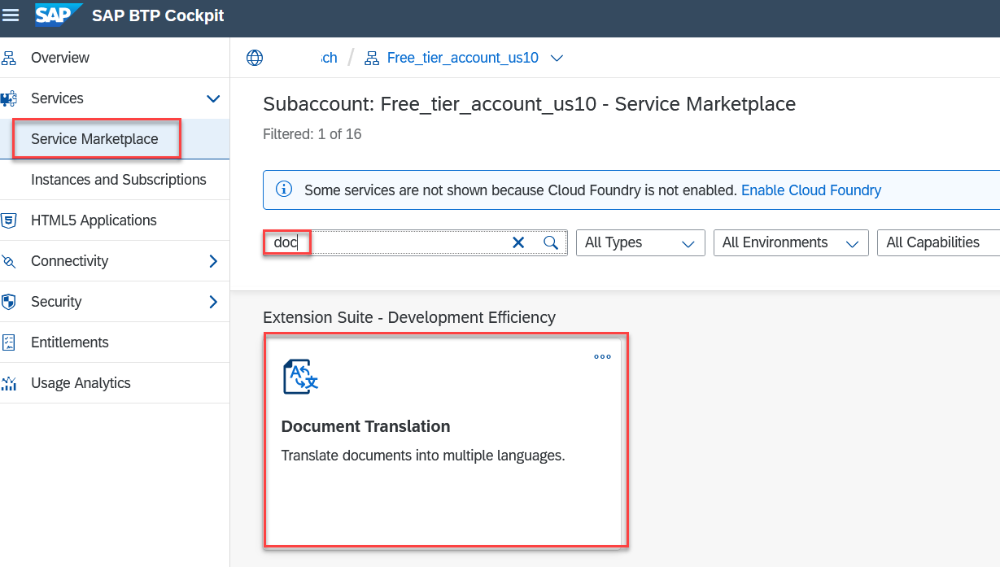
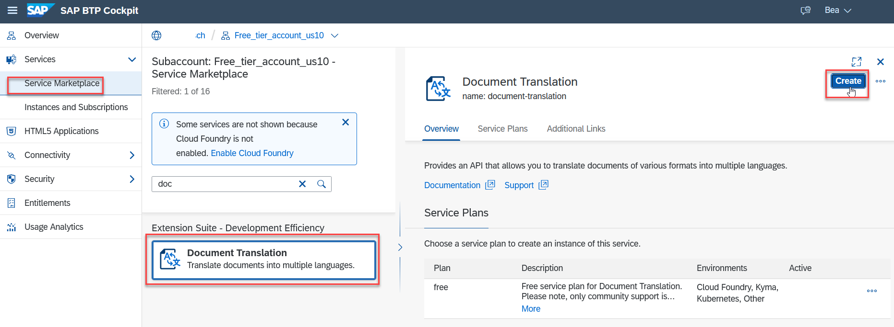
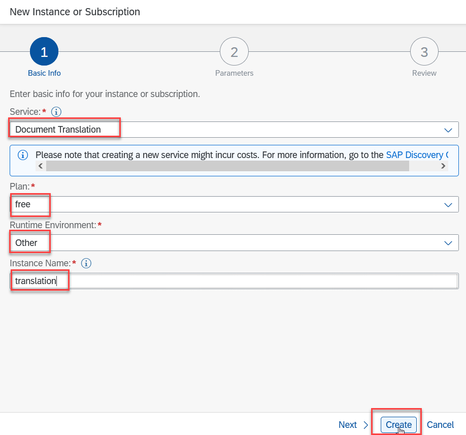
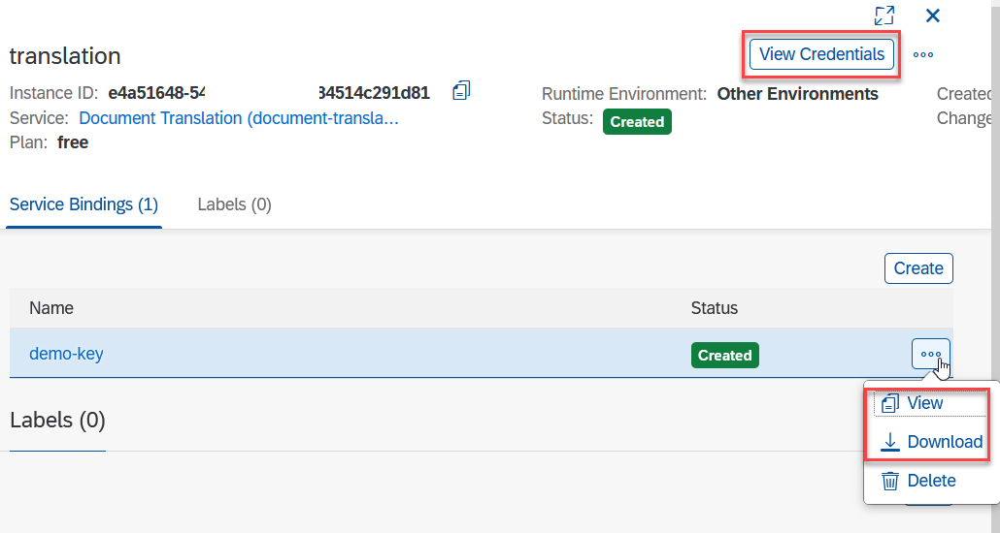

## Prerequisites
 - You have created a trial account on SAP Business Technology Platform (region AWS Europe): [Get a Free Trial Account on SAP Business Technology](hcp-create-trial-account)
    - Hint: [You can also watch the video and learn how to create the account](https://www.youtube.com/watch?v=n5luSQKYvQQ&feature=emb_logo)

## Details
### You will learn
- How to create a service instance of Document Translation
- How to create service keys for your service instance
- Which information from the service key is necessary for the authentication e.g. in SAP Business API Hub or SAP Enable Now
---

[ACCORDION-BEGIN [Step 1: ](Enter your trial account)]

1. In your web browser, open the [SAP Business Technology Platform trial cockpit](https://cockpit.hanatrial.ondemand.com/).

2. Navigate to your trial account by clicking **Enter Your Trial Account**.

    !

    >Please make sure that you are using the region **Europe (Frankfurt) - AWS**.

3. From your global account page, choose the `trial` tile to access your sub account.

    !

[DONE]
[ACCORDION-END]

[ACCORDION-BEGIN [Step 2: ](Access space)]

All applications and services are available in spaces. By default, trial accounts only have the **dev** space available. To access your spaces, click **Spaces** on the navigation sidebar and select the **dev** space to open it. You will create your service instance in this space.

!

[DONE]
[ACCORDION-END]

[ACCORDION-BEGIN [Step 3: ](Access service via Service Marketplace)]

The **Service Marketplace** is where you find the available services on SAP Business Technology.

To access it, click **Service Marketplace** on the navigation sidebar and search for **`doc`**. Click the tile named `Document Translation` to access the service.

!

[DONE]
[ACCORDION-END]

[ACCORDION-BEGIN [Step 4: ](Create service instance)]

You will now create an instance of your service.

1. Click on the three dots and open the menu to **Create** a new instance.

    !

2. In the dialog, leave the default value for the service and select the **trial** service plan.

    For the name for your new instance, enter: `demo`.

    !

    Click **Create Instance** (you can ignore the other steps).

    !

3. In the following dialog, click **View Instance** to go to the list of your service instances.

    

You have successfully created a service instance for Document Translation.

[DONE]
[ACCORDION-END]

[ACCORDION-BEGIN [Step 5: ](Create service keys)]

You are now able to create service keys for your new service instance. Service keys are used to generate credentials to enable apps to access and communicate with the service instance.

1. Click the navigation arrow to open the details of your service instance. Then, click the dots to open the menu and select **Create Service Key**.

      !

2. In the dialog, enter `demo-key` as the name of your service key. Click **Create** to create the service key.

      !

You have successfully created service keys for your service instance. You can now either view the service key in the browser or download it.

!

You will need the values of the service keys to enable the Document Translation service, for example, for the following:

- [Translate Documents with SAP API Business Hub](sth-document-translation-apihub)
- [Enter credentials for Document Translation in SAP Enable Now](https://enablenowexpert.com/?p=714)

[VALIDATE_1]
[ACCORDION-END]
---
