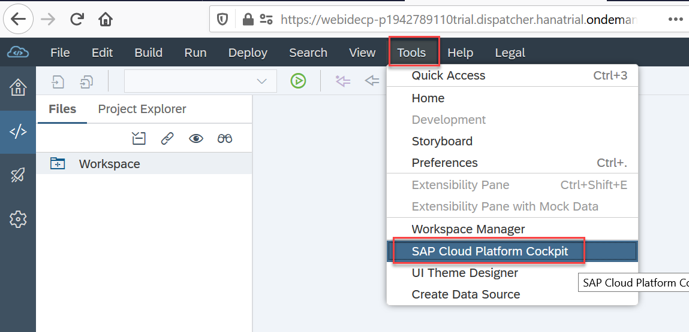

## Prerequisites  
 - **Tutorials:** [Get a Free Trial Account on SAP Cloud Platform](hcp-create-trial-account)

## Details
### You will learn  
  - How to enable the SAP Translation Hub service on SAP Cloud Platform

---
[ACCORDION-BEGIN [Step 1: ](Launch SAP Web IDE)]

SAP Translation Hub is currently only available on Neo Trial landscape and not on SAP Cloud Foundry. You have to choose a workaround to access SAP Translation Hub in your Trial environment. Please open your Trial instance: `https://cockpit.hanatrial.ondemand.com/cockpit/#/home/trial`
In SAP Cloud Platform cockpit, choose the "Launch SAP Web IDE" button.

[DONE]

[ACCORDION-END]

[ACCORDION-BEGIN [Step 2: ](Open SAP Cloud Platform cockpit)]

In SAP Web IDE, choose **Tools** - **SAP Cloud Platform Cockpit** in the navigation area.

[DONE]

[ACCORDION-END]

[ACCORDION-BEGIN [Step 3: ](Open the service catalog)]

In your SAP Cloud Platform trial account, choose **Services** in the navigation area on the left.

[DONE]

[ACCORDION-END]

[ACCORDION-BEGIN [Step 4: ](Locate the SAP Translation Hub service)]

Search for the SAP Translation Hub service by entering **`transl`**, and then choose the **SAP Translation Hub** tile.

[DONE]

[ACCORDION-END]

[ACCORDION-BEGIN [Step 5: ](Enable the service)]

Choose **Enable**.

[DONE]

[ACCORDION-END]

[ACCORDION-BEGIN [Step 6: ](Verify that the service is enabled)]

After you enable the service, the **Enabled** status is green and the link to the SAP Translation Hub UI in the **Take Action** section is active:

[VALIDATE_1]

[ACCORDION-END]
