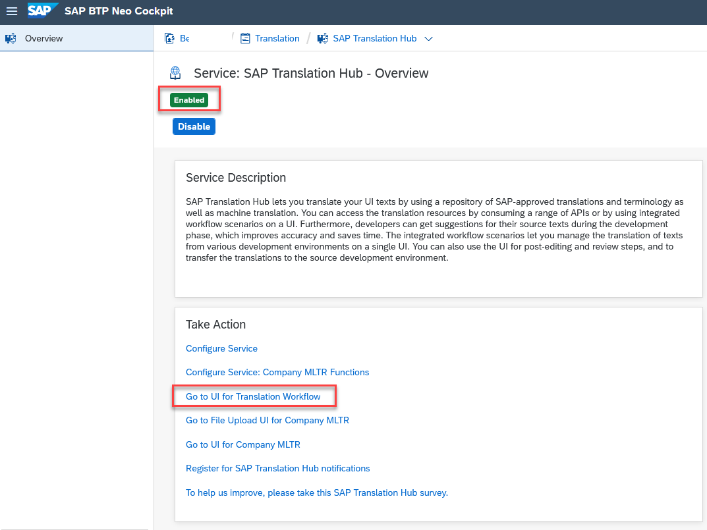

## Prerequisites  
 - **IMPORTANT:** This tutorial cannot be completed on a trial account.

## Details
### You will learn  
  - How to enable the SAP Translation Hub service on SAP Business Technology Platform (BTP)

  ---
[ACCORDION-BEGIN [Step 1: ](Open the service catalog)]

In your SAP BTP account choose **Services** in the navigation area on the left.

[DONE]

[ACCORDION-END]

[ACCORDION-BEGIN [Step 2: ](Locate the SAP Translation Hub service)]

Search for the SAP Translation Hub service by entering **`transl`**, and then choose the **SAP Translation Hub** tile.

[DONE]

[ACCORDION-END]

[ACCORDION-BEGIN [Step 3: ](Enable the service)]

Choose **Enable**.

[DONE]

[ACCORDION-END]

[ACCORDION-BEGIN [Step 4: ](Verify that the service is enabled)]

After you enable the service, the **Enabled** status is green and the link to the SAP Translation Hub UI in the **Take Action** section is active:

[VALIDATE_1]

[ACCORDION-END]
