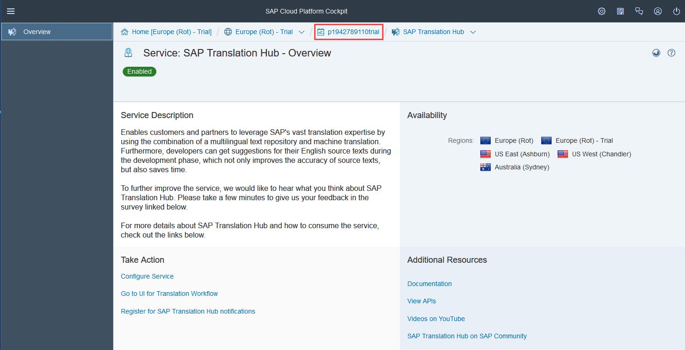
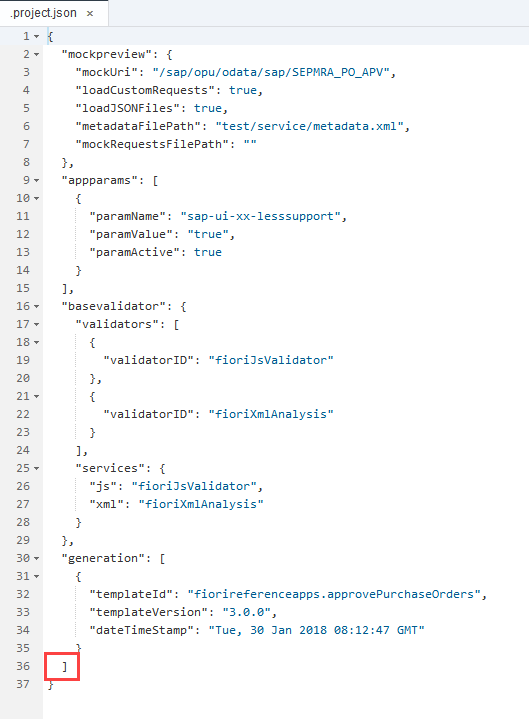
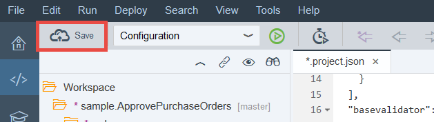
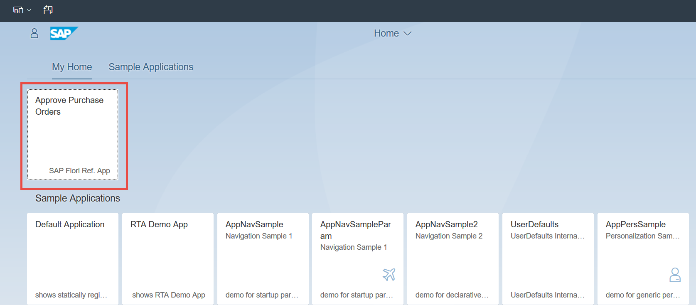

## Prerequisites  
 - **Proficiency:** Beginner
 - **Tutorials:** [Enable the SAP Translation Hub service](https://www.sap.com/developer/tutorials/sth-enable.html)

## Next Steps
- [Deploy an SAP Fiori app to SAP Cloud Platform](https://www.sap.com/developer/tutorials/sth-deploy-fiori-app.html)

## Details
### You will learn  
You'll learn how to prepare an SAP Fiori reference app so that you can translate it using SAP Translation Hub.

### Time to Complete
**10 Min**.

---
[ACCORDION-BEGIN [Step 1: ](Open overview screen of cockpit)]
To go to the overview screen of the SAP Cloud Platform cockpit, choose your user ID at the top of the screen.




[ACCORDION-END]
[ACCORDION-BEGIN [Step 2: ](Locate SAP Web IDE in the cockpit)]
Choose **Services** and locate the **SAP Web IDE** tile by searching for **`web`**. Then choose the tile.


[ACCORDION-END]

[ACCORDION-BEGIN [Step 3: ](Open SAP Web IDE)]

In the service description for SAP Web IDE, choose **Go to Service**.


[ACCORDION-END]

[ACCORDION-BEGIN [Step 4: ](Create a new project from a sample application)]

To get started with the app, ensure that you're on the **Home** tab (house icon) and choose **New Project from Sample Application**.


[ACCORDION-END]

[ACCORDION-BEGIN [Step 5: ](Choose the Approve Purchase Orders app)]

To add a project with the required files to your account, choose **Approve Purchase Orders** and then **Next**.


[ACCORDION-END]

[ACCORDION-BEGIN [Step 6: ](Accept standard license conditions)]

Accept the standard license conditions by choosing **I agree** and then **Finish**.


[ACCORDION-END]

[ACCORDION-BEGIN [Step 7: ](Open the project.json file)]
To be able to view the app in multiple languages and enable SAP Translation Hub to locate the text resources file, you need to enter some data in the `.project.json` file.

Expand the root folder of the application (`sample.ApprovePurchaseOrders`) and double-click the `.project.json` file.
> Depending on your browser settings, you might have to disable the pop-up blocker to be able to open the file.


[ACCORDION-END]

[ACCORDION-BEGIN [Step 8: ](Make project settings)]

In this step, you're going to specify the domain to which the texts belong (sales), the languages in which you want the app to be available (Danish, Dutch, Finnish, French, and German), and the name of the resources file (`i18n.properties`).
In the `.project.json` file, locate the last square bracket (`]`) in the file:



Enter a comma after the last square bracket and choose **Enter** to insert a new line.
At the start of the new line, paste the following code:

```
"translation": {
    "translationDomain": "02",
    "supportedLanguages": "da,nl,en,fi,fr,de",
    "defaultLanguage": "en",
    "defaultI18NPropertyFile": "i18n.properties",
    "resourceModelName": "i18n"
  }
```
The result should look like this:


Save your settings.



[ACCORDION-END]

[ACCORDION-BEGIN [Step 9: ](Create a run configuration)]

To test the application with mock data from a local system, you're going to need a special run configuration. To do this, right-click the root folder of your application (`sample.ApprovePurchaseOrders`) and choose **Run | Run Configurations**.


[ACCORDION-END]

[ACCORDION-BEGIN [Step 10: ](Choose Web application)]

Choose the **+** sign then **Web Application**.


[ACCORDION-END]

[ACCORDION-BEGIN [Step 11: ](Assign a run application file)]

Now you need to do the following:

- In the **File Name** field, choose the application file name `/webapp/test/flpSandboxMockServer.html`.
- Under **Preview Mode**, select **With Frame**.
- Under **Mock Data**, select **Run with mock data**.

Once you've done that, choose **OK**.


[ACCORDION-END]

[ACCORDION-BEGIN [Step 12: ](Open the app in the SAP Fiori launchpad)]

Now you want to see what the application looks like by accessing it from an SAP Fiori launchpad. To do this, choose the green button shown below.


> Depending on your browser settings, you might have to disable the pop-up blocker to proceed.

Choose the **Approve Purchase Orders** tile.



To make things look more realistic, the app uses mock data.


[ACCORDION-END]


## Next Steps
- [Deploy an SAP Fiori app to SAP Cloud Platform](https://www.sap.com/developer/tutorials/sth-deploy-fiori-app.html)
