## Prerequisites  
 - **Proficiency:** Beginner
 - **Tutorials:** [Enable the SAP Translation Hub service](https://www.sap.com/developer/tutorials/sth-enable.html)

## Next Steps
- [Commit your project to Git and deploy to the cloud](https://www.sap.com/developer/tutorials/teched-2016-5.html) - This tutorial contains a Git repository called `te2016`. To make it easier to follow the steps in the translation tutorial, use the name of the project that you created for the sample Fiori app in SAP Web IDE instead (`nwepmrefappsextshop`). Do not open the active version of the app, as described at the end of the tutorial.
- [Translate your app with SAP Translation Hub](https://www.sap.com/developer/tutorials/sth-translate-fiori-app.html)

## Details
### You will learn  
You will use a sample Fiori app to create a new HTML5 app and prepare it for translation using SAP Translation Hub.

### Time to Complete
**10 Min**.

---
[ACCORDION-BEGIN [Step 1: ](Locate SAP Web IDE in the cockpit)]
In the service catalog, locate the **SAP Web IDE** tile by searching for `Web`, and then choose the tile.

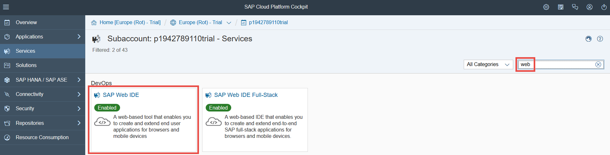


[ACCORDION-END]

[ACCORDION-BEGIN [Step 2: ](Open SAP Web IDE)]

Choose **Go to Service**.

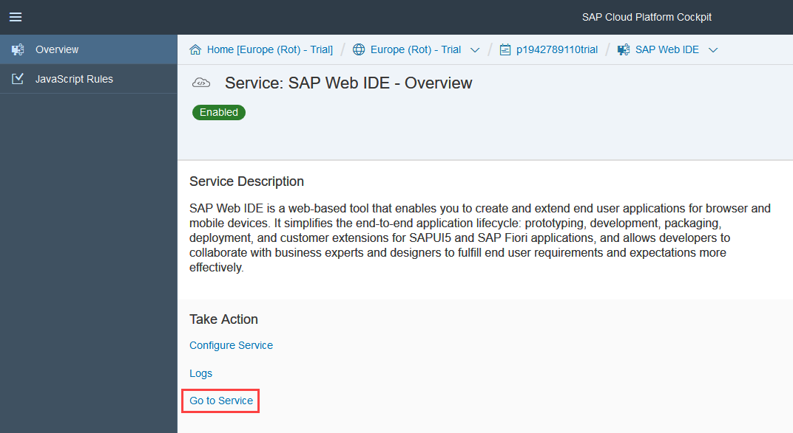


[ACCORDION-END]

[ACCORDION-BEGIN [Step 3: ](Create a new project from a sample application)]

To get started with the app, choose **New Project from Sample Application**.

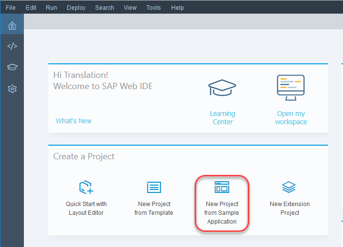


[ACCORDION-END]

[ACCORDION-BEGIN [Step 4: ](Choose shop app)]

To add a project with the required files to your account, choose **Shop** and then **Next**.


[ACCORDION-END]

[ACCORDION-BEGIN [Step 5: ](Accept standard license conditions)]

Accept the standard license conditions by choosing **I agree** and then **Finish**.

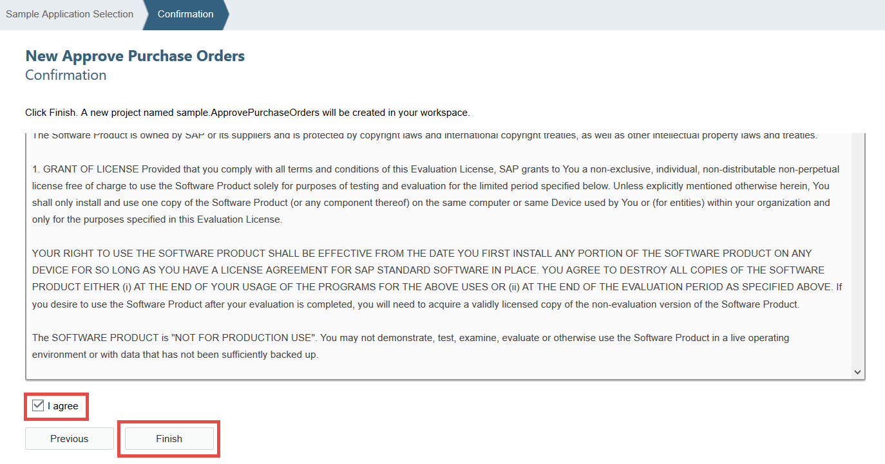


[ACCORDION-END]

[ACCORDION-BEGIN [Step 6: ](Open project file)]
To be able to view the app in multiple languages and enable SAP Translation Hub to locate the resources file, you need to enter some data in the `.project.json` file.

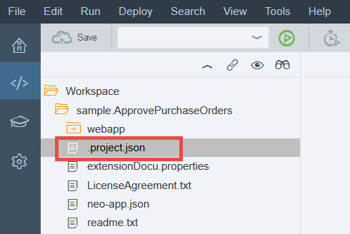

[ACCORDION-END]

[ACCORDION-BEGIN [Step 7: ](Make project settings)]

In this step, you're going to specify the domain for the texts (sales), the languages in which you want the app to be available (Danish, Dutch, English, Finnish, French, and German), and the name of the resources file (`i18n`).
In the `.project.json` file, enter a comma after the last square bracket (`]`) and paste the following code after the comma you entered:

```
"translation": {
    "translationDomain": "02",
    "supportedLanguages": "da,nl,en,fi,fr,de",
    "defaultLanguage": "en",
    "defaultI18NPropertyFile": "",
    "resourceModelName": "i18n"
  }
```
The result should look like this:

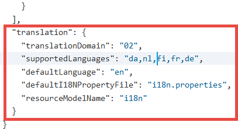


[ACCORDION-END]

[ACCORDION-BEGIN [Step 8: ](Create run configuration)]

To test the application with mock data from a local system, you're going to need a special run configuration. To do this, right-click the application and choose **Run > Run Configurations**.

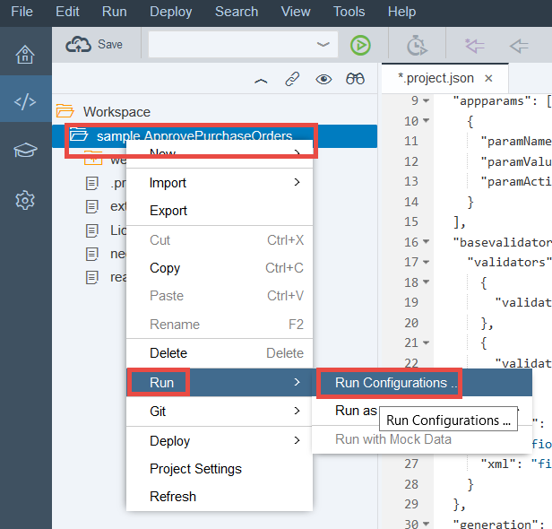


[ACCORDION-END]

[ACCORDION-BEGIN [Step 9: ](Choose Web application)]

Choose **+ > Web Application**.

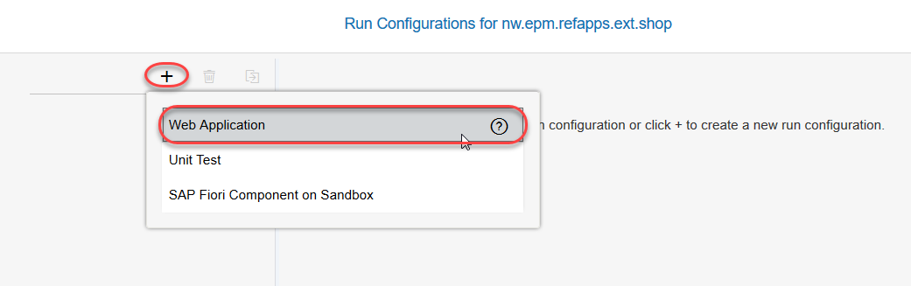


[ACCORDION-END]

[ACCORDION-BEGIN [Step 10: ](Assign run application file)]

Now you need to do the following:

- Under **File Name**, enter the application file name `testFLPservice.html`.
- Under **Preview Mode**, choose **With Frame**.
- Under **Mock Data**, select **Run with mock data**.

Once you've done that, choose **OK**.

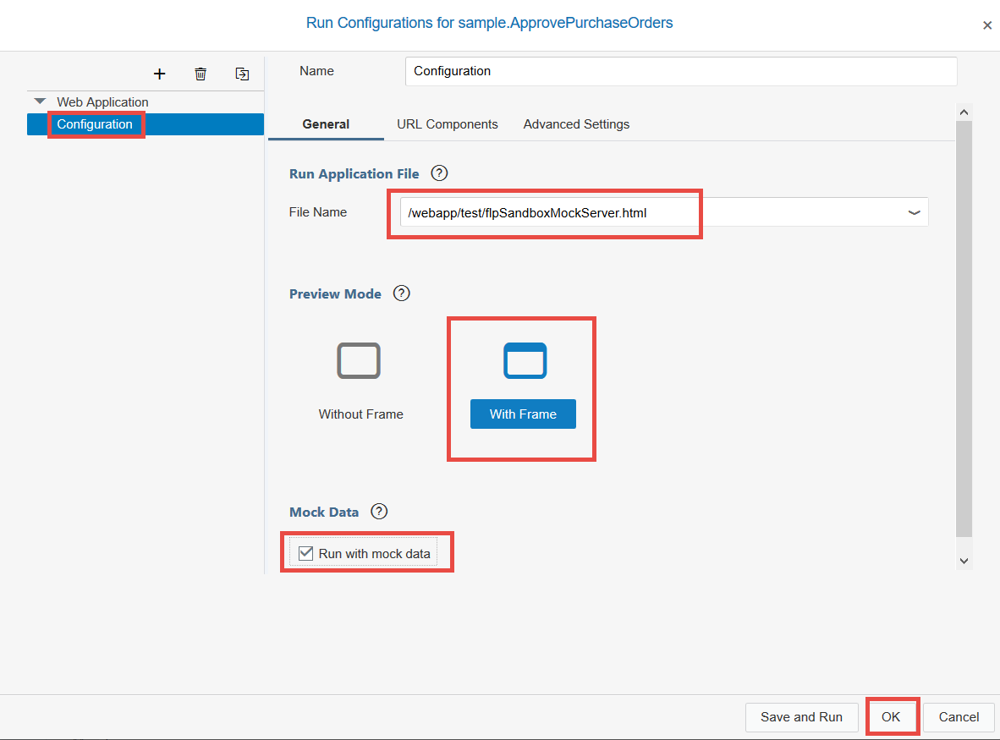


[ACCORDION-END]

[ACCORDION-BEGIN [Step 11: ](Open app in Fiori launchpad)]

Now you want to see what the application looks like by accessing it from a Fiori launchpad. To do this, choose the green button shown below.

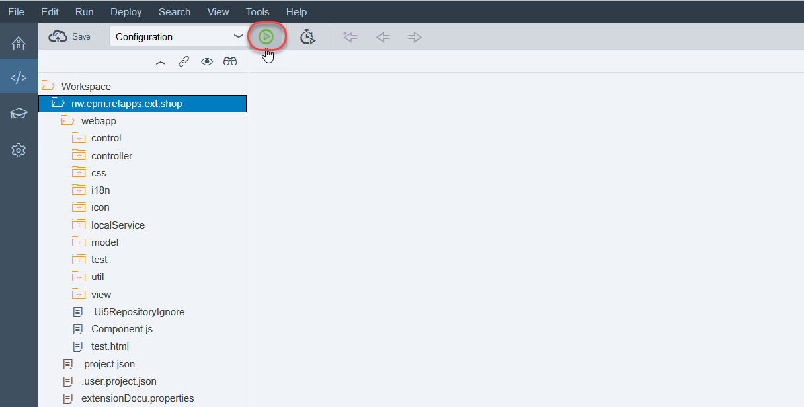


[ACCORDION-END]

[ACCORDION-BEGIN [Step 12: ](Open the app)]

Choose the **Shop** tile.

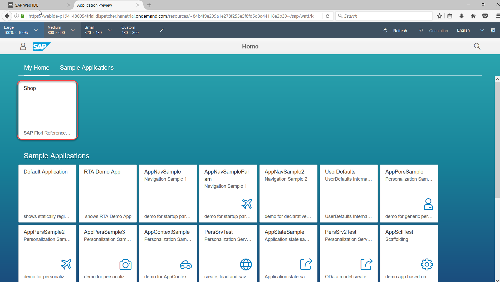

To make things look more realistic, the app uses mock data:

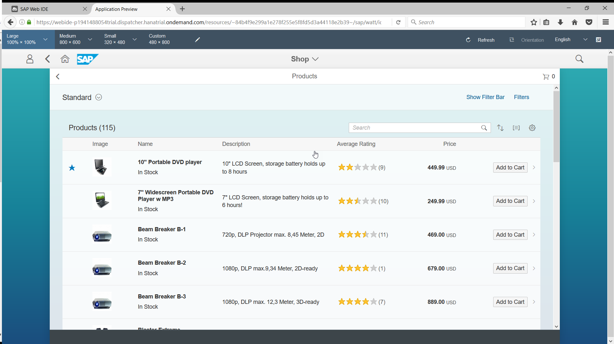


[ACCORDION-END]


## Next Steps
- [Commit your project to Git and deploy to the cloud](https://www.sap.com/developer/tutorials/teched-2016-5.html) - This tutorial contains a Git repository called `te2016`. To make it easier to follow the steps in the translation tutorial, use the name of the project that you created for the sample Fiori app in SAP Web IDE instead (`nwepmrefappsextshop`). Do not open the active version of the app, as described at the end of the tutorial.
- [Translate your app with SAP Translation Hub](https://www.sap.com/developer/tutorials/sth-translate-fiori-app.html)
