# Prepare an SAP Fiori App for Translation in Web IDE (Neo environment)
<!-- description --> Prepare an app based on an SAP Fiori reference app and prepare it for translation with SAP Translation Hub.

## Prerequisites  
  - **IMPORTANT:** This tutorial cannot be completed on a trial account.

## You will learn  
  - How to prepare an SAP Fiori reference app so that you can translate it using SAP Translation Hub

---
### Open overview screen of cockpit

To go to the overview screen of the SAP BTP cockpit, choose your user ID at the top of the screen.

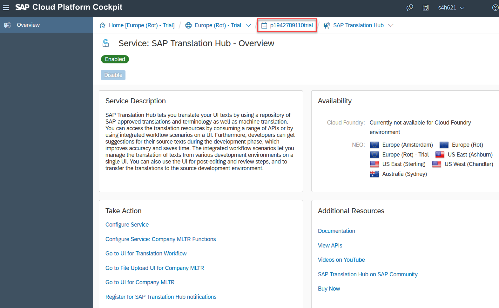

### Locate SAP Web IDE in the cockpit

Choose **Services** and locate the **SAP Web IDE** tile by searching for **`web`**. Then choose the tile.

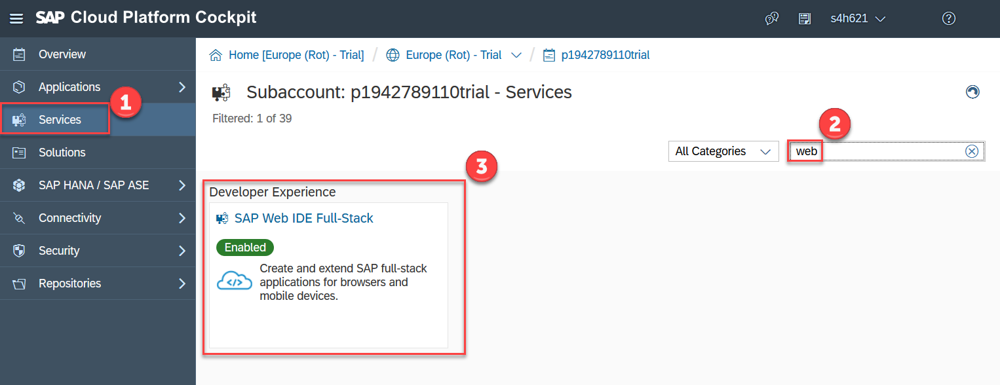

### Open SAP Web IDE

In the service description for SAP Web IDE, choose **Go to Service**.

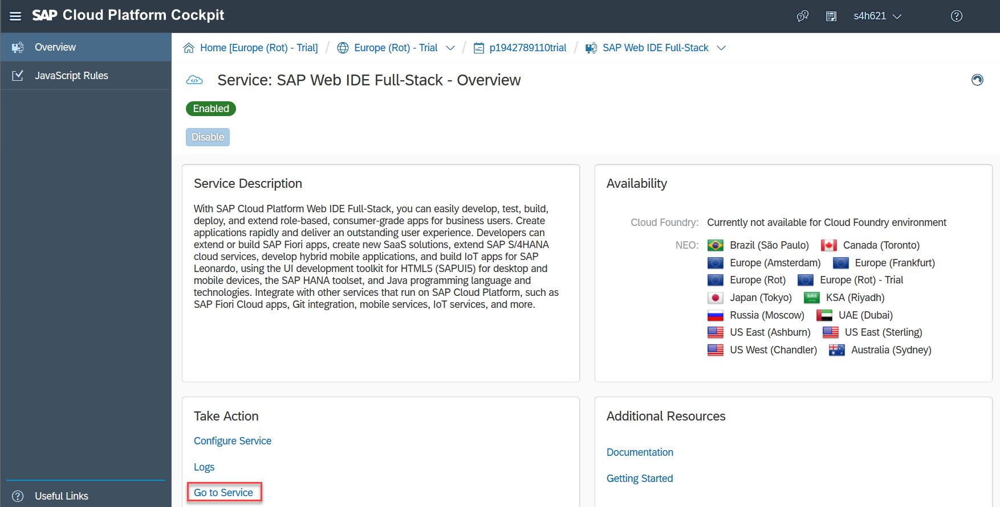

### Create a new project from a sample application

To get started with the app, ensure that you're on the **Home** tab (house icon) and choose **New Project from Sample Application**.

### Choose the Shop app

To add a project with the required files to your account, choose **Shop** and then **Next**.

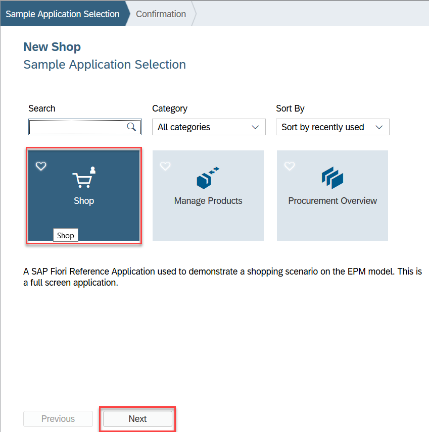

### Accept standard license conditions

Accept the standard license conditions by choosing **I agree** and then **Finish**.

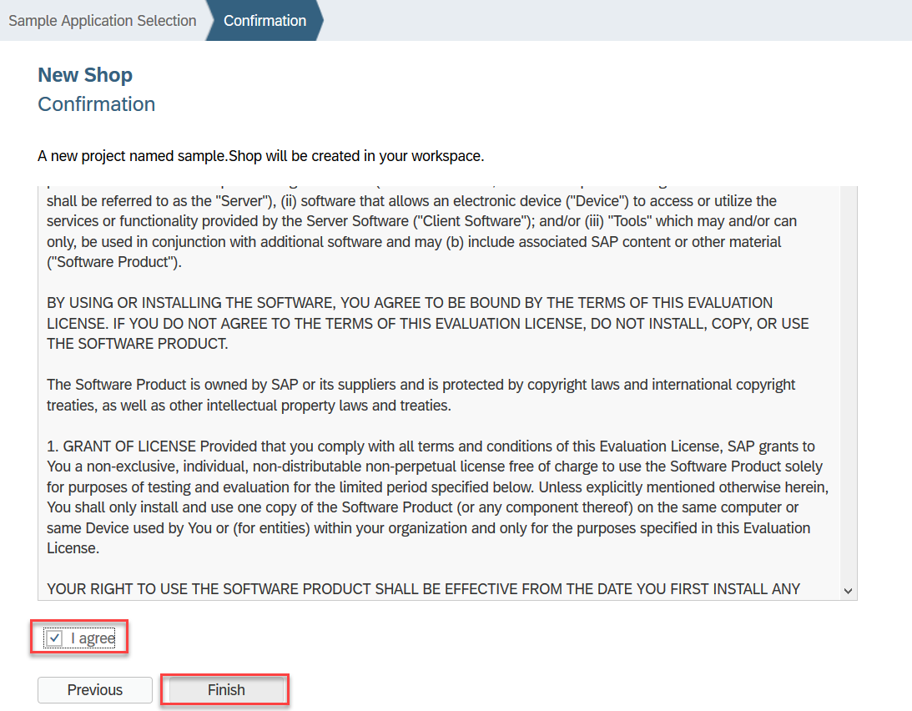

### Open the project settings

To be able to view the app in multiple languages and enable SAP Translation Hub to locate the text resources file, you need to enter some data in the project settings.
Select root folder of the application **sample.Shop** and open the menu with a right mouse click.
Select **Project - Project Settings**.

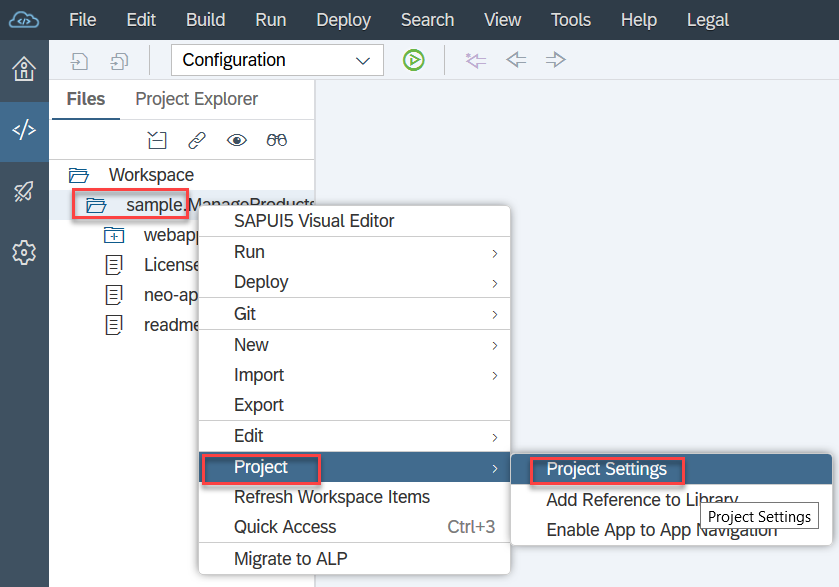

### Make project settings

In this step, you're going to specify the languages in which you want the app to be available (Chinese, French, and German).
In the `Project Settings` locate the **Languages tab** in section General and check that **English** is the default language.

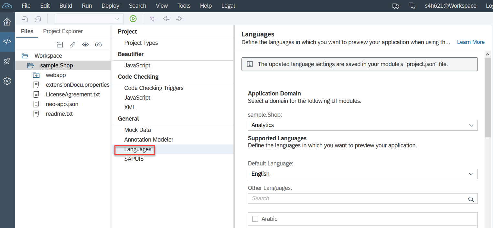

Scroll down in the Languages section to maintain the languages: **Chinese, French and German**.
 **Save and Close** the Project settings afterwards.

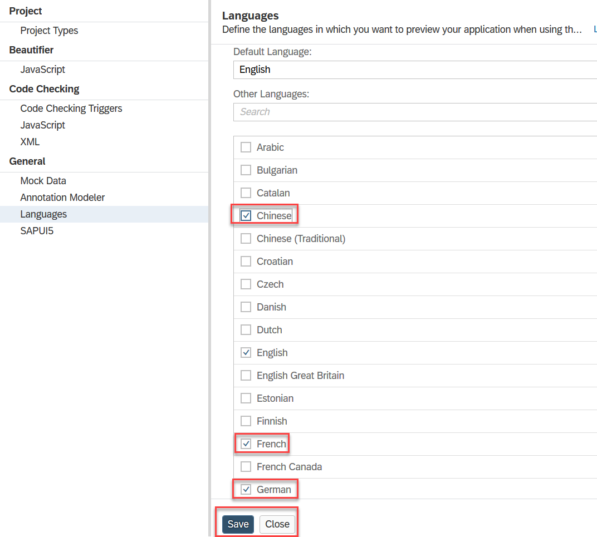

### Create a run configuration

To test the application with mock data from a local system, you're going to need a special run configuration. To do this, right-click the root folder of your application (`sample.Shop`) and choose **Run | Run Configurations**.

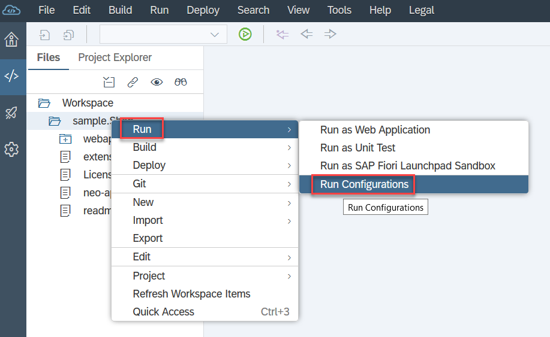

### Choose Web application

Choose the **+** sign then **Web Application**.

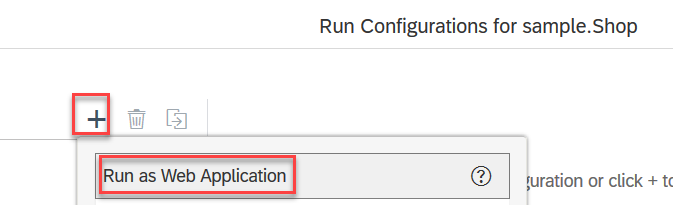

### Assign a run application file

Now you need to do the following:

- In the **File Name** field, choose the application file name `/webapp/test/flpSandboxMockServer.html`.
- Under **Preview Mode**, select **With Frame**.
- Under **Mock Data**, select **Run with mock data**.

Once you've done that, choose **OK**.

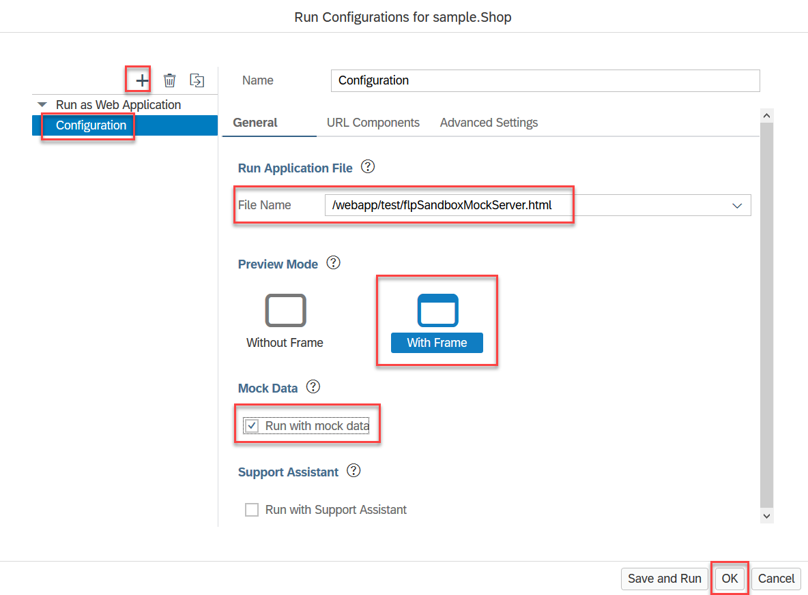

### Open the app in the SAP Fiori launchpad

Now you want to see what the application looks like by accessing it from an SAP Fiori launchpad. To do this, choose the green button shown below.

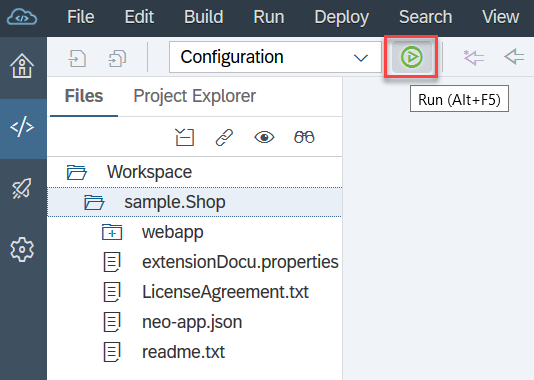
> Depending on your browser settings, you might have to disable the pop-up blocker to proceed.

Choose the **Shop** tile.

To make things look more realistic, the app uses mock data.

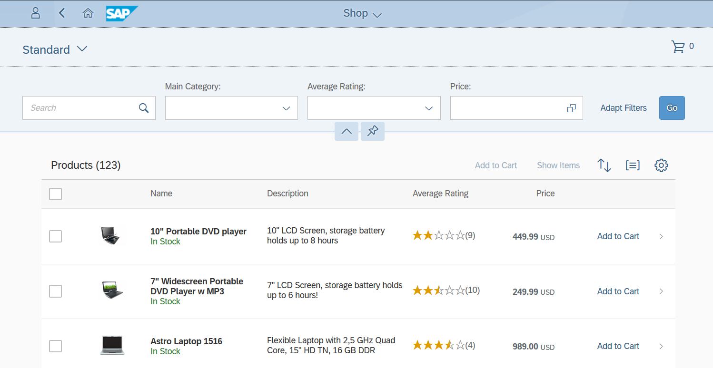

