## Prerequisites  
 - **Proficiency:** Beginner
  - **Tutorials:** [Deploy an SAP Fiori app to SAP Cloud Platform](https://www.sap.com/developer/tutorials/sth-deploy-fiori-app.html)

## Next Steps
- Select a tutorial from the [Tutorial Navigator](https://www.sap.com/developer/tutorial-navigator.html) or the [Tutorial Catalog](https://www.sap.com/developer/tutorial-navigator.tutorials.html)

## Details
### You will learn  
You'll learn how to translate an SAP Fiori app using SAP Translation Hub.

### Time to Complete
**10 Min**.

---
[ACCORDION-BEGIN [Step 1: ](Open overview screen of cockpit)]
To go to the overview screen of the SAP Cloud Platform cockpit, choose your user ID at the top of the screen.

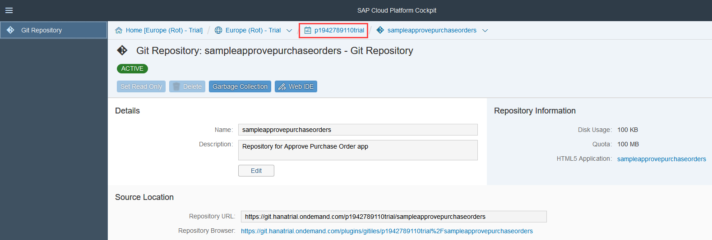

[ACCORDION-END]

[ACCORDION-BEGIN [Step 2: ](Locate SAP Translation Hub in the cockpit)]

Choose **Services** and locate the **SAP Translation Hub** tile by searching for **`transl`**. Then choose the tile.
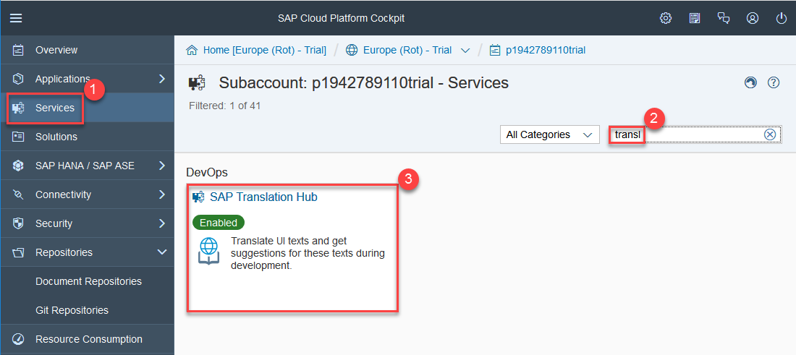

[ACCORDION-END]

[ACCORDION-BEGIN [Step 3: ](Open SAP Translation Hub)]

In the service description for SAP Translation Hub, choose **Go to UI for Translation Workflow**.

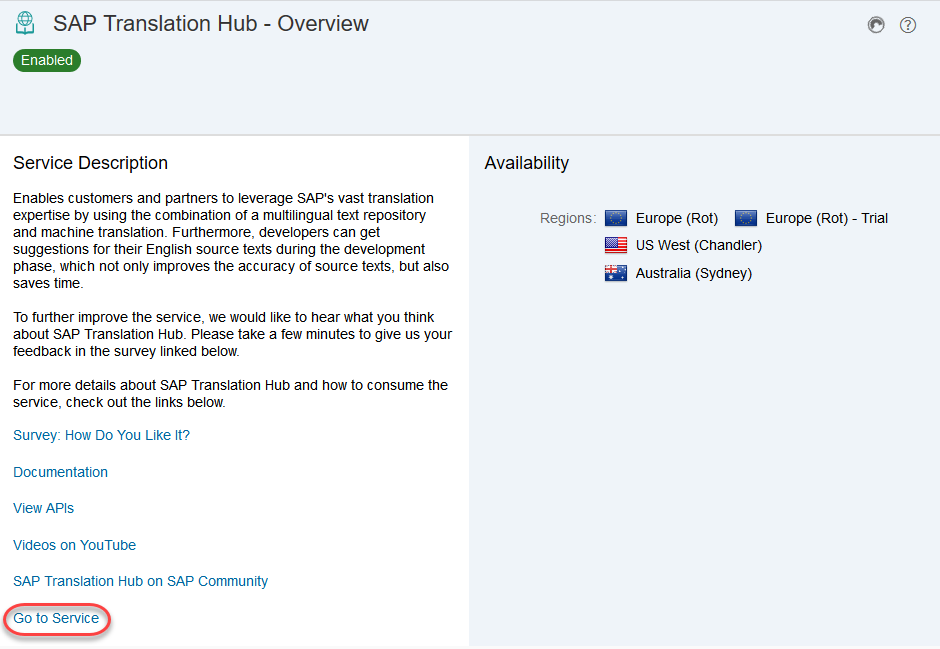

[ACCORDION-END]

[ACCORDION-BEGIN [Step 4: ](Create a new Git translation project)]

First, you'll need to create a translation project. Choose **+** and then **Git Project**.  

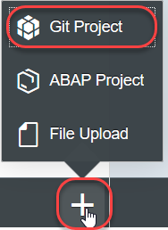

[ACCORDION-END]

[ACCORDION-BEGIN [Step 5: ](Enter translation project details)]

Now you need to enter the following details about your project:

Field Name | Value
:-------------  | :-------------
Application Name | **`sampleapprovepurchaseorders`**
Path to Properties File | **`webapp/i18n/i18n.properties`**
Domain | **Sales**
Target Languages   | Enter the target languages that you specified in your project in SAP Web IDE: **Danish**, **Dutch**, **Finnish**, **French**, and **German**

To see a quality index for translations provided by machine translation (not all languages are supported - see on-screen help for details), select **Show Quality Index for MT**.
Leave all other fields and selection options as they are and choose **Save**.

[ACCORDION-END]

[ACCORDION-BEGIN [Step 6: ](Translate texts in translation project)]

SAP Translation Hub shows an overview of your translation project. To start the translation process and push the translations to the Git repository, choose **Translate and Push** in the bottom right of the screen.

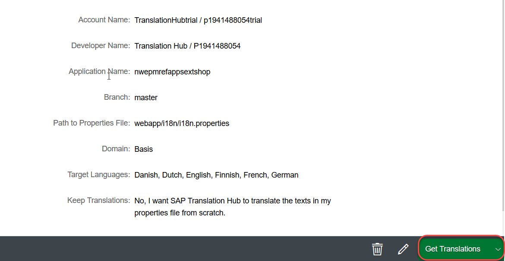

Enter your Git password and choose **Submit**.

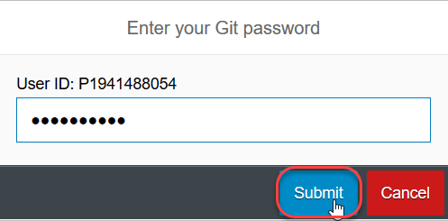

If everything works as expected, you see the following status:

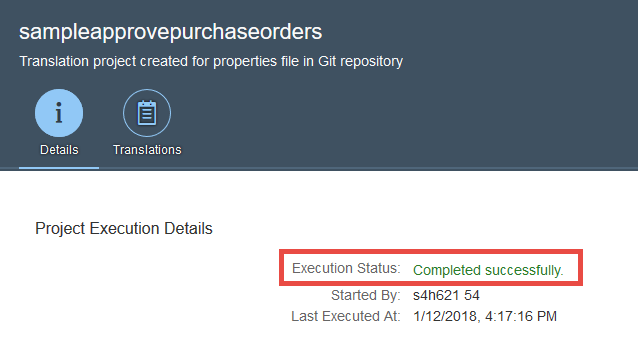

[ACCORDION-END]

[ACCORDION-BEGIN [Step 7: ](Check translations)]

The translation is now complete, but you might want to review the translations. To do that, choose **Translations**:

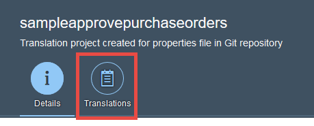

This is where you can switch between the target languages and, in the columns to the right, see the translation provider and a quality status. The higher the number on a scale from 0-100, the better the quality.
> Note: For translations provided by SAP machine translation (SAP MT), a quality index is not available for all languages.

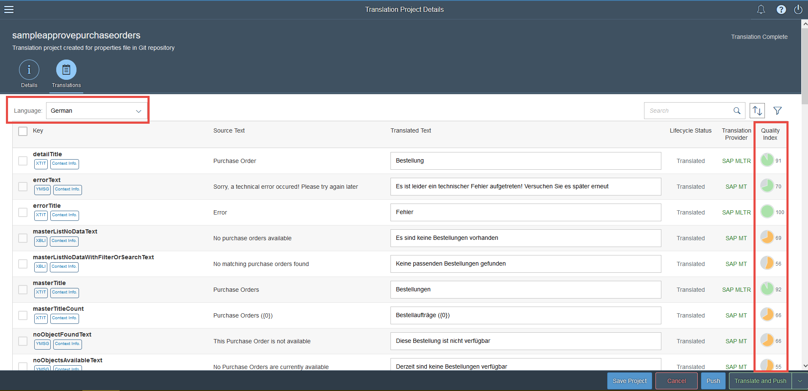

[ACCORDION-END]

[ACCORDION-BEGIN [Step 8: ](Update translations (optional))]

If you want to change any of the translations, simply make your changes directly in the **Translated Text** column. After you make a change, the translation provider changes to `Manual`.
When you're done, choose **Save Project**.
As a final step, push your changes to the Git repository by choosing **Push**.

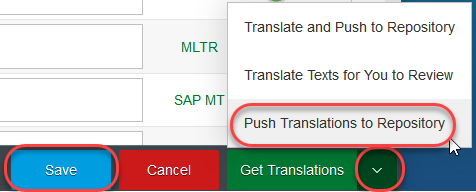

Enter your Git password and choose **Submit**.

[ACCORDION-END]

[ACCORDION-BEGIN [Step 9: ](Pull translations from the Git repository to SAP Web IDE)]

To see the translations in SAP Web IDE, you need to pull the translations from the Git repository.

In SAP Web IDE (see where you left off in [Deploy an SAP Fiori app to SAP Cloud Platform](https://www.sap.com/developer/tutorials/sth-deploy-fiori-app.html)), select the root folder (`sample.ApprovePurchaseOrders`) of your project.

Open the Git pane by choosing the icon under the magnifying glass at the right of the screen. Confirm that `sample.ApprovePurchaseOrders` appears under **Repository** and then choose **Pull**.

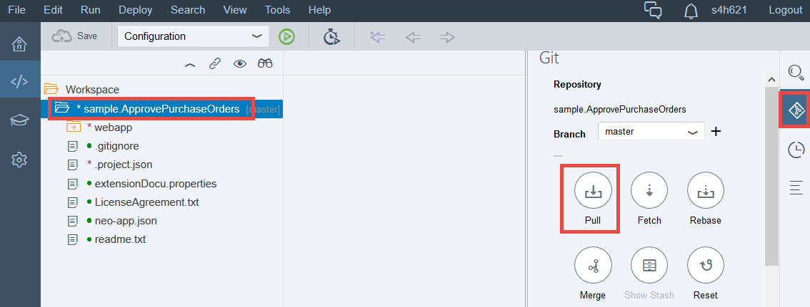

A success message appears in the top right of the SAP Web IDE window.

[ACCORDION-END]

[ACCORDION-BEGIN [Step 10: ](Check the i18n properties files in SAP Web IDE)]

The `i18n` folder in your project now contains properties files for the target languages that you selected in your project. To see the translations, open any of the properties files by double-clicking them.

[ACCORDION-END]

[ACCORDION-BEGIN [Step 11: ](Run the app in additional languages)]

As a final step, you can view the app in different languages. To open the SAP Fiori launchpad, choose the green button shown below:
> Depending on your browser settings, you might have to disable the pop-up blocker to proceed.

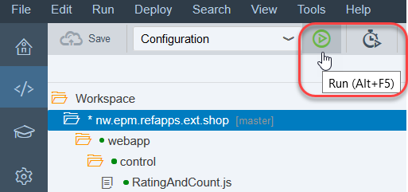

When the preview opens, change the language in the top right of the screen.

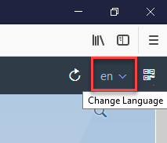

Now open the **Approve Purchase Orders** app. The example below shows the app in German.

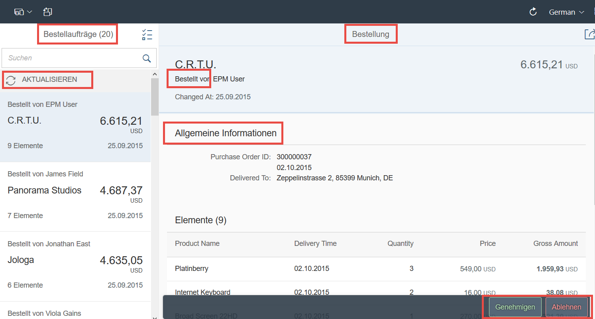

> Note: Some texts in the app come from the back end or are hard coded, and are therefore not part of the `i18n.properties` file that you translated in this tutorial.

[ACCORDION-END]

## Next Steps
- Select a tutorial from the [Tutorial Navigator](https://www.sap.com/developer/tutorial-navigator.html) or the [Tutorial Catalog](https://www.sap.com/developer/tutorial-navigator.tutorials.html)
