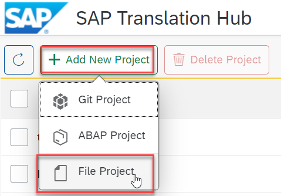

## Prerequisites  
 - **Proficiency:** Beginner
  - **Tutorials:** [Enable the SAP Translation Hub service](http://www.sap.com/developer/tutorials/sth-enable.html)
 - **Tutorials:** [Install and configure Eclipse environment](https://github.com/SAP/cloud-espm-v2#1-quick-start-guide) Complete the **1. Quick start guide** section.

## Next Steps
 - Select a tutorial from the [Tutorial Navigator](http://www.sap.com/developer/tutorial-navigator.html) or the [Tutorial Catalog](http://www.sap.com/developer/tutorials.html)

## Details
### You will learn  
You will translate the properties file of a Java app using the file upload scenario in SAP Translation Hub.

### Time to Complete
**10-15 Min**.

---
[ACCORDION-BEGIN [Step 1: ](Locate properties file)]

In your Eclipse window, locate the `i18n.properties` file that contains your app texts.

[DONE]
[ACCORDION-END]

[ACCORDION-BEGIN [Step 2: ](View texts in properties file)]

Before you get started with the translation process, open the `i18n.properties` file to take a look at the texts that you are going to translate.

[DONE]
[ACCORDION-END]

[ACCORDION-BEGIN [Step 3: ](Choose tile for developer account)]

In the [SAP Cloud Platform cockpit](https://account.hanatrial.ondemand.com), choose the tile for your personal developer account.

[DONE]
[ACCORDION-END]

[ACCORDION-BEGIN [Step 4: ](Open the service catalog)]

Choose **Services** in the navigation area on the left.

[DONE]
[ACCORDION-END]

[ACCORDION-BEGIN [Step 5: ](Locate the SAP Translation Hub service)]

Search for the SAP Translation Hub service by entering **Trans** and then choose the **SAP Translation Hub** tile.

[DONE]
[ACCORDION-END]

[ACCORDION-BEGIN [Step 6: ](Open SAP Translation Hub UI)]

To access the SAP Translation Hub, UI, choose **Go to Service**.

[DONE]
[ACCORDION-END]

[ACCORDION-BEGIN [Step 7: ](Create a translation project)]

Create a translation project for single files that you want to upload.

[DONE]
[ACCORDION-END]

[ACCORDION-BEGIN [Step 8: ](Enter translation project details)]

Enter the following details about your translation project:

Field Name | Value
:-------------  | :-------------
Application Name | `espmcloud`
File Type | **Java Properties File**
Domain | **Sales**
Target Languages   | Enter the languages of your choice, such as **French** and **Italian**

Choose **Save**.

[DONE]
[ACCORDION-END]

[ACCORDION-BEGIN [Step 9: ](Upload properties file)]

You can upload the properties file in two ways: there's the drag & drop option, which automatically starts the translation process, and there's the more traditional file selection option, which requires you to select the file and start the translation process. The end result is the same, it's just a matter of how you prefer to work.

#### Drag & Drop Option
Simply drag the file from your Eclipse project to the translation project screen. SAP Translation Hub uploads your properties file to the translation project and translates the texts in one go.

#### File Selection Option
 <ol> <li> On the translation project screen, choose **Upload File**:
</li>
 <li> Navigate to the folder on your local machine that contains the `i18n.properties` file and open it:
 </li>
<li> Choose **Upload and Translate**:
</li>
</ol>

Regardless of the option you choose, when SAP Translation Hub has translated the texts, the following success message appears:

[DONE]
[ACCORDION-END]

[ACCORDION-BEGIN [Step 10: ](Review translations)]

To review the translated texts, choose **Translations**.

On this screen, you can switch between target languages and view information about the translation provider and quality rating:

[DONE]
[ACCORDION-END]

[ACCORDION-BEGIN [Step 11: ](Filter by quality index (optional))]

To better plan the language review process, you can filter translations by the quality rating. For example, this enables you to see only those translations that have a quality rating below a certain threshold, such as `50`.
Choose the following icon above the **Quality Index** column:

Choose **Quality Index**:

Enter `50` as the upper limit or move the right slider bubble to the center of the scale:

The following success message confirms your filter setting:

[DONE]
[ACCORDION-END]

[ACCORDION-BEGIN [Step 12: ](Update translations (optional))]

If you want to update any translations, make the changes in the **Translated Text** column and choose **Save**:

[DONE]
[ACCORDION-END]

[ACCORDION-BEGIN [Step 13: ](Download translations)]

Now it's time to download your translations so that you see your Java app in other languages. Choose **Download Translations**:

SAP Translation Hub prepares a `zip` file that contains properties files for each of the target languages in your translation project; save the `zip` file on your local PC and make a note of its location. You'll need to navigate to this file later in the tutorial.

[DONE]
[ACCORDION-END]

[ACCORDION-BEGIN [Step 14: ](Import translations in Eclipse)]

Now it's time to head back to your Eclipse window and import the translations into the project for your Java app.

Ensure that you are looking at the **Java** perspective:

In the **Package Explorer**, navigate to your `i18n` folder, by choosing `espm-cloud-web > src > main > webapp > webshop`.
Right-click the `i18n` folder and choose **Import...**.  

Choose **Archive File**:

At the top of the **Import** window, browse to the `zip` file that you downloaded from the SAP Translation Hub UI and choose **Finish**:

The properties files per target language appear in the `i18n` folder:

[DONE]
[ACCORDION-END]

[ACCORDION-BEGIN [Step 15: ](Restart Java server (optional))]

To see the translations in your Java app, you need to restart the Java server. In Eclipse, switch to the **Git** perspective:  

Choose the **Servers** tab:  

Right-click **Java Web Server** and choose **Clean...**:  

Confirm the clean process by choosing **OK**:

Depending on system performance, it can take several minutes for the Java server to be cleaned and restarted. When the process is complete, the status of the Java Web server changes to **Started, Synchronized**:

[DONE]
[ACCORDION-END]

[ACCORDION-BEGIN [Step 16: ](Display app in browser)]

To see your app in the translated languages, enter the following address in a browser; the last two letters denote the language of your app: `http://localhost:8080/espm-cloud-web/webshop/?sap-language=fr`

The French version of the app appears:

[DONE]
[ACCORDION-END]

## Next Steps
 - Select a tutorial from the [Tutorial Navigator](http://www.sap.com/developer/tutorial-navigator.html) or the [Tutorial Catalog](http://www.sap.com/developer/tutorials.html)
