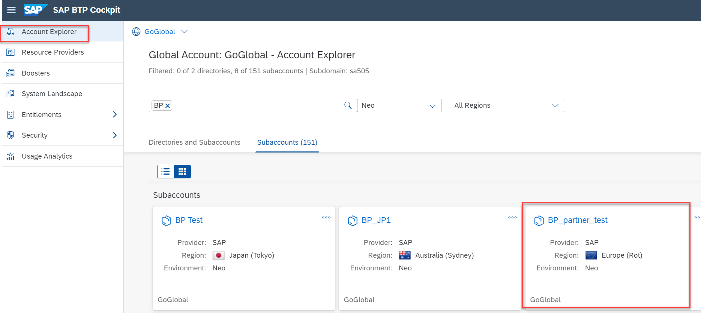
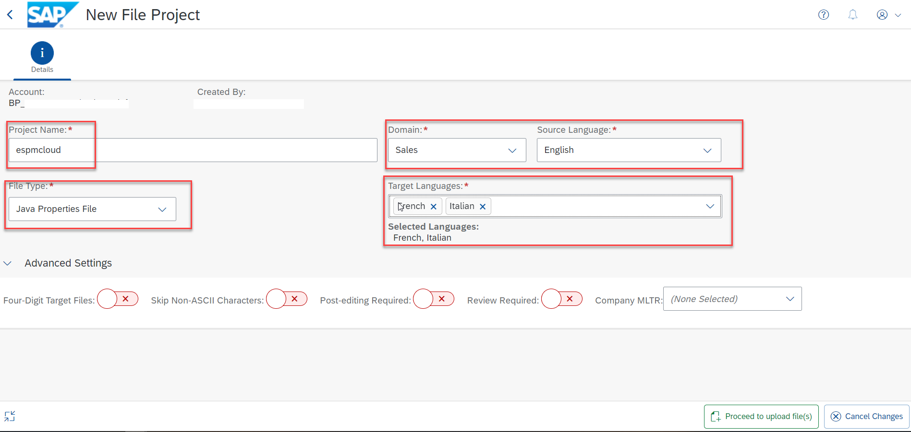
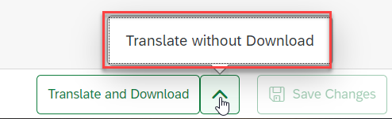

# Translate a Java App
<!-- description --> Use SAP Translation Hub to translate the UI texts for a Java app that you develop in Eclipse.

## Prerequisites  
  - **IMPORTANT:** This tutorial cannot be completed on a trial account.
  - [Install and configure Eclipse environment](https://github.com/SAP/cloud-espm-v2#1-quick-start-guide) Complete the **1. Quick start guide** section.

## You will learn  
  - How to translate the properties file of a Java app using the file upload scenario in SAP Translation Hub

---
### Locate properties file

In your Eclipse window, locate the `i18n.properties` file that contains your app texts.

### View texts in properties file

Before you get started with the translation process, open the `i18n.properties` file to look at the texts that you're going to translate.

### Choose your SAP BTP Neo account

In the [SAP BTP cockpit](https://account.eu3.hana.ondemand.com/neo/), choose the tile for your account in the SAP BTP Neo environment.

### Open the service catalog

Choose **Services** in the navigation area on the left. Search for the SAP Translation Hub service by entering **trans** and then choose the **SAP Translation Hub** tile.

### Open SAP Translation Hub UI

To access the SAP Translation Hub, UI, choose **Go to UI for Translation Workflow**.

### Create a translation project

Create a **File Project** for the .properties file that you're going to upload.

### Enter translation project details

Enter the following details about your file translation project:

Field Name | Value
:-------------  | :-------------
Project Name | `espmcloud`
File Type | **Java Properties File**
Domain | **Sales**
Source Language | **English**
Target Languages | Enter the languages of your choice, such as **French** and **Italian**

Choose **Proceed to upload file(s)**.

### Upload properties file

You can upload the properties file in two ways: there's the drag & drop option, which automatically starts the translation process, and there's the more traditional file selection option, which requires you to select the file and start the translation process. The end result is the same, it's just a matter of how you prefer to work.

#### Drag & Drop Option
Simply drag the file from your Eclipse project to the translation project screen. SAP Translation Hub uploads your properties file to the translation project.

#### File Selection Option
 <ol> <li> On the translation project screen, choose **Upload File**:
 <li> Navigate to the folder on your local PC that contains the `i18n.properties` file and open it:
 </li>
<li> Choose **Upload**:
</li>
</ol>

Regardless of the option you choose, you need to start the translation step by selecting **Translate without Download** or **Translate and Download**:

### Review translations

To review the translated texts, choose the **Translations** tab.
On this screen, you can switch between target languages and view information about the translation provider and quality rating:

### Filter by quality index (optional)

To better plan the language review process, you can filter translations by the quality rating. For example, this enables you to see only those translations that have a quality rating below a certain threshold, such as `50`.
Choose the filter icon above the **Quality Index** column:

Choose **Quality Index**:

Enter `50` as the upper limit or move the right slider bubble to the center of the scale:

The following success message confirms your filter setting:

### Update translations (optional)

If you want to update any translations, make the changes in the **Translated Text** column and choose **Save Changes**:

### Download translations

Now it's time to download your translations so that you see your Java app in other languages. Choose **Download Translations**:

SAP Translation Hub prepares a `zip` file that contains properties files for each of the target languages in your translation project; save the `zip` file on your local PC and make a note of its location. You'll need to navigate to this file later in the tutorial.

### Import translations in Eclipse

Now it's time to head back to your Eclipse window and import the translations into the project for your Java app.

Ensure that you're looking at the **Java** perspective:

In the **Package Explorer**, navigate to your `i18n` folder, by choosing `espm-cloud-web > src > main > webapp > webshop`.
Right-click the `i18n` folder and choose **Import...**.  

Choose **Archive File**:

At the top of the **Import** window, browse to the `zip` file that you downloaded from the SAP Translation Hub UI and choose **Finish**:

The properties files per target language appear in the `i18n` folder:

### Restart Java server (optional)

To see the translations in your Java app, you need to restart the Java server. In Eclipse, switch to the **Git** perspective:  

Choose the **Servers** tab:  

Right-click **Java Web Server** and choose **Clean...**:  

Confirm the clean process by choosing **OK**:

Depending on system performance, it can take several minutes for the Java server to be cleaned and restarted. When the process is complete, the status of the Java Web server changes to **Started, Synchronized**:

### Display app in browser

To see your app in the translated languages, enter the following address in a browser; the last two letters denote the language of your app: `http://localhost:8080/espm-cloud-web/webshop/?sap-language=fr`

The French version of the app appears:

