# Translate a Java Properties File
<!-- description --> Translate and review properties files with the SAP Translation Hub file upload scenario.

## Prerequisites  
  - **IMPORTANT:** This tutorial cannot be completed on a trial account.

## You will learn  
  - How to translate a properties file using SAP Translation Hub

### Open overview screen of cockpit

In your SAP BTP account, choose **Services** in the navigation area on the left.

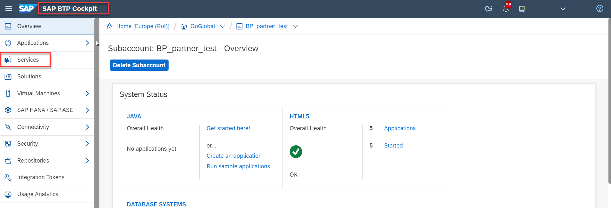!

### Locate SAP Translation Hub in the cockpit

Locate the **SAP Translation Hub** tile by searching for **`tran`**. Then choose the tile.

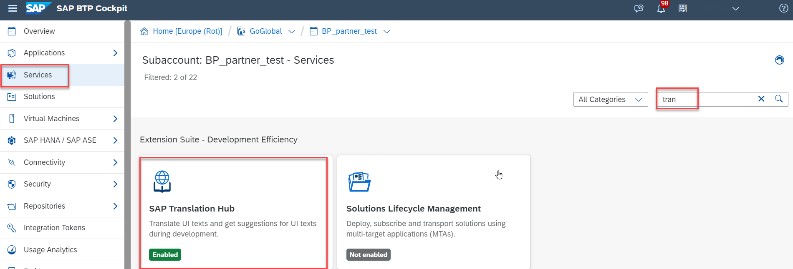!

### Open SAP Translation Hub

In the service description for SAP Translation Hub, choose **Go to UI for Translation Workflow**.

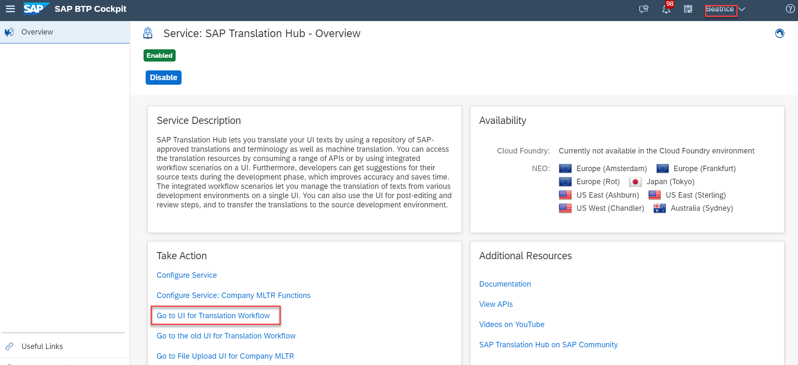!

### Create a new file translation project

First, you'll need to create a translation project.

Choose **+ Add New Project** and then **File Project**.  

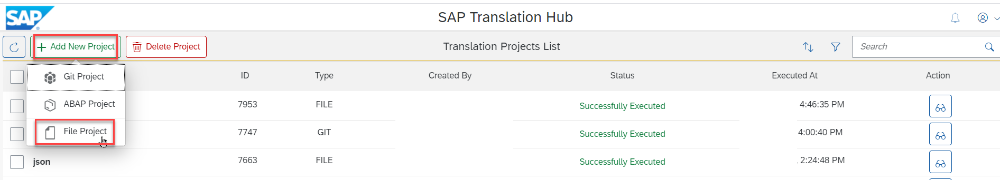!

### Enter translation project details

Now you need to enter the following details about your project on the **Details** tab:

Field Name | Value
:-------------  | :-------------
Project Name | **`fioriapp`**
Domain | **Sales**
Source Language | **English**
File Type | **Java Properties File**
Target Languages   | **Chinese**, **French**, and **German**

In the **Advanced Settings** you can specify  if you want to use a company MLTR or a review process.

To simplify the tutorial only select **YES** for **Review Required**. Leave all other fields and selection options as they are and click on **Proceed to upload file(s)**.

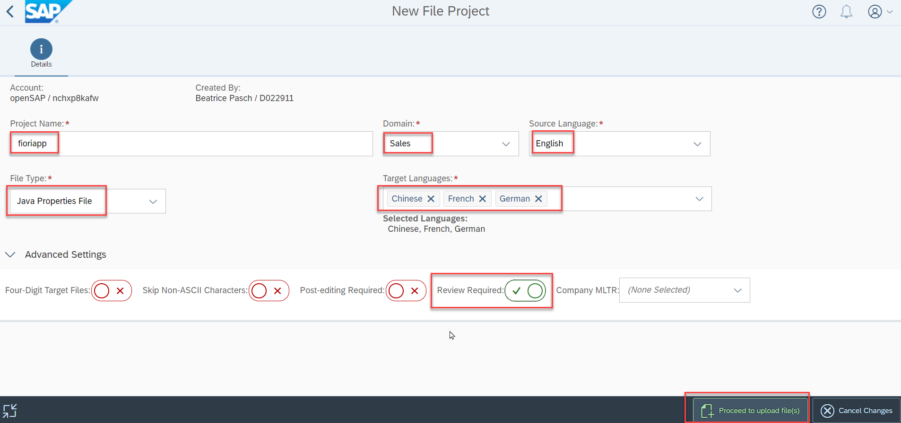!

### Upload the file to the translation project

Drag your source file to anywhere in the project or click on the + icon to upload your .properties file.

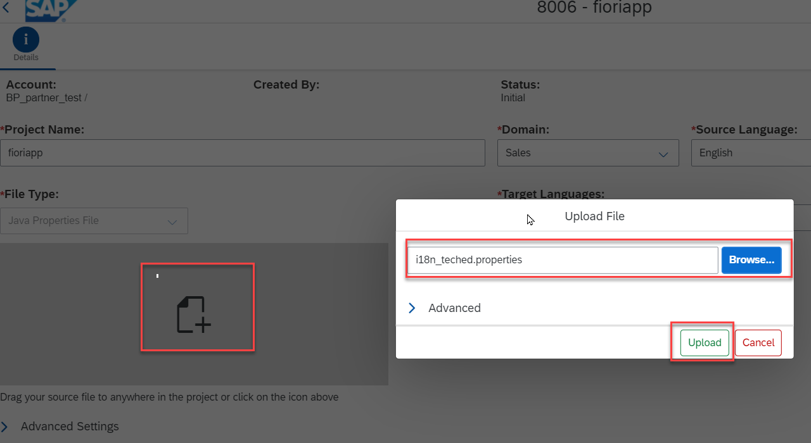!

If everything works as expected, you see the following status:

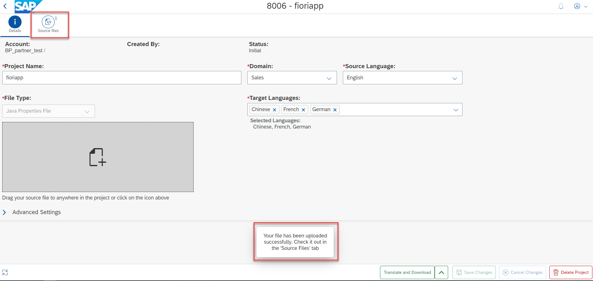!

### Translate texts in translation project

SAP Translation Hub shows an overview of your translation project. To start the translation process choose the red marked icon and  **Translate without Download** in the bottom right of the screen.

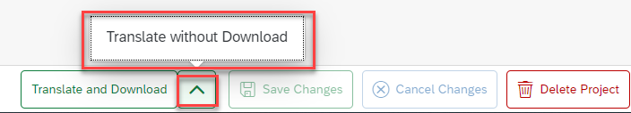!

If everything works as expected, you see the following status:

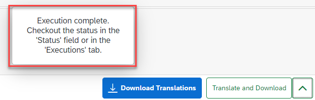!

### Check translations

The translation is now complete, but you might want to review the translations. To do that, choose **Translations**:

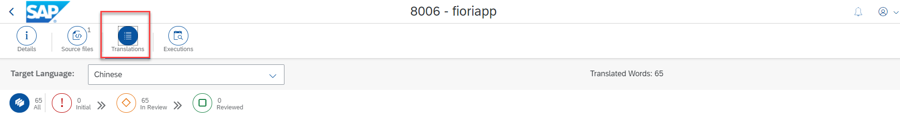!

This is where you can switch between the target languages and, in the columns to the right, see the translation provider and a quality status. The higher the number on a scale from 0-100, the better the quality.
> For translations provided by SAP machine translation (SAP MT), the quality index is always 25.

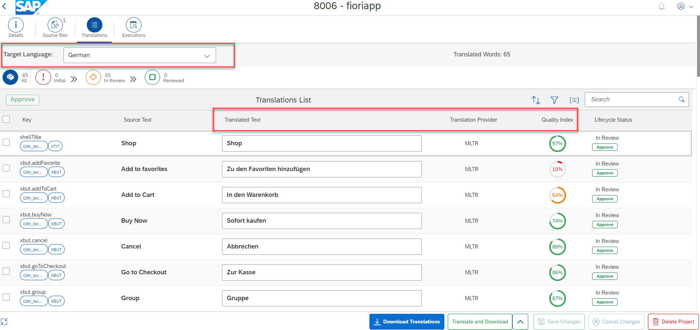!

### Update translations (optional)

If you want to change any of the translations, simply make your changes directly in the **Translated Text** column. When you're done, choose **Save Project**. As a final step, download your translations with the button **Download Translations**.

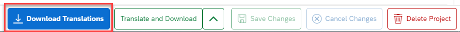!

A zip file is downloaded to your local drive. It contains a separate .properties file for each target language.

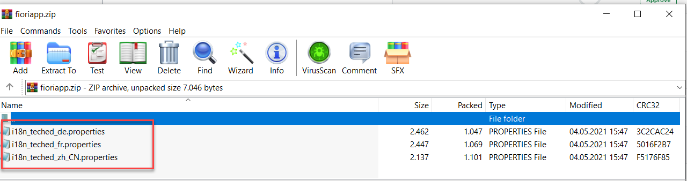!

