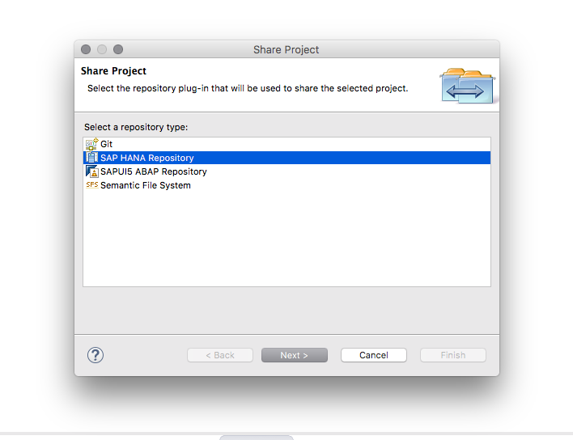
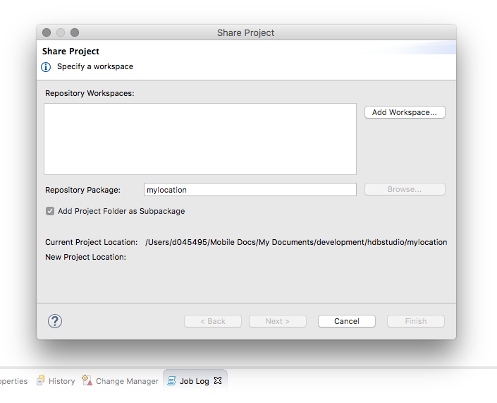
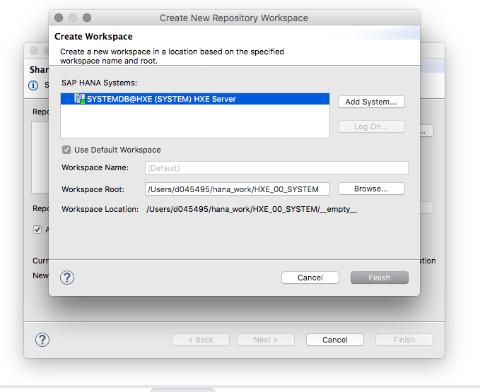

## Prerequisites  
  - **Tutorials:** [SAP HANA Studio, Deploy your project](studio-deploy-project)

## Details
### You will learn  
  - How to expand your simple application and deploy it to the SAP HANA server

&nbsp;
> **DEPRECATED:** SAP HANA XS Classic is deprecated as of SPS02. Please use XS Advanced, and learn about how to get started with the new mission [Get Started with XS Advanced Development](mission.xsa-get-started).

&nbsp;

---

[ACCORDION-BEGIN [Step 1: ](Select your SAP HANA repository)] 

Now that you have the basic application you will right click and choose from the **Team** menu the option to **Share Project** and you will select your SAP HANA repository.

Choose your SAP HANA Repository for deployment.

[ACCORDION-END]

[ACCORDION-BEGIN [Step 2: ](Create repository if necessary)] 

Define the steps and repository if for some reason you have not already created it in the previous tutorial.

[ACCORDION-END]

[ACCORDION-BEGIN [Step 3: ](Define package name)] 

Define your "package" name which corresponds to the path when you work with your application later.

[ACCORDION-END]

[ACCORDION-BEGIN [Step 4: ](Activate project)] 

Finally right click again and under **Team** choose **Activate All** to activate the project and be able to see it on the server itself.

[ACCORDION-END]


