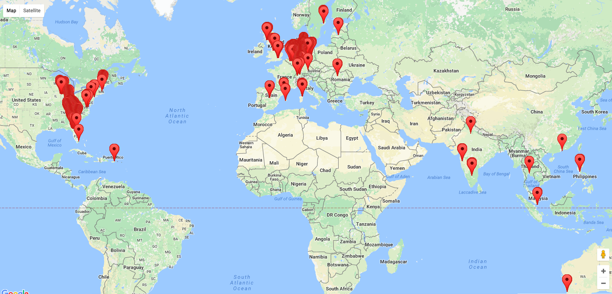

## Prerequisites  
 - **Proficiency:** Beginner
 - **Tutorials:** [SAP HANA Studio, Import your data](http://www.sap.com/developer/tutorials/studio-import-data.html)

## Next Steps
 - Select a tutorial from the [Tutorial Navigator](http://www.sap.com/developer/tutorial-navigator.html) or the [Tutorial Catalog](http://www.sap.com/developer/tutorials.html)

## Details
### You will learn  
Now that you have data it's time to display it in some way as well as enable access to your data.

### Time to Complete
**10 Min**.

---

1. The first step is to create an `xsodata` file that enables you to access the table via OData or from another application.

	

2. The first step is to create an `xsodata` file that enables you to access the table via OData or from another application.

	```
	service namespace "codejam.mylocation.services" {
		"codejam.mylocation.data::geolocation.history" key generate local "GEN_ID";
	}
	```

3. 	Once you have saved and activated this file you should be able to access it via the web browser and ensure that everything is working.

	
	

4. Now that you can access the data it is time to enhance your `index.html` page with a bit of magic in the way of Google Maps.

	```
	<!DOCTYPE html>
<html>
  <head>
    <title>Map Locations</title>
    <meta name="viewport" content="initial-scale=1.0">
    <meta charset="utf-8">
    <style>
      #map {
        height: 80%;
      }
      html, body {
        height: 100%;
        margin: 0;
        padding: 0;
      }
    </style>
	<script src="https://ajax.googleapis.com/ajax/libs/jquery/2.1.3/jquery.min.js"></script>
  </head>
  <body>
    <div id="map"></div>

	<script>
	  	var map;

		function initMap() {
			map = new google.maps.Map(document.getElementById('map'), {
				center: {lat: -34.397, lng: 150.644},
				zoom: 8
			});

			$.ajax({
				url: '/codejam/mylocation/services/geo.xsodata/geolocation.history?&format=json',
				async:false,
				dataType: 'json',
				success: function(data) {
		     	    for(var i = 0; i < data['d']['results'].length; i++) {
			     		jsonDate = data['d']['results'][i]['date'];
			      	    var date = new Date(parseInt(jsonDate.substr(6)));
			      	  	var latLng = new google.maps.LatLng(data['d']['results'][i]['lat'],data['d']['results'][i]['lon']);
			          	var marker = new google.maps.Marker({
			            	position: latLng,
			            	map: map
			          	});
		     	    }
				},
					failure: function(errMsg) {
					console.log(errMsg);
			  	}
			}); 	
		}

	</script>
	<script src="https://maps.googleapis.com/maps/api/js?callback=initMap&key=YOUR_API_KEY"></script>
  </body>
</html>
	```
5. With a bit of magic you should now be able to see your data on a map once you have saved and activated it to the server.

	


## Next Steps
 - Select a tutorial from the [Tutorial Navigator](http://www.sap.com/developer/tutorial-navigator.html) or the [Tutorial Catalog](http://www.sap.com/developer/tutorials.html)
