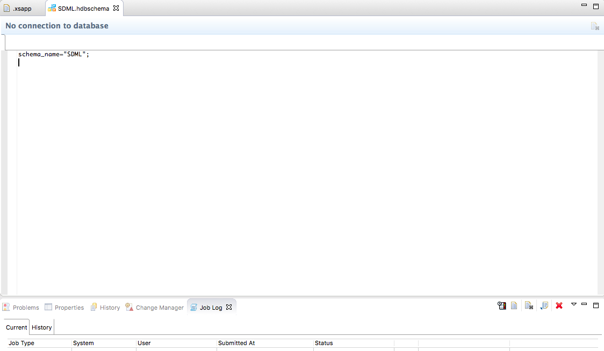
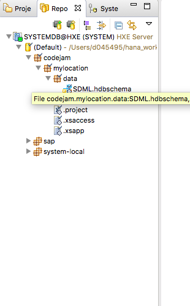
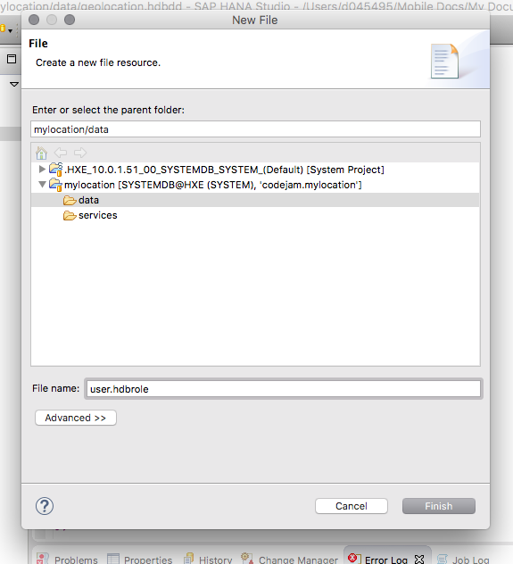
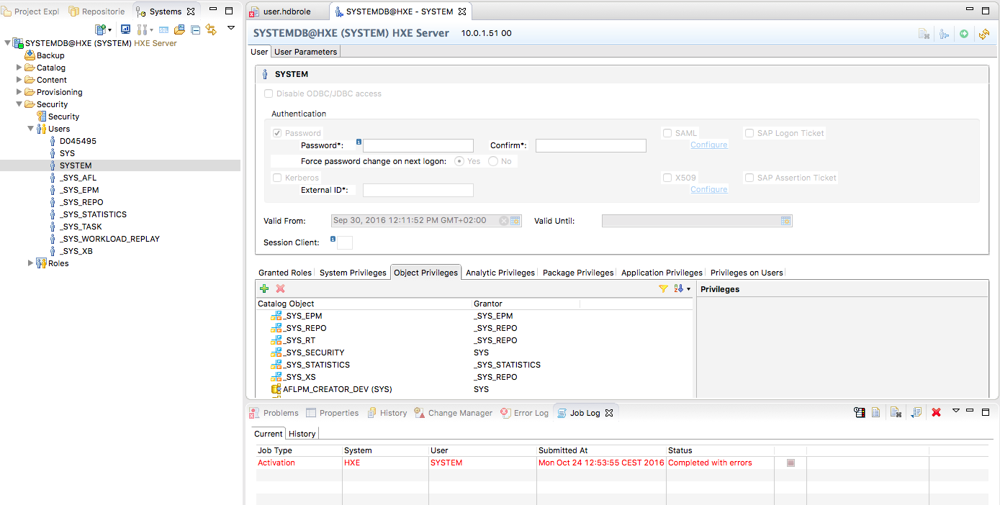
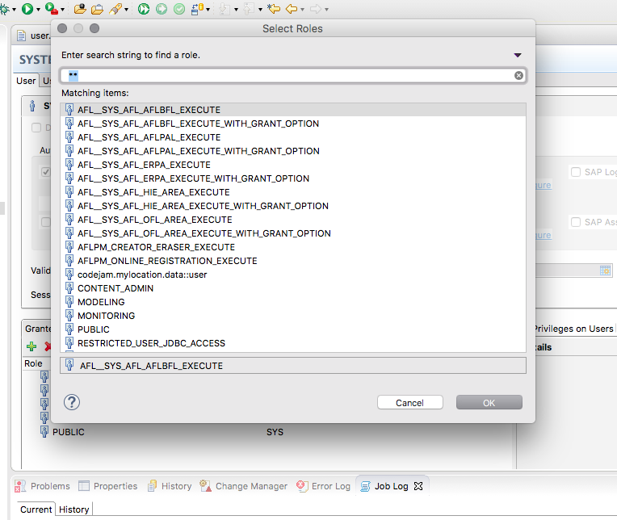
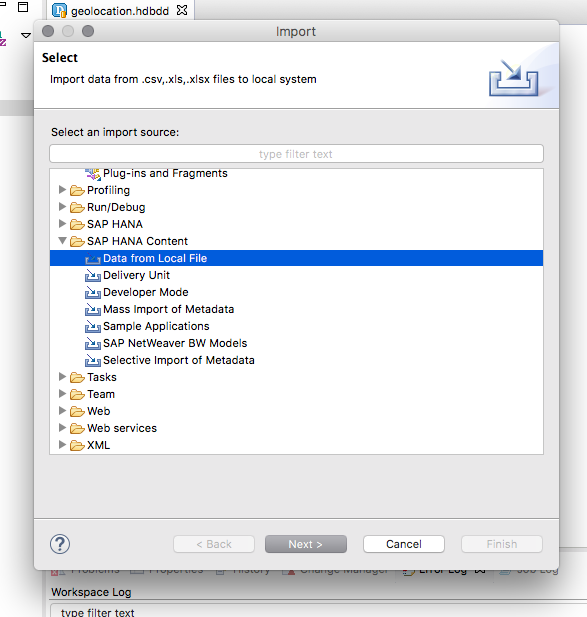
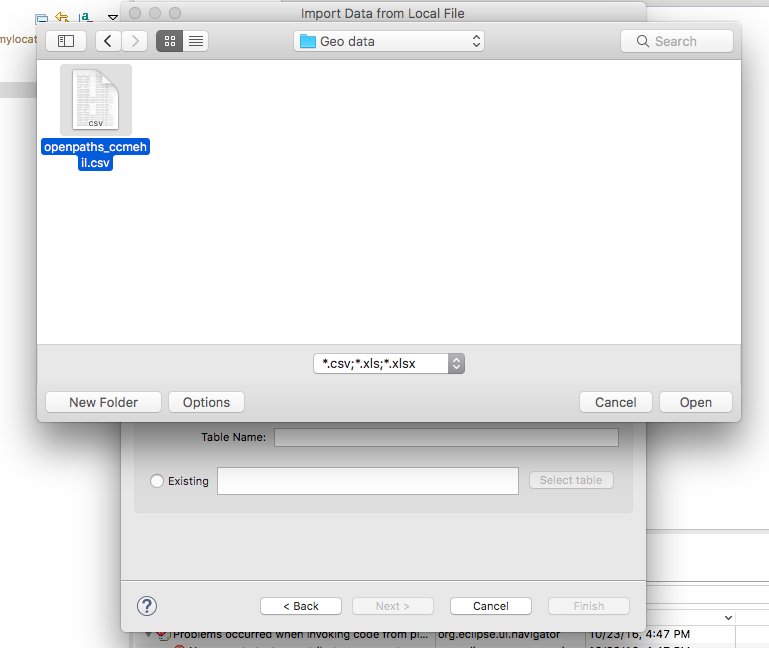
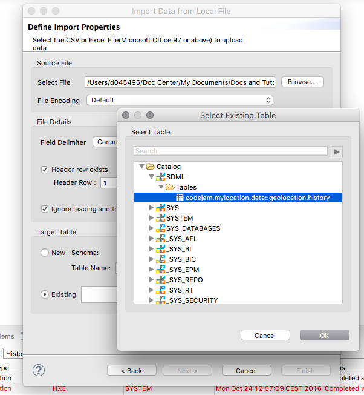
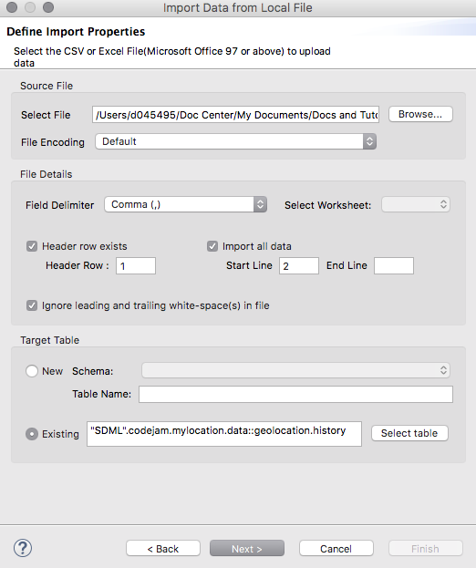
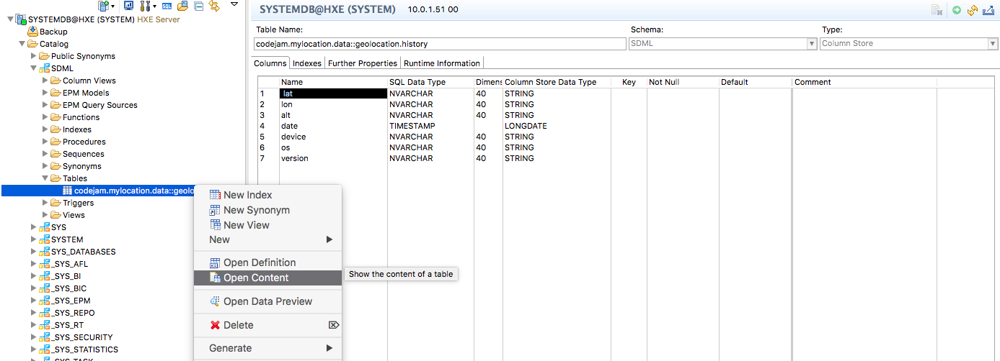

## Prerequisites  
 - **Proficiency:** Beginner
 - **Tutorials:** [SAP HANA Studio, Deploy your project](http://www.sap.com/developer/tutorials/studio-deploy-project.html)

## Next Steps
 - [SAP HANA Studio, Display your project](http://www.sap.com/developer/tutorials/studio-display-project.html)

## Details
### You will learn  
Now to expand your application to include data objects and import your sample data.

### Time to Complete
**10 Min**.

---

1. Now that your application is in place and your project has been shared with the server each time you make your changes and activate they will be updated to the server. To start with, create a new folder in your application called `data`and then add a new file called `SDML.hdbschema`

	

	```
		schema_name="SDML";
	```

2. Now that you have your schema defined you will need to add your data objects, your table. Right click and choose new file and call it `geolocation.hdbdd`

    

    ```
    namespace codejam.mylocation.data;

    @Schema: 'SDML'
    context geolocation {
        type SString : String(40);
        type LString : String(255);
        type SDate : UTCTimestamp;
    type tt_locations {
            lat: SString;
            lon: SString;
            alt: SString;
            date: SString;
            device: SString;
            os: SString;
            version: SString;
        };
        type tt_error {
            HTTP_STATUS_CODE: Integer;
            ERROR_MESSAGE: String(100);
            DETAIL: String(200);
        };

        @Catalog.tableType : #COLUMN
        Entity history {
            lat: SString;
            lon: SString;
            alt: SString;
            date: SDate;
            device: SString;
            os: SString;
            version: SString;
        };
    };
    ```

3. Now that you have your table you will create a role file to give your user or other users access to the application and the newly created objects. Right click and choose new file again and call it `user.hdbrole`

	

4. Now enter the following into the role defining which objects and which access they have.

	```
	role codejam.mylocation.data::user {
	catalog schema "SDML": CREATE ANY, ALTER, DROP, EXECUTE, SELECT, INSERT, UPDATE, DELETE, INDEX, TRIGGER, DEBUG;
	catalog sql object "SDML"."codejam.mylocation.data::geolocation.history":
		SELECT, INSERT, UPDATE, DELETE;
	}
	```

5. Activate all the objects.
6. Now that your role is created you need to switch over to the "Systems" tab and select "Security"

	

7. Choose your user (e.g. SYSTEM) and apply the new role to the user and save.

	

8. Now that your user has full access it's time to import your sample data. For this portion of the tutorial I personally chose an application called "Open Paths", `https://openpaths.cc/`, and ran it on my mobile device for awhile to generate data. Then I was able to download my own history in `CSV` format for use in this example.

9. To import data into your system from a local file you will click on "File" and then "Import" from the menu.

	

10. Then you will select from your local system your file.

	

11. Then you will define some basic settings and to an existing table.

	
	

12. Now when you choose next you will be able to do some mappings.

	

13. Now that the mappings are done you can choose "Import", provided everything goes OK you will have your data now imported into the system and should be able to see it from the "Catalog".

	

## Next Steps
 - [SAP HANA Studio, Display your project](http://www.sap.com/developer/tutorials/studio-display-project.html)
