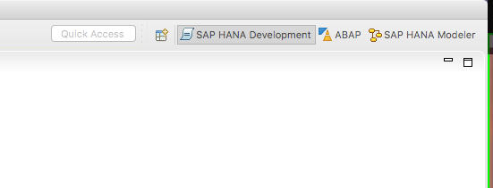
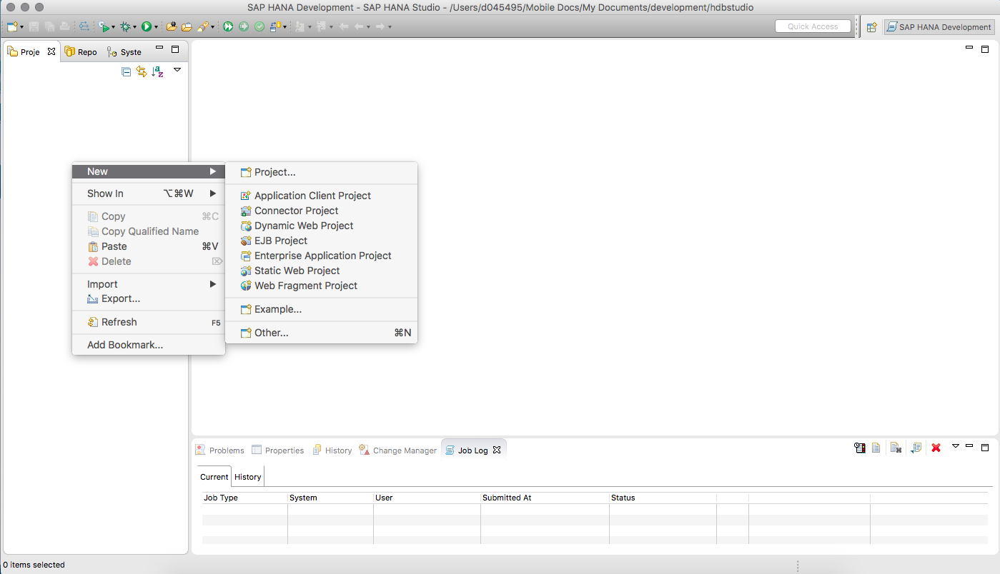
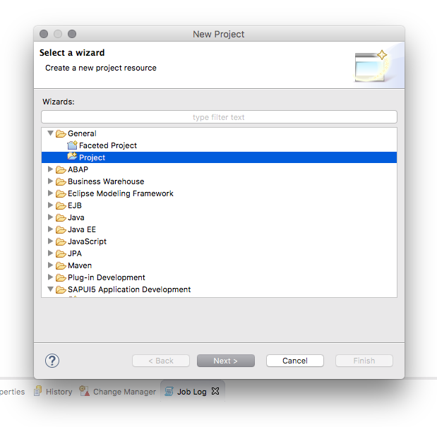
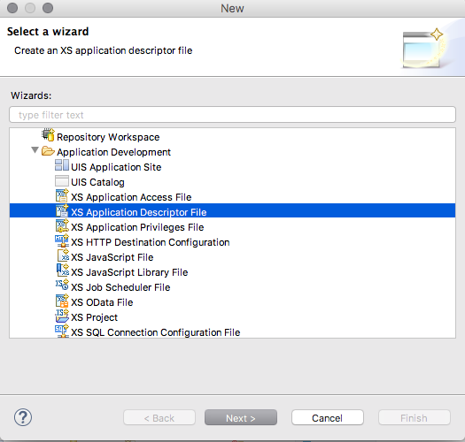
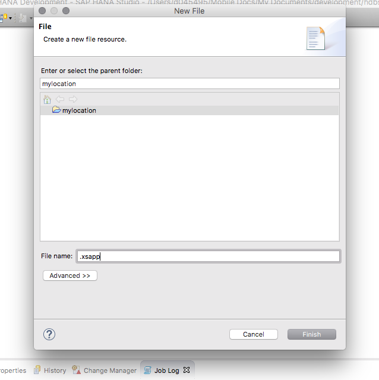

## Prerequisites  
 - **Proficiency:** Beginner
 - **Tutorials:** [How to download and install the HANA Eclipse plugin](http://www.sap.com/developer/how-tos/2016/09/hxe-howto-eclipse.html)

## Next Steps
 - [SAP HANA Studio, Deploy your project](http://www.sap.com/developer/tutorials/studio-deploy-project.html)

## Details
### You will learn  
Setup your first project with SAP HANA Studio for the SAP HANA, express edition.

### Time to Complete
**10 Min**.

---

1. From the previous tutorial you should now have your SAP HANA Studio connected to your SAP HANA, express edition. Therefore, the next step is to create a link to the SAP HANA repository. 

	

    Be sure to switch your perspective to the `SAP HANA DEVELOPMENT` one. To make the next steps work properly.

	 

2. Now that you have the repository linked you can create your first project. This initial project will be the basis for a series of tutorials.

	

3. The first step to create your new repository will be select "File" then "New" and from the drop down you will select a "Project" under the "General" section.

	

4. The project name will be `mylocation` as the idea behind this project will be a simple SAP HANA application around geographical location.

	

5. Once the project is created you will need to create your initial `.xsapp`file to signify that it is an XS application followed by an `.xsaccess` file to define settings for the application. You can use either the wizard to select the `XS Application Descriptor File` and `XS Application Access File` 

	
	
	or simply the "File" - "New" option and manually type the name `.xsapp` and `.xsacess` being sure to incude the `.` first.
	
	

6. The content of your `.xsaccess` file is quite simple.

	```
	{
		"exposed": true
	}
	```
	
	The content of the `.xsapp` can actually be empty.

## Next Steps
- [SAP HANA Studio, Deploy your project](http://www.sap.com/developer/tutorials/studio-deploy-project.html)
