## Prerequisites  
 - [Download Eclipse and SAP HANA Studio plugins](https://tools.hana.ondemand.com/#hanatools)
 - [Create a Repository Workspace](https://www.sap.com/developer/tutorials/studio-new-project.html)


## Next Steps
 - Select a tutorial from the [Tutorial Navigator](https://www.sap.com/developer/tutorial-navigator.html) or the [Tutorial Catalog](https://www.sap.com/developer/tutorials.html)

## Details
### You will learn  
In this tutorial, you will go through all the steps to import data from a MS Excel Spreadsheet, model a simple Calculation view and view the results in a pivot table  using the HANA MDX connector from MS Excel. You will first create the basic setup within an XS Project.

### Time to Complete
**25 Min**

---

[ACCORDION-BEGIN [Step 1: ](Download and Install SAP HANA Client)]

First, you will need to download and install the SAP HANA Client to enable the MDX Connector. You can find it in the Marketplace, in the [SAP Software Download Center](https://support.sap.com/swdc):

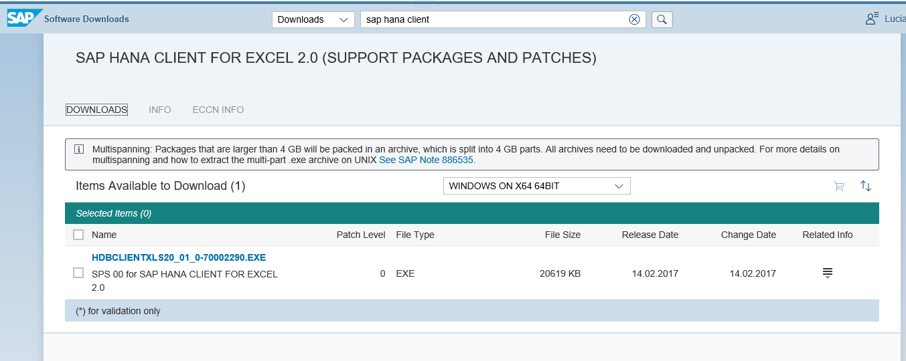

Follow the instructions from the installer to complete the installation.


[ACCORDION-END]

[ACCORDION-BEGIN [Step 2: ](Create the XS Project and Core Data Services artifacts)]


In SAP HANA Studio, from the SAP HANA Development perspective, create an XS Project by selecting `File->New->XS Project`. If you do not see the XS Project option, go into `Other` and look for it under the `Application Development` menu inside `SAP HANA`.

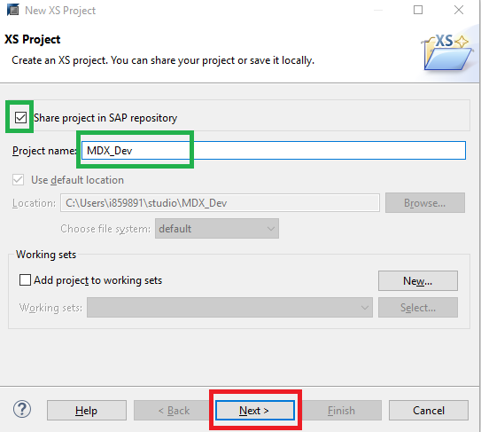

Click on `Next`, choose a repository, add a name for a package and untick the `Add project Folder as Subpackage`.

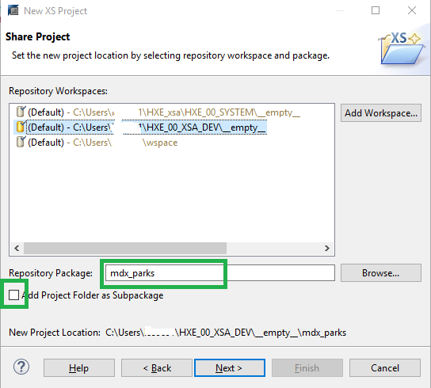

Click `Next`, add a name for a schema and for the Data Definition (`.hdbdd`) file

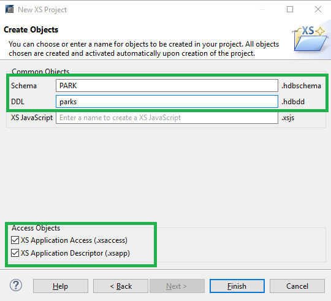

You can now declare a context in a Core Data Services (CDS) artifact. This context will serve as a group for the two design-time entities (tables) that will hold the data you will import and the data types you will create.

Enter the following code into the `.hdbdd` file:

```
namespace mdx_parks;

@Schema : 'PARK'
context parks {

/**`Type` is to declare reusable field or structure declarations. **/

Type tyObjectID : String(8);
Type tyParkID : String(7);
Type LString : String(200);
Type MString : String(80);
Type SString : String(20);
Type TString : String(2);


/** An entity becomes a table **/

entity Park {

	key OBJECTID : tyObjectID;
	key ParkID : tyParkID;
	ParkName : MString;
	ParkType : SString;
	ParkStatus : SString;
	DevelopmentStatus: SString;
	ParkPlanningArea : SString;
	MgtPriorty : SString;
	MgtAgencyName : MString;
	MgtAgencyType : SString;
	Landowner : MString;
	OwnerType : SString;
	Acreage : Decimal(10,2);
	AcreSource : SString;
	Address : MString;
	CityMuni : SString;
	County :  SString;
	State : TString;
	StreetNum : String(6);
	StreetDirection : TString;
	StreetName : MString;
	StreetType : String(4);
	Zip : String(5);

	};

/**	The following fields in the file have been lef out:
StatusCmnt, Comments, Classic**/

entity Amenities {
	key ID : String(32);
	key ParkID : tyParkID;
	park: Association[1] to Park on park.ParkID = ParkID;
	AmenityType : MString;
	CourtCount : Integer;
	DescriptionText : LargeString;
	HasSwingset : String(5);

	};


/**Fields Park Name, FieldCount,FieldSurface, AgeGroup, Address, Latitude, Longitude, CreatedDate,UpdatedDate,FID
 not included **/


};

```
The structures defined for these three entities match those of the files we will use later, except for some fields that have been intentionally left out.

Right-click on the project, go down to `Team` and click on the `Activate All` button.

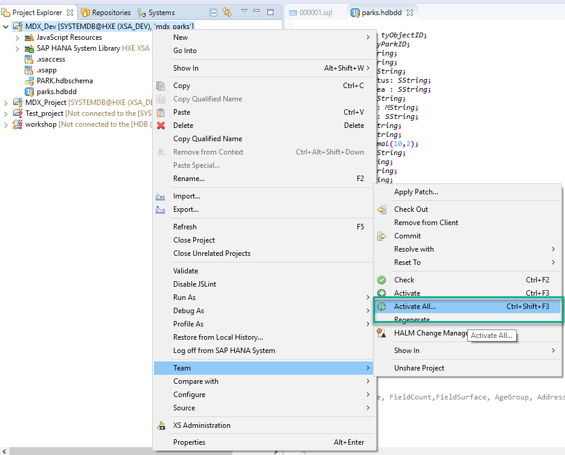


[ACCORDION-END]

[ACCORDION-BEGIN [Step 3: ](Grant permissions to the newly created schema)]

From the `Systems` tab, open the `Security` folder and look for your user ID. Double-click on it to open your User Administration page.

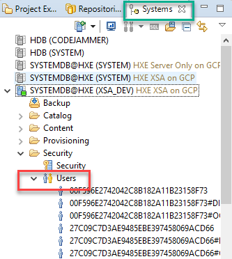

Click on the `Object Privileges` tab and the on the **+** sign to add the schema you need access to:

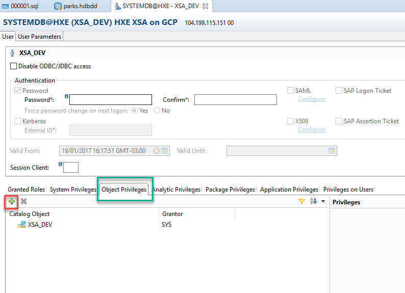

Select the schema you have just created:

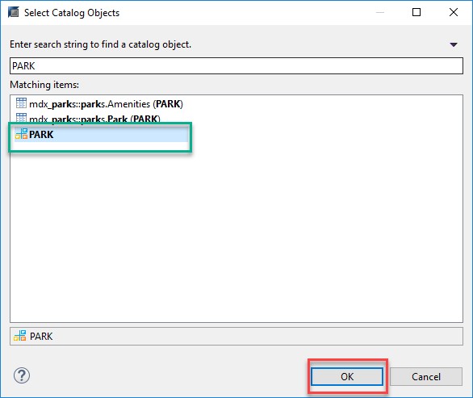

>Note: You may need this done by a user with administration permissions.


Flag permissions to Delete, execute, insert, select and Update your new schema.
Once finished, press **F8** or click on the green arrow on the top right corner to deploy the changes.

You can now go into the `Systems` tab and look for the Schema and tables:

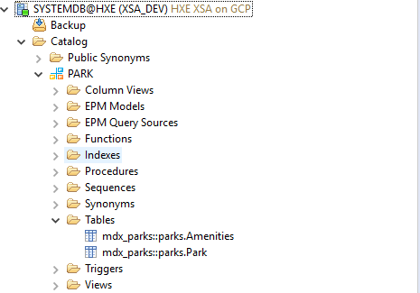


[ACCORDION-END]

[ACCORDION-BEGIN [Step 4: ](Import data into your tables)]

This example uses data from the [Open Data City of Boise](http://opendata.cityofboise.org/datasets?keyword=recreation) site. If you choose another dataset, you need to adapt the entities and types created in the previous step to match the structure of that dataset.

The datasets in this example are the [Boise Parks Facilities Open Data](http://opendata.cityofboise.org/datasets/f3f869a1a23648219560176e785d0c06_0) and the [Boise Parks and Reserves Open Data](http://opendata.cityofboise.org/datasets/41b7354db4704bd0a7545f84196a164e_0) CSV files.  

Go into **File** and then `Import`.

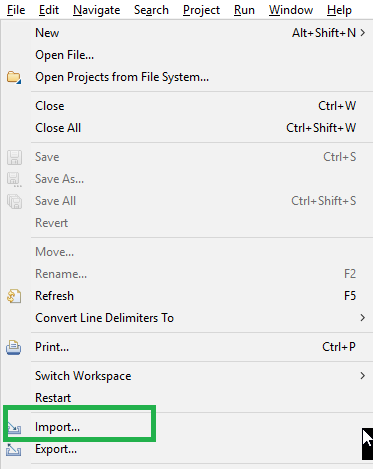

In the `SAP HANA Content` folder, choose `Data from Local File` and then click on **Next**.

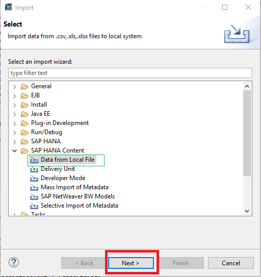

Choose your target system (where your schema and tables are):


Click on **Browse** to select one of the two files you will import. This example starts with `Boise_Parks_and_Reserves_Open_Data.csv`, which contains the date for the table `Park`. You could also start with `Boise_Parks_Amenities_Open_Data.csv`, which contains the data for the table `Amenities`. once you select the file, click on **Open**.

>Note: You could also use `.xlsx` or `.xls` file formats.

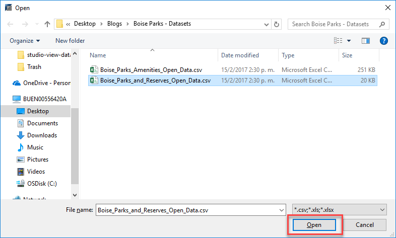

Click on the `Header Row Exists` to indicate that the first row contains the names of the columns. Click on **Select Table** to search for the table to which you will import the file. This example uses the table `Park`.

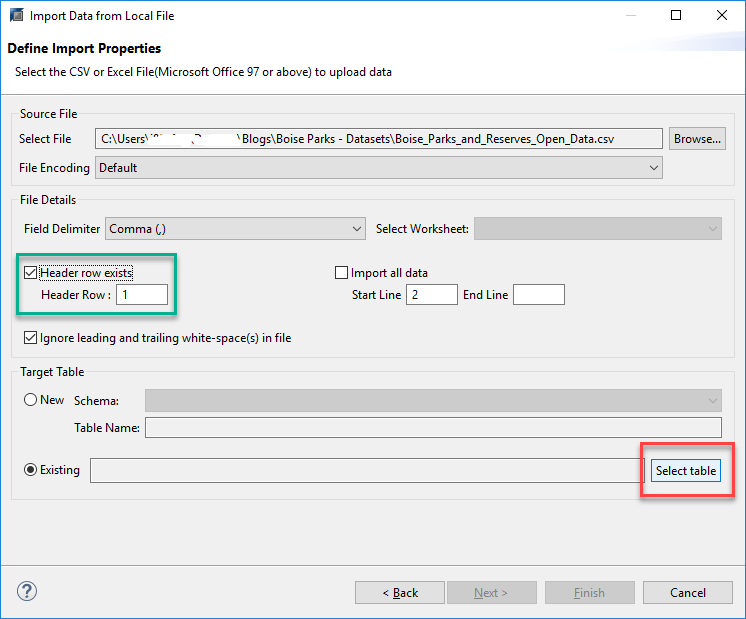

Click on **Next**. If you are importing a file with a Header Row and the names of the rows match the names in the table, you can choose the `Map By Name`, like in this example. If you do not have a header row or the names do not match, you can choose to perform the mapping manually by dragging the fields from the source file on the left to the target table on the right.

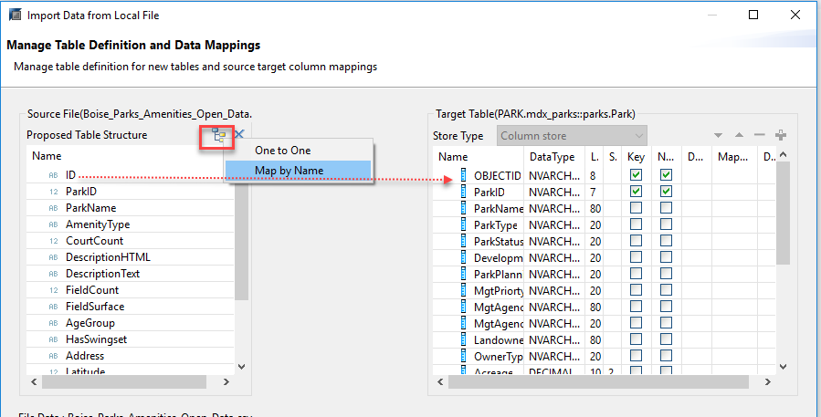
Perform the same import procedure with the `Amenities` table using the `Boise_Parks_Amenities_Open_Data.csv` file.

Right-click on the tables to **Open Data Preview** and see the files loaded. You can quickly explore the data in the `Distinct Values` and `Analysis` tabs:

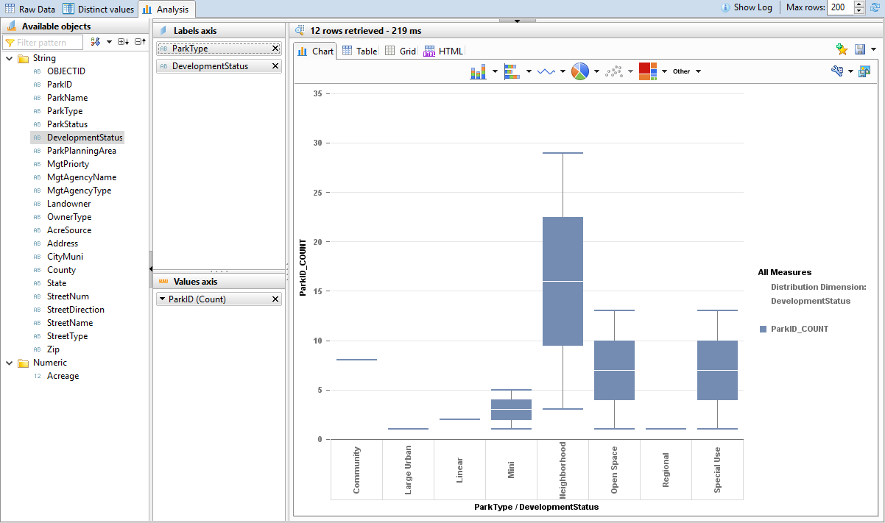

> Hint: If you click on the `Show Log` button on the top right corner of the data preview in SAP HANA Studio, you can see the SQL Query and the server processing time.


[ACCORDION-END]

[ACCORDION-BEGIN [Step 5: ](Create a Calculation View)]

You will now create a Calculation View. A calculation view can perform complex calculations joining different tables, standard views and even other calculation views as sources.

From the `Project Explorer` tab in SAP HANA Studio, right click on the project, then on `New` and then look for the `Calcuation View` under `SAP HANA / Database Development`

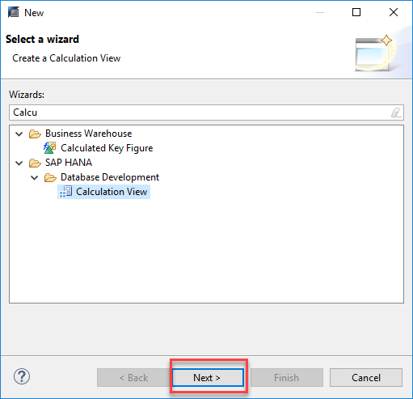

Enter the name for your calculation view and click on **Finish**.

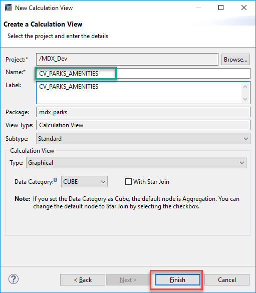

Add two projection nodes by dragging and dropping `Projection` nodes from the Nodes lateral bar. These nodes will be used to join the parks to their Amenities and add a filter later.


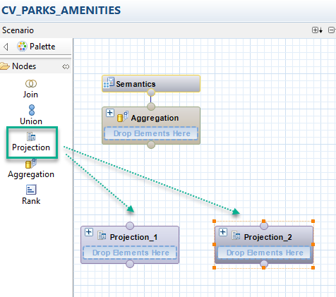

Hover on the nodes and a **+** sign will appear on the right.

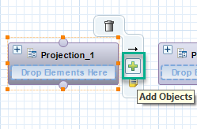

Click on it to select the one of tables (either Park or Amenities) to be projected. Repeat the same for the other table so you can select all of the fields for output. You can either click on the circle on the left of each individual field or right click on the top of the table node and select **Add all to Output**.

For the Amenities, leave out the `DescriptionText` field from the output as it is not supported by this type of view.

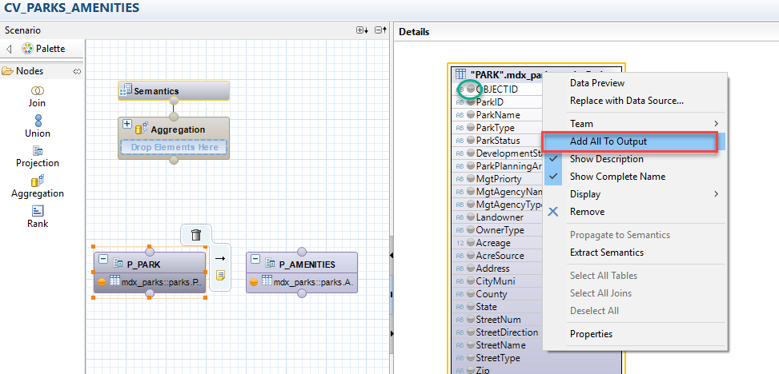

Drag and drop a `Join` node from the `Nodes` bar on the left. To connect the tables, drag and drop the circles on the top of each `Projection` node into the `Join` node.

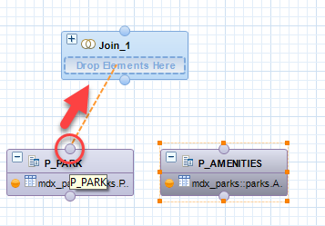

Click on the Join Node to connect the key fields by dragging the `ParkID` from the left into the `ParkID` field from the right:

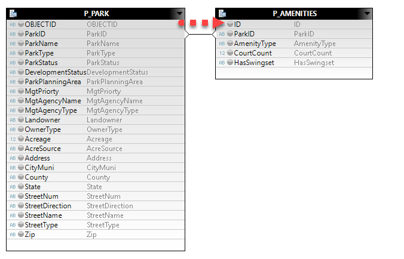

Add all the fields to output (except for the `ParkID` field from amenities, to prevent it from being duplicate) and set the `Join Type` to `Left Outer` so that Parks that do not have any amenities are also included in the results.

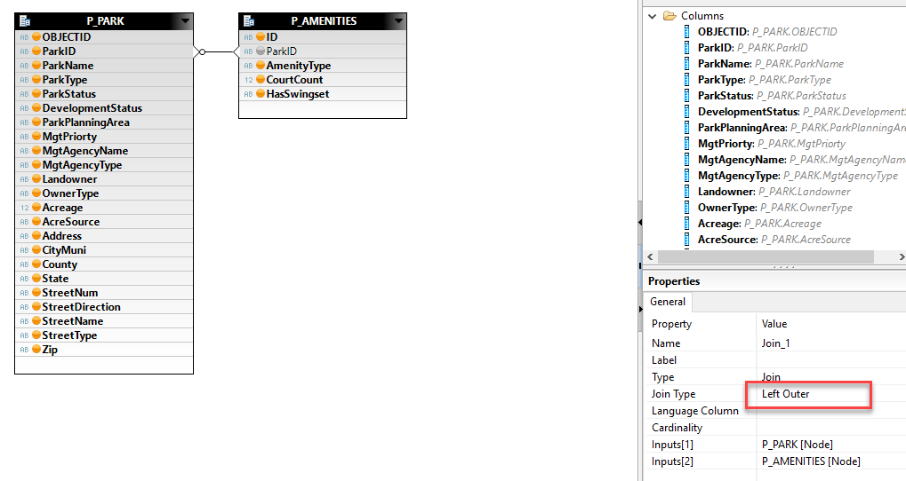

Finally, drag and drop the circle on the `Join` node into the `Aggregation` node. Add all the fields in the Aggregation to Output and click on the `Semantics` node.
Use the **Auto Assign**  button to automatically set the type (measure or attribute) for each field.  

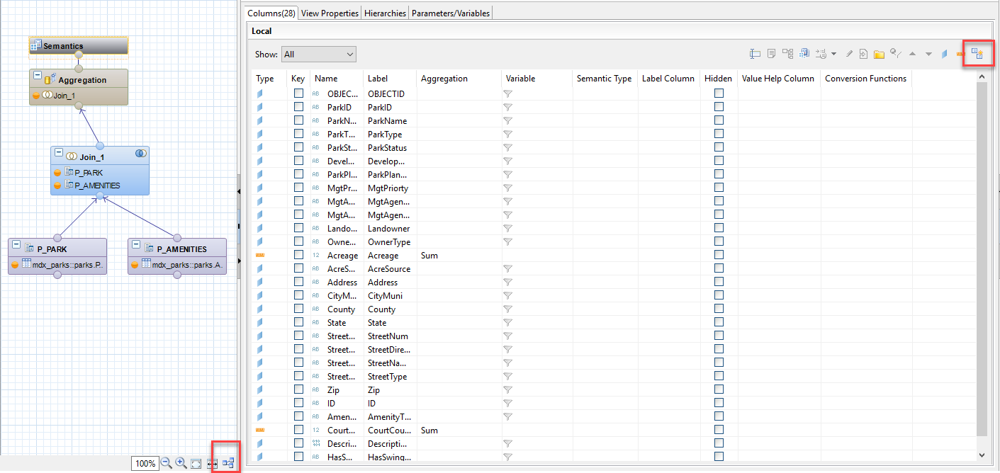

> The `Auto Layout` button at the bottom of the graphic model makes the diagram prettier.

Activate your view using the green arrow on the top:

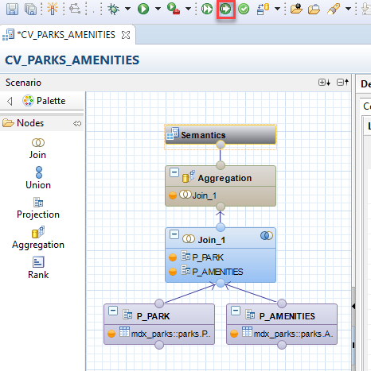

And click on `Raw Data` to see your results:


[ACCORDION-END]

[ACCORDION-BEGIN [Step 6: ](Connect to your instance using the MDX connector)]

Open a new spreadsheet in MS Excel. In the `Data` ribbon, choose `From Data Connection Wizard` in the `Other Sources` menu.


Choose `Other/Advanced` and click **Next**.

If you completed Step 1 successfully, you will see  `HANA MDX Provider` at the bottom. Select it and click on **Next**.

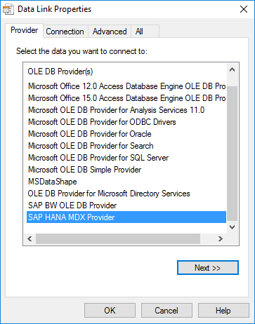

Enter the connection details to your SAP HANA database and test the connection before clicking on **OK**.

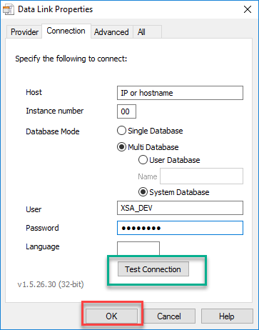

> Hint: You can right-click on the system, and open `Properties` to see your IP or host name followed by port `3xx15`, where xx is your instance number.

After the connection is established, choose the package  (`database` to MS Excel) and the calculation view (also known as, `Cube`) and then click **Finish**.

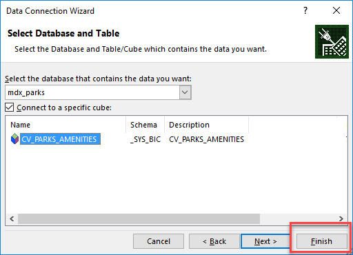

Review the `Import Data` options. Keep the `Pivot Table` and click on OK.

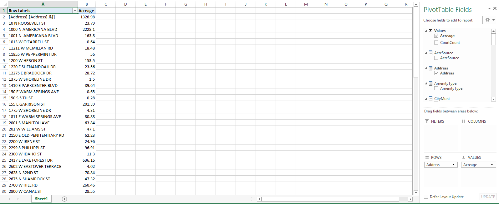

You can now use Excel to execute OLAP queries against SAP HANA and create Pivot Tables and Pivot Charts.


[ACCORDION-END]


---


## Next Steps
- Select a tutorial from the [Tutorial Navigator](https://www.sap.com/developer/tutorial-navigator.html) or the [Tutorial Catalog](https://www.sap.com/developer/tutorials.html)
