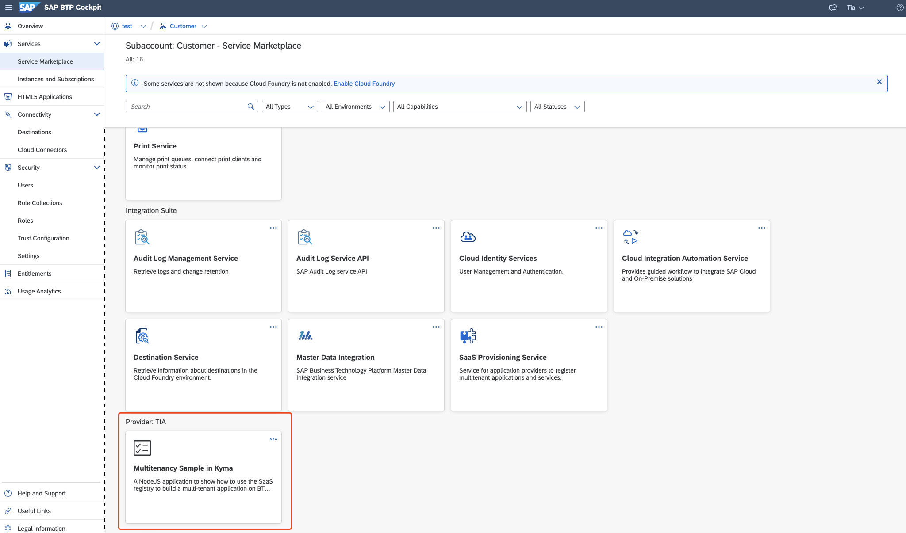
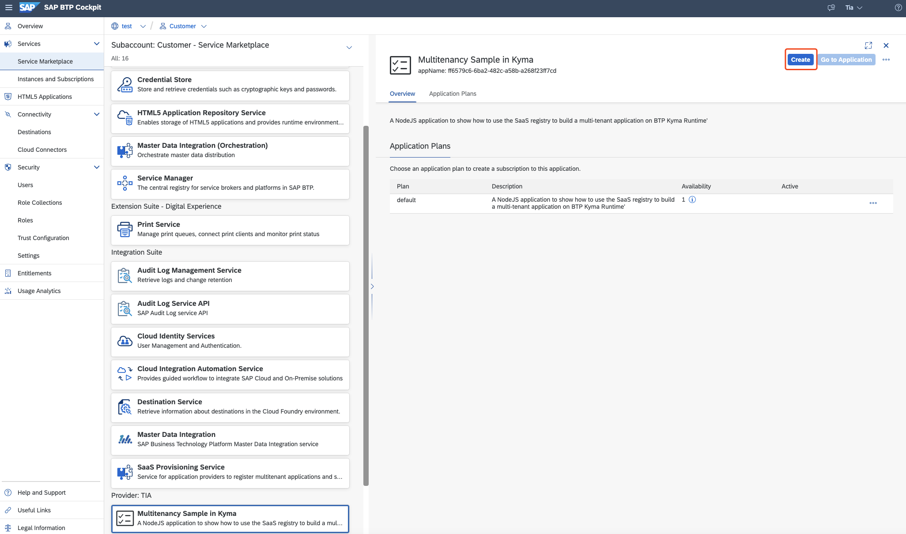
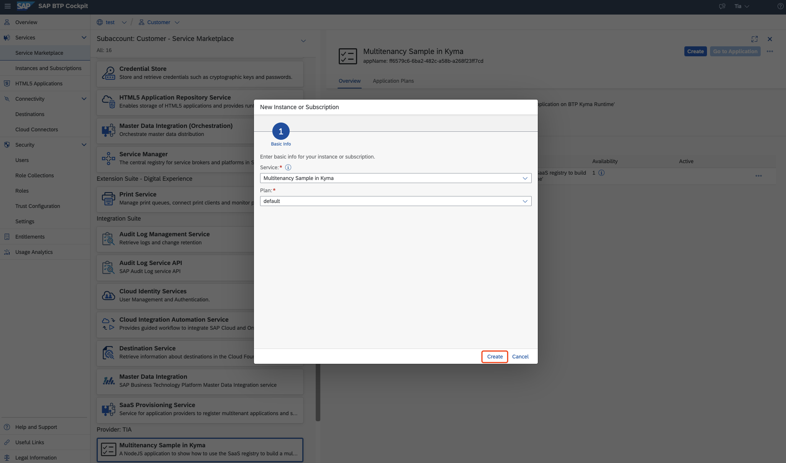
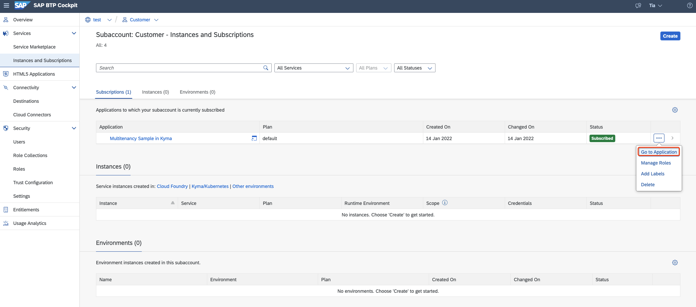
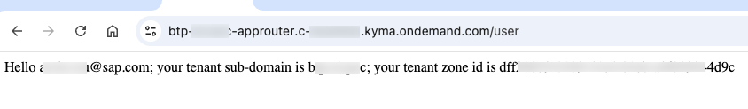

# Subscribe a Multitenant Application by a Consumer
<!-- description --> Create a subaccount in your global account for each application consumer, subscribe each consumer subaccount to the hosted multitenant application deployed in the provider account.

## Prerequisites
- You have finished the tutorial [Deploy a Multitenant Application to a Provider subaccount, Kyma Runtime](deploy-multitenant-app-kyma).

## You will learn
- How to subscribe customers to the hosted multitenant application

---

### Create New Subaccount

Now, a consumer can subscribe to the application through the SAP BTP Account Cockpit.

Create a new subaccount for the customer in the same Global Account with the multitenant application provider subaccount, for example, called `Customer`.

### Subscribe Multitenant Application

1. Switch to the new subaccount `Customer`, you can see and subscribe the multitenant application in the **Service Marketplace**.

 

<!-- border -->

2. Create an instance for the multitenant application:

 

<!-- border -->

3. Select the service and click **Create**:

 

<!-- border -->

4. Once it is subscribed, you can try to access it by clicking **Go to Application**:

 

<!-- border -->
    The multitenant application will display the logged-in user's name and customer's tenant-related information, shown as below:

 

<!-- border -->

---
