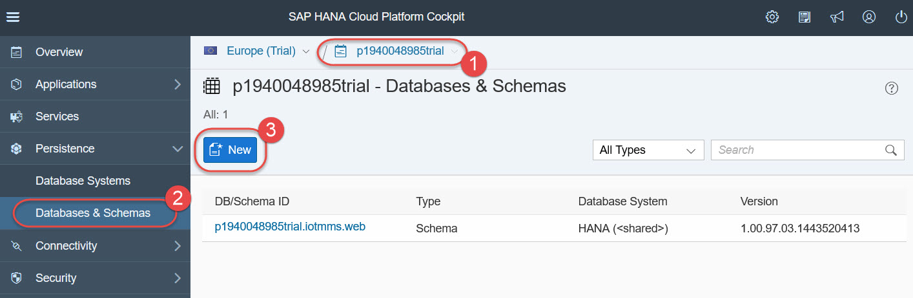
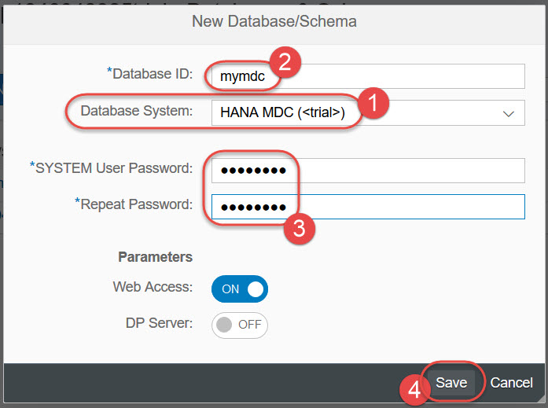
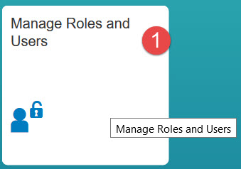
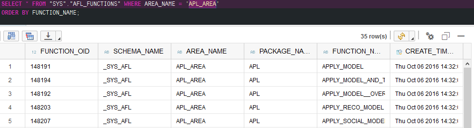
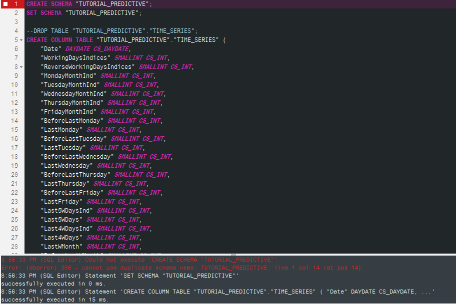
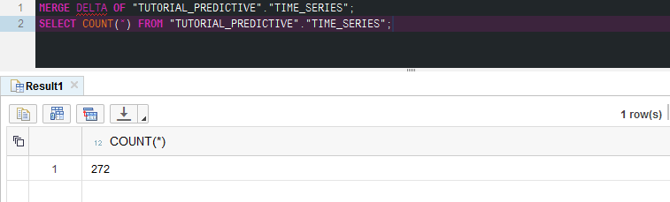
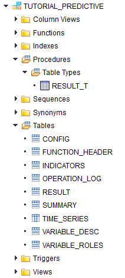
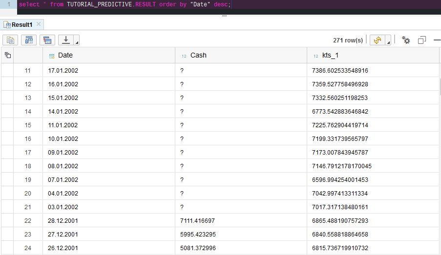

## Prerequisites  
 - **Proficiency:** Beginner
 - **Tutorials:**
   - [ABC Analysis with SAP HANA PAL](http://www.sap.com/developer/tutorials/teched-2016-10.html)
   - Your SAP HANA MDC database is created and running in SAP Cloud Platform account and you have Developer access to it

## Next Steps
 - Select a tutorial from the [Tutorial Navigator](http://www.sap.com/developer/tutorial-navigator.html) or the [Tutorial Catalog](http://www.sap.com/developer/tutorials.html)


## Details
### You will learn

You will use the **SAP HANA Automated Predictive Library (APL)** to create and run the **Automated Time Series** algorithm to analyze a signal and forecast the next "n" values.

For that, you will use a **SAP HANA multi-tenant database container (MDC)** instance available on the **SAP Cloud Platform** trial account where each tenant databases in the same system share the same system resources (memory and CPU cores) but each tenant database is fully isolated with its own database users, catalog, repository, persistence (data files and log files) and services.

For more details about the **Automated Time Series**  available in **APL**, you can check the [SAP HANA Automated Predictive Library Reference Guide](https://cp.hana.ondemand.com/dps/d/preview/5b8e06cae5be43f5af9dbe72d73bb7a9/2.5/en-US/frameset.htm?5db34eae84ed44e49ec1f0f78dfb52a1.html).

### Time to Complete
**20 Min**.

[ACCORDION-BEGIN [Step 1: ](Check or create your SAP HANA MDC instance in HCP)]

Log into [SAP Cloud Platform](https://account.hanatrial.ondemand.com) by opening the following URL in a new tab: https://account.hanatrial.ondemand.com

Make sure you are using the **Europe (Trial)** landscape, and click on your account name to open the cockpit view.

In the left-hand navigation bar, select in **Persistence > Databases & Schemas** and check that you have database of the system type **HANA MDC (trial)** created.

**If you have one instance already configured, then please go to the next step of this tutorial.**


If you do not have HANA MDC instance, then follow these steps to create the instance and assign required roles to **`SYSTEM`** user.

Click on **New**.



Choose the **HANA MDC (trial)** as the Database System.

Pick a **Database ID** for your instance (it should be all lowercase, only letters and digits).

Choose a password for the **`SYSTEM`** user.

Please note it down, as you are the only one who is going to use it, and there is no way to reset it if lost.

Click on **Save**



Now your **SAP HANA MDC** instance is being built, and this will take about 6 minutes.

You should see a message **Database started successfully** on the **Events** screen once the instance is ready to be used.


Now, two more steps need to be done to give your **`SYSTEM`** user administration and developer roles.

**It is not a good practice to update the SYSTEM user like this but for the sake of time and reduce the number of steps, we will be updating the SYSTEM user.**

**So please, never give the same user administration and developer roles in real-life productive scenarios! `;-)`**

On the left side navigation bar, click on **Overview**.

Click on **Administration Tools: SAP HANA Cockpit**.


Logon as user **`SYSTEM`** with the password you provided during the instance creation.


At the first time login as **`SYSTEM`**, an information screen pops up saying your user has no administration authorizations yet.

Just click **OK** on this and **Continue** on the next pop up.


Once the **SAP HANA Cockpit** is open, click on **Manage Roles and Users** to open the **Security Workbench**.



**SAP HANA Web-based Development Workbench: Security** opens in the new browser window.

Expand the **Users** node, click once on the **SYSTEM** user, and click **green plus** icon to add a new **Granted Roles** to the user.


Search for role **`sap.hana.xs.ide.roles::Developer`**, select it and click **OK** to add that role to **Granted Roles**.


Press **`Ctrl+S`** or click **Save** icon.

Now your **`SYSTEM`** user has developer role assigned. **Again, never do the same - giving the same user both administration and developer roles in productive systems!**

Close the **Security Workbench** and the **SAP HANA Cockpit** and move to the next step.

[DONE]
[ACCORDION-END]

[ACCORDION-BEGIN [Step 2: ](Open SAP HANA Web-based Development Workbench)]

The database should be in the state **`STARTED`**. Click on **SAP HANA Web-based Development Workbench**.


[DONE]
[ACCORDION-END]

[ACCORDION-BEGIN [Step 3: ](Open the Catalog tool)]

On the **SAP HANA Web-based Development Workbench**, click on **Catalog** which will allow you to create, edit, execute and manage SQL catalog artifacts in the SAP HANA database


Then, in the **Catalog Workbench** click on the **SQL** icon to open a new SQL Console.

Logon using your developer user. For brevity, you can use the user `SYSTEM`, but ideally a separate user should be used.

Type the following code and run it using the **Run** icon or pressing `F8` on the keyboard:

```sql
SELECT * FROM "SYS"."AFL_FUNCTIONS" WHERE AREA_NAME = 'APL_AREA'
ORDER BY FUNCTION_NAME;
```

If the **Automated Predictive Library (APL)** is installed on the SAP HANA instance, then the query will return the list of APL functions available in the library.



You should be able to find **FORECAST** among **APL** functions and this is the one you are going to use in this tutorial.

Now, in order to be able to execute the **APL** functions, you will need to add your user the **`AFL__SYS_AFL_APL_AREA_EXECUTE`** role.

As you are connected as the `SYSTEM` you can't that role to yourself, so we will be creating and using a dedicated user to run the APL functions.

Type the following code and run it using the **Run** icon or pressing `F8` on the keyboard:

```sql
DROP USER APL_USER CASCADE;
CREATE USER APL_USER PASSWORD Welcome16 NO FORCE_FIRST_PASSWORD_CHANGE;
ALTER USER  APL_USER DISABLE PASSWORD LIFETIME;

GRANT AFL__SYS_AFL_APL_AREA_EXECUTE TO APL_USER;
GRANT AFLPM_CREATOR_ERASER_EXECUTE TO APL_USER;
GRANT CREATE SCHEMA TO APL_USER;

call _SYS_REPO.GRANT_ACTIVATED_ROLE ('sap.hana.ide.roles::Developer','APL_USER');

```

You can now logout from the Catalog console, and log back in using the new `APL_USER` user where the password is `Welcome16`.

[DONE]
[ACCORDION-END]

[ACCORDION-BEGIN [Step 4: ](Introduction to APL and Auto Time Series algorithm)]

The **Automated Predictive Library (APL)** defines functions that can be called from within **SQLScript** procedures to perform analytic algorithms.

For more details about APL, you can check the [What is SAP HANA Automated Predictive Library (APL)?](https://help.sap.com/businessobject/product_guides/pa24/en/pa24_hana_apl_user_en/frameset.htm) online help.

[DONE]
[ACCORDION-END]

[ACCORDION-BEGIN [Step 5: ](Create a schema and load input data)]

Next, you need to create the table and load the data set that will be used during this tutorial.

You can find the SQL statements at the following link [`apl_timeseries_data.txt`](https://raw.githubusercontent.com/SAPDocuments/Tutorials/master/tutorials/teched-2016-11/apl_timeseries_data.txt).

Paste the code from the link above into a **SQL Editor** and hit **Run** to create a new schema **`TUTORIAL_PREDICTIVE`**, a table named **`TIME_SERIES`** and insert the data.

**You may run into some SQL errors when running the script as the schema may already exists from a previous tutorial, so don't worry as long as the table is created.**

You should see the **`TUTORIAL_PREDICTIVE`** schema and the **`TIME_SERIES`** table created in the **Catalog Explorer** on the left side (you may need to refresh the tree structure for that):



As this is a columnar table, so HANA will merge newly inserted records to get the table compressed and optimized for the best performance.

Verify all 272 records have been loaded by running the following SQL script:

```sql
SELECT COUNT(*) FROM "TUTORIAL_PREDICTIVE"."TIME_SERIES";
```



Next, you can create a view that will be the input to the **Automated Time Series** algorithm as time series analysis usually requires sorted data.

```sql
DROP VIEW "TUTORIAL_PREDICTIVE"."TIME_SERIES_SORTED";

CREATE VIEW "TUTORIAL_PREDICTIVE"."TIME_SERIES_SORTED" AS SELECT * FROM "TUTORIAL_PREDICTIVE"."TIME_SERIES" ORDER BY "Date" ASC;

SELECT COUNT(*) FROM "TUTORIAL_PREDICTIVE"."TIME_SERIES_SORTED";
--Should return 272 records
```


[DONE]
[ACCORDION-END]

[ACCORDION-BEGIN [Step 6: ](Create the wrap procedure for Auto Time Series APL function)]

To use any **APL** functions, you must do the following:

- Generate the input table "types" required by the generic **APL** function with your specific data structures
- Call that **AFL** procedure, for example, from an **SQLScript** procedure

>You can find more details in **SAP HANA Automated Predictive Library (APL) Reference** document at https://help.sap.com/pa.

> **Note:**
> Due to a recent change on the HANA MDC setup on trial, we had to review the code provided below and use the "hard-coded way" to use the APL. Once the setup is fixed, we will revert to the nicer and shorter version of the script.

Use the following code to generate the types and the model configuration:

```sql
/* Set the function header to  prepare logging configuration */
DROP TYPE TUTORIAL_PREDICTIVE.T_FUNCTION_HEADER;
CREATE TYPE TUTORIAL_PREDICTIVE.T_FUNCTION_HEADER AS TABLE (
  "KEY" NVARCHAR(50),
  "VALUE"NVARCHAR(50)
);
DROP TABLE TUTORIAL_PREDICTIVE.APL_TS_FUNCTION_HEADER;
CREATE TABLE TUTORIAL_PREDICTIVE.APL_TS_FUNCTION_HEADER LIKE TUTORIAL_PREDICTIVE.T_FUNCTION_HEADER;
INSERT INTO TUTORIAL_PREDICTIVE.APL_TS_FUNCTION_HEADER VALUES ( 'Oid','TIME_SERIES');
INSERT INTO TUTORIAL_PREDICTIVE.APL_TS_FUNCTION_HEADER VALUES ( 'LogLevel','8');

/* Set the Time Series algorithm configuration*/
DROP TYPE TUTORIAL_PREDICTIVE.T_OPERATION_CONFIG;
CREATE TYPE TUTORIAL_PREDICTIVE.T_OPERATION_CONFIG AS TABLE (
  "KEY" NVARCHAR(1000),
  "VALUE" NVARCHAR(300),
  "CONTEXT" NVARCHAR(100)
);
DROP TABLE TUTORIAL_PREDICTIVE.APL_TS_CONFIG;
CREATE TABLE TUTORIAL_PREDICTIVE.APL_TS_CONFIG LIKE TUTORIAL_PREDICTIVE.T_OPERATION_CONFIG;
INSERT INTO TUTORIAL_PREDICTIVE.APL_TS_CONFIG VALUES ('APL/Horizon', '21', '');
INSERT INTO TUTORIAL_PREDICTIVE.APL_TS_CONFIG VALUES ('APL/TimePointColumnName', 'Date', '');
INSERT INTO TUTORIAL_PREDICTIVE.APL_TS_CONFIG VALUES ('APL/LastTrainingTimePoint', '2001-12-29 00:00:00', '');

/* We don't need to set the variable, so it will be guessed from the data*/
DROP TYPE TUTORIAL_PREDICTIVE.T_VARIABLE_DESC;
CREATE TYPE TUTORIAL_PREDICTIVE.T_VARIABLE_DESC AS TABLE (
  "RANK"  Integer,
  "NAME" NVARCHAR(127),
  "STORAGE" NVARCHAR(10),
  "VALUETYPE" NVARCHAR(10),
  "KEYLEVEL" Integer,
  "ORDERLEVEL" Integer,
  "MISSINGSTRING" NVARCHAR(50),
  "GROUPNAME" NVARCHAR(50),
  "DESCRIPTION" NVARCHAR(100),
  "OID" NVARCHAR(50)
);
DROP TABLE TUTORIAL_PREDICTIVE.APL_TS_VARIABLE_DESC;
CREATE TABLE TUTORIAL_PREDICTIVE.APL_TS_VARIABLE_DESC LIKE TUTORIAL_PREDICTIVE.T_VARIABLE_DESC;

/* We only need to describe the date column and the signa we are trying to predict*/
DROP TYPE TUTORIAL_PREDICTIVE.T_VARIABLE_ROLES;
CREATE TYPE TUTORIAL_PREDICTIVE.T_VARIABLE_ROLES AS TABLE (
	"NAME" NVARCHAR(127),
	"ROLE" NVARCHAR(10),
	"COMPOSITION_TYPE" NVARCHAR(10),
	"COMPONENT_NAME" NVARCHAR(127),
	"OID" NVARCHAR(50)
);
DROP TABLE TUTORIAL_PREDICTIVE.APL_TS_VARIABLE_ROLES;
CREATE TABLE TUTORIAL_PREDICTIVE.APL_TS_VARIABLE_ROLES LIKE TUTORIAL_PREDICTIVE.T_VARIABLE_ROLES;
INSERT INTO TUTORIAL_PREDICTIVE.APL_TS_VARIABLE_ROLES VALUES ('Date', 'input',null,null,null);
INSERT INTO TUTORIAL_PREDICTIVE.APL_TS_VARIABLE_ROLES VALUES ('Cash', 'target',null,null,null);

/* Now, we prepare the input table type*/
DROP TYPE TUTORIAL_PREDICTIVE.T_APL_TS_INPUT ;
CREATE TYPE TUTORIAL_PREDICTIVE.T_APL_TS_INPUT as table  (
    "Date" DAYDATE,
    "WorkingDaysIndices" Integer,
    "ReverseWorkingDaysIndices" Integer ,
    "MondayMonthInd" Integer ,
    "TuesdayMonthInd" Integer ,
    "WednesdayMonthInd" Integer ,
    "ThursdayMonthInd" Integer ,
    "FridayMonthInd" Integer ,
    "BeforeLastMonday" Integer ,
    "LastMonday" Integer ,
    "BeforeLastTuesday" Integer ,
    "LastTuesday" Integer ,
    "BeforeLastWednesday" Integer ,
    "LastWednesday" Integer ,
    "BeforeLastThursday" Integer ,
    "LastThursday" Integer ,
    "BeforeLastFriday" Integer ,
    "LastFriday" Integer ,
    "Last5WDaysInd" Integer ,
    "Last5WDays" Integer ,
    "Last4WDaysInd" Integer ,
    "Last4WDays" Integer ,
    "LastWMonth" Integer ,
    "BeforeLastWMonth" Integer ,
    "Cash" DOUBLE
);

/* Now, we prepare the output table*/
DROP TYPE TUTORIAL_PREDICTIVE.T_APL_TS_RESULT ;
CREATE TYPE TUTORIAL_PREDICTIVE.T_APL_TS_RESULT as table (
 "Date" DAYDATE,
 "Cash" DOUBLE,
 "kts_1" DOUBLE
);
DROP TABLE TUTORIAL_PREDICTIVE.APL_TS_RESULT;
CREATE TABLE TUTORIAL_PREDICTIVE.APL_TS_RESULT LIKE TUTORIAL_PREDICTIVE.T_APL_TS_RESULT;

/* Now, we prepare the opertion log table*/
DROP TYPE TUTORIAL_PREDICTIVE.OPERATION_LOG;
CREATE TYPE TUTORIAL_PREDICTIVE.OPERATION_LOG AS TABLE (
	"NAME" NVARCHAR(127),
	"ROLE" NVARCHAR(10),
	"COMPOSITION_TYPE" NVARCHAR(10),
	"COMPONENT_NAME" NVARCHAR(127),
	"OID" NVARCHAR(50)
);
DROP TYPE TUTORIAL_PREDICTIVE.T_OPERATION_LOG;
CREATE TYPE TUTORIAL_PREDICTIVE.T_OPERATION_LOG AS TABLE (
	"OID" NVARCHAR(50),
	"TIMESTAMP" TIMESTAMP,
	"LEVEL" Integer,
	"ORIGIN" NVARCHAR(50),
	"MESSAGE" NCLOB
);
DROP TABLE TUTORIAL_PREDICTIVE.APL_TS_OPERATION_LOG;
CREATE TABLE TUTORIAL_PREDICTIVE.APL_TS_OPERATION_LOG LIKE TUTORIAL_PREDICTIVE.T_OPERATION_LOG;

/* Now, we prepare the summary table*/
DROP TYPE TUTORIAL_PREDICTIVE.T_SUMMARY;
CREATE TYPE TUTORIAL_PREDICTIVE.T_SUMMARY AS TABLE (
	"OID" NVARCHAR(50),
	"KEY" NVARCHAR(100),
	"VALUE" NVARCHAR(200)
);
DROP TABLE TUTORIAL_PREDICTIVE.APL_TS_SUMMARY;
CREATE TABLE TUTORIAL_PREDICTIVE.APL_TS_SUMMARY LIKE TUTORIAL_PREDICTIVE.T_SUMMARY;

/* Now, we prepare the indicator table*/
DROP TYPE TUTORIAL_PREDICTIVE.T_INDICATORS;
CREATE TYPE TUTORIAL_PREDICTIVE.T_INDICATORS AS TABLE (
	"OID" NVARCHAR(50),
	"VARIABLE" NVARCHAR(127),
	"TARGET" NVARCHAR(127),
	"KEY" NVARCHAR(127),
	"VALUE" NCLOB,
	"DETAIL" NCLOB
);
DROP TABLE TUTORIAL_PREDICTIVE.APL_TS_INDICATORS;
CREATE TABLE TUTORIAL_PREDICTIVE.APL_TS_INDICATORS LIKE TUTORIAL_PREDICTIVE.T_INDICATORS;
```

You should see following objects created in the `TUTORIAL_PREDICTIsVE` schema:



[DONE]
[ACCORDION-END]

[ACCORDION-BEGIN [Step 7: ](Run the wrapper procedure and check the results)]

Now, you can execute the *APL** procedure.

```sql
/* Now, we create the AFL signature table to create the wrapper procedure*/
DROP TABLE "TUTORIAL_PREDICTIVE"."FORECAST_SIGNATURE";
CREATE COLUMN TABLE "TUTORIAL_PREDICTIVE"."FORECAST_SIGNATURE"
 (
   "POSITION" INT,
   "SCHEMA_NAME" NVARCHAR(256),
   "TYPE_NAME" NVARCHAR(256),
   "PARAMETER_TYPE" VARCHAR(7)
 );
insert into FORECAST_SIGNATURE values (1, 'TUTORIAL_PREDICTIVE','T_FUNCTION_HEADER', 'IN');
insert into FORECAST_SIGNATURE values (2, 'TUTORIAL_PREDICTIVE','T_OPERATION_CONFIG', 'IN');
insert into FORECAST_SIGNATURE values (3, 'TUTORIAL_PREDICTIVE','T_VARIABLE_DESC', 'IN');
insert into FORECAST_SIGNATURE values (4, 'TUTORIAL_PREDICTIVE','T_VARIABLE_ROLES', 'IN');
insert into FORECAST_SIGNATURE values (5, 'TUTORIAL_PREDICTIVE','T_APL_TS_INPUT', 'IN');
insert into FORECAST_SIGNATURE values (6, 'TUTORIAL_PREDICTIVE','T_APL_TS_RESULT', 'OUT');
insert into FORECAST_SIGNATURE values (7, 'TUTORIAL_PREDICTIVE','T_OPERATION_LOG', 'OUT');
insert into FORECAST_SIGNATURE values (8, 'TUTORIAL_PREDICTIVE','T_SUMMARY', 'OUT');
insert into FORECAST_SIGNATURE values (9, 'TUTORIAL_PREDICTIVE','T_INDICATORS', 'OUT');

/* Now, we drop and re-create the AFL Wrapper procedure*/
call SYS.AFLLANG_WRAPPER_PROCEDURE_DROP('TUTORIAL_PREDICTIVE','APLWRAPPER_FORECAST');
call SYS.AFLLANG_WRAPPER_PROCEDURE_CREATE('APL_AREA','FORECAST','TUTORIAL_PREDICTIVE', 'APLWRAPPER_FORECAST', TUTORIAL_PREDICTIVE.FORECAST_SIGNATURE);

/* And finally, we call the AFL Wrapper that will run the APL Forecast algorithm*/
call TUTORIAL_PREDICTIVE.APLWRAPPER_FORECAST(
        TUTORIAL_PREDICTIVE.APL_TS_FUNCTION_HEADER,
        TUTORIAL_PREDICTIVE.APL_TS_CONFIG,
        TUTORIAL_PREDICTIVE.APL_TS_VARIABLE_DESC,
        TUTORIAL_PREDICTIVE.APL_TS_VARIABLE_ROLES,
        TUTORIAL_PREDICTIVE.TIME_SERIES_SORTED,
        TUTORIAL_PREDICTIVE.APL_TS_RESULT,
        TUTORIAL_PREDICTIVE.APL_TS_OPERATION_LOG,
        TUTORIAL_PREDICTIVE.APL_TS_SUMMARY,
        TUTORIAL_PREDICTIVE.APL_TS_INDICATORS
) with overview;
```

As a result, the table `"TUTORIAL_PREDICTIVE"."RESULT"` will be populated with the results of the **Automated Time Series** model where **`kts_1`** represents the prediction.

[DONE]
[ACCORDION-END]

[ACCORDION-BEGIN [Step 8: ](Check your results)]
  - The indicators:

  When training, testing or querying a model, it's possible to retrieve variable indicators (i.e variable statistics).

  For each variable, a collection of indicators may be retrieved. These indicators are described using the following attributes: { variable name, indicator name, indicator value, indicator detail (when applicable) }.

  Indicators are returned from an APL function through an output database table. The output table contains estimator indicators for regression models, to help plotting the regression curve.

```sql
select * from TUTORIAL_PREDICTIVE.APL_TS_INDICATORS;
```
  - The summary:

  When training or applying a model, debriefing information related to the operation is produced.

  This is known as the summary. This information is a set of indicators, provided as string pairs { KEY, VALUE }.

```sql
select * from TUTORIAL_PREDICTIVE.APL_TS_SUMMARY;
```

  - The operation log:

  When performing an APL operation, especially training or applying a model, the Automated Analytics engine produces status/warning/error messages.

  These messages are returned from an APL function through an output database table.

```sql
select * from TUTORIAL_PREDICTIVE.APL_TS_OPERATION_LOG;
```

  - The result:

  The result table will contain 3 columns: the date, the signal with the training data if any and the predictive (`kts_1`).

```sql
select * from TUTORIAL_PREDICTIVE.APL_TS_RESULT order by "Date" desc;
```



Congratulations!! You have run your first **APL** algorithm!

**Final note**: the SAP HANA MDC instance is yours and you can use it as well outside of this tutorial.

Just remember that it is stopped automatically after 12 hours, and then deleted if not re-started during 7 days.

You will get email notifications before the instance is scheduled for deletion, so that you can go to your SAP Cloud Platform Trial account to start this instance and to prevent it from being removed.

And yes, use it to learn more about **SAP HANA** features!

[DONE]
[ACCORDION-END]

## Next Steps
  - Select a tutorial from the [Tutorial Navigator](http://www.sap.com/developer/tutorial-navigator.html) or the [Tutorial Catalog](http://www.sap.com/developer/tutorials.html)
