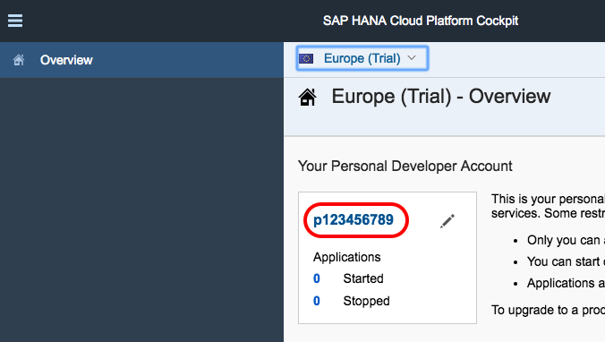
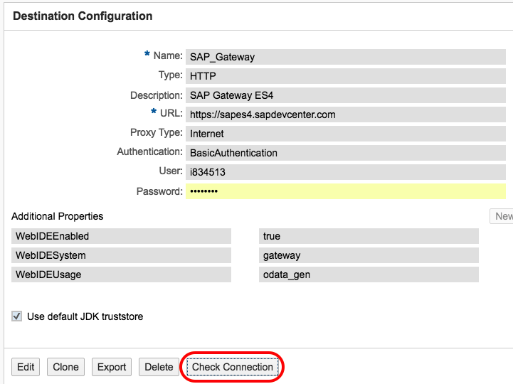

## Prerequisites  
 - **Proficiency:** Beginner
 - **Tutorials:** [Create an account on the Gateway Demo system](http://www.sap.com/developer/tutorials/gateway-demo-signup.html)

## Next Steps
 - [Build an SAP Fiori UX app with SAP Gateway data](http://www.sap.com/developer/tutorials/teched-2016-4.html)

## Details
### You will learn  
You will create a destination (a server end-point where SAP Cloud Platform can send or receive data) that points to an SAP Gateway OData service.

### Time to Complete
**< 5 Min**.

---

[ACCORDION-BEGIN [Step 1: ](Log into your SAP Cloud Platform account)]
Log into [SAP Cloud Platform](https://account.hanatrial.ondemand.com) by opening the following URL in a new tab: https://account.hanatrial.ondemand.com

Make sure you are using the **Europe (Trial)** landscape, and click on your account name as highlighted on the screenshot to open the cockpit view.

[DONE]
[ACCORDION-END]

[ACCORDION-BEGIN [Step 2: ](Go to Destinations)]

In the left-hand navigation bar, select **Connectivity > Destinations** then click on **New Destination**.

[DONE]
[ACCORDION-END]

[ACCORDION-BEGIN [Step 3: ](Enter Destination details)]

Enter the field values as listed below:

Field Name     | Value
:------------- | :-------------
Name           | `SAP_Gateway`
Type           | `HTTP`
Description    | `SAP Gateway ES4`
URL            | `https://sapes4.sapdevcenter.com`
Proxy Type     | `Internet`
Authentication | `BasicAuthentication`
User           | `<Your ES4 Gateway user> (e.g. p123456789)`
Password       | `<Your ES4 Gateway password>`

Leave the **Use default JDK truststore** checked.

And add the following **Additional Properties** fields by clicking on the **New Property** button once for each property.

Field Name       | Value
:--------------- | :-------------
`WebIDEEnabled`  | `true`
`WebIDESystem`   | `gateway`
`WebIDEUsage`    | `odata_abap`

Then click **Save**.

[DONE]
[ACCORDION-END]

[ACCORDION-BEGIN [Step 4: ](Test the new Destinations)]

After the destination is saved, you can click the **Check Connection** button to test that SAP Gateway is reachable.

Note that the **Check Connection** operation is not validating your user credentials but only the end-point availability.

[DONE]
[ACCORDION-END]

## Next Steps
 - [Build an SAP Fiori UX app with SAP Gateway data](http://www.sap.com/developer/tutorials/teched-2016-4.html)
