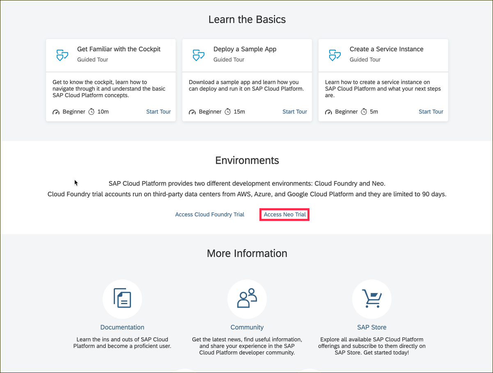
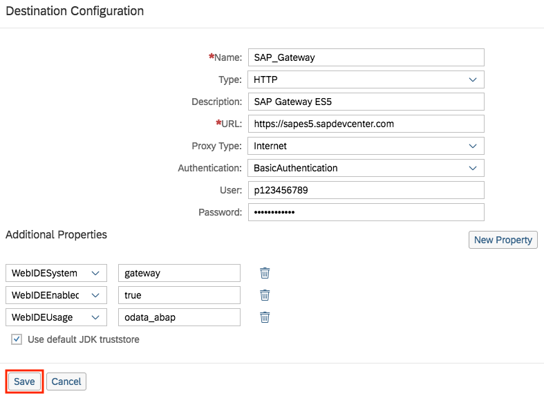

## Prerequisites  
- **Tutorials:** [Create an Account on the Gateway Demo System](https://developers.sap.com/tutorials/gateway-demo-signup.html)

## Details
### You will learn  
- How to configure a basic destination
- What some of the Web IDE specific properties are
- How to specify the Web IDE usage parameter for a Gateway based OData service

If you've also completed the tutorial [Create a destination for the Northwind OData services](https://developers.sap.com/tutorials/hcp-create-destination.html) you'll find this one similar, but for another type of OData server endpoint. This time, the endpoint is the SAP Gateway Demo server you may have already signed up for access to in the tutorial [Create an account on the Gateway Demo system](https://developers.sap.com/tutorials/gateway-demo-signup.html).

The SAP Gateway Demo system contains a set of EPM OData services, including the one you may have already explored by hand in the tutorial [Continue your OData exploration with EPM](https://developers.sap.com/tutorials/odata-02-exploration-epm.html).

> The current incarnation of the SAP Gateway Demo server is known as `ES5`.

Destinations are key building blocks in the SAP Cloud Platform Connectivity service, and are used to define connections for outbound communication from your application to remote systems. These remote systems can be on-premises or in the cloud.

A destination has a name, a URL, authentication details, and some other configuration details.

---

[ACCORDION-BEGIN [Step : ](Log into SAP Cloud Platform)]

Go to <https://account.hanatrial.ondemand.com> and log in to your SAP Cloud Platform cockpit.

[DONE]
[ACCORDION-END]

[ACCORDION-BEGIN [Step : ](Enter the Neo Environment)]

Scroll down the page and click on **Access Neo Trial** to enter the Neo environment.

[DONE]
[ACCORDION-END]

[ACCORDION-BEGIN [Step 2: ](Create new destination)]

In the left-hand navigation bar, open up **Connectivity > Destinations**, and then select **New Destination**.

[DONE]
[ACCORDION-END]

[ACCORDION-BEGIN [Step 3: ](Confirm data)]

Enter the field values as listed below:

Field Name     | Value
:------------- | :-------------
Name           | `SAP_Gateway`
Type           | `HTTP`
Description    | `SAP Gateway ES5`
URL            | `https://sapes5.sapdevcenter.com`
Proxy Type     | `Internet`
Authentication | `BasicAuthentication`
User           | Your ES5 Gateway user (e.g. `p123456789`)
Password       | Your ES5 Gateway password

Leave the **Use default JDK truststore** checked.

[DONE]
[ACCORDION-END]

[ACCORDION-BEGIN [Step 4: ](Specify additional properties and save)]

Add the following **Additional Properties** fields by clicking on the **New Property** button once for each property.

Field Name       | Value
:--------------- | :-------------
`WebIDEEnabled`  | `true`
`WebIDESystem`   | `gateway`
`WebIDEUsage`    | `odata_abap`
`sap-client`     | `002`

> Values for the `WebIDEUsage` property determine how the SAP Web IDE interprets the destination definition and presents it to you for connection and consumption. For example, the value `odata_abap` signifies that the destination represents an SAP Gateway system hosting OData services, and that provides a special catalog service for finding and selecting available OData services. OData services from this destination are to be selected via the Service Catalog data connection source in the SAP Web IDE **New Project** wizard.
>&nbsp;
> Find out more about the possible values for the `WebIDEUsage` property in the SAP Help Portal, in the [Connect to ABAP Systems](https://help.sap.com/viewer/825270ffffe74d9f988a0f0066ad59f0/Cloud/en-US/5c3debce758a470e8342161457fd6f70.html) section.

When you're done, finish by saving the destination with **Save**.

[VALIDATE_4]
[ACCORDION-END]
