## Prerequisites  
 - **Proficiency:** Beginner
 - **Tutorials:** [Create an SAP HANA Cloud Platform destination pointing to an SAP Gateway](http://go.sap.com/developer/tutorials/teched-2016-3.html)

## Next Steps
 - [Commit your project to Git and deploy to the cloud](http://go.sap.com/developer/tutorials/teched-2016-5.html)

## Details
### You will learn  
Use the SAP Web IDE template wizard to build a Fiori UX app displaying information from on OData service in less than 10 minutes.

### Time to Complete
**15 Min**.

---

[ACCORDION-BEGIN [Step 1: ](Log into your HCP account)]
Log into [SAP HANA Cloud Platform](https://account.hanatrial.ondemand.com) by opening the following URL in a new tab: https://account.hanatrial.ondemand.com

Make sure you are using the **Europe (Trial)** landscape, and click on your account name to open the cockpit view.

In the left-hand navigation bar, click on **Services**, then scroll down to the **SAP Web IDE** tile and click on the tile to open the overview page.

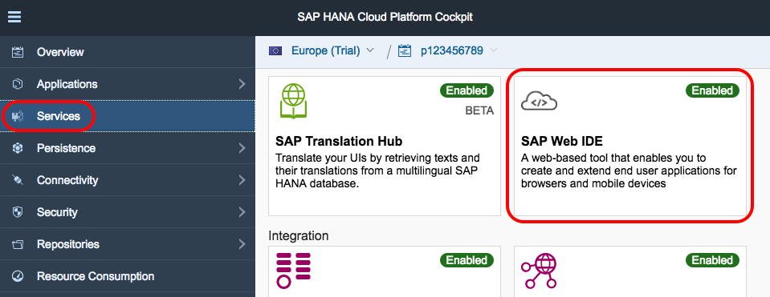

[DONE]
[ACCORDION-END]

[ACCORDION-BEGIN [Step 2: ](Open SAP Web IDE)]

From the **SAP Web IDE - Overview** page, click on the **Open SAP Web IDE** link which will open a new tab with the **Web IDE**.

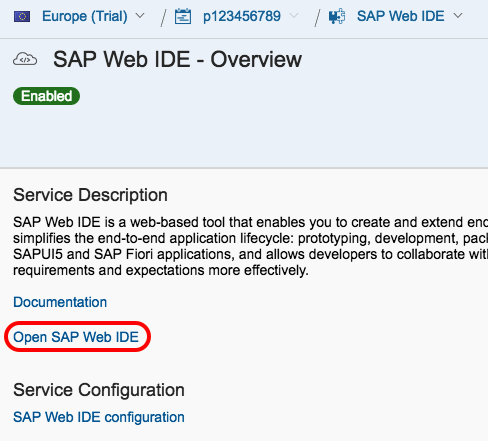

[DONE]
[ACCORDION-END]

[ACCORDION-BEGIN [Step 3: ](Create a new project)]

In **SAP Web IDE**, select from the menu bar **File > New > Project from Template**, or click on the **New Project from Template** button located on the main panel.


[DONE]
[ACCORDION-END]

[ACCORDION-BEGIN [Step 4: ](Select the app template)]

In the **Template Selection** step, select the **SAP Fiori Master-Detail Application** template and click **Next**.

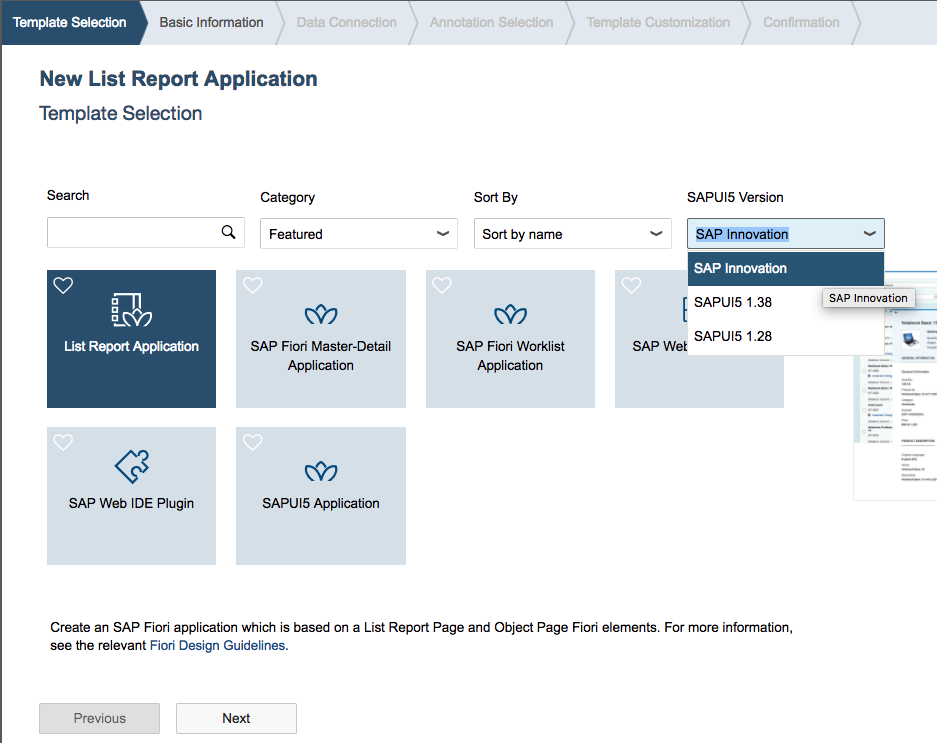

[DONE]
[ACCORDION-END]

[ACCORDION-BEGIN [Step 5: ](Name your project)]

In the **Basic Information** step, you will name your project `te2016` (it is important to keep this name as it will be referenced later).

Select the **Enable native mobile device functionality** checkbox, and click **Next**.

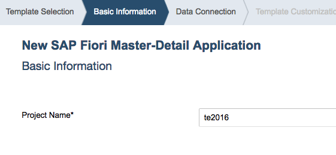

[DONE]
[ACCORDION-END]

[ACCORDION-BEGIN [Step 6: ](Select the data connection)]

In the **Data Connection** step, on the left side, click on **Service URL** under **Sources**.

Next, select the `SAP Gateway ES4` destination from the pull down list, and in the **Paste the service URL here** text box, enter:

```
/sap/opu/odata/IWBEP/GWDEMO
```

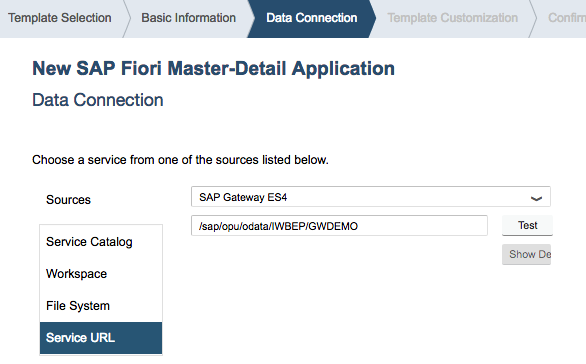

The hostname (from the destination) plus the rest of the service URL you just added make up the full URL to the SAP Gateway OData service document you will use.

[DONE]
[ACCORDION-END]

[ACCORDION-BEGIN [Step 7: ](Verify connection to the OData service)]

Click the **Test** button and log enter your SAP Gateway username and password if prompted.

If the Service is displayed (as shown below), you were able to successfully connect to the SAP Gateway OData service. Click **Next**.

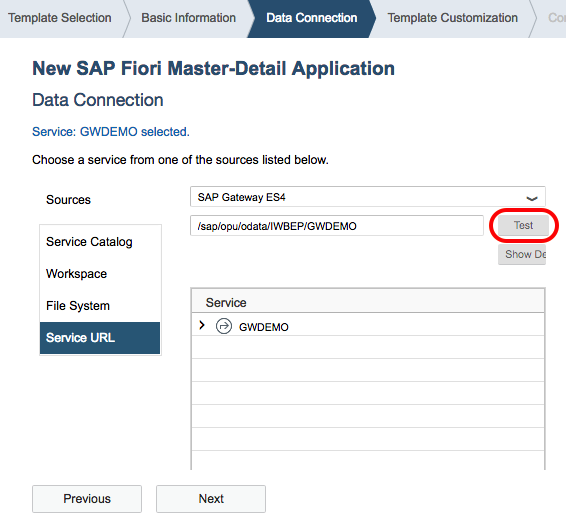

[DONE]
[ACCORDION-END]

[ACCORDION-BEGIN [Step 8: ](Enter Application Settings information)]

In the next steps, you will enter a few sets of information related to titles and labels, but also select data fields to show in the app.

**Do not advance to the next screen until all fields have been completed.**

In the **Application Settings** area, enter the following information:

Field Name     | Value
:------------- | :-------------
Type           | `Standalone App`
Title          | `Partner Contacts`
Namespace      | `com.test.teched`
Description    | `TechEd 2016 App Space application`

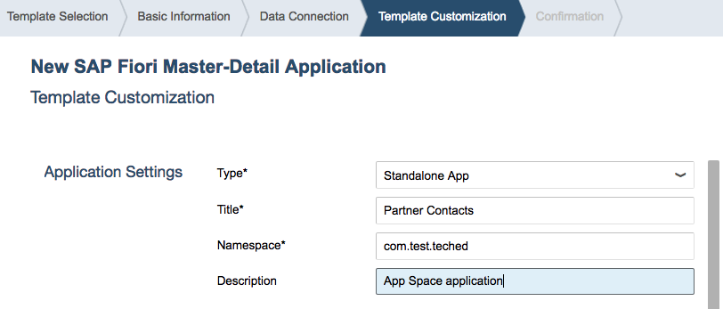

[DONE]
[ACCORDION-END]

[ACCORDION-BEGIN [Step 9: ](Specify data for the "master" view)]

In the **Data Binding - Object** area, enter the following information:

Field Name                | Value
:------------------------ | :-------------
Object Collection         | `BusinessPartnerCollection`
Object Collection ID      | `BusinessPartnerKey`
Object Title              | `Company`
Object Numeric Attribute  | `leave blank`
Object Unit of Measure    | `leave blank`

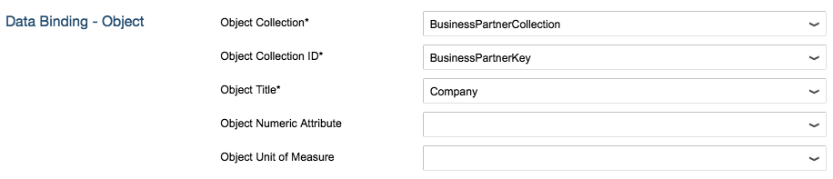

[DONE]
[ACCORDION-END]

[ACCORDION-BEGIN [Step 10: ](Specify data for the "detail" view )]

In the **Data Binding - Line Item** area, enter the following information and then click **Finish**.

Field Name                   | Value
:--------------------------- | :-------------
Line Item Collection         | `RelatedContacts`
Line Item Collection ID      | `ContactKey`
Line Item Title              | `FullName`
Line Item Numeric Attribute  | `leave blank`
Line Item Unit of Measure    | `CountryText`

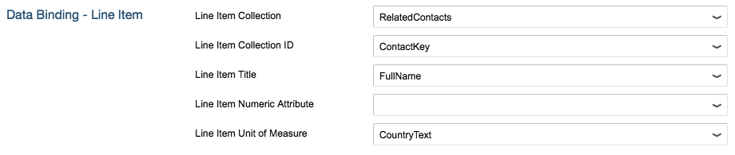

[DONE]
[ACCORDION-END]

[ACCORDION-BEGIN [Step 11: ](Open the internationalization file)]

In **SAP Web IDE**, click on the **`te2016`** project folder to expand it.

Then navigate and expand **`webapp` > `i18n`**, and double-click the `i18n.properties` file to open it in the editor.

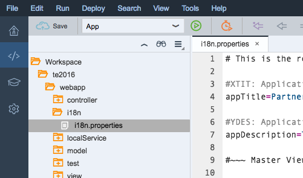

> Note: `i18n` is a standard abbreviation for "internationalization"

[DONE]
[ACCORDION-END]

[ACCORDION-BEGIN [Step 12: ](Insert the "Contacts" label)]

Find and replace all instances (three of them) of `<LineItemNamePlural>` in the `i18n.properties` file with `Contacts`.

> Note: you can use CTRL+H to open the "Find and Replace" box which includes a "Replace All" function if you click on "All".

[DONE]
[ACCORDION-END]

[ACCORDION-BEGIN [Step 13: ](Insert the "Business Partner" label)]

Find and replace all instances (five of them) of `<ObjectName>` in the `i18n.properties` file with `Business Partner`.

[DONE]
[ACCORDION-END]

[ACCORDION-BEGIN [Step 14: ](Insert the "Business Partners" label)]

Find and replace all instances (three of them) of `<ObjectNamePlural>` in the `i18n.properties` file with `Business Partners`.

[DONE]
[ACCORDION-END]

[ACCORDION-BEGIN [Step 15: ](Insert the "Related Contacts" label)]

Find and replace all instances `<FirstColumnName>` in the `i18n.properties` file with `Related Contacts`.

[DONE]
[ACCORDION-END]

[ACCORDION-BEGIN [Step 16: ](Insert the "Country" label)]

Find and replace all instances `<LastColumnName>` in the `i18n.properties` file with `Country`.

Save your edits.

[DONE]
[ACCORDION-END]

[ACCORDION-BEGIN [Step 17: ](Launch your app)]

To run your app, select your project folder and click the **Run** button.

A new tab will open in your browser showing your app running in a preview pane.

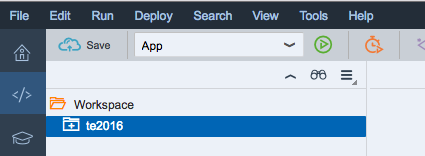

[DONE]
[ACCORDION-END]

[ACCORDION-BEGIN [Step 18: ](Confirm your app looks like the example)]

Your app should look like the image below.

You can click on items in the master list and the right-hand (detail) pane will update.

You have just built an SAP Fiori UX app.

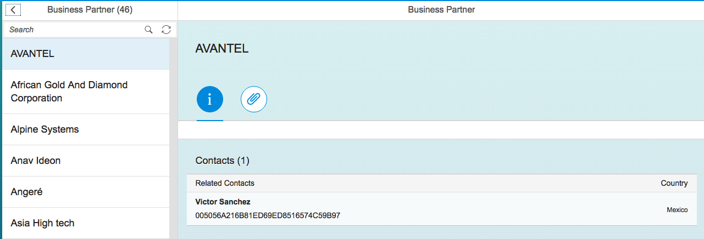

[DONE]
[ACCORDION-END]

## Next Steps
 - [Commit your project to Git and deploy to the cloud](http://go.sap.com/developer/tutorials/teched-2016-5.html)
