## Prerequisites  
 - **Proficiency:** Beginner

## Details
### You will learn  
Use the SAP Web IDE templates wizard to build an SAP Fiori app displaying information from an OData service in less than 10 minutes.

### Time to Complete
**10 Min**.

---

[ACCORDION-BEGIN [Step 1: ](Log into your SAP Cloud Platform Trial account)]
Log into [SAP Cloud Platform](https://account.hanatrial.ondemand.com) by opening the following URL in a new tab: https://account.hanatrial.ondemand.com

Click on Neo Trial to open the cockpit view.

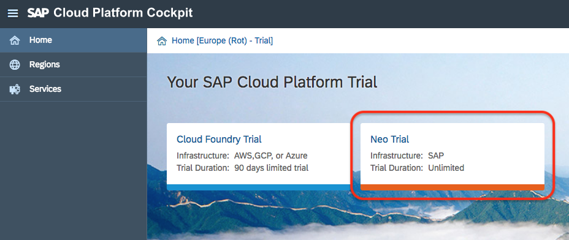

In the left-hand navigation bar, select **Services**, then on the right panel, scroll down to the **SAP Web IDE Full-Stack** tile and click on the tile to open the overview page.

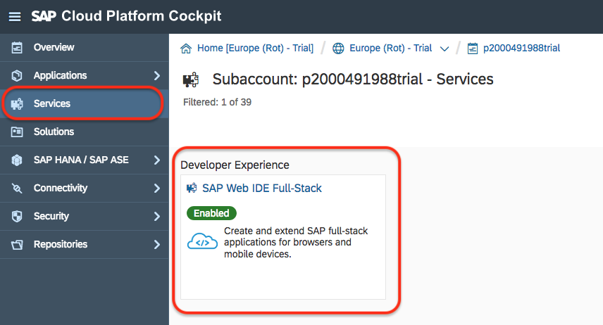

[DONE]
[ACCORDION-END]

[ACCORDION-BEGIN [Step 2: ](Open SAP Web IDE)]

From the **SAP Web IDE Full-Stack - Overview** page, click on the **Go to Service** link which will open **SAP Web IDE**.

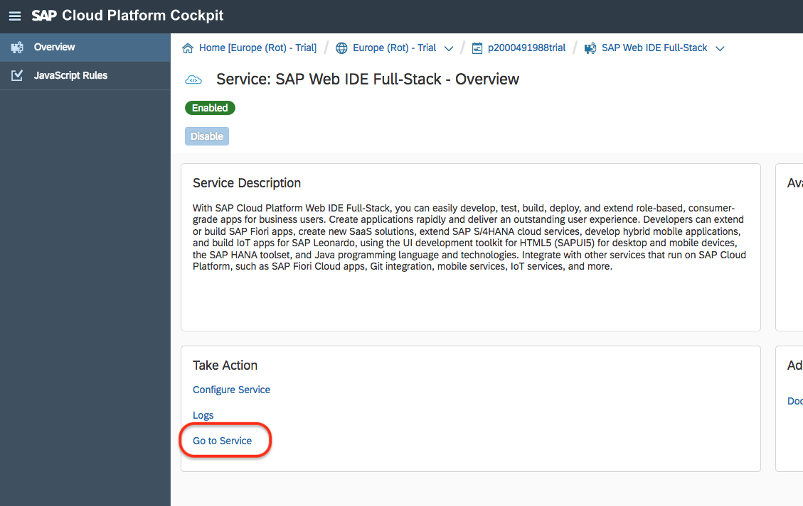

Enter the URL for SAP Web IDE in your trial account below and click **Validate**.

[VALIDATE_2]

[ACCORDION-END]

[ACCORDION-BEGIN [Step 3: ](Create a new project)]

In **SAP Web IDE**, select from the menu bar **File > New > Project from Template**, or click on the **New Project from Template** button located on the main panel.

[DONE]
[ACCORDION-END]

[ACCORDION-BEGIN [Step 4: ](Select the app template)]

In the **Template Selection** step, select the **SAP Fiori Master-Detail Application** template and click **Next**.

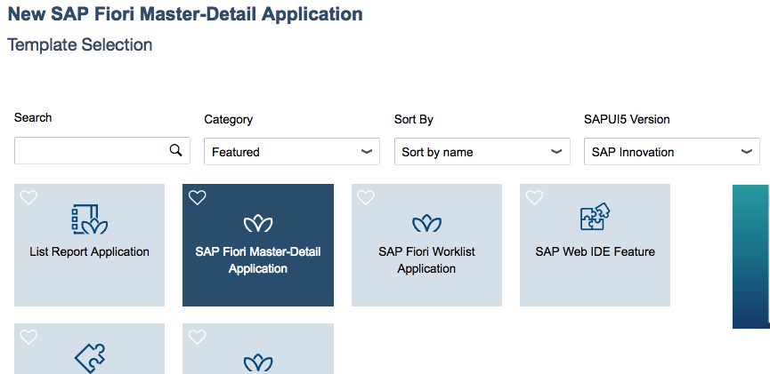

[DONE]
[ACCORDION-END]

[ACCORDION-BEGIN [Step 5: ](Name your project)]

In the **Basic Information** step, you will name your project `BusinessPartners`.
In the **App Descriptor Data** section, enter the following information:

Field Name     | Value
:------------- | :-------------
Title          | `Partner Contacts`
Namespace      | `com.test`

Click **Next**.

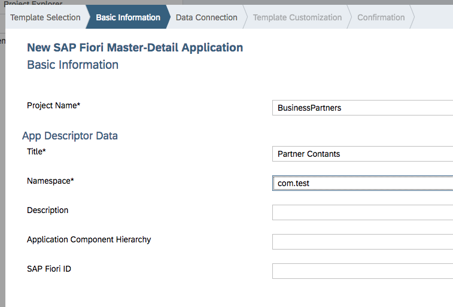

[DONE]
[ACCORDION-END]

[ACCORDION-BEGIN [Step 6: ](Select the data connection)]

In the **Data Connection** step, on the left side, verify **Service Catalog** under **Sources** is selected.

Next, select the `ES5 - SAP Gateway ES5` destination from the pull down list.

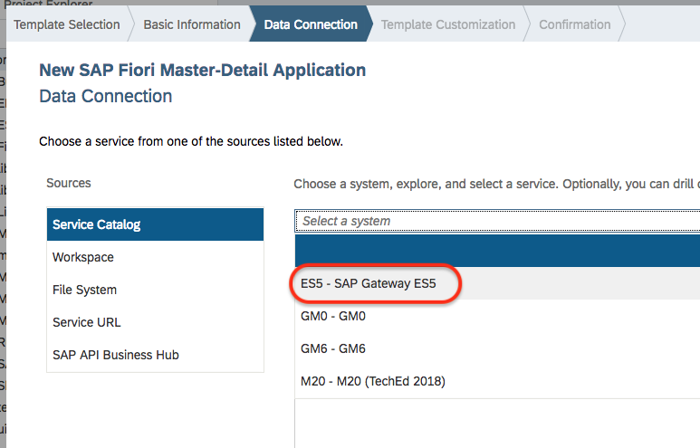

[DONE]
[ACCORDION-END]

[ACCORDION-BEGIN [Step 7: ](Select the OData service)]

Scroll down the list of services that appears and select the **`GWSAMPLE_BASIC`** service then click **Next**.

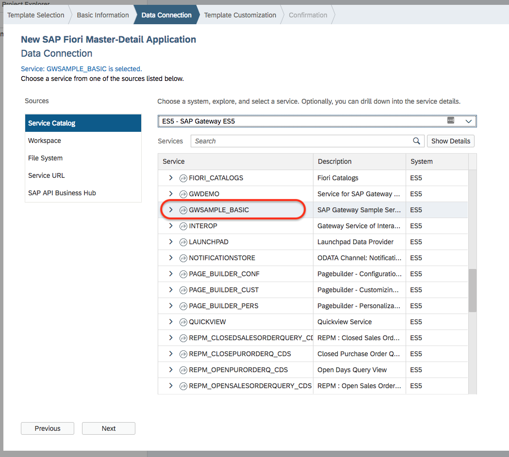

[DONE]
[ACCORDION-END]

[ACCORDION-BEGIN [Step 8: ](Select the Type of your application)]

In the next steps, you will enter a few sets of information related to titles and labels, but also select data fields to show in the app.

In the **Application Scenario** area, select the `Standalone App (optimized for individual deployment)` type.

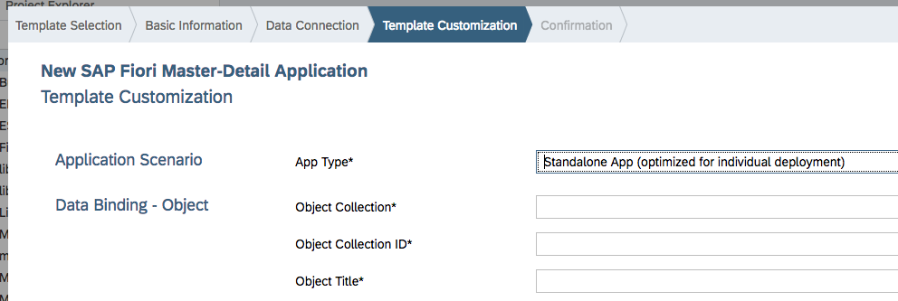

[DONE]
[ACCORDION-END]

[ACCORDION-BEGIN [Step 9: ](Specify data for the "master" view)]

In the **Data Binding - Object** area, enter the following information:

Field Name                | Value
:------------------------ | :-------------
Object Collection         | `BusinessPartnerSet`
Object Collection ID      | `BusinessPartnerID`
Object Title              | `CompanyName`
Object Numeric Attribute  | `leave blank`
Object Unit of Measure    | `leave blank`

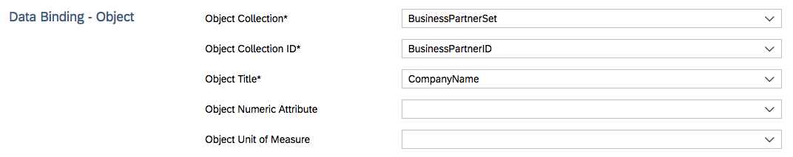

[DONE]
[ACCORDION-END]

[ACCORDION-BEGIN [Step 10: ](Specify data for the "detail" view )]

In the **Data Binding - Line Item** area, enter the following information:

Field Name                   | Value
:--------------------------- | :-------------
Line Item Collection         | `ToContacts`
Line Item Collection ID      | `ContactGuid`
Line Item Title              | `Address/City`
Line Item Numeric Attribute  | `leave blank`
Line Item Unit of Measure    | `Address/Country`

Then click **Finish**.

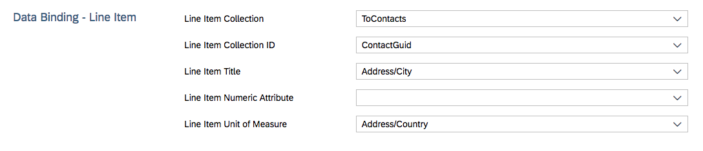

[DONE]
[ACCORDION-END]

[ACCORDION-BEGIN [Step 11: ](Open the internationalization file)]

In **SAP Web IDE**, click on the **`BusinessPartners`** project folder to expand it.

Then navigate and expand **`webapp` > `i18n`**, and double-click the `i18n.properties` file to open it in the editor.

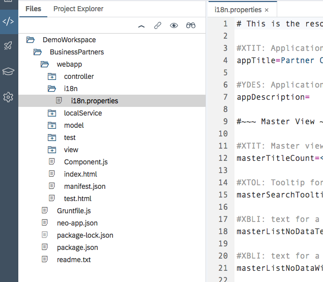

> Note: `i18n` is a standard abbreviation for "internationalization"

[DONE]
[ACCORDION-END]

[ACCORDION-BEGIN [Step 12: ](Insert the "Contacts" label)]

Find and replace all instances (three of them) of `<ToContactsPlural>` (including the angle brackets) in the `i18n.properties` file with `Contacts`.

> Note: you can use CTRL+H to open the "Find and Replace" box which includes a "Replace All" function if you click on "All".

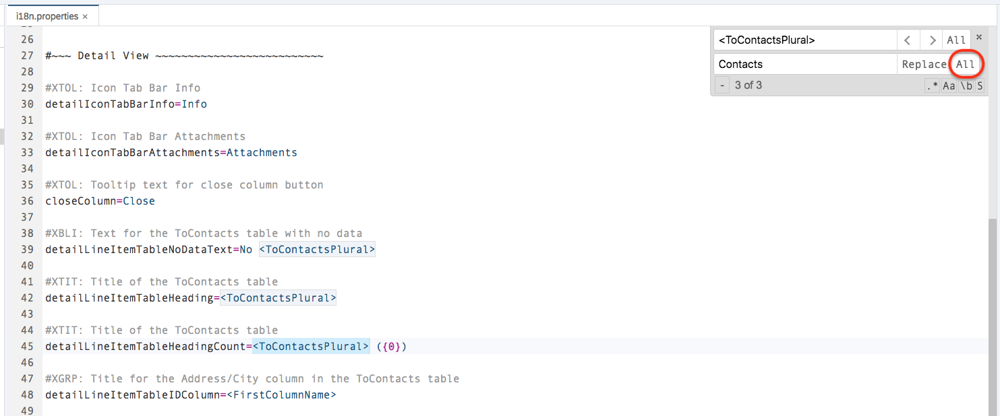

[DONE]
[ACCORDION-END]

[ACCORDION-BEGIN [Step 13: ](Insert the "Business Partners" label)]

Find and replace all instances (two of them) of `<BusinessPartnerSetPlural>` (including the angle brackets) in the `i18n.properties` file with `Business Partners`.

[DONE]
[ACCORDION-END]

[ACCORDION-BEGIN [Step 14: ](Insert the "Business Partner" label)]

Find and replace all instances (four of them) of `<BusinessPartnerSet>` (including the angle brackets) in the `i18n.properties` file with `Business Partner`.

[DONE]
[ACCORDION-END]

[ACCORDION-BEGIN [Step 15: ](Insert the "City" label)]

Find and replace all instances of `<FirstColumnName>` (including the angle brackets) in the `i18n.properties` file with `City`.

[DONE]
[ACCORDION-END]

[ACCORDION-BEGIN [Step 16: ](Insert the "Country" label)]

Find and replace all instances of `<LastColumnName>` (including the angle brackets) in the `i18n.properties` file with `Country`.

Save your edits.

[DONE]
[ACCORDION-END]

[ACCORDION-BEGIN [Step 17: ](Launch your app)]

To run your app, select your project folder and click the **Run** button.

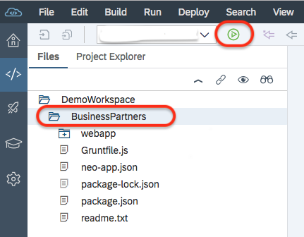

When prompted, select the index.html as the file to run, and click **OK**.

A new tab will open in your browser showing your app running in a preview pane.

Click on one of the Business Partners to see its details on the right.

[DONE]
[ACCORDION-END]

[ACCORDION-BEGIN [Step 18: ](Confirm your app looks like the example)]

Your app should look like the image below.

You can click on items in the master list and the right-hand (detail) pane will update.

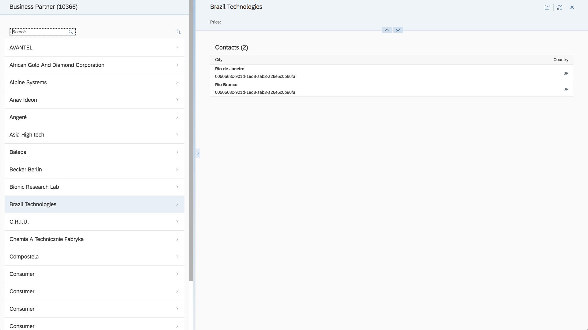

Click on **`AVANTEL`** in the master list, copy the alpha-numeric string below **`Hermosillo`**, paste it into the text field below and click **Validate**.

[VALIDATE_18]

[ACCORDION-END]
