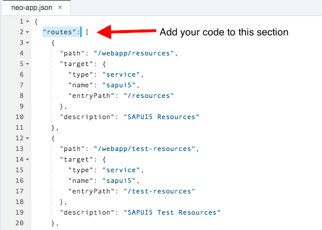
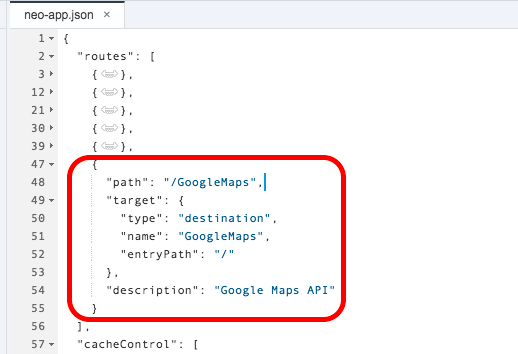
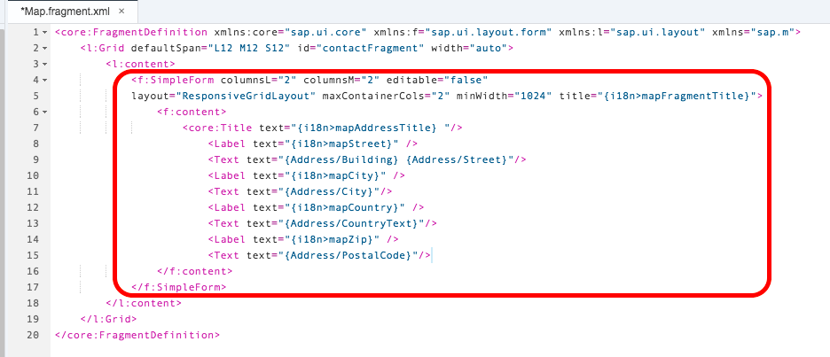
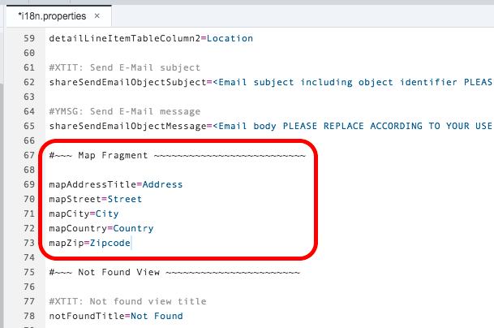
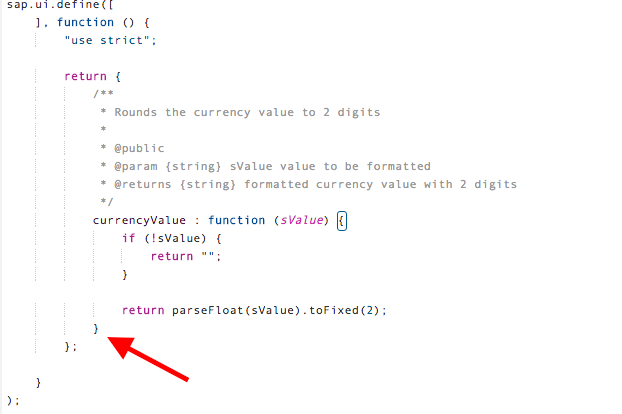
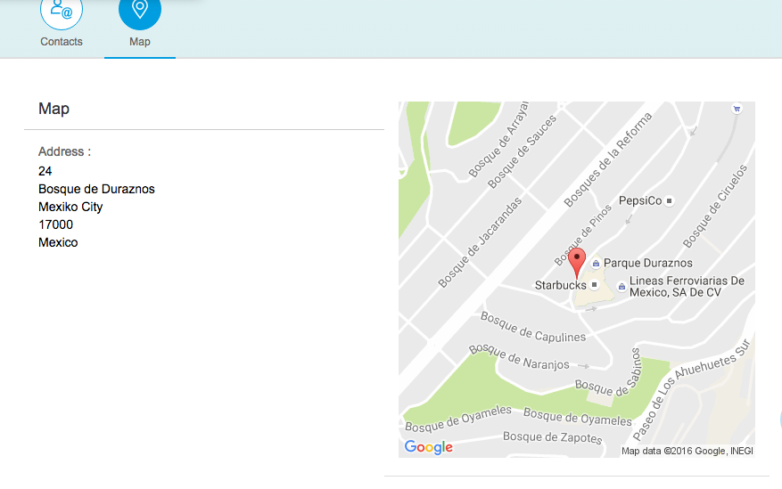

## Prerequisites  
 - [Add an XML fragment for a tab in your app](http://www.sap.com/developer/tutorials/teched-2016-6.html)


## Next Steps
 - [Translate your app into multiple languages](http://www.sap.com/developer/tutorials/teched-2016-8.html)


## Details
### You will learn  
You will add a map display to one of the tabs in your app and geolocate an address associated with the item selected in the master (or list) view.


### Time to Complete
**15-20 Min**.

---
[ACCORDION-BEGIN [Step 1: ](Read about Google Static Maps API)]
You will be using the Google Static Maps API. For more information on this API, you can visit the [API Documentation Page](https://developers.google.com/maps/documentation/static-maps/intro) ([link](https://developers.google.com/maps/documentation/static-maps/intro)).

The Static Maps API returns an image that you can display in a HTML image tag.   

[DONE]
[ACCORDION-END]

[ACCORDION-BEGIN [Step 2: ](Create a Destination for the API)]
In order to use the Google Maps API, you need to create a new destination in HCP for your application.

Log into [SAP HANA Cloud Platform](https://account.hanatrial.ondemand.com) by opening the following URL in a new tab: https://account.hanatrial.ondemand.com

Make sure you are using the **Europe (Trial)** landscape, and click on your account name to open the cockpit view.

In the left-hand navigation bar, select **Connectivity > Destinations** and finally click on **New Destination**.

Enter the following field values.

|Field Name     | Value                                  |
|---------------|----------------------------------------|
|Name           | `GoogleMaps`                           |
|Type           | `HTTP`                                 |
|Description    | `Google Maps API`                      |
|URL            | `https://maps.googleapis.com/maps/api` |
|Proxy Type     | `Internet`                             |
|Authentication | `NoAuthentication`                     |

Leave the **Use default JDK truststore** checked

And add the following **Additional Properties** below by clicking on the **New Property** button once for each property.

|Field Name      | Value  |
|----------------|--------|
|`WebIDEEnabled` | `true` |
|`WebIDESystem`  | `API`  |

Click on **Save**.

After the destination is saved, you can click the **Check Connection** button to test that Google Maps end-point is reachable.

[DONE]
[ACCORDION-END]

[ACCORDION-BEGIN [Step 3: ](Update the neo-app.json)]

First, _re-open_ the **SAP Web IDE**.

From your [SAP HANA Cloud Platform cockpit](https://account.hanatrial.ondemand.com/cockpit), in the left-hand navigation bar, select **Services** and then click on the **SAP Web IDE** tile.

In the **SAP Web IDE** overview page, click **Open SAP Web IDE**.

You will need to add the *Google Maps*  destination as a route available for your application by adding it to the `neo-app.json` file which is located under the `te2016` folder.

Open the `neo-app.json` file and locate the **routes** array.

You will add this new route to that end of the array.



Copy the following code and paste it after the last route. **Save** your changes.

```
,
{
  "path": "/GoogleMaps",
  "target": {
    "type": "destination",
    "name": "GoogleMaps",
    "entryPath": "/"
  },
  "description": "Google Maps API"
}
```
> Make sure you include the comma at the beginning of the code as this is the array element separator

Your `neo-app.json` file should now have 6 routes configured.

These routes allow you to make a call to an URL without have to directly reference it, following the Fiori Design Guidelines.



[DONE]
[ACCORDION-END]

[ACCORDION-BEGIN [Step 4: ](Update the Map Fragment view)]

To make map fragment responsive, you need to update the form displaying the address.

Replace the `SimpleForm` section in your current map fragment with the following code.

```xml
<f:SimpleForm columnsL="2" columnsM="2" editable="false"
layout="ResponsiveGridLayout" maxContainerCols="2" minWidth="1024" title="{i18n>mapFragmentTitle}">
  <f:content>
    <core:Title text="{i18n>mapAddressTitle} "/>
      <Label text="{i18n>mapStreet}" />
      <Text text="{Address/Building} {Address/Street}"/>
      <Label text="{i18n>mapCity}" />
      <Text text="{Address/City}"/>
      <Label text="{i18n>mapCountry}" />
      <Text text="{Address/CountryText}"/>
      <Label text="{i18n>mapZip}" />
      <Text text="{Address/PostalCode}"/>
  </f:content>
</f:SimpleForm>
```

Your map fragment should look like the image below when you are done.

Make sure you **Save** your changes.



[DONE]
[ACCORDION-END]

[ACCORDION-BEGIN [Step 5: ](Update the i18n properties)]

In the i18n folder, open the `i18n.properties` file.

Create a new **Map Fragment** section and add the new label values to your internationalization file above the **Not Found View** section.

```
#~~~ Map Fragment ~~~~~~~~~~~~~~~~~~~~~~~~~~

mapAddressTitle=Address
mapStreet=Street
mapCity=City
mapCountry=Country
mapZip=Zipcode
```

Your i18n file should look like the image below.



[DONE]
[ACCORDION-END]

[ACCORDION-BEGIN [Step 6: ](Add the Map to the Map Fragment)]

You will need an `Image` element in your view to hold the image graphic returned from the Google API.

You will add it to the Map `Fragment` file (which is displayed when you click on the Map tab).

You will also add the code to the `SimpleForm` that you updated.

The new code should be placed after the last form element, as indicated by the red arrow.


In `Map.fragment.xml`, add the following code after the last  `<Text>` element.  Then click **Save**.

```xml
    <core:Title text=" "/>
    <Image src="{
      parts: [
        'Address/Building',
        'Address/Street',
        'Address/PostalCode',
        'Address/City'
      ],
      formatter: '.formatter.formatMapUrl'
    }"
    alt="{i18n>mapAltText}"
     />
```

You need to bind multiple attributes using `parts:` to get the full address.

The address is composed of the Street Number, the Street Name, the Postal Code, and the City. The `formatter:` call will transform these parts into the proper form for the API call.

The `<core:Title>` element will add a responsive 2nd column.

On larger formats, like a desktop or iPad, you will see 2 columns. On smaller screens, like phones, you will see 1 column.

Your final code should look like the screenshot below.


[DONE]
[ACCORDION-END]

[ACCORDION-BEGIN [Step 7: ](Update the Formatter JavaScript)]

You need to update your model `formatter.js` to include a new function call for the Google Static Maps API.

In the `model` folder, open your `formatter.js` file. You will be adding a new function to the return of this function.

>Don't forget to add a comma at the end of the function definition for `currencyValue` to let the JavaScript know there is another function in the return



After you add the code, **Save** your changes.

```javascript
    /**
      * Formats an address to a static google maps image
      * @public
      * @param {string} sBuilding the building number
      * @param {string} sStreet the street
      * @param {string} sZIP the postal code
      * @param {string} sCity the city
      * @returns {string} sValue a google maps URL that can be bound to an image
      */
    formatMapUrl: function(sBuilding, sStreet, sZIP, sCity) {
      return "/GoogleMaps/staticmap?zoom=16&size=400x400&markers="
        + jQuery.sap.encodeURL(sBuilding +" "+ sStreet + ", " + sZIP +  " " + sCity );
    }
```

Your function takes in the different parameters required to create an address.

You return a text string of the Google API web address, which will return an image.

You need to encode the text to a web-readable format by using the `jQuery.sap.encodeURL()` function.

You can invoke this model formatter by using the `formatter` in the view.

Your final code should look like the screenshot below.


[DONE]
[ACCORDION-END]

[ACCORDION-BEGIN [Step 8: ](Update the i18n properties)]

In the i18n folder, open the `i18n.properties` file.

Add the new label values to your internationalization file in the Map Fragment section.

```
mapAltText=Map of location
```


[DONE]
[ACCORDION-END]

[ACCORDION-BEGIN [Step 9: ](Run your application)]

Run your app.

When you click on an item for more details, your page should look like the image below.



[DONE]
[ACCORDION-END]

### Optional

Follow the below steps to make your map more unique.

[ACCORDION-BEGIN [Step 10: ](Read about Styled Google Maps API)]
You can modify the URL created in the `formatter.js` to change features in the outputted map image.

You can modify the URL to include a new `style` for example by indicating the `feature` to update, the `element` within the feature to modify, and the `color` to change the element to.

For more information on styling the map with Google, visit their [Styled Maps API Documentation](https://developers.google.com/maps/documentation/static-maps/styling).

[DONE]
[ACCORDION-END]

[ACCORDION-BEGIN [Step 11: ](Add color to your map)]

Go to your `formatter.js` file, and modify the URL to include the new style.

Feel free to try different colors.

The [W 3 Schools color picker](http://www.w3schools.com/colors/colors_picker.asp) will provide you will the hexadecimal values for different colors.

Don't forget to **Save** your changes before re-running your app.

```javascript
    return "/GoogleMaps/staticmap?zoom=13&size=400x400&treasureMode=aye&markers="
      + jQuery.sap.encodeURL(sBuilding + " " + sStreet + ", " + sZIP +  " " + sCity)
      + "&style=feature:road.highway%7Celement:geometry%7Cvisibility:simplified%7Ccolor:0xc280e9"
      + "&style=feature:poi%7Celement:geometry%7Ccolor:0x0080ff";
```

The `feature` indicates that you want to update the highways.

The `element` indicates that you want to change the styling of the geometry on the highways.

And the `color` indicates the highway geometry color.

[DONE]
[ACCORDION-END]

## Next Steps
 - [Translate your app into multiple languages](http://www.sap.com/developer/tutorials/teched-2016-8.html)
