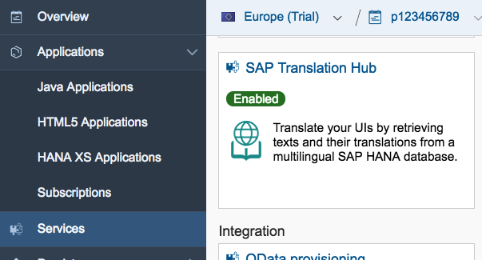
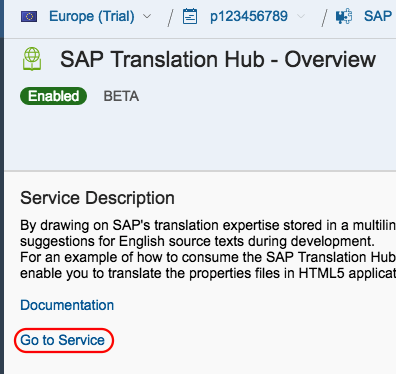
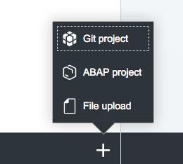
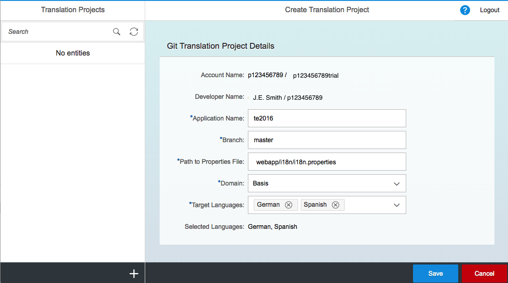
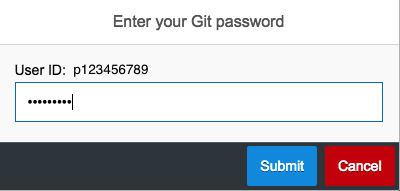
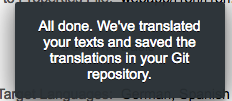
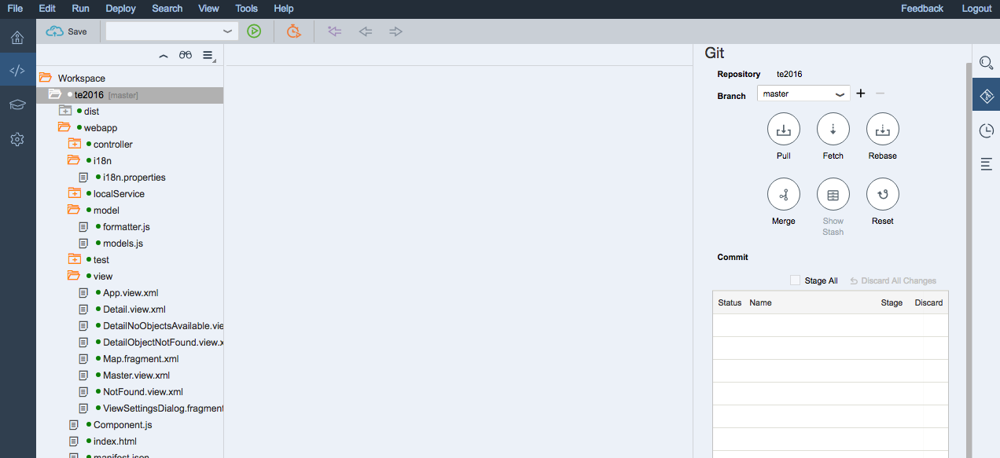
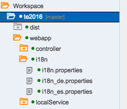

## Prerequisites  
 - **Proficiency:** Beginner
 - **Tutorials:** [Add a map display to your app](https://www.sap.com/developer/tutorials/teched-2016-7.html)

## Next Steps
 - [ABC Analysis with SAP HANA PAL](https://www.sap.com/developer/tutorials/teched-2016-10.html)

## Details
### You will learn  
Throughout this series you have inserted a number of labels into an `i18n` (internationalization) file in your project (`i18n.properties`). In addition to having all the strings in your app collected in one file (and therefore easy to update), SAPUI5 can load different language files based on your device language and locale settings.

Examples of language settings are `en` for English, `de` for German. Language and locale combinations allow for dialects of languages such as `en_UK` and `en_US` for British and American English. SAPUI5 will also allow an app to select the most appropriate language. If a device is set to `de_CH` for Swiss German, but that file isn't included in the app, it will look for a `de` (German) file to load.

### Time to Complete
**10 Min**.

---

[ACCORDION-BEGIN [Step 1: ](Open your SAP Cloud Platform cockpit)]

Log into your [SAP Cloud Platform account](https://account.hanatrial.ondemand.com), click on the **Services** in the left-hand navigation bar.

[ACCORDION-END]

[ACCORDION-BEGIN [Step 2: ](Open the SAP Translation Hub overview page)]

Scroll down until you see the **SAP Translation Hub** tile.

Click on the tile to open the overview page.

[ACCORDION-END]

[ACCORDION-BEGIN [Step 3: ](Go To Service)]

Click on the **Go to Service** link.

[ACCORDION-END]

[ACCORDION-BEGIN [Step 4: ](Create a new translation project)]

When the Translation Hub page loads, click the **+** icon at the bottom of the window, and then select **Git Project** to create a new translation process.

[ACCORDION-END]

[ACCORDION-BEGIN [Step 5: ](Fill in project details)]

Fill in the project details as shown below:

Field Name                 | Value
:------------------------- | :-------------
Application name           | `te2016`
Branch                     | `master`
Path to properties file    | `webapp/i18n/i18n.properties`
Domain                     | `Basis`
Target languages           | `German`, `Spanish`

Click on **Save**

[ACCORDION-END]

[ACCORDION-BEGIN [Step 6: ](Initiate translations)]

Once the project is created click the green **Get Translations** button, and log in if prompted.

[ACCORDION-END]

[ACCORDION-BEGIN [Step 7: ](Translation completion)]

You will see the "All done." toast message at the bottom of the screen when the translations are complete.

[ACCORDION-END]

[ACCORDION-BEGIN [Step 8: ](Pull translated files to Web IDE)]

Return to **SAP Web IDE** and open the **Git** pane.

You will notice that there is only the original `i18n.properties` file in your project folder.

In the **Git pane**, click the **Pull** button to pull the translated files from your **Git** repository to your local project folder.

[ACCORDION-END]

[ACCORDION-BEGIN [Step 9: ](Confirm translated files in project)]

If you check the `i18n` folder in your project, you will see the two new files:

 - `i18n_de.properties`
 - `i18n_es.properties`

[ACCORDION-END]

[ACCORDION-BEGIN [Step 10: ](Commit files, and deploy to the cloud)]

Commit your new files to **Git** and deploy the application to SAP Cloud Platform(following the same procedure as in the previous [tutorial](https://www.sap.com/developer/tutorials/teched-2016-5.html).

Right-click on your **`te2016`** project folder, and select **Deploy > Deploy to SAP Cloud Platform** and click **Deploy**.

[ACCORDION-END]

[ACCORDION-BEGIN [Step 11: ](Testing your language files)]

To test the language support in the deployed app, we can utilize the SAPUI5 `sap-ui-language` URL parameter.

To do so, just append `?sap-ui-language=xx_YY` to your application URL

- If your standard application URL looks like this:
  - `https://te2016-p12345678trial.dispatcher.hanatrial.ondemand.com/`
- You can view the German strings by specifying:
  - `https://te2016-p12345678trial.dispatcher.hanatrial.ondemand.com/?sap-ui-language=de`
- And the Spanish strings by specifying:
  - `https://te2016-p12345678trial.dispatcher.hanatrial.ondemand.com/?sap-ui-language=es`

[ACCORDION-END]

[ACCORDION-BEGIN [Step 12: ](Run the app on your phone)]

If your device is set to either the German or Spanish locale, then the app will check the language and locale settings on the device, and load the appropriate strings file.

[ACCORDION-END]

