## Prerequisites  
 - **Proficiency:** Beginner
 - **Tutorials:** [Translate your app into multiple languages](http://go.sap.com/developer/tutorials/teched-2016-7.html)

## Next Steps
 - [ABC Analysis with SAP HANA](http://go.sap.com/developer/tutorials/teched-2016-10.html)

## Details
### You will learn  
- How to add a device type, message type and device to the IoT Services of SAP HANA Cloud Platform (HCP)
- How to modify JavaScript code on your device to send data to the SAP HANA Cloud Platform (HCP)

This tutorial will take you through the steps at a rapid pace, if you'd like more details please contact one of our support staff.

### Time to Complete
**20 Min**.

---

[ACCORDION-BEGIN [Step 1: ](Connection to the SAP HANA Cloud Platform)]

The first step you need is to connect to the [SAP HANA Cloud Platform](https://account.hanatrial.ondemand.com/) trial system which will be referred to as HCP for the remainder of the tutorial.

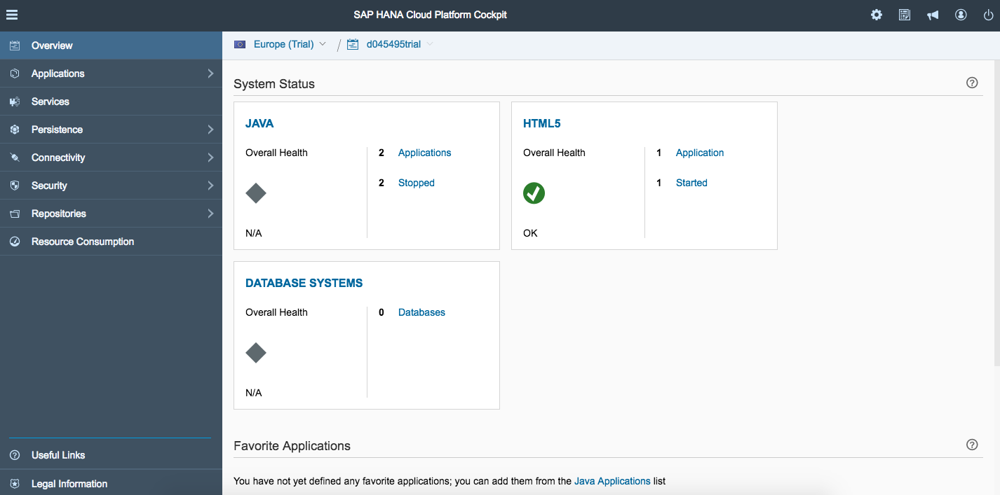

[DONE]
[ACCORDION-END]

[ACCORDION-BEGIN [Step 2: ](Enable IoT Services)]

Now you will need to select "Services" in the left column menu, scroll down and select the "Internet of Things (IoT)" services and ensure they are enabled.


Once the service is enabled click the **Go to Service** link and a new browser tab will open.


[DONE]
[ACCORDION-END]

[ACCORDION-BEGIN [Step 3: ](Deploy the IoT Services)]

With IoT services enabled, you can begin the steps necessary to connect your device and enable message communication.

The first step will be to configure and deploy the Message Management Service (MMS). Click on the **Deploy Message Management Service** tile.

Enter in your information in the fields, where your account ID is your p-number (or s-number if you are SAP's customer or partner, or i-/d-number if you are SAP employee) with the world “trial” (no space between the p-number and trial) and your user name is just your p-number. Click **Deploy**. It will deploy `iotmms` Java application for you.

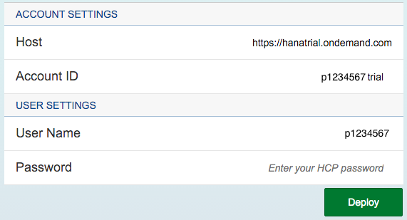

[DONE]
[ACCORDION-END]

[ACCORDION-BEGIN [Step 4: ](Configure the IoT MMS)]

Once `iotmms` Java application is deployed (created), you need to do data binding and authorization for users who should use it.

Return to the HCP Cockpit view and click on **Java Applications** in the left navigation bar. You will see the new `iotmms` application you just deployed. Click on the `iotmms` link to display the **IoT MMS dashboard**.

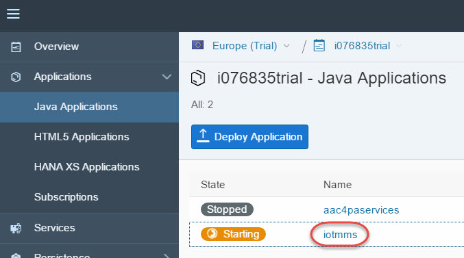

With the **IoT MMS dashboard** displayed click on **Data Source Bindings**. Check the data binding is in place, something similar to pictures below.

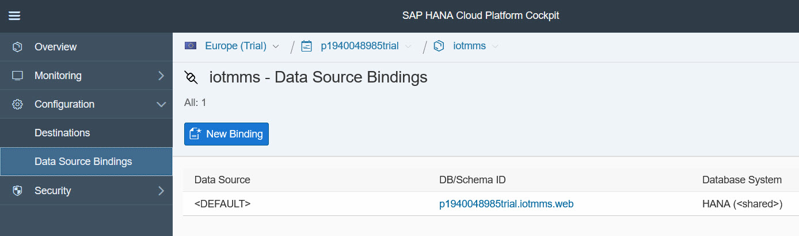

or

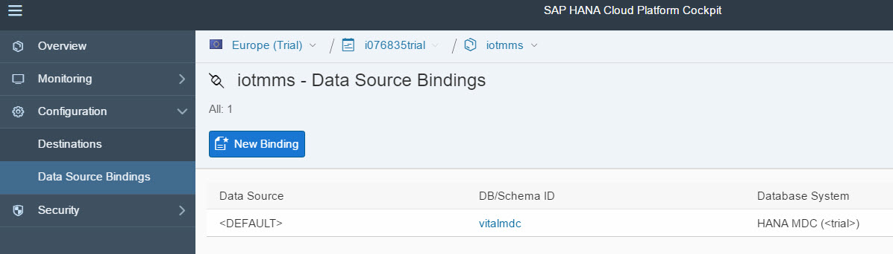

In case **your `iotmms` application is missing the data binding** you need to do additional steps of manually creating new database and binding it. Otherwise proceed to the next step of assigning a role with required authorizations.

[DONE]
[ACCORDION-END]

[ACCORDION-BEGIN [Step 5: ](Assign authorizations to run IoT MMS)]

Click on the Roles link in the left navigation bar. Select the **IoT-MMS-User** (click the empty cell next to the Name to select the row if it is not highlighted in blue).

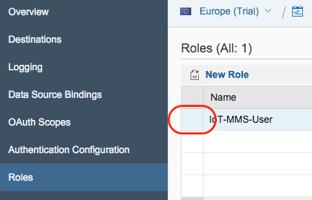

Then under **Individual Users**, click **Assign** and enter your HCP user ID (e.g. your p-number without the word “trial” on the end).


Once user is assigned to the role, stop and start `iotmms` application.

From here you will need to "Go to Service"

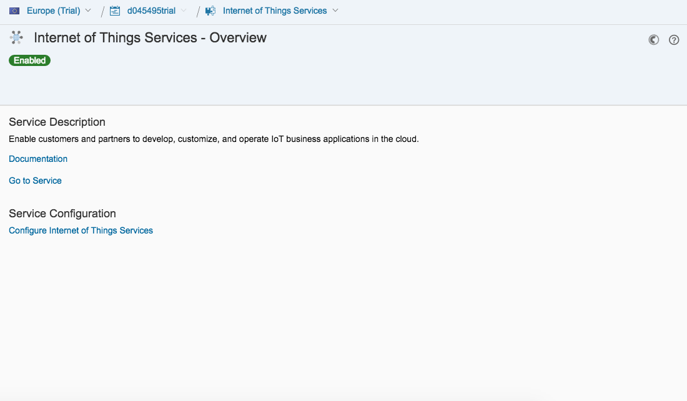

[DONE]
[ACCORDION-END]

[ACCORDION-BEGIN [Step 6: ](Create a new Message Type)]

5. Now that your version is up to date you will need to go to "Message Type" and create a new message type.

Field    | Value
---------|-------------------
Name     | te2016

And the following fields:

Position    | Name        | Type
------------|-------------|--------
1           | timestamp   | long
2           | temperature | double
3           | humidity    | double

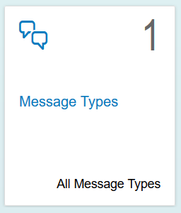

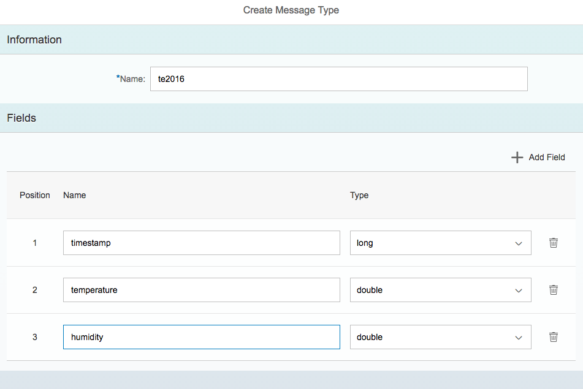

Please note down the created message type id displayed here as we will be using it later.

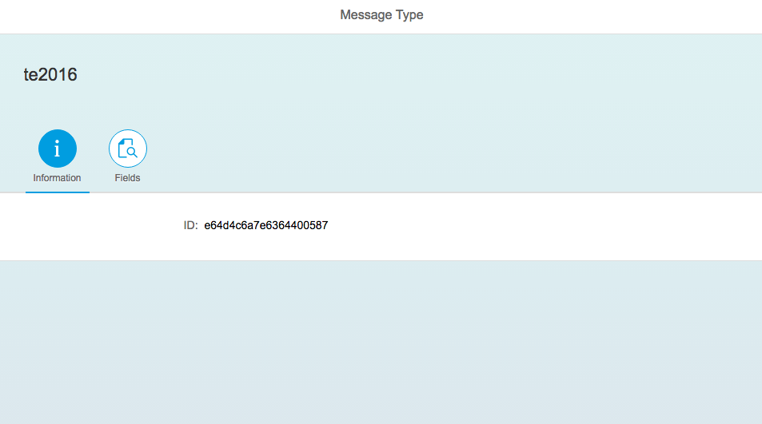

[DONE]
[ACCORDION-END]

[ACCORDION-BEGIN [Step 7: ](Create new Device Type)]

Once the message type is created you will need to create a new "Device Type" and assign the "Message Type" to it.

Field           | Value
----------------|------------
Name            | tessel2016
Message Type    | te2016
Direction       | From Device

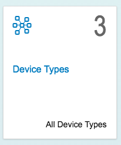

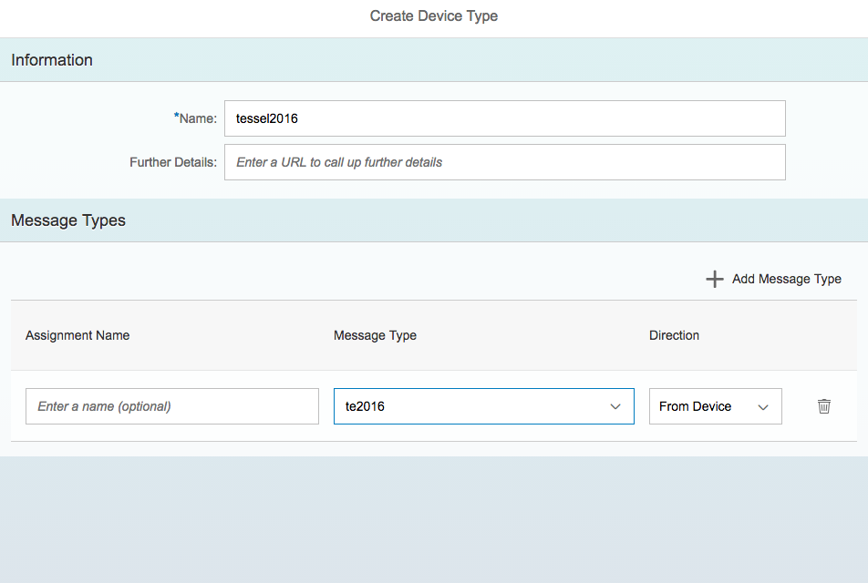

[DONE]
[ACCORDION-END]

[ACCORDION-BEGIN [Step 8: ](Add a device)]

Now that you have your message and device types created you will need to add your device.

Field           | Value        
----------------|------------------
Name            | te_tessel_16
Device Type     | tessel2016

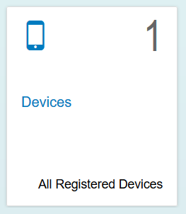

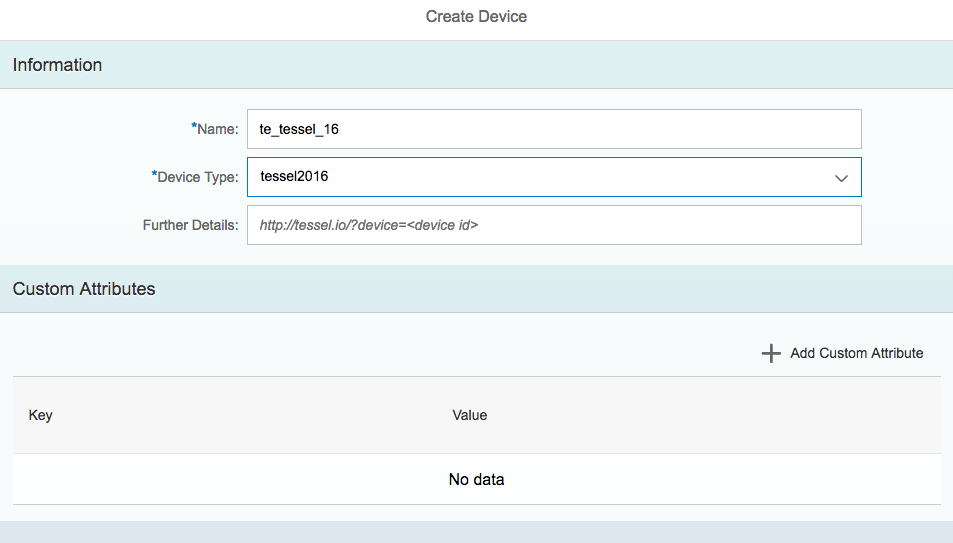

Be sure to save this token that is generated you will need it later.

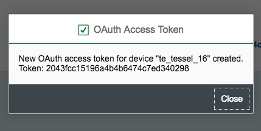

Please note down the created device id displayed here as we will be using it later.

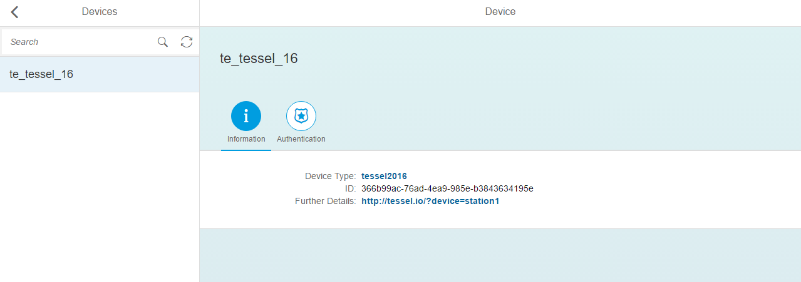

[DONE]
[ACCORDION-END]

[ACCORDION-BEGIN [Step 9: ](Select your IoT Device)]

Your device is the physical Tessel device next to you.

[DONE]
[ACCORDION-END]

[ACCORDION-BEGIN [Step 10: ](Download the JavaScript file)]

With these steps completed you are now ready to modify the JavaScript code we have prepared for the device and deploy and execute it.

If you are with us at TechEd in the `AppSpace`, the file is already available in the following directory: `C:\teched2016\te16.js`.

If you are doing this on your own machine, you can download the file [`te16_js.txt`](te16_js.txt), and rename it to `te16.js` on your machine.

[DONE]
[ACCORDION-END]

[ACCORDION-BEGIN [Step 11: ](Modify the code)]

Modifying the code provided in the file now called `te16.js`, you will need to add in your message type id's, device id, etc.

The lines in particular you will need to modify are the following

```
var hostIoT = 'iotmms<HCP Account User ID>trial.hanatrial.ondemand.com';
var authStrIoT = 'Bearer <generated token from step 7>';
var deviceId = '<generated device id from step 8>';
var messageTypeID = '<generated message type id from step 5>';

```

You will modify the `hostIoT` line to add your own HCP Account User ID which starts with either an `S` or a `P`.

 - The `authStrIoT` line contains the token you received in the popup window after creating your device
 - The `deviceId` is the ID of the device you created, not to be confused with the `token`
 - The `messageTypeID` is the ID of the message type you created

[DONE]
[ACCORDION-END]

[ACCORDION-BEGIN [Step 12: ](Run your JavaScript program)]

Once you have saved your file you will deploy and execute it from the command line. Open a "command" window, and run the following two commands:

- `t2 init`
- `t2 run te16.js`

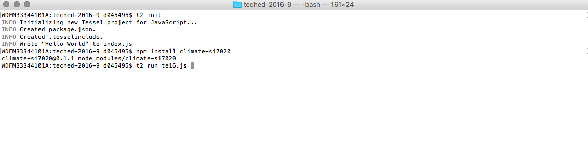

[DONE]
[ACCORDION-END]

[ACCORDION-BEGIN [Step 13: ](Verify data acquisition)]

Provided your JavaScript file was modified properly, the correct items your output should be something like the following.

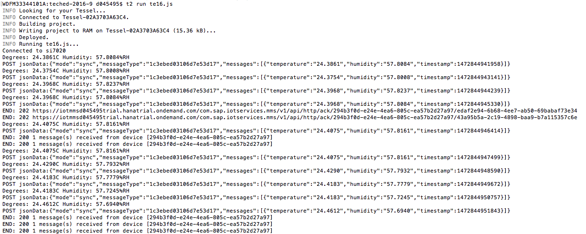

[DONE]
[ACCORDION-END]

[ACCORDION-BEGIN [Step 13: ](See your data in SAP HANA Cloud Platform)]

If you now go back to the IoT Services in HCP you can see those newly created entries.

   

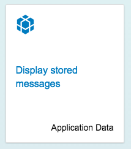

The table with your data will match the `Message Type ID`

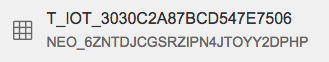   

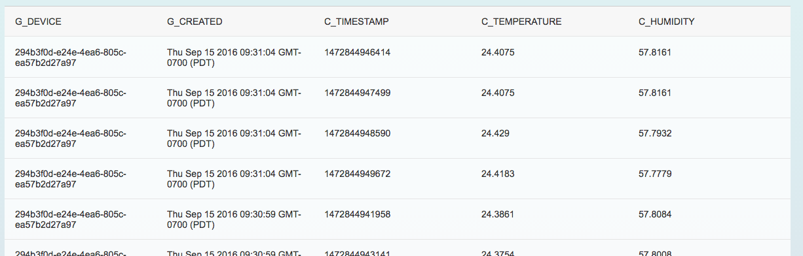

[DONE]
[ACCORDION-END]

## Next Steps
 - [Predictive analytics with SAP HANA: ABC Analysis](http://go.sap.com/developer/tutorials/teched-2016-10.html)
