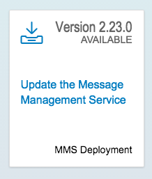

## Prerequisites  
 - **Proficiency:** Beginner 
 - **Tutorials:** [Translate your app into multiple languages](http://go.sap.com/developer/tutorials/teched-2016-7.html)

## Next Steps
 - [Processing Internet of Things (IoT) data in SAP HANA with XSA](http://go.sap.com/developer/tutorials/teched-2016-10.html)

## Details
### You will learn  
- How to add a device type, message type and device to the IoT Services of SAP HANA Cloud Platform (HCP)
- How to modify JavaScript code on your device to send data to the SAP HANA Cloud Platform (HCP)

This tutorial will take you through the steps at a rapid pace, if you'd like more details please contact one of our support staff.

### Time to Complete
**15 Min**.

---

[ACCORDION-BEGIN [Step 1: ](Connection to the SAP HANA Cloud Platform)]

The first step you need is to connect to the [SAP HANA Cloud Platform](https://account.hanatrial.ondemand.com/) trial system which will be referred to as HCP for the remainder of the tutorial. 


[DONE]
[ACCORDION-END]

[ACCORDION-BEGIN [Step 2: ](Enable IoT Services)]

Now you will need to select "Services" in the left column menu, scroll down and select the "Internet of Things (IoT)" services and ensure they are enabled.


[DONE]
[ACCORDION-END]

[ACCORDION-BEGIN [Step 3: ](Open IoT Services page)]

From here you will need to "Go to Service"


[DONE]
[ACCORDION-END]

[ACCORDION-BEGIN [Step 4: ](Verify version)]

From here you will need to ensure that you have the most recent version deployed.



[DONE]
[ACCORDION-END]

[ACCORDION-BEGIN [Step 5: ](Create a new Message Type)]

5. Now that your version is up to date you will need to go to "Message Type" and create a new message type.


[DONE]
[ACCORDION-END]

[ACCORDION-BEGIN [Step 6: ](Create new Device Type)]

Once the message type is created you will need to create a new "Device Type" and assign the "Message Type" to it.


[DONE]
[ACCORDION-END]

[ACCORDION-BEGIN [Step 7: ](Add a device)]

Now that you have your message and device types created you will need to add your device.


Be sure to save this token that is generated you will need it later.


[DONE]
[ACCORDION-END]

[ACCORDION-BEGIN [Step 8: ](Select your IoT Device)]

Your device is the physical Tessel device next to you.

[DONE]
[ACCORDION-END]

[ACCORDION-BEGIN [Step 9: ](Download the JavaScript file)]

With these steps completed you are now ready to modify the JavaScript code we have prepared for the device and deploy and execute it. Begin by downloading the file [`te16_js.txt`](te16_js.txt) file, and rename it to `te16.js`.


[DONE]
[ACCORDION-END]

[ACCORDION-BEGIN [Step 10: ](Modify the code)]

Modifying the code provided in the file now called `te16.js`, you will need to add in your message type id's, device id, etc.

The lines in particular you will need to modify are the following

```
var hostIoT = 'iotmmsXXXXXXXXXXtrial.hanatrial.ondemand.com';
  
var authStrIoT = 'Bearer XXXXXXXXXXXXXXXXXXXXXXXXXXXX';
	
var deviceId = 'XXXX-XXXX-XXXX-XXXX-XXXX';
	
var messageTypeID = 'XXXXXX';
	
```

You will modify the `hostIoT` line to add your own user ID which starts with either an `S` or a `P`. 

 - The `authStrIoT` line contains the token you received in the popup window after creating your device
 - The `deviceId` is the ID of the device you created, not to be confused with the `token`
 - The `messageTypeID` is the ID of the message type you created

[DONE]
[ACCORDION-END]

[ACCORDION-BEGIN [Step 11: ](Run your JavaScript program)]

Once you have saved your file you will deploy and execute it from the command line. Open a "command" window, and run the following two commands:

- `t2 init` 
- `t2 run te16.js`

 

[DONE]
[ACCORDION-END]

[ACCORDION-BEGIN [Step 12: ](Verify data acquisition)]

Provided your JavaScript file was modified properly, the correct items your output should be something like the following.


[DONE]
[ACCORDION-END]

[ACCORDION-BEGIN [Step 13: ](See your data in SAP HANA Cloud Platform)]
  
If you now go back to the IoT Services in HCP you can see those newly created entries.

   


The table with your data will match the `Message Type ID` 

   


[DONE]
[ACCORDION-END]


## Next Steps
 - [Processing Internet of Things (IoT) data in SAP HANA with XSA](http://go.sap.com/developer/tutorials/teched-2016-10.html)
