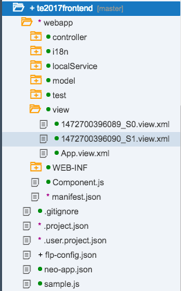
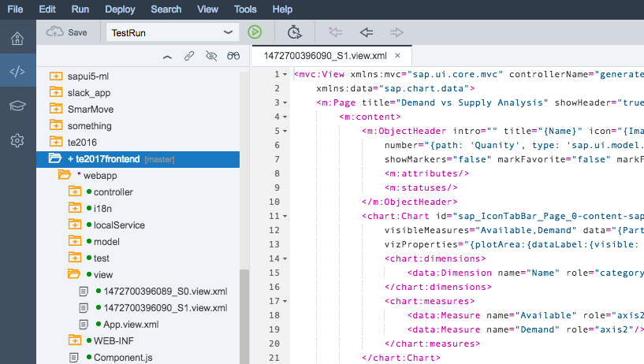
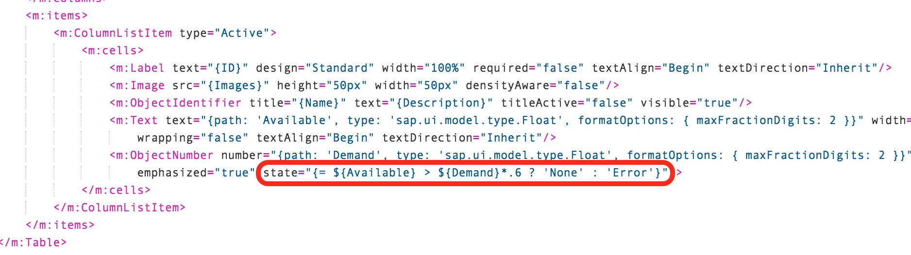
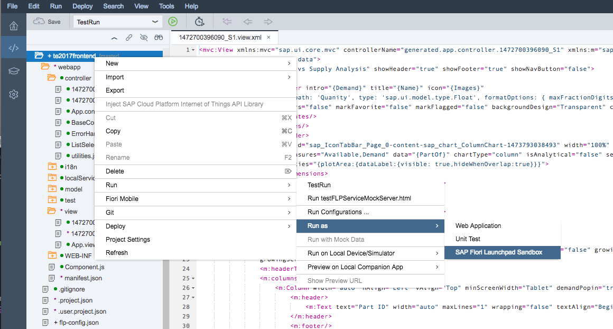
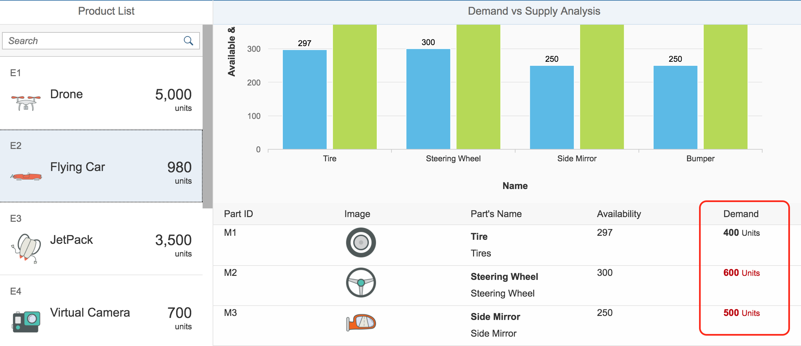
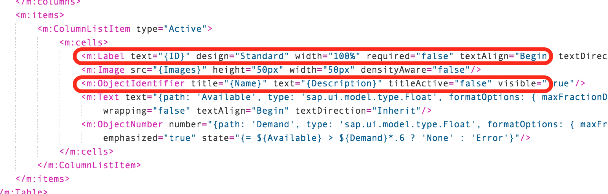
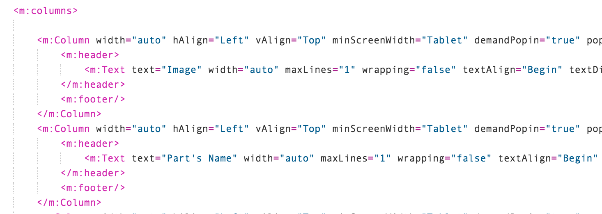
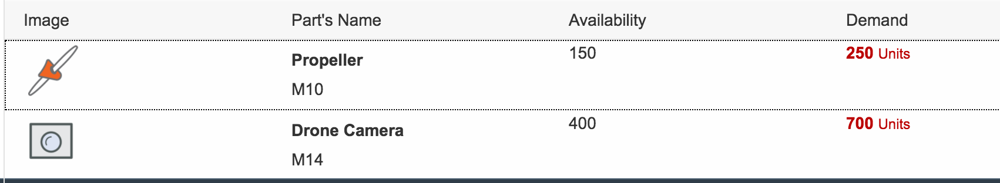

## Prerequisites  
 - **Proficiency:** Beginner

## Details
### You will learn  
You will add some modifications to the application using SAPUI5. Add some conditional logic to the Demand field to quickly understand if there are enough parts available to create the product.

### Time to Complete
**15 Min**

---

[ACCORDION-BEGIN [Step 1: ](Open the Detail view)]

In your SAP Web IDE, expand the **`webapp > view`** folders.

In the View folder, locate the `XXXXX_SO.view.xml` and `XXXXX_S1.view.xml` files. These are your Master and Detail views. `S0` is the master, or view 0, and `S1` is the detail, or view 1.



**Double click on the `S1` view** to open it.



[DONE]
[ACCORDION-END]

[ACCORDION-BEGIN [Step 2: ](Edit the Column List control)]

In the Detail view (`XXXX_S1`), locate the **`ColumnListItem`** control. This control sets the template for all items in the list bound to the table you added earlier in Build. Each row in the table contains a Label, Image, Identifier, Text, and Object Number control.


You are going to update the `ObjectNumber` control to add some formatting to the number.

In the **`ObjectNumber`** control definition, locate the **state** property. Instead of using a default state, you can calculate the state at runtime. You'll create an `IF` statement inside of the property definition. You can compare the **Available** and **Demand** fields to see if your need is greater than your supply. If the availability is less than 60% of the demand, you can set the state to Error so the issue is highly visible. To do this, replace _none_ with the following expression:

```
{= ${Available} > ${Demand}*.6 ? 'None' : 'Error'}
```



This is called **Expression Binding**. Learn more about [expression binding](https://sapui5.hana.ondemand.com/1.34.9/docs/guide/5cff8d1c3fb84c5db7a00f2daca125af.html).

**SAVE** your changes.

[DONE]
[ACCORDION-END]


[ACCORDION-BEGIN [Step 3: ](Run the application)]

Run you application. **Right-click** on the `te2017frontend` folder, and select `Run > Run as > Web Application`.



When clicking around on different toys, you will notice that the Demand column in the Parts table will either be red or grey depending on how much availability there is. If the demand is a lot higher than the availability, the Demand will be red. If the Demand is red, you might want to order some more!



[DONE]
[ACCORDION-END]

[ACCORDION-BEGIN [Step 4: ](Validate your app)]

In your running application, locate the **Robot** toy and **click it**. On the **Part** detail page, look at the parts table. **Answer the following question below**.


[VALIDATE_4]
[ACCORDION-END]

[ACCORDION-BEGIN [Step 5: ](Combine cell controls)]

In the table, the Description field doesn't add a lot of value, so you want to combine the Part Name column and the Part ID column to save space. Back in the **Detail** view (`S1`), locate the `ColumnListItem` control again. You will combine the `Label` and `ObjectIdentifier` controls.



Locate the **`Label`** control. **Delete** the Label control.

In the `ObjectIdentifier` control, change the **text** property from _Description_ to _ID_.

```
 text="{ID}"
```


[DONE]
[ACCORDION-END]

[ACCORDION-BEGIN [Step 6: ](Remove the column)]

Because you removed a control from the row template, you need to remove the corresponding header from `columns` control.

Locate the `<m:columns>` control under the **Table** control.


The first `Column` control contains the header information for the **Part ID** column that you removed. **Delete the whole first `<m:Column>` control.**



The first Column control should now be **Image**.

**SAVE** your changes.

[DONE]
[ACCORDION-END]

[ACCORDION-BEGIN [Step 7: ](Run the application)]

**Run your application**.

In the Parts table, there should be only 4 columns with the Part ID under the Part name.



[DONE]
[ACCORDION-END]

[ACCORDION-BEGIN [Step 8: ](Validate your app)]

Copy the URL from your running application. **Paste your application URL** in the box below.

[VALIDATE_8]
[ACCORDION-END]
