## Prerequisites  
 - **Proficiency:** Beginner

## Details
### You will learn  
You will create a Git repository in SAP Cloud Platform for your project, commit your project files, and then deploy and your app to the cloud. You will be able to access your app from a laptop and your mobile device.

### Time to Complete
**10 Min**.

---

[ACCORDION-BEGIN [Step 1: ](Log into your SAP Cloud Platform account)]

Log into [SAP Cloud Platform](https://account.hanatrial.ondemand.com) by opening the following URL in a new tab: https://account.hanatrial.ondemand.com

Make sure you are using the **Europe (Trial)** landscape, and click on your account name to open the cockpit view.

In the left-hand navigation bar, select **Repositories > Git Repositories**.

[DONE]
[ACCORDION-END]

[ACCORDION-BEGIN [Step 2: ](Create new repository)]

Click on **New Repository**, and enter the following details:

Field             | Value
:---------------- | :----------------
Repository Name   | `te2017frontend`
Description       | `Repository for Inventory Dashboard app`

Make sure the **Create empty commit** box is checked, click **OK** and your repository will be created.

[DONE]
[ACCORDION-END]

[ACCORDION-BEGIN [Step 3: ](Open the repository overview page)]

Click on the **`te2017frontend`** repository link to open the repository overview page.

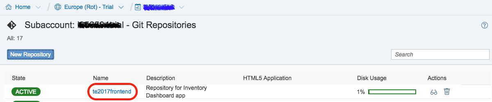

[DONE]
[ACCORDION-END]

[ACCORDION-BEGIN [Step 4: ](Copy the Git Repository URL)]

On the repository overview page, copy the **Repository Browser** URL and paste it into the field below and click **Validate**.

[VALIDATE_4]
[ACCORDION-END]

[ACCORDION-BEGIN [Step 5: ](Initialize Local Repository)]

On the repository overview page, copy the **Repository URL**:

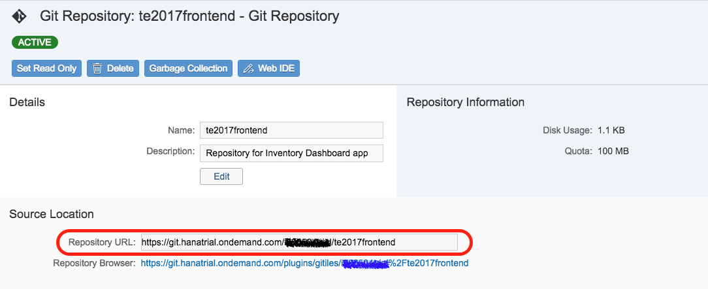

Open **SAP Web IDE** in a browser window (or in an existing one), right-click on your **`te2017frontend`** project folder and select **Git > Initialize Local Repository**.

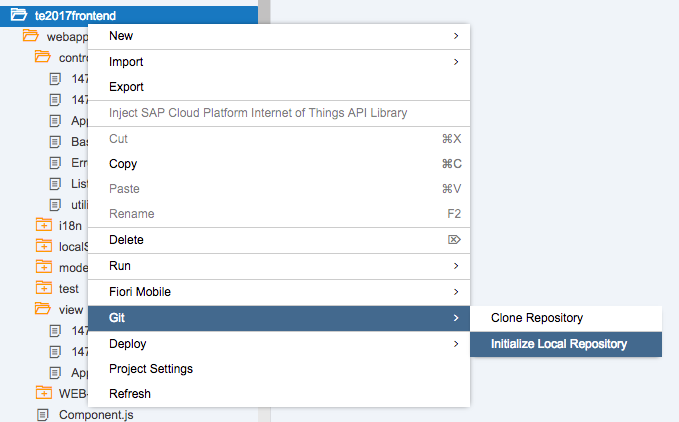

An alert box will appear in the upper right corner of your SAP Web IDE window.

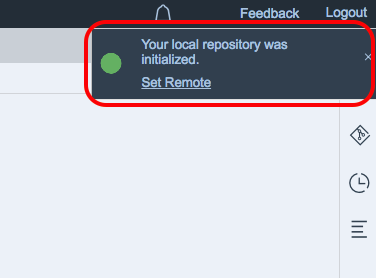

[DONE]
[ACCORDION-END]

[ACCORDION-BEGIN [Step 6: ](Link to remote repository)]

Click the **Set Remote** link in the alert and paste in the **Repository URL** you copied earlier. You can leave the **Add configuration for Gerrit** unchecked and click **OK**.

This will initialize your local repository and link it to the Git repository in HCP.

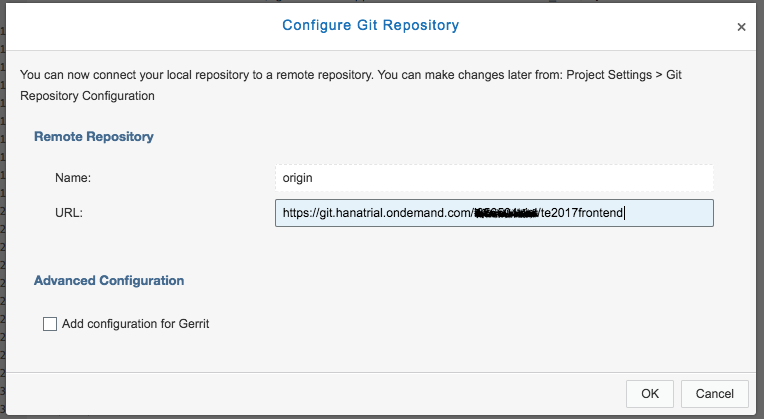

> If you closed the Set Remote notification in the top right side of the screen, you can use the menu to locate the Set Remote option. **Right click** on the project name and go to `Git > Set Remote` in the menu.

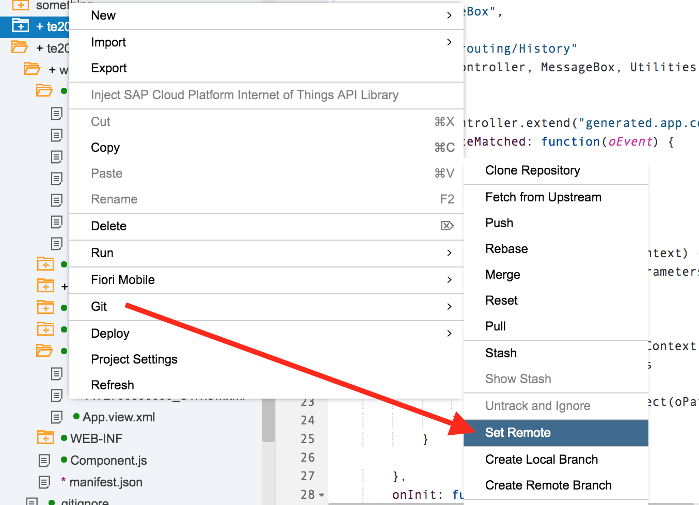

[DONE]
[ACCORDION-END]

[ACCORDION-BEGIN [Step 7: ](Open the Git pane)]

Click on the **Git pane** icon on the right hand side bar of the **SAP Web IDE** window.

If your project does not appear in the **Git pane**, keep the Git pane open and click on the project folder.

[DONE]
[ACCORDION-END]

[ACCORDION-BEGIN [Step 8: ](Perform a Git Fetch)]

To allow **SAP Web IDE** to see remote branches in the SAP Cloud Platform Git repository, click the **Fetch** button on the Git pane and log in with your email address and SAP Cloud Platform account password if prompted.

When the **Changes Fetched** dialog box opens, click **OK**.

[DONE]
[ACCORDION-END]

[ACCORDION-BEGIN [Step 9: ](Perform a Git Merge)]

Click the **Merge** button on the Git pane to merge your local branch to the remote origin/master branch.

When the **Merge "master"** dialog box opens, make sure the **origin/master** remote branch is selected and click **OK**.

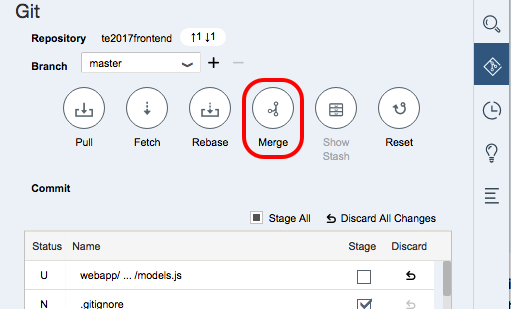

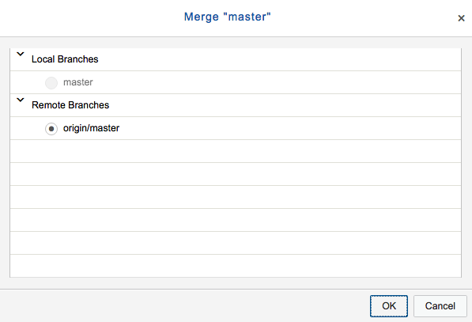

At this point your Git repository is set up.

The next steps will commit and push your project files to the repository.

[DONE]
[ACCORDION-END]

[ACCORDION-BEGIN [Step 10: ](Stage files)]

You may select individual files to commit, but to commit all project files, click the **Stage All** checkbox.

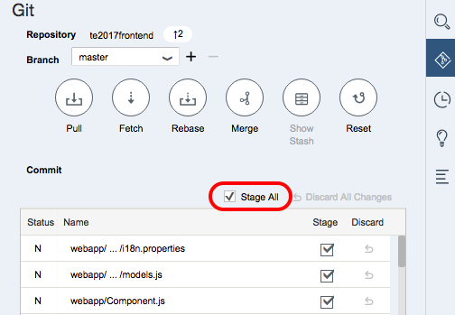

[DONE]
[ACCORDION-END]

[ACCORDION-BEGIN [Step 11: ](Enter a description for the commit)]

Scroll down in the **Git pane** and enter a description (required for any commits) like `Initial commit`.

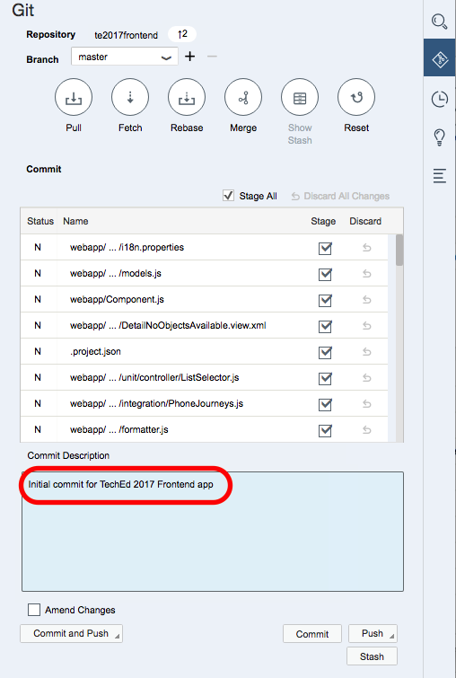

[DONE]
[ACCORDION-END]

[ACCORDION-BEGIN [Step 12: ](Perform a Git Commit and Push)]

Click on the **Commit and Push** button, and select **Remote Branch**, from the pop up menu.

This will add your files to the master branch (in other source control systems this is sometimes referred to as the "trunk").

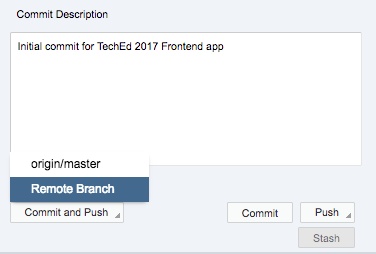

[DONE]
[ACCORDION-END]

[ACCORDION-BEGIN [Step 13: ](Push changes to the remote branch)]

In the **Push Changes to a remote branch** dialog box, select **origin/master**, click **OK** and log in with your SAP Cloud Platform credentials if prompted.

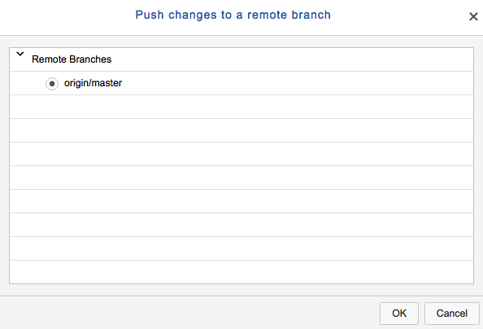

[DONE]
[ACCORDION-END]

[ACCORDION-BEGIN [Step 14: ](New file decorations)]

You will see a confirmation alert appear briefly in the top-right corner of the SAP Web IDE window (just below **Logout**), and you will see the decorations change to the **green circles** indicating that the files in your project match the versions in the Git repository.

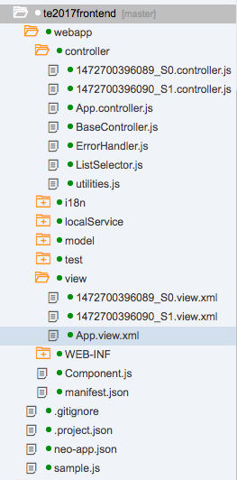

[DONE]
[ACCORDION-END]
