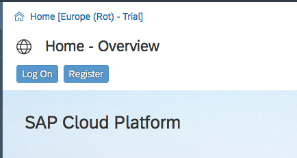
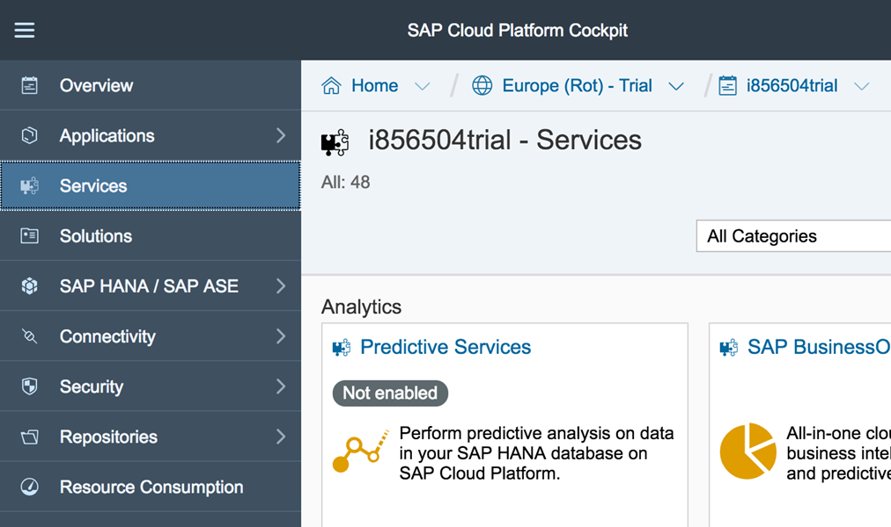
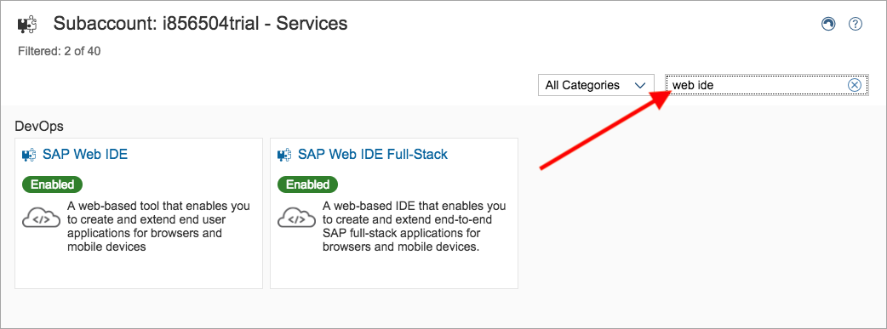
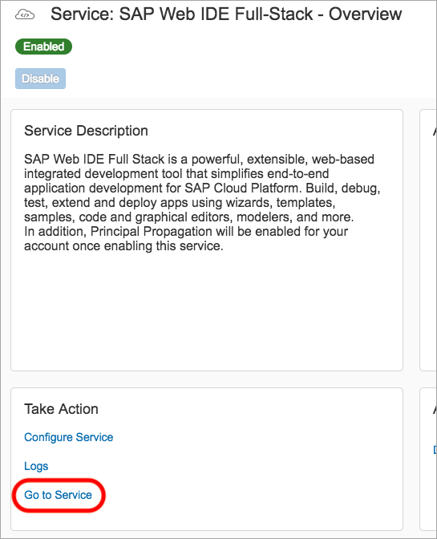
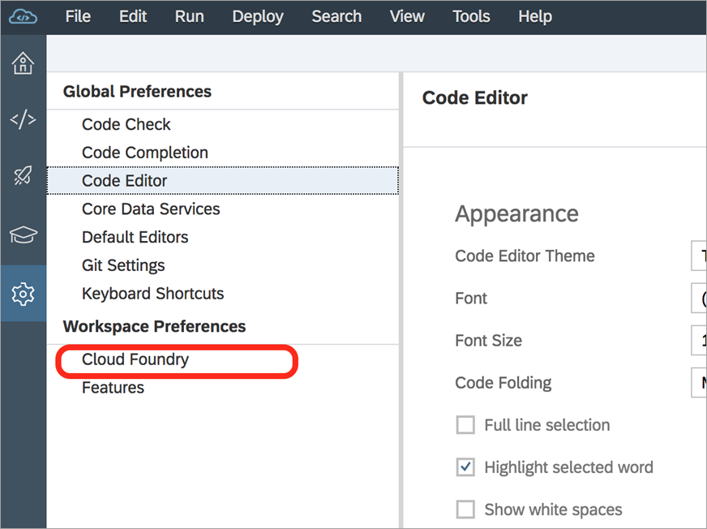
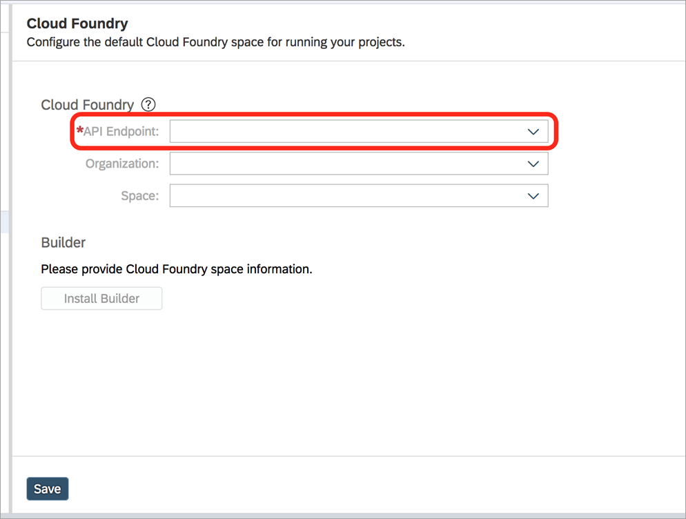
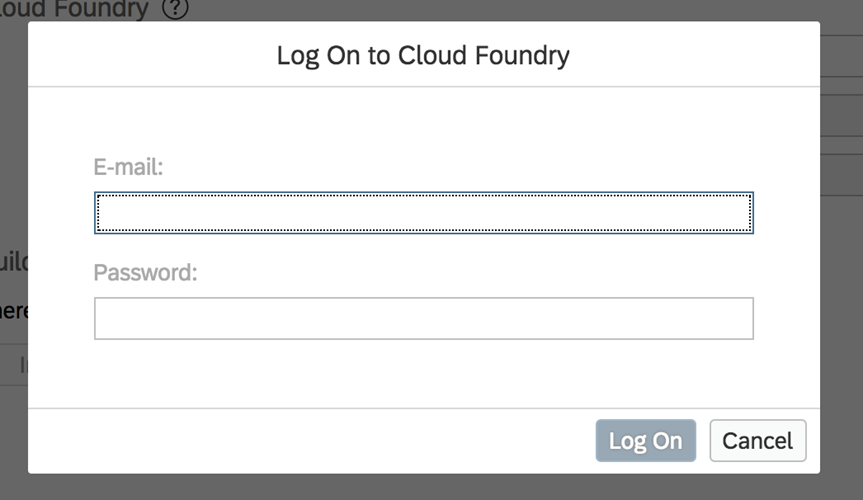
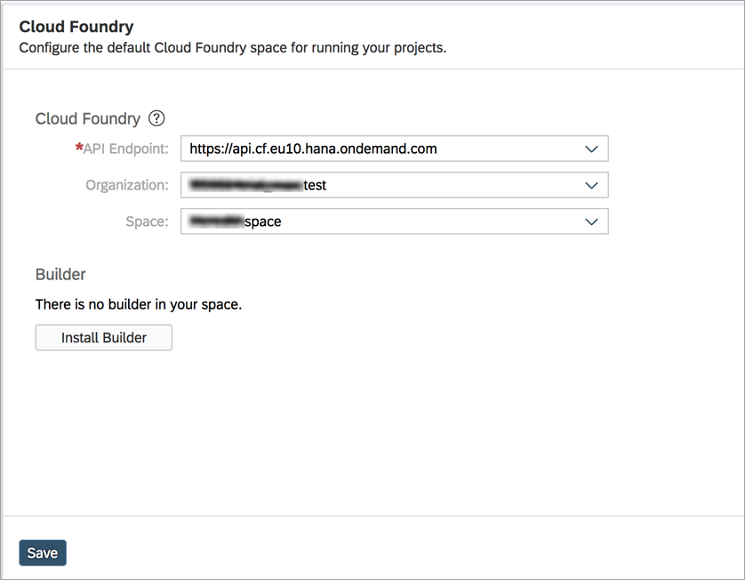

## Prerequisites  
 - Login to SAP.com

## Details
### You will learn  
  - Get a new SAP Cloud Foundry trial account
  - Setup SAP Web IDE Full Stack
  - Connect SAP Web IDE to Cloud Foundry

---

[ACCORDION-BEGIN [Step](Log into SAP Cloud Platform)]

Start by [logging into SAP Cloud Platform](https://account.hanatrial.ondemand.com/).

>If you don't have an account on SAP Cloud Platform yet, go to the [Get a Free Trial Account on SAP Cloud Platform](https://www.sap.com/developer/tutorials/hcp-create-trial-account.html) tutorial, and then come back to this step.

[DONE]
[ACCORDION-END]

[ACCORDION-BEGIN [Step](Select account type)]

The opening screen will appear.  Choose **Cloud Foundry Trial** as the type of account.

[DONE]
[ACCORDION-END]

[ACCORDION-BEGIN [Step](Select region for trial account)]

Clicking on the Cloud Foundry trial link will bring up the **Start Cloud Foundry Trial** dialog box.  Choose one of regions from this list.    

We suggest that you use the _Europe (Frankfurt)_ region.  

> We suggest the _Europe (Frankfurt)_ region because it has the largest list of services.  If you want to use a region closer to you, [check to be certain it has the services you want before selecting it](https://help.sap.com/doc/aa1ccd10da6c4337aa737df2ead1855b/Cloud/en-US/3b642f68227b4b1398d2ce1a5351389a.html?3b642f68227b4b1398d2ce1a5351389a.html).

You will then see a dialog box while the account is set up.  When complete, the dialog box will look like this.  Click **Go To Space** to continue.

[DONE]
[ACCORDION-END]

[ACCORDION-BEGIN [Step 1: ](Open the SAP Web IDE Full Stack)]

The next step is to open the SAP Web IDE Full Stack.

Open a **new tab** in to the [SAP Cloud Platform cockpit](https://account.hanatrial.ondemand.com/).  Then click on the **Neo Trial** link.

Next, go to the **Services** link on the left side of the screen.

[VALIDATE_1]
[ACCORDION-END]

[ACCORDION-BEGIN [Step 2: ](Find SAP Web IDE Full-Stack)]
On the Service catalog, search for **Web IDE**.

Select the **SAP Web IDE Full-Stack** service.

[DONE]
[ACCORDION-END]

[ACCORDION-BEGIN [Step 3: ](Enable the service)]
Once the service page loads, **Enable** the service. This may take a few minutes.

Wait for the status to change to the green, _Enabled_ status.

[DONE]
[ACCORDION-END]

[ACCORDION-BEGIN [Step 4: ](Open the SAP Web IDE)]
Once the service is enabled, click the **Go to Service** link. This will open the new, full-stack version of SAP Web IDE.

[DONE]
[ACCORDION-END]

[ACCORDION-BEGIN [Step 7: ](Enable a Cloud Foundry workspace)]
Finally, you will need to connect SAP Web IDE to your Cloud Foundry trial account.

This can also be configured in the **Preferences** pane.

Click on the **Cloud Foundry** option under **Workspace Preferences**.

Start by selecting the API Endpoint of the Cloud Foundry space you configured in a previous tutorial.

>When you select an endpoint, you may be prompted with a login box. If so, enter your email address associated with your SAP Cloud Platform account and password for your SAP Cloud Platform account. Click **Log On**.
>
>

Once you successfully log in, if you have a space configured, it will automatically populate the **Organization** and **Space** fields. If you wish to use a different space, you can update it now.

Make sure to save to keep your Cloud Foundry space preferences.

>When working on applications, you may get an error about not having a builder for the space. If you need to install a builder, click **Install Builder** on this page and then **Save**.

[DONE]
[ACCORDION-END]

---
