## Prerequisites
 - These series of tutorials can be completed at the AppSpace at SAP TechEd.
 - You have a free log in access to Google Cloud platform, provided by an expert at the Google Cloud booth at the Developer Garage.

## Details
### You will learn
  - How to create your own instance of SAP HANA, express edition
  - How to configure your instance of SAP HANA, express edition with XS Advanced

These tutorials are meant to be completed at the Developer Garage at SAP TechEd. The experts at the Google Cloud booth will provide you with an access to an account.


---

[ACCORDION-BEGIN [Step 1: ](Log in to the SAP Community)]

Register or log in to the SAP Community. This will allow you to track progress of the tutorials and earn prizes at the Developer garage.


[DONE]
[ACCORDION-END]


[ACCORDION-BEGIN [Step 2: ](Log in to Google Cloud)]

Use the credentials provided to you by the experts at the Developer Garage. These credentials are temporary and allow you to complete these tutorials without using credit in your Google account.

Open an **incognito window** in Google Chrome and navigate to [Google Cloud](https://console.cloud.google.com)

Enter the provided username

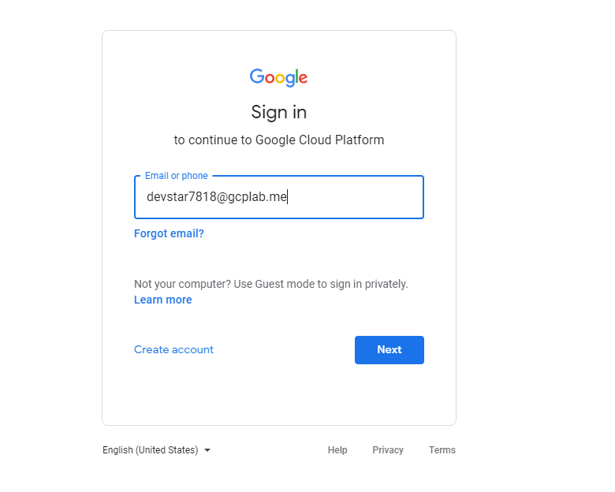

Click **Next**. Enter the password in the log in slip

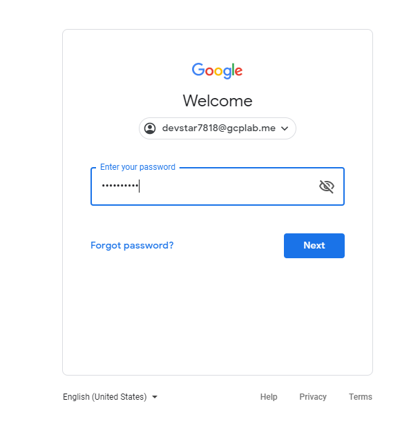

Click **Next** and then **Accept** to the policies applied to the free temporary account.

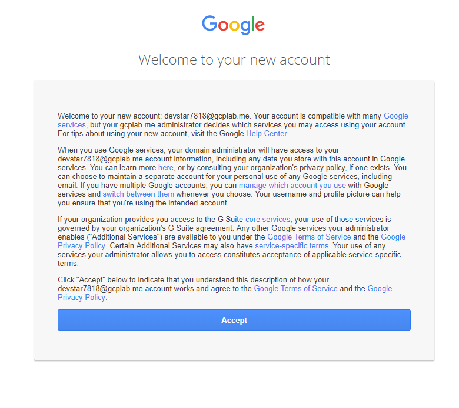

**Agree and Continue** in the next step

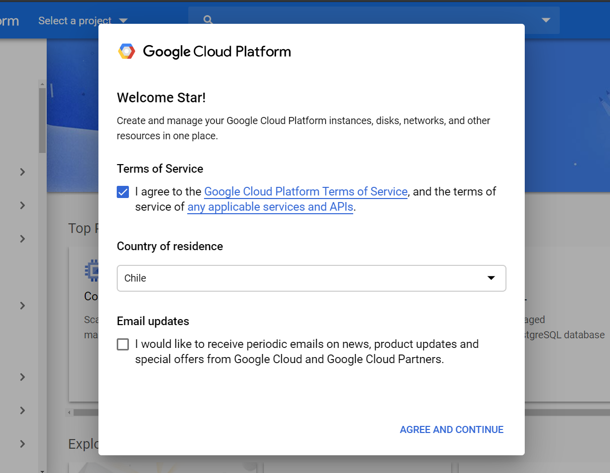


[DONE]
[ACCORDION-END]

[ACCORDION-BEGIN [Step 3: ](Look for SAP HANA, express edition in the Google Marketplace)]

Click on **Select a project**

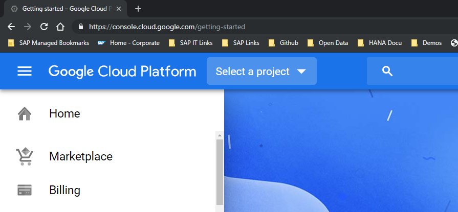

Choose the project that has been preconfigured for you. The name can vary.

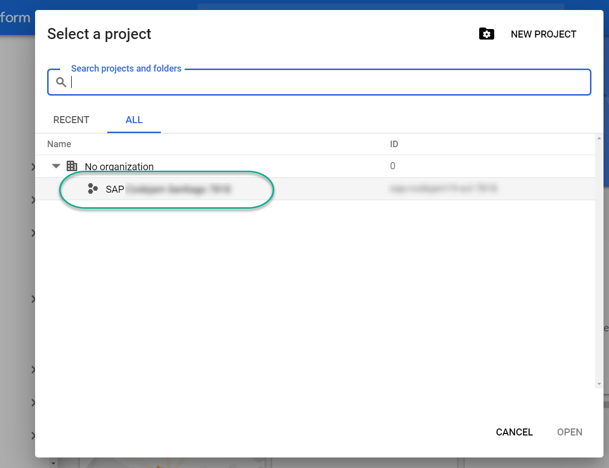

Click on **Marketplace** on the left-side menu.

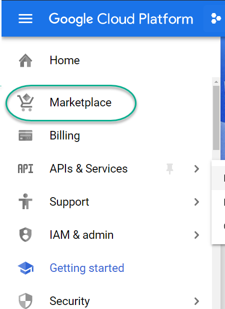

Choose **SAP HANA, express edition (server +  applications)**

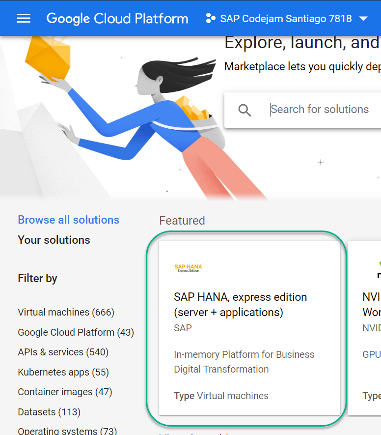


[DONE]
[ACCORDION-END]


[ACCORDION-BEGIN [Step 4: ](Deploy SAP HANA, express edition in Google Cloud)]

> Make sure your instance says `server + applications` in the description.

Click **Launch on Compute Engine**.

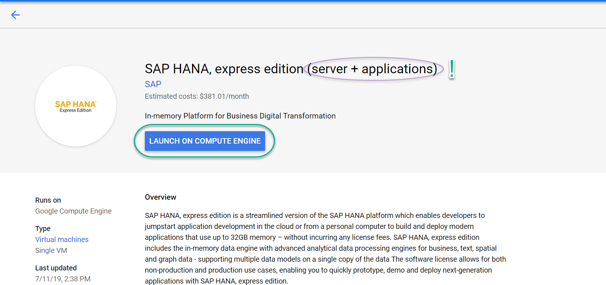

Scroll down, without changing any of the defaults. Accept the **Terms of service**, **agree** to share the information of the temporary account and click **Deploy**

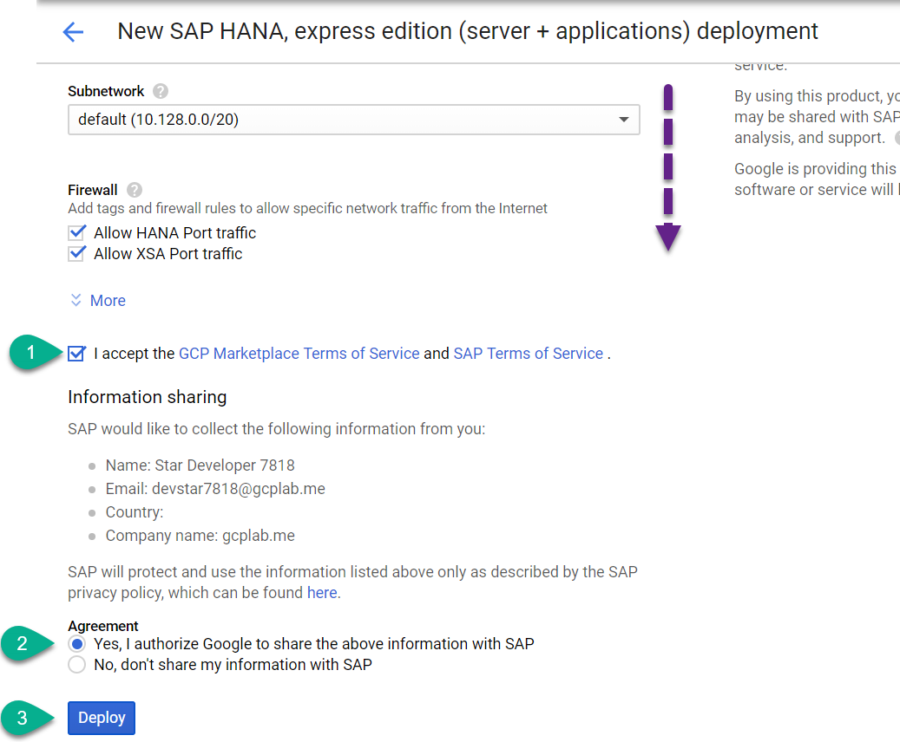

> ##What is going on?
> You are creating your own instance of SAP HANA, express edition. The platform is now provisioning a virtual machine, providing an external IP address and applying the default firewall rules.

[DONE]
[ACCORDION-END]

[ACCORDION-BEGIN [Step 5: ](Configure the platform)]

Wait until the provisioning has finished. It may take a minute or two.

Once finished, click on the name of the virtual machine.

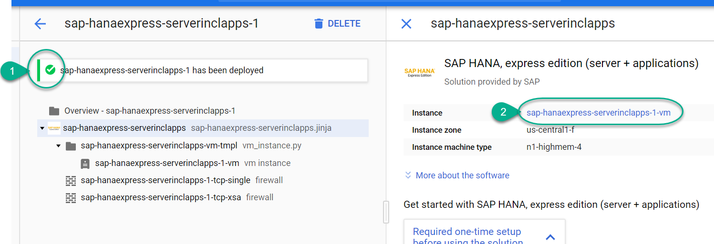

Click on the **SSH** button to open a web console.


[DONE]
[ACCORDION-END]


[ACCORDION-BEGIN [Step 6: ](Configure your virtual machine)]

Once the SSH terminal has loaded, copy and paste the following command into it

```ssh
sudo su - hxeadm
```

After each command, press **Enter**.

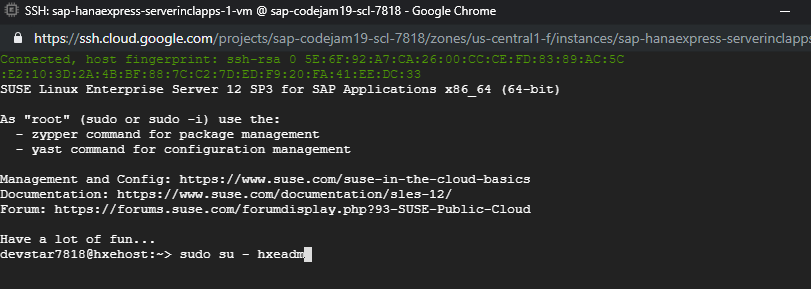

Enter **HanaRocks1** as a password and a second time to confirm it.

> ## Please use the `HanaRocks1` password for this temporary virtual machine.
> It will be easier for the experts to help you in case you need it.


Answer **N** to using a proxy, **N** to wait for the XSA configuration to finish and **Y** to proceed with configuration.

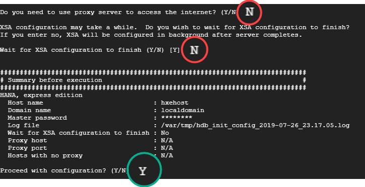

**Leave this window open**. Configuration will continue while you complete other tasks.

Watch the following video to complete the validations.

<iframe width="560" height="315" src="https://www.youtube.com/embed/HWP839IWaNU" frameborder="0" allow="accelerometer; autoplay; encrypted-media; gyroscope; picture-in-picture" allowfullscreen></iframe>


[VALIDATE_1]
[ACCORDION-END]

---
