## Prerequisites
 - These series of tutorials can be completed at the AppSpace at SAP TechEd.
 - You have completed [the first tutorial](teched-google-cloud-run-1)

## Details
### You will learn
  - How to start a project in Google Cloud Shell
  - How to initialize a project using the Cloud Application Programming model

These tutorials are meant to be completed at the Developer Garage at SAP TechEd. The experts at the Google Cloud booth will provide you with an access to an account.

---

[ACCORDION-BEGIN [Step 1: ](Open the code editor)]

Go back to the Google Cloud console. Close the Learn panel if open:

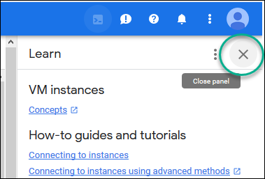

Click on the cloud shell icon .

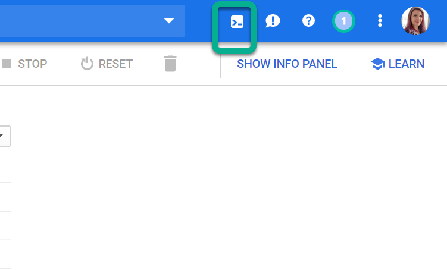

Click **Start Cloud Shell**

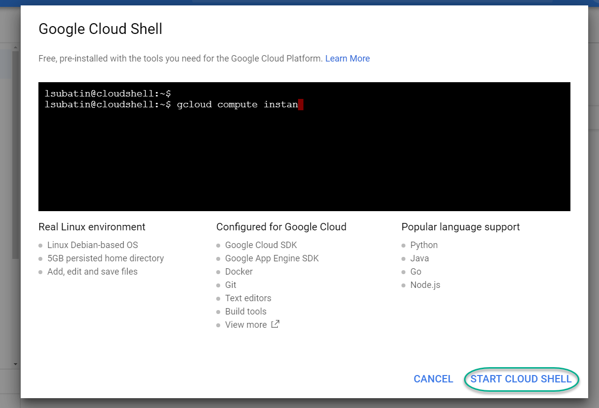

The cloud console will open up. Click on the icon to **Launch the code editor**

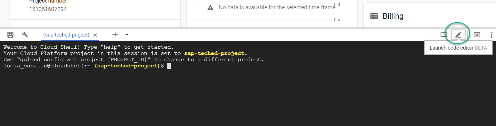

[DONE]
[ACCORDION-END]

[ACCORDION-BEGIN [Step 2: ](Configure `npm`)]

You will create a project using the SAP Core Data and Services Node.js module from SAP `npm` repository. Paste the following commands into the editor and press **Enter**

```text
npm config set @sap:registry https://npm.sap.com
npm install --global @sap/cds@3.13.0
```
For example:

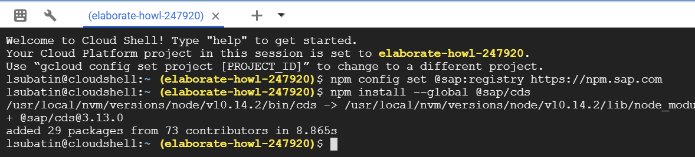

> Note: You can use the copy and paste commands in this console too.

[DONE]
[ACCORDION-END]


[ACCORDION-BEGIN [Step 3: ](Initialize a CAPM project)]

You will initialize your application using the Cloud Application Programming model. You application will contain two modules: one for database artifacts and one for services. The services module will be written in Node.js (alternatively, you could use Java). For simplicity in this application and since it will not be for productive use, you will skip authentication and authorizations.

Execute the following command:

```text  
cds init --modules db,srv --insecure --db-technology hana --verbose teched
```
You will see a new folder has been created. Expand it to see the two new modules:

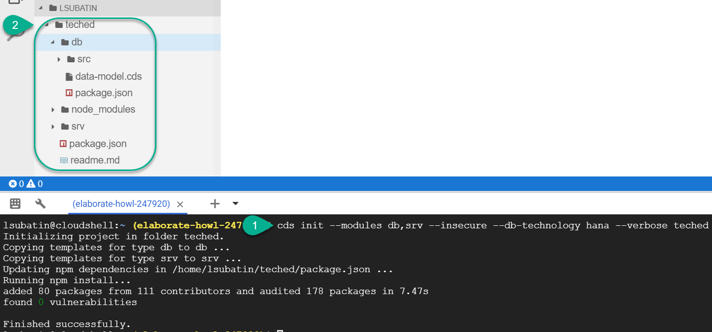

[DONE]
[ACCORDION-END]

[ACCORDION-BEGIN [Step 4: ](Create database artifacts)]
You will now create the design-time artifacts for your database. You will define two tables first.

In the `db` folder, open the sample file **`data-model.cds`** and replace the content with the following:

```text
namespace teched.recipes;

entity Foods {
    key id : Integer;
    INGREDIENTS : association to many Ingredients on INGREDIENTS.FoodId = $self;
    description :  String(80);
}

entity Ingredients {
    key FoodId : association to Foods;
    key ingredient : Integer;
    name : String(80);
    quantity : Decimal(13, 3);
    unit :  String(3);
}

```

For example:

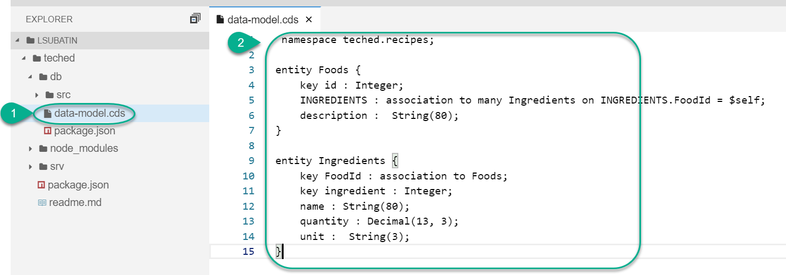

Take a look at the code you have just pasted. You can see two entities, one for Food and one for ingredients. These entities are associated to each other, as a recipe for one food item will be associated to many ingredients.

These two entities will be translated into tables in the database.


[DONE]
[ACCORDION-END]

[ACCORDION-BEGIN [Step 5: ](Create the data load definition)]

You will now define instructions to load test data into your tables from two files.

Under `db/src`, create a folder called `loads`

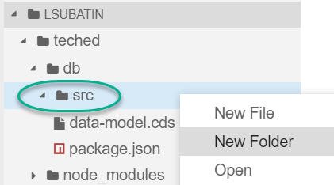

In the `loads` folder, create a new file with the following name:

```text
data_load.hdbtabledata
```

Add the following content into it:

```text
{
	"format_version": 1,
	"imports": [{
		"target_table": "TECHED_RECIPES_INGREDIENTS",
		"source_data": {
			"data_type": "CSV",
			"file_name": "ingredients.csv",
			"has_header": true,
			"dialect": "HANA",
			"type_config": {
				"delimiter": ","
			}
		},
		"import_settings": {
        	"include_filter" : [ ],			
			"import_columns": ["INGREDIENT", "NAME", "QUANTITY", "UNIT", "FOODID_ID"]
		}
	},
	{
		"target_table": "TECHED_RECIPES_FOODS",
		"source_data": {
			"data_type": "CSV",
			"file_name": "recipes.csv",
			"has_header": true,
			"dialect": "HANA",
			"type_config": {
				"delimiter": ","
			}
		},
		"import_settings": {
        	"include_filter" : [ ],			
			"import_columns": ["ID", "DESCRIPTION" ]
		}
	}]
}
```

As follows:

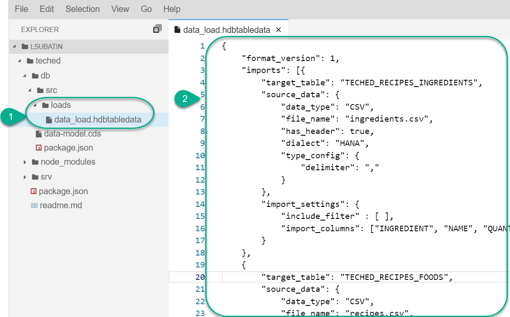


[DONE]
[ACCORDION-END]

[ACCORDION-BEGIN [Step 6: ](Add the data files)]

If you look at the file you created in the previous step, you will see it references two files. You will now create these files so that their content is loaded into the tables.

In the command line, navigate into the `loads` directory and enter the following command

```text
cd ./teched/db/src/loads
touch ingredients.csv recipes.csv
edit ingredients.csv
```

This will create two files and open the `ingredients` file in the editor.

Paste the following content into the **ingredients** file:

```text
INGREDIENT,NAME,QUANTITY,UNIT,FOODID_ID
1,MILK,1,L,1
1,MILK,1,L,4
2,SUGAR,100,G,1
3,FLOURLESS FLOUR,5,SP,1
3,FLOURLESS FLOUR,5,SP,2
3,FLOURLESS FLOUR,5,SP,3
3,FLOURLESS FLOUR,5,SP,4
3,FLOURLESS FLOUR,5,SP,5
4,DARK CHOCOLATE,5,KG,1
4,DARK CHOCOLATE,2,KG,2
5,MILK CHOCOLATE,3,KG,3
5,MILK CHOCOLATE,3,KG,1
6,FAKE MEATBALLS,5,UN,4
7,TOASTED PEANUTS,1,KG,3
8,TOASTED PEANUTS,1,G,2
9,RAW MACADAMIA NUTS,1,KG,2
9,RAW MACADAMIA NUTS,1,KG,3
10,MILLENNIUM FALCON SPRINKLES,2,G,1
10,MILLENNIUM FALCON SPRINKLES,2,G,2
10,MILLENNIUM FALCON SPRINKLES,2,G,3
10,MILLENNIUM FALCON SPRINKLES,2,G,4
10,MILLENNIUM FALCON SPRINKLES,2,G,5
11,KITTY SHAPED WATER,1,L,1
11,KITTY SHAPED WATER,1,L,2
```

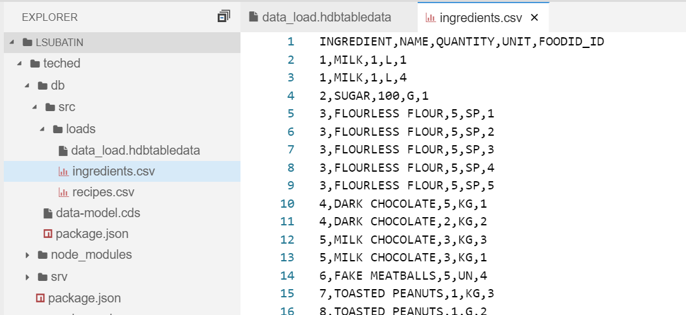

Open the file **`recipes.csv`** file

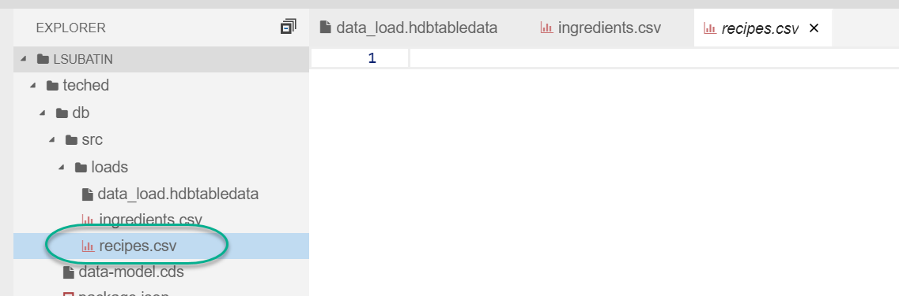

Paste the following content into `recipes.csv`

```text
ID,DESCRIPTION
1,Rabid Nutella Chocolate Cake
2,Unicorn fishies
3,Flourless peanut butter
4,Veggie fantasy duck
5,Fizzy rain water pops
```

Use the results of the following command to complete the validation below.

```text
cat ~/teched/db/src/loads/ingredients.csv | grep KIT
```

[VALIDATE_1]
[ACCORDION-END]

[ACCORDION-BEGIN [Step 7: ](Adapt the services)]

Open the file `srv/cat-service.cds` and paste the following content into it

```text
using teched.recipes as recipes from '../db/data-model';


service CatalogService {
    @readonly entity Foods as projection on recipes.Foods;
    @readonly entity Ingredients as projection on recipes.Ingredients;
}

```
For example:

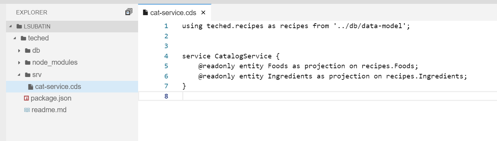

[DONE]
[ACCORDION-END]

[ACCORDION-BEGIN [Step 8: ](Use CDS to generate the artifacts for SAP HANA)]
You will be connecting to the SAP HANA, express edition instance you created in the previous tutorial. Use the following two commands to create the `hdbcds` files.

```text
cd ~/teched/db/
npm install
```
You will see  the progress in the console.

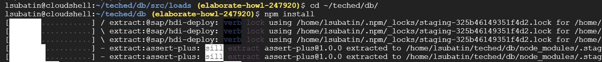

Expand the `gen` folder that was generated after the last commands.

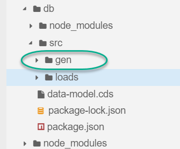


[VALIDATE_2]
[ACCORDION-END]

---
