## Prerequisites
  - These series of tutorials can be completed at the AppSpace at SAP TechEd.
  - You have completed [the previous tutorial](teched-google-cloud-run-2)

## Details
### You will learn
  - How to create an HDI container from the command line in SAP HANA, express edition
  - How to create access keys for your HDI connection

HANA Deployment Infrastructure containers store both design-time representations of database artifacts and their runtime objects. You have created the design-time artifacts using CDS files in the previous tutorial. HDI containers provide access to the physical schema and objects within it through specific, auto-generated technical users and their passwords.
You will now create an HDI container, connect to it from your application in Google Cloud Run to deploy the `.hdbcds` files into the database, have the HANA Deployment Infrastructure create the tables and fill them with sample data.

These tutorials are meant to be completed at the Developer Garage at SAP TechEd. The experts at the Google Cloud booth will provide you with an access to an account.

---

[ACCORDION-BEGIN [Step 1: ](Create an HDI container)]

Go back to the SSH console window where SAP HANA, express edition was finishing its configuration and starting its applications.


> Note: If you have closed this window, you can go back into the `Google Compute Engine` and click on the `SSH` button right next to the virtual machine.
>  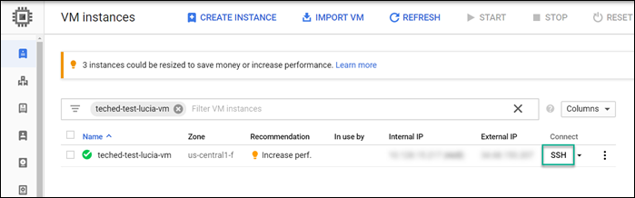

Paste the following command to log in to the XS Advanced command line interface:

```text
xs-admin-login
```
Use `HanaRocks1` as the password.

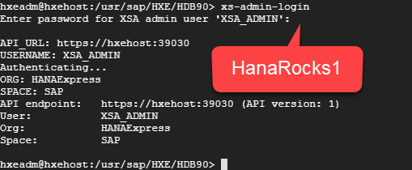

Use the following command to switch to the development space and create an HDI container.

```text
xs target -s development
xs create-service hana hdi-shared my-hdi  -c '{ "schema":"FOOD"}'
```
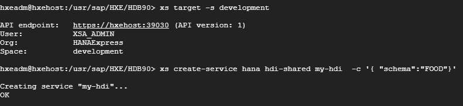


[DONE]
[ACCORDION-END]

[ACCORDION-BEGIN [Step 2: ](Create keys for your HDI container)]

You can access the runtime artifacts in an HDI containers (for example, the schema or the tables) through some automatically-generated technical users. Create a key to retrieve those users.

```text
xs create-service-key my-hdi my-key
xs service-key my-hdi my-key
```

You will see the credentials and information to connect to your HDI container.

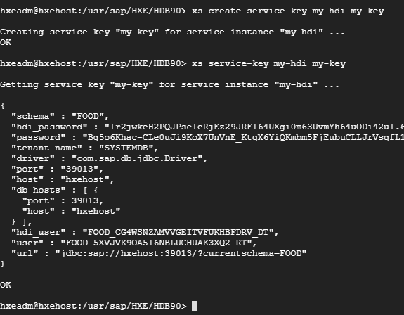

[DONE]
[ACCORDION-END]


[ACCORDION-BEGIN [Step 3: ](Use they keys to log in)]

To test the log in to the HDI container, you will use the fields `user` and `password` from the previous key.

Enter the following command to log in to the database with the `hdbsql` command line.

```text
hdbsql -i 90 -d systemdb
```
Enter the following select statement

```sql
select * from dummy;
```
Use the username and password from the key when prompted (you can use `CTRL+C` and `CTRL+V`)

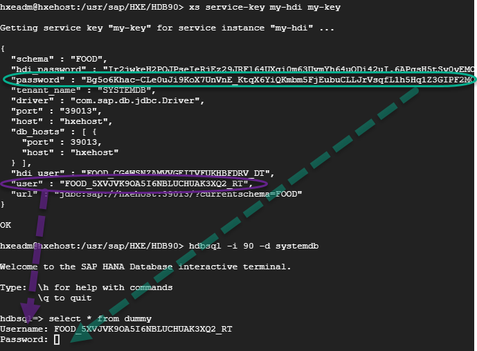

> Note: The password field will not show any contents after you paste it.

Press **`q`** to exit the results


**Leave this window open**. You will need the contents of the key shortly.

[DONE]
[ACCORDION-END]

[ACCORDION-BEGIN [Step 4: ](Take the keys into your project)]

The Cloud Application Programming model will connect to a database if it finds the connection information in the environment variables. In Cloud Foundry, the environment variable that would normally hold this information is called `VCAP_SERVICES`. Even though this application will not be deployed into Cloud Foundry, you can still create an environment variable called  `VCAP_SERVICES` to enter the information for your application to connect to SAP HANA, express edition.

In your **`teched`** project in the **Cloud Editor**, create a new file .

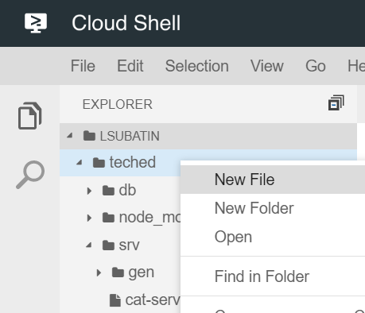

Call the file `credentials.json`.

Copy the following contents into the file

```json
{
 "VCAP_SERVICES": {
     "hana": [
         {
             "name": "hana", "tags": [ "hana" ],
             "credentials":
                 <<REPLACE ME!>>


         }
     ]
 }
}
```

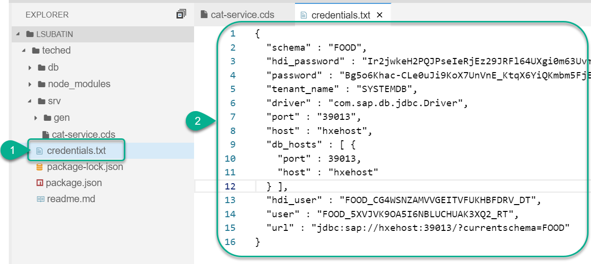

Copy the contents of the key into this file, including the `{}` (curly brackets) and paste them to replace `REPLACE ME`.

For example:

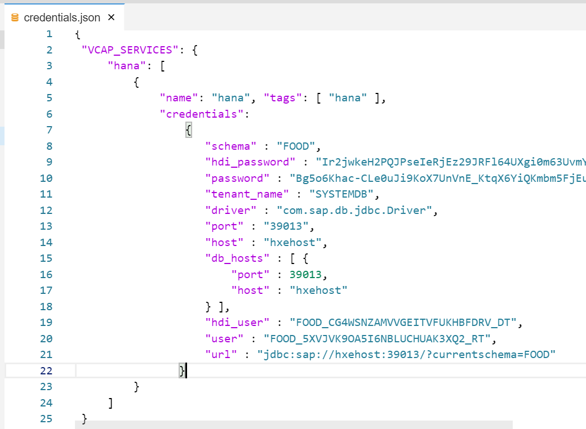

[DONE]
[ACCORDION-END]

[ACCORDION-BEGIN [Step 5: ](Replace the host with the external IP address)]

The key generated in SAP HANA, express edition contains the host `hxehost`. This will only work if connecting from inside the virtual machine or if the name of the host was mapped to an IP address in a local computer.

Go back to the [list of instances](https://console.cloud.google.com/compute/instances) for your project. Copy the **External IP address** for your SAP HANA, express edition.

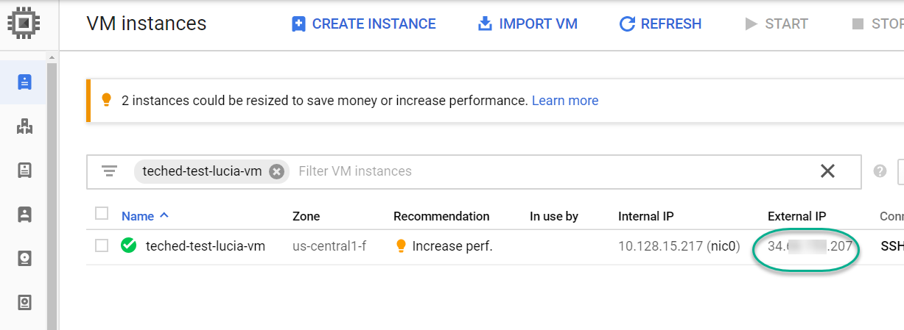

Use this value to replace `hxehost` in the `credentials.json` file

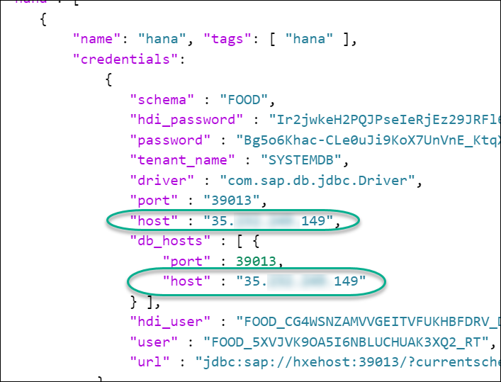

[DONE]
[ACCORDION-END]

[ACCORDION-BEGIN [Step 6: ](Export the environment variable for local testing)]

You will now export the environment variable `VCAP_SERVICES` into your Cloud Shell environment so you can locally execute the `cds` module for testing.

The following command will parse the `credentials.json` file into a string you can use. Paste it into the Google Cloud Shell.

```ssh
sed 's/"/\\"/g' <(jq -r "to_entries|map(\"\(.key)=\(.value|tostring)\")|.[]" ~/teched/credentials.json)
```

Use the output of the previous command and paste it into the console as if it were a command. This will assign the value of `VCAP_SERVICES` for this session.

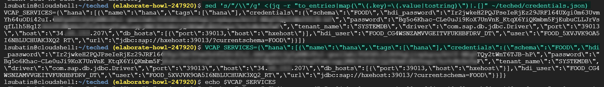

[VALIDATE_1]
[ACCORDION-END]


---
