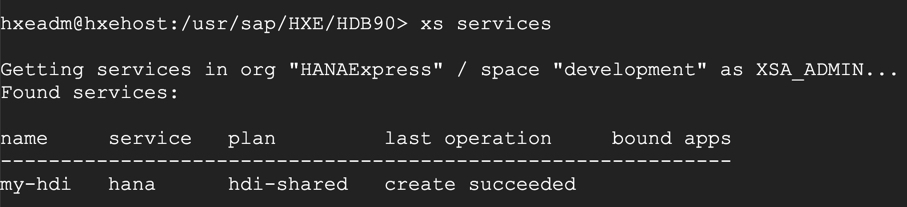
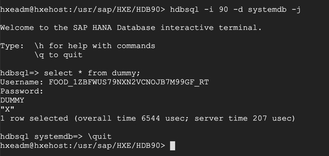
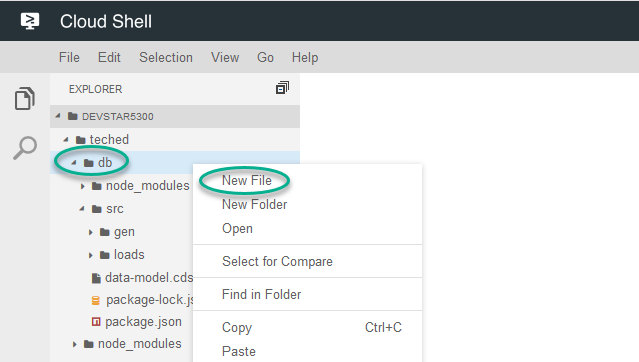

## Prerequisites
  - These series of tutorials can be completed at the AppSpace at SAP TechEd.
  - You have completed [the previous tutorial](teched-google-cloud-run-2)

## Details
### You will learn
  - How to create an HDI container from the command line in SAP HANA, express edition
  - How to create access keys for your HDI connection

SAP HANA Deployment Infrastructure (or `HDI` for short) containers store both design-time representations of database artifacts and their runtime objects. See [SAP HANA documentation for more information](https://help.sap.com/viewer/4505d0bdaf4948449b7f7379d24d0f0d/2.0.04/en-US/e28abca91a004683845805efc2bf967c.html).

You have created the design-time artifacts using CDS files in the previous tutorial. HDI containers provide access to the physical schema and objects within it through specific, auto-generated technical users and their passwords.
You will now create an HDI container, connect to it from your application in Google Cloud Run to deploy the `.hdbcds` files into the database, have the HANA Deployment Infrastructure create the database tables and populate them with some sample data.

**These tutorials are meant to be completed at the Developer Garage at SAP TechEd.** The experts at the Google Cloud booth will provide you with access to an account.

---

[ACCORDION-BEGIN [Step 1: ](Create an HDI container)]

Go back to the SSH console window where SAP HANA, express edition, was finishing its configuration and starting its applications.

Maximize the console for a better experience:


> Note: If you have closed this window, you can go back into the **Google Compute Engine** `https://console.cloud.google.com/compute/instances` (in incognito mode of the web browser) and click on the `SSH` button right next to the virtual machine.
>  
>
> After reopening the window you'll need to execute the following command again:
> ```SSH
> sudo su - hxeadm
> ```
> Remember to maximize the window.

Paste the following command to log in to the XS Advanced command line interface:

```SSH
xs-admin-login
```

Use `HanaRocks1` as the password.


Execute the following two commands to switch to the development space of HANA XSA and to create an HDI container with database schema called `FOOD`.

```SSH
xs target -s development
xs create-service hana hdi-shared my-hdi  -c '{ "schema":"FOOD"}'
```


Once created successfully you can see this HDI container among services.

```SSH
xs services
```



[DONE]
[ACCORDION-END]

[ACCORDION-BEGIN [Step 2: ](Create keys for your HDI container)]

You can access the runtime artifacts in an HDI containers (for example, the schema or the tables) through some automatically-generated technical users. Create a key to retrieve those users.

```SSH
xs create-service-key my-hdi my-key
xs service-key my-hdi my-key
```

You will see the credentials and information to connect to your HDI container.


[DONE]
[ACCORDION-END]


[ACCORDION-BEGIN [Step 3: ](Use they keys to log in)]

To test the log in to the HDI container, you will use the fields `user` and `password` from the previous key.

Enter the following command to log in to the database with the `hdbsql` command line.

```SSH
hdbsql -i 90 -d systemdb -j
```

Enter the following select statement

```sql
select * from dummy;
```
Use the values of **`user`** and **`password`** properties from the service key when prompted.


> Note: The password field will not show any contents after you paste it.
>  This step will fail if:
>
> - You use the user and password values from the service key other than `password` and `user`
> - The password spans two lines.  If the authentication fails, copy and paste the two lines of the password separately before hitting **Enter** on the keyboard.

If you log in successfully, then you should see the result of the SQL query, i.e. the content of the system `dummy` table.



Type `\quit` to exit `hdbsql` and to return to the OS shell.

**Leave this window open**. You will need the contents of the service key in next steps.

[DONE]
[ACCORDION-END]

[ACCORDION-BEGIN [Step 4: ](Use the service key in your project)]

The Cloud Application Programming model will connect to a database if it finds the connection information in the environment variables. In Cloud Foundry, the environment variable that would normally hold this information is called `VCAP_SERVICES`.

Even though this application will not be deployed into Cloud Foundry, you can still create an environment variable called  `VCAP_SERVICES` to enter the information for your application to connect to SAP HANA, express edition.

In your `teched` project in the **Cloud Shell**'s **Editor**, under the `db` folder, create a new file.



Use the following name:

```file
default-env.json
```

Copy the following contents into the file

```json
{
 "VCAP_SERVICES": {
     "hana": [
         {
             "name": "hana", "tags": [ "hana" ],
             "credentials":
                 <<REPLACE ME!>>

         }
     ]
 }
}
```

Copy the contents of the key into this file, including the `{}` (curly brackets) and paste them to replace `<<REPLACE ME!>>`.

For example:


[DONE]
[ACCORDION-END]

[ACCORDION-BEGIN [Step 5: ](Replace the host with the external IP address)]

The key generated in SAP HANA, express edition, contains the host `hxehost`. This will only work if connecting from inside the virtual machine or if the name of the host was mapped to an IP address in a local computer.

Go back to the [list of instances](https://console.cloud.google.com/compute/instances) for your project. Copy the **External IP address** for your SAP HANA, express edition, instance.


Use this value to replace both instances of `hxehost` in the `default-env.json` file


Copy the file to the root folder. This file will serve the credentials of the HDI container while you are testing the application.

```shell
cp ~/teched/db/default-env.json ~/teched/default-env.json
```

Paste the results of the following command to complete the validation:

```shell
find ~/teched -name default-env.json
```

[VALIDATE_1]
[ACCORDION-END]

---
