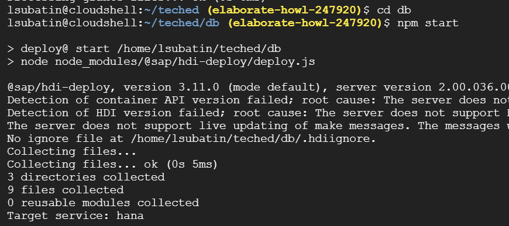
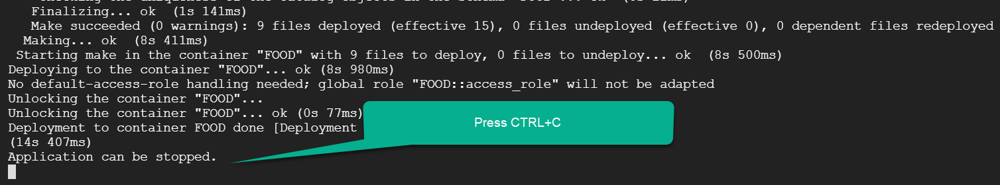
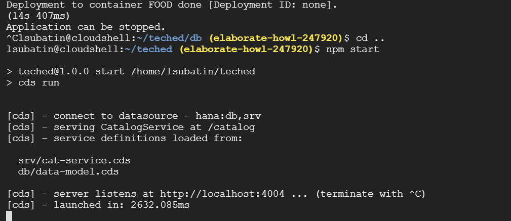
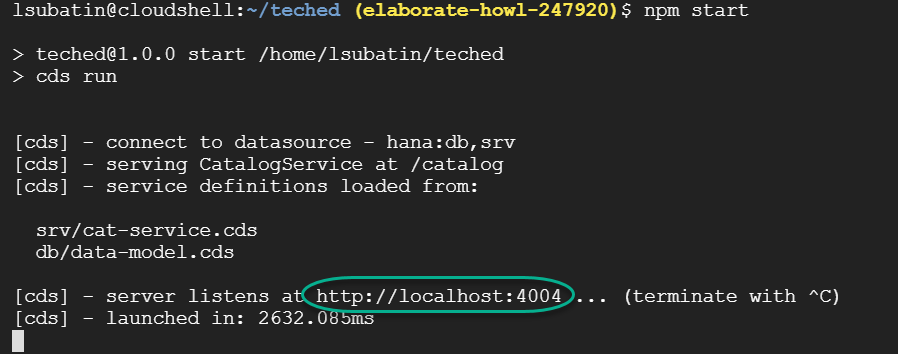
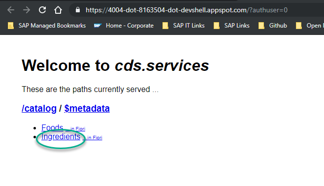
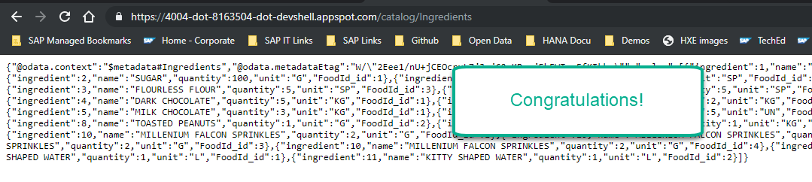
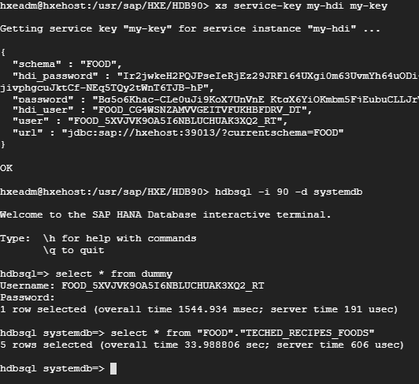

## Prerequisites
- These series of tutorials can be completed at the AppSpace at SAP TechEd.
- You have completed [the previous tutorial](teched-google-cloud-run-3)

## Details
### You will learn
  - How to deploy the CDS artifacts
  - How to query data in your instance of SAP HANA, express edition
  - How to execute your OData services in the local Cloud Shell environment for testing purposes

**These tutorials are meant to be completed at the Developer Garage at SAP TechEd.** The experts at the Google Cloud booth will provide you with access to an account.

---

[ACCORDION-BEGIN [Step 1: ](Connect and deploy to the database)]

In the Google Cloud Shell, use the following two commands to deploy the database artifacts into SAP HANA, using the connection information you created.

```ssh
cd ~/teched/db
npm start
```
You will see the deployment start:



Press **`CTRL+C`** once the deployment has finished.



The `.hdbcds` files have now been translated into tables in the HDI container you have manually created.

[DONE]
[ACCORDION-END]

[ACCORDION-BEGIN [Step 2: ](Start the OData services)]

Go into the root directory and start the services using the following two commands:

```ssh
cd ..
npm start
```

You will see `server listens at...`. This is the service being exposed from the Cloud Shell virtual machine.



[DONE]
[ACCORDION-END]


[ACCORDION-BEGIN [Step 3: ](Test the services)]

Click on the link where the application is listening.



A new tab will open. Click on the `Ingredients` link.



Congratulations! You should now see the data in your database being exposed through your service. This means the data has been loaded into the database and your application is up and running locally.



[DONE]
[ACCORDION-END]

[ACCORDION-BEGIN [Step 4: ](Check deployment in the database)]

Go back into the **console for you HANA express virtual machine**.


> Note: If you closed the console, click on SSH button next to your [virtual machine](https://console.cloud.google.com/compute/instances) and run `sudo su - hxeadm`.
> Command `xs service-key my-hdi my-key` will provide the credential information in the same machine.

You will now query the SAP HANA database and see how the sample files have been loaded into the tables.

Use the following command to check the data inserted by the CDS module in the database:

```sql
select * from "FOOD"."TECHED_RECIPES_FOODS"
```



Use the results to complete the validation below.

[VALIDATE_1]
[ACCORDION-END]

---
