## Prerequisites
- These series of tutorials can be completed at the AppSpace at SAP TechEd.
- You have completed [the previous tutorial](teched-google-cloud-run-4)

## Details
### You will learn
  - How to create your own Docker image with your application
  - How to upload your image into the container registry

These tutorials are meant to be completed at the Developer Garage at SAP TechEd. The experts at the Google Cloud booth will provide you with an access to an account.

---

[ACCORDION-BEGIN [Step 1: ](Create project NPM configuration file)]

Copy the `.npmrc` global configuration file to the project's root folder with the following command:

```shell
cp ~/.npmrc ~/teched
```

[DONE]
[ACCORDION-END]

[ACCORDION-BEGIN [Step 2: ](Create a Dockerfile)]

You will create a Docker image from a Node.js image using the application you created using the Cloud Application Programming model. This image will be uploaded into a repository and deployed into Cloud Run.

Create a Docker file using the following command:

```shell
touch ~/teched/Dockerfile
edit ~/teched/Dockerfile
```

Insert the following contents into the `Dockerfile`

```Dockerfile
# Use the official Node.js 8 image.
# https://hub.docker.com/_/node
FROM node:8

# Create and change to the app directory.
WORKDIR /usr/src/app

# Copy application dependency manifests to the container image.
# A wildcard is used to ensure both package.json AND package-lock.json are copied.
# Copying this separately prevents re-running npm install on every code change.
COPY /package*.json ./
COPY .npmrc ./

# Install dependencies.
RUN npm install

# Copy local code to the container image.
COPY . .

# Run the web service on container startup.
CMD [ "npm", "start" ]

```

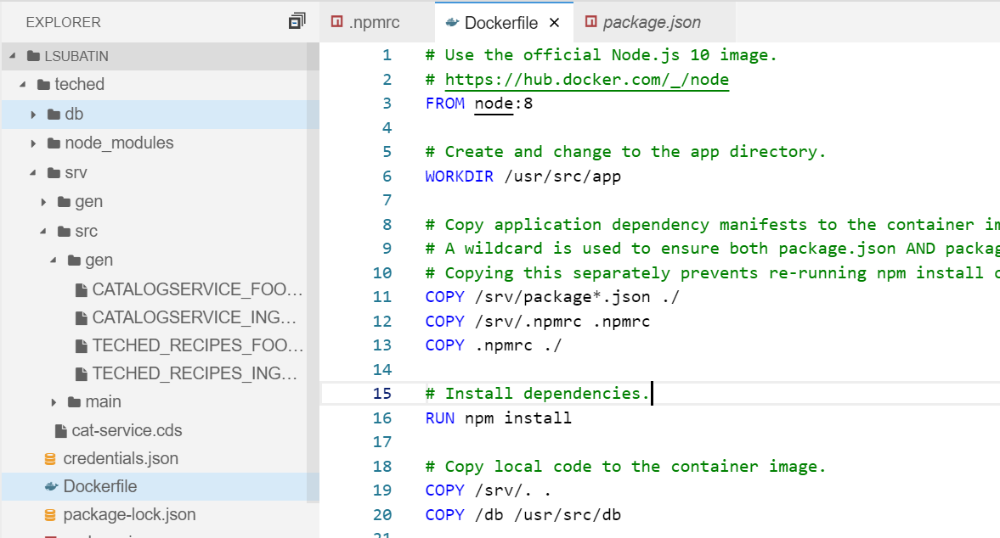

[DONE]
[ACCORDION-END]


[ACCORDION-BEGIN [Step 3: ](Upload the image)]

Open the following URL in a new tab...

```url
https://console.cloud.google.com/apis/api/cloudbuild.googleapis.com/overview
```

...and **Enable** the Cloud Build API.

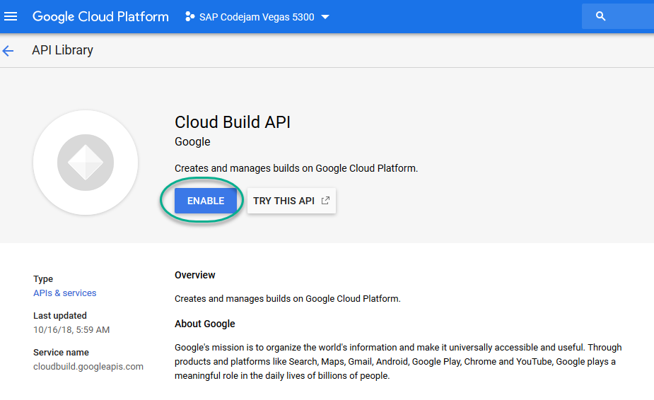

Wait until the API has been enabled. You can close this tab and go back to the Cloud Shell once it has.

Use the following command to create and upload a container image. Answer **y** if prompted to activate Cloud Run for your account.

```shell
cd ~/teched
gcloud builds submit --tag gcr.io/$GOOGLE_CLOUD_PROJECT/teched
```

This will take about a minute.

Make sure you see a **SUCCESS** message once the process is finished.


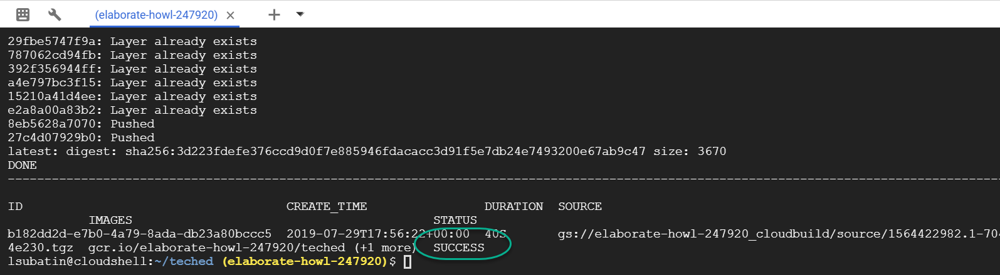

[DONE]
[ACCORDION-END]

[ACCORDION-BEGIN [Step 4: ](Retrieve the environment variable)]

Use the following command to get the `VCAP_SERVICES` file as a string.

```shell
jq -r "to_entries|map(\"\(.key)=\(.value|tostring)\")|.[]" ~/teched/default-env.json
```

 **Leave this open**. You will need this result later.

 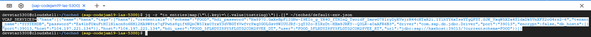

[DONE]
[ACCORDION-END]

[ACCORDION-BEGIN [Step 4: ](Create a Cloud Run deployment)]

Open a new tab and enter [https://console.cloud.google.com/run](https://console.cloud.google.com/run).

Click **Start using Cloud Run**.

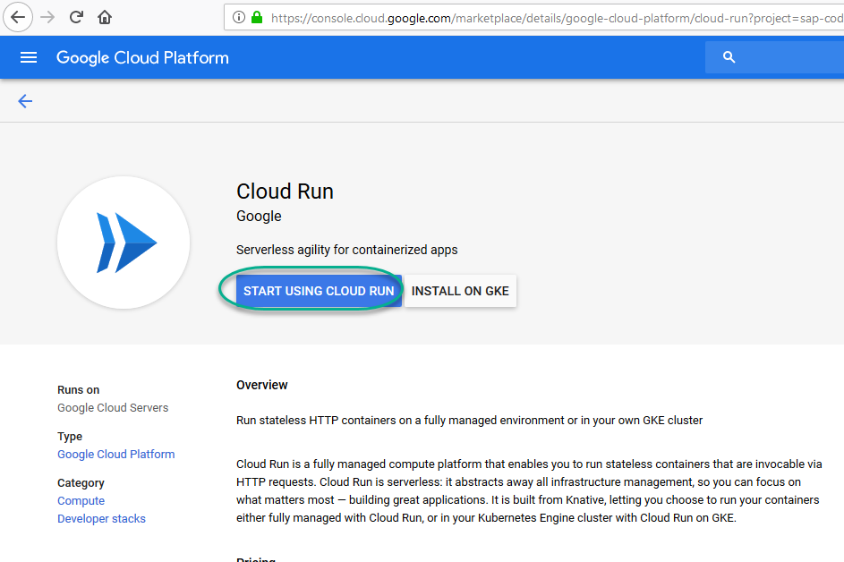

Click **Create Service**.

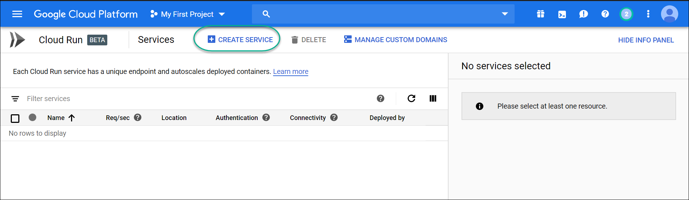

Choose **Select**.

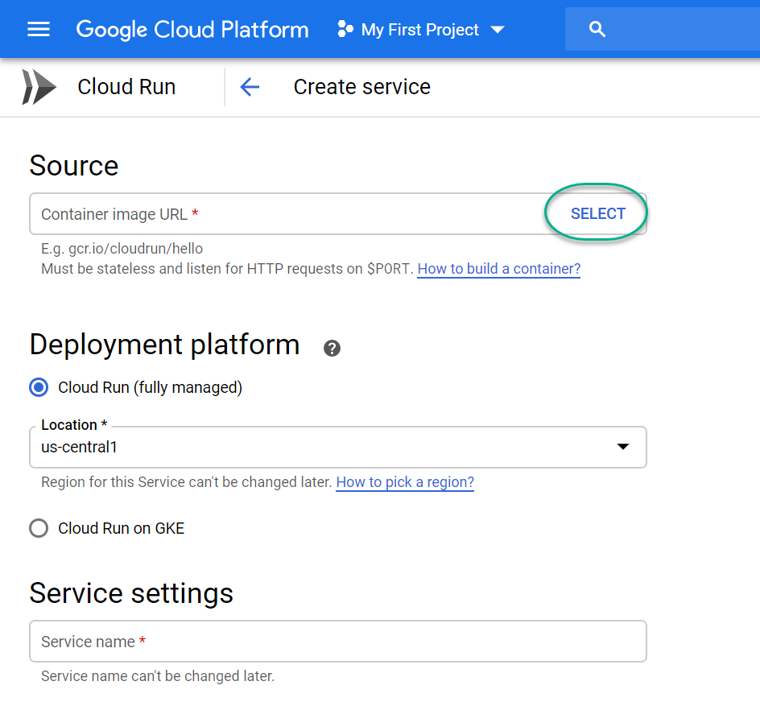

Expand the list and click on the latest registry image.


Flag **Allow unauthenticated invocations** and click **Show Optional Revision Settings**.

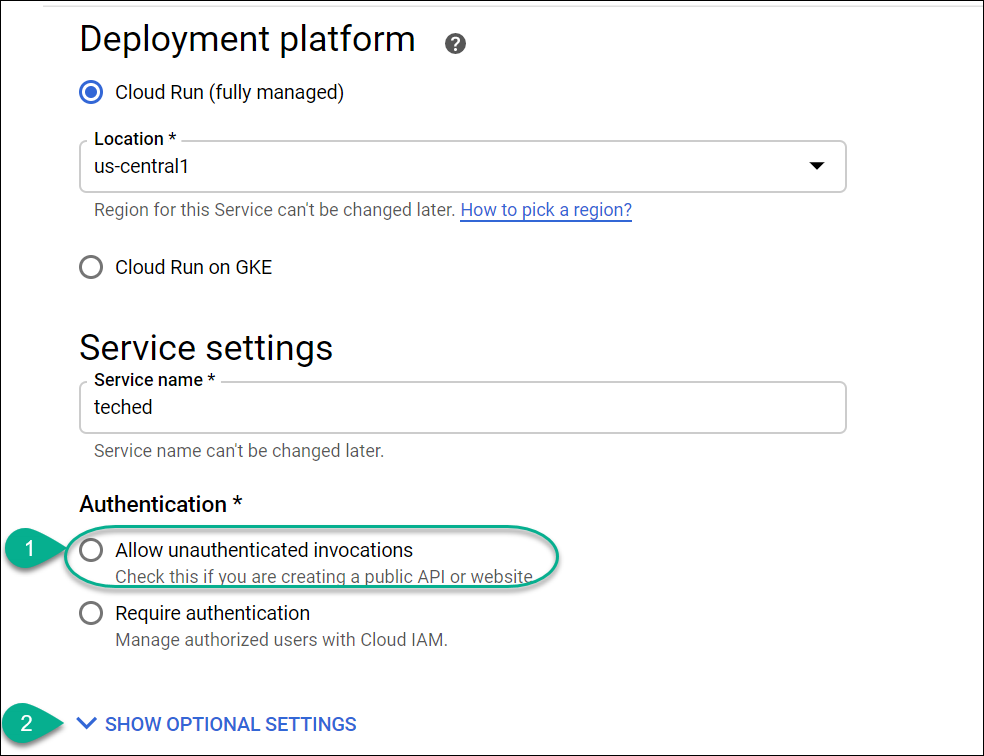

In the environment variable, add a variable called `VCAP_SERVICES` and use the content of the file `default-env.json` as a string from the previous step.

Do not copy the `VCAP_SERVICES=` assignment. You only need the value of the variable.

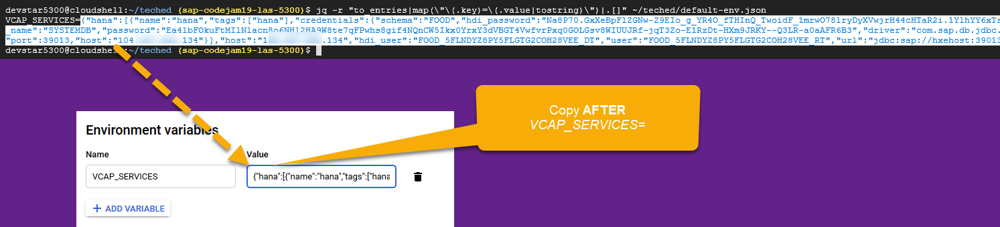

Scroll down and click **Create**

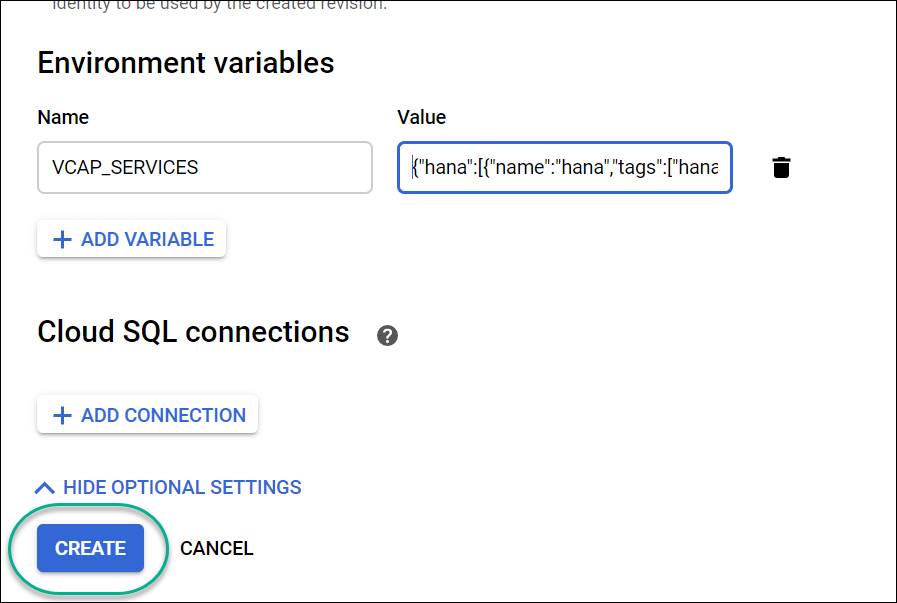


[DONE]
[ACCORDION-END]

[ACCORDION-BEGIN [Step 5: ](Test your service)]

Wait until deployment has finished and click on the URL.


Congratulations! Your cloud run deployment is up and running.

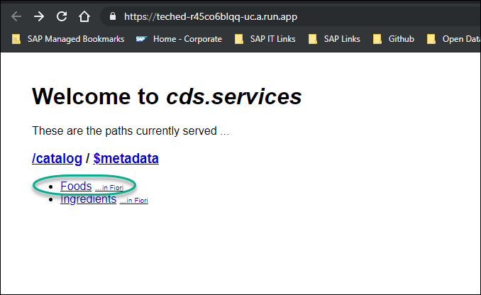

Click on the **Foods** service to complete the validation below.

[VALIDATE_1]
[ACCORDION-END]

---
