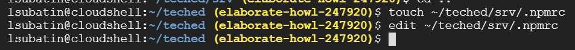
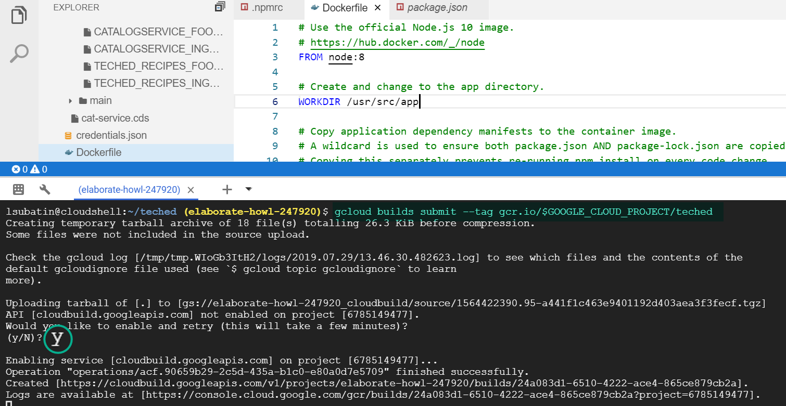
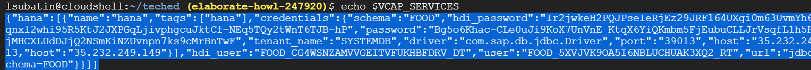
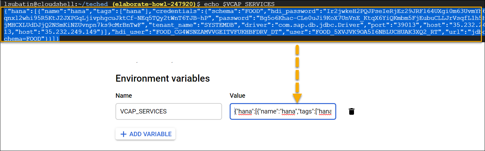

## Prerequisites
- These series of tutorials can be completed at the AppSpace at SAP TechEd.
- You have completed [the previous tutorial](teched-google-cloud-run-4)

## Details
### You will learn
  - How to create your own Docker image with your application
  - How to upload your image into the container registry

These tutorials are meant to be completed at the Developer Garage at SAP TechEd. The experts at the Google Cloud booth will provide you with an access to an account.

---

[ACCORDION-BEGIN [Step 1: ](Create NPM configuration file)]

Use the following two commands to create a file called `.npmrc` in the `srv` directory. This file is used by `NPM` for configuration.

```ssh
touch ~/teched/srv/.npmrc
edit ~/teched/srv/.npmrc
```



Paste the following line into the file:

```text
@sap:registry=https://npm.sap.com
```


Copy the `.npmrc` file to the root folder too with the following command:

```ssh
cp ./srv/.npmrc ~/teched
```


[DONE]
[ACCORDION-END]

[ACCORDION-BEGIN [Step 2: ](Create a Dockerfile)]

You will create a Docker image from a Node.js image using the application you created using the Cloud Application Programming model. This image will be uploaded into a repository and deployed into Cloud Run.

Create a Docker file using the following command:

```ssh
touch ~/teched/Dockerfile
edit ~/teched/Dockerfile
```

Insert the following contents into the `Dockerfile`

```text
# Use the official Node.js 8 image.
# https://hub.docker.com/_/node
FROM node:8

# Create and change to the app directory.
WORKDIR /usr/src/app

# Copy application dependency manifests to the container image.
# A wildcard is used to ensure both package.json AND package-lock.json are copied.
# Copying this separately prevents re-running npm install on every code change.
COPY /package*.json ./
COPY /srv/.npmrc .npmrc
COPY .npmrc ./

# Install dependencies.
RUN npm install

# Copy local code to the container image.
COPY . .

# Run the web service on container startup.
CMD [ "npm", "start" ]

```


[DONE]
[ACCORDION-END]


[ACCORDION-BEGIN [Step 3: ](Upload the image)]

Use the following command to create and upload a container image. Answer **y** if prompted to activate Cloud Run for your account.

```ssh
cd ~/teched
gcloud builds submit --tag gcr.io/$GOOGLE_CLOUD_PROJECT/teched
```

For example:



Make sure you see a **SUCCESS** message once the process is finished.


[DONE]
[ACCORDION-END]

[ACCORDION-BEGIN [Step 4: ](Retrieve the environment variable)]

Use the following command to get the `VCAP_SERVICES` environment variable.

```ssh
echo $VCAP_SERVICES
```
 **Leave this open**. You will need this result later.

 

[DONE]
[ACCORDION-END]

[ACCORDION-BEGIN [Step 4: ](Create a Cloud Run deployment)]

Open a new tab and enter [https://console.cloud.google.com/run](https://console.cloud.google.com/run).

Click **Create Service**.


Choose **Select**.


Expand the list and click on the latest registry image.


Flag **Allow unauthenticated invocations** and click **Show optimal settings**.


In the environment variable, add a variable called `VCAP_SERVICES` and use the content of the result from `echo $VCAP_SERVICES` in the cloud shell:



Scroll down and click **Create**


[DONE]
[ACCORDION-END]

[ACCORDION-BEGIN [Step 5: ](Test your service)]

Wait until deployment has finished and click on the URL.


Congratulations! Your cloud run deployment is up and running.


Click on the **Foods** service to complete the validation below.

[VALIDATE_1]
[ACCORDION-END]

---
