## Prerequisites
- These series of tutorials can be completed at the `AppSpace` at SAP TechEd.
- You have completed [the previous tutorial](teched-google-cloud-run-5)

## Details
### You will learn
  - How to authorize a community connector in Google Data Studio
  - How to create a simple chart using data in SAP HANA exposed through an OData service.

These tutorials are meant to be completed at the Developer Garage at SAP TechEd. The experts at the Google Cloud booth will provide you with an access to an account.

---

[ACCORDION-BEGIN [Step 1: ](Log in to Data Studio)]

The endpoint exposed by your deployment is now listing the services and the tables you created using Core Data and Services . You can now consume these APIs from a front end application, such as an SAP UI5 application. You will use Google Data Studio to consume these entries.

**In a new tab**, open [https://datastudio.google.com/overview](https://datastudio.google.com/overview)

Click on **Use it for free**.

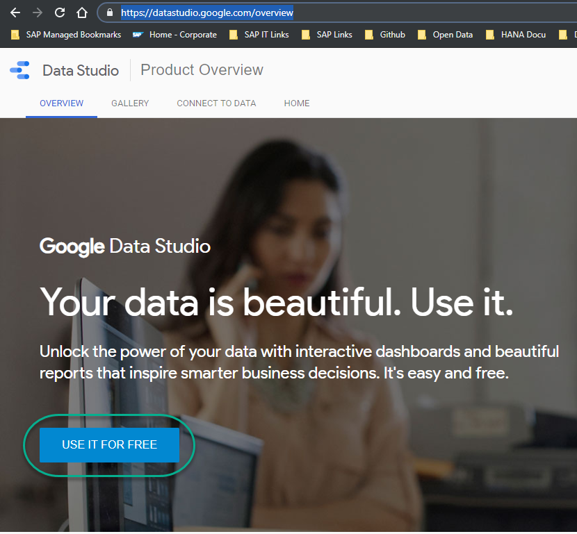

Click **Blank Report** tile.

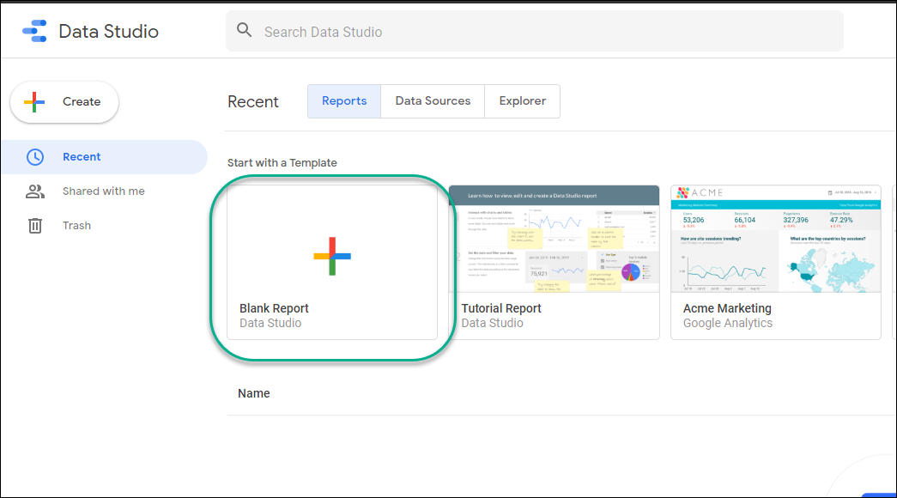

Click **Get Started**.

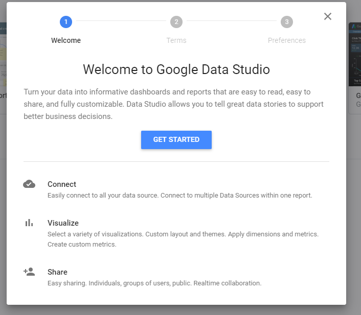

Accept the terms and conditions for the test account and continue until the end.

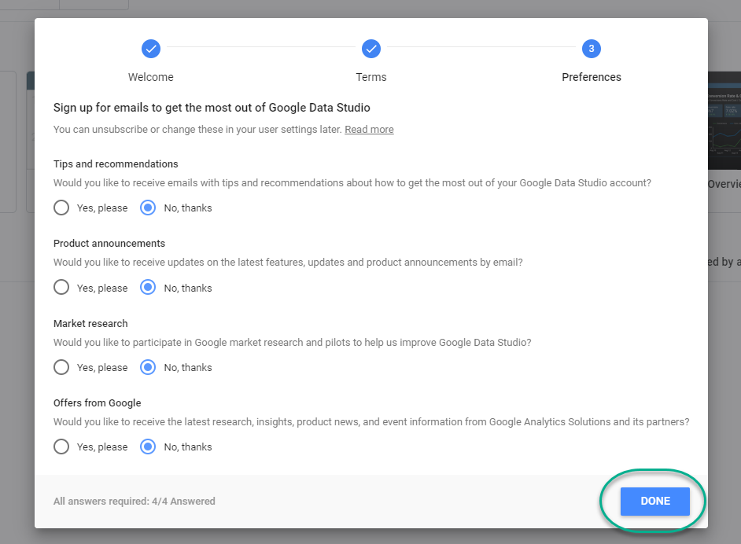

[DONE]
[ACCORDION-END]

[ACCORDION-BEGIN [Step 2: ](Authorize a community connector)]

Create a blank report.

Click **Create New Data Source** in **Add a data source** column to connect to your OData services.

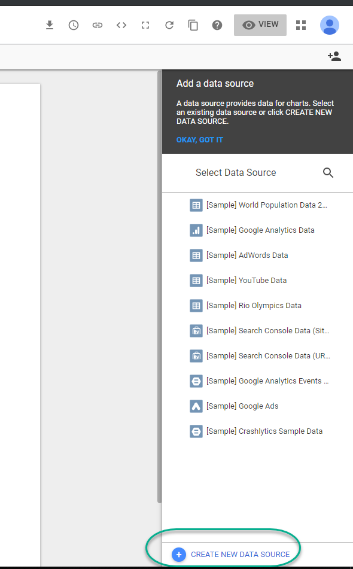

Search for `json` and choose **Custom JSON/CSV/XML** from the available partner connectors.

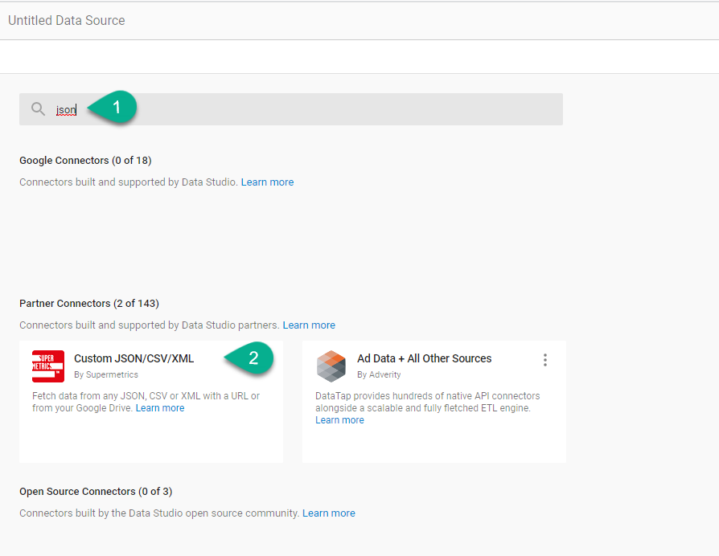

Click **Authorize**.

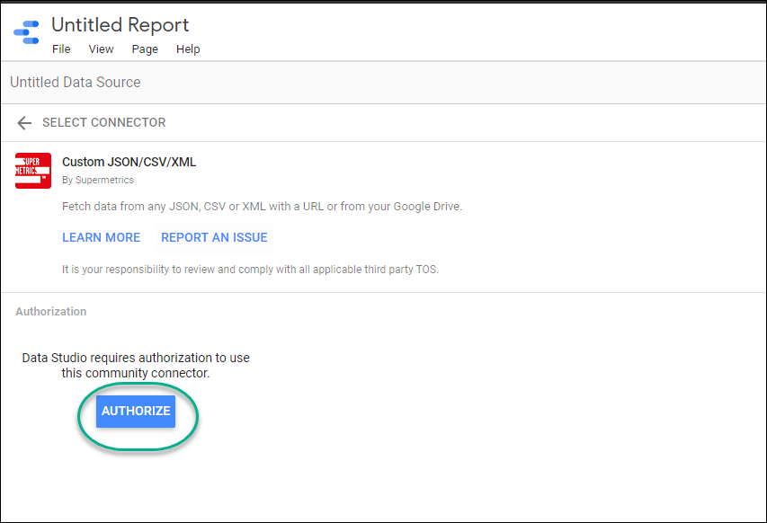

Choose your `devstar` account and click **Allow**.

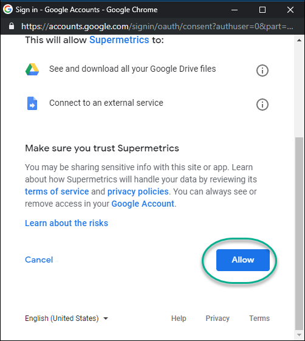

Authorize the connection to the data.

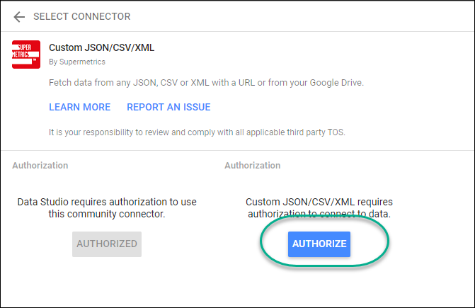

[DONE]
[ACCORDION-END]

[ACCORDION-BEGIN [Step 3: ](Connect to your application)]

Fetch the URL of the `Ingredients` service from your Cloud Run application.

Choose **`JSON`** as the data type and paste the URL of the service.

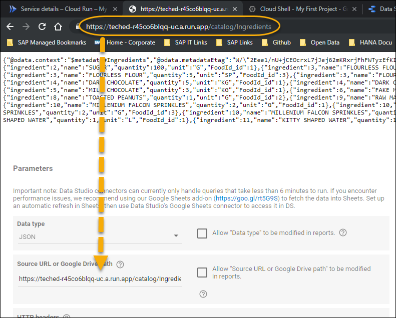

Click on **Connect**.

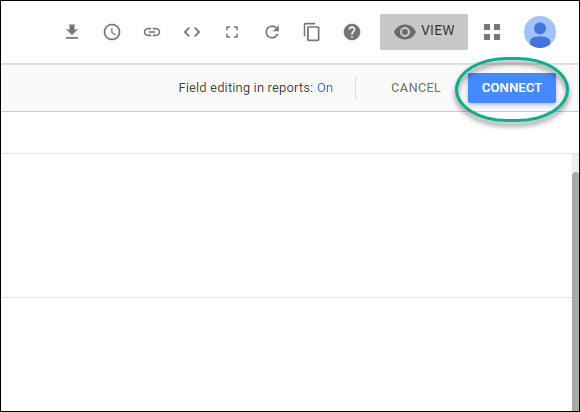

Click **Add to report**.

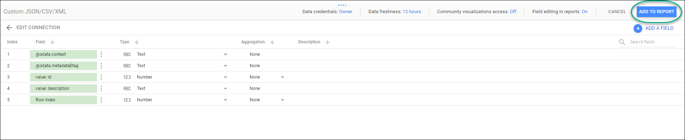

When prompted, confirm you want to add this data source to your report and **Allow** access to Data Studio.

[DONE]
[ACCORDION-END]

[ACCORDION-BEGIN [Step 4: ](Create a table)]

Click **Add a Chart** and choose a table.

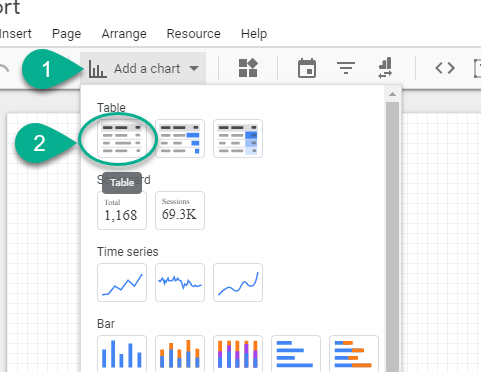

Remove the `context` dimension.

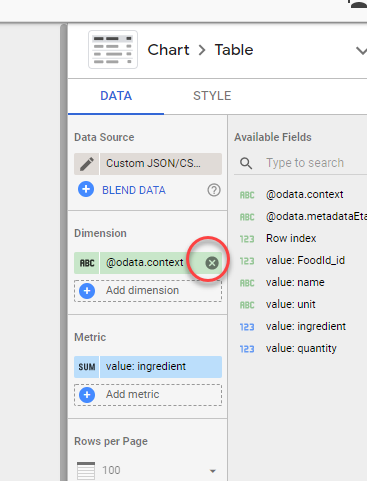

Click **Add a dimension** and choose **name**.

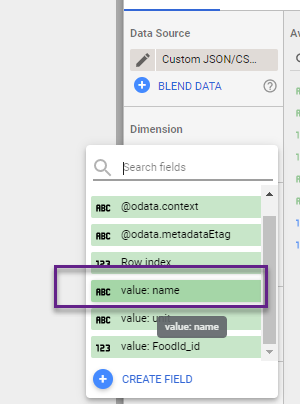

[VALIDATE_1]
[ACCORDION-END]

---
