### Prerequisites
- You can view the tutorials without an SAP ID, but you will be able to keep your progress and earn badges with one (and do this tutorial). If you don't have one, go to [Create your SAP Universal ID](https://account.sap.com/core/create).

## Details
### You will learn
  - How to search for tutorials
  - How to complete a tutorial
  - How to earn badges 😀

We want to give a very quick tour of SAP Tutorials.

Since you are already doing a tutorial -- this tutorial -- you already know some of the basics. Still, we'd like to review some things maybe you didn't know.

---

[ACCORDION-BEGIN [Step 1: ](Start to complete this tutorial)]

In every step of a tutorial, you have either a **Done** button or a question you have to answer. This let's you indicate that you have completed the step and to keep track of your progress.

In order to keep your progress, you must be logged into your SAP account. If the **Done** or **Submit Answer** button has a lock on it, then click it and you will be automatically logged in.

>You can also click the person icon at the top right of the page.

>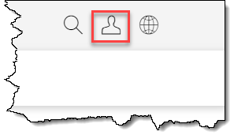

After clicking the button, it should look like this:

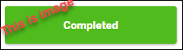

Below, in this step, click the **Done** button (if it is locked, once you are logged in, click it again).

[DONE]
[ACCORDION-END]

[ACCORDION-BEGIN [Step 2: ](Open the Tutorial Navigator)]

Go to <https://developers.sap.com/tutorial-navigator.html> to open the SAP Tutorial Navigator.

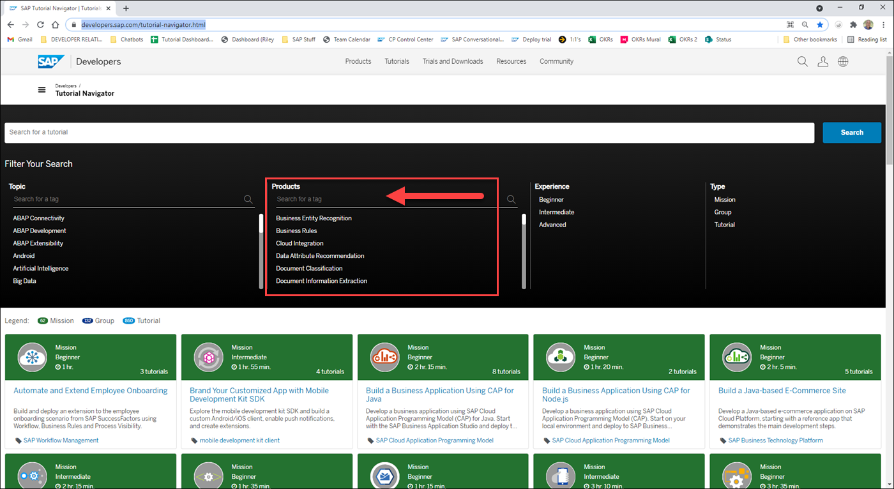

If you want to search for tutorials related to a particular product, select a filter under **Products**.

You can filter the filters by entering some text, for example, type in `AI` to find the filter for **SAP Conversational AI**.

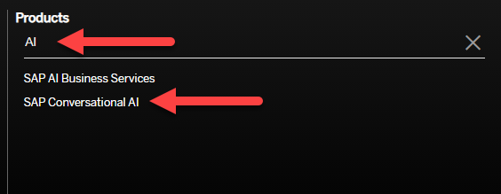

You can do the same for **Topics**, for such general categories like **Java** or **iOS**.

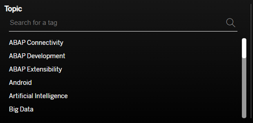

[DONE]
[ACCORDION-END]

[ACCORDION-BEGIN [Step 3: ](Search for a tutorial)]

Of course, you can do a free text search, which will match words in the title or description.

Search for a mission that matches `First Chatbot`

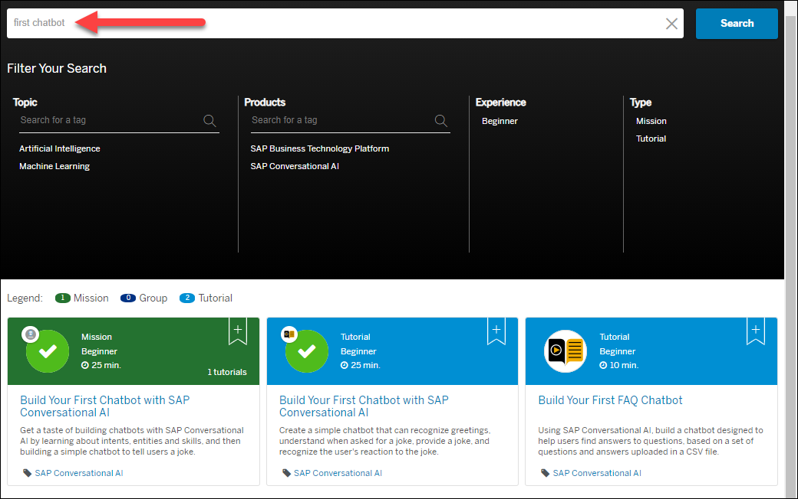

Note that you can further filter the results by the topic or product tags shown, for example, only tutorials related to machine learning.

[DONE]
[ACCORDION-END]

[ACCORDION-BEGIN [Step 4: ](Bookmark tutorials)]

You can bookmark tutorials so you can do them when you have time. Just click the **+** sign in the tile.

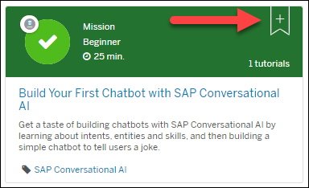

The bookmark icon turns white.

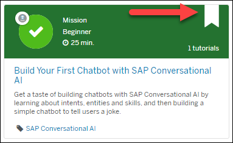

Now you can open another browser window to the [developers home page](https://developers.sap.com), and make sure you are logged in with your SAP ID (top right).  

Open the Bookmarks tab and you will see the new tutorial/mission bookmarks.

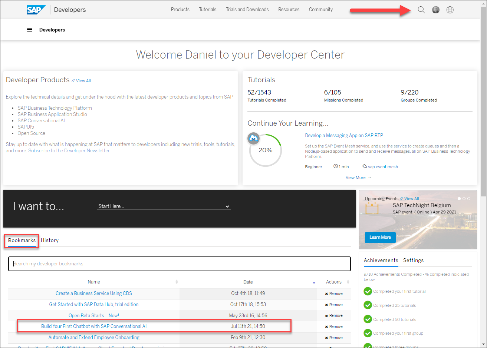

[DONE]
[ACCORDION-END]

[ACCORDION-BEGIN [Step 5: ](Open mission)]

Make sure you are back in the SAP Tutorial Navigator.

Click the tile called **Create Your First Chatbot with SAP Conversational AI**, which opens the mission page.

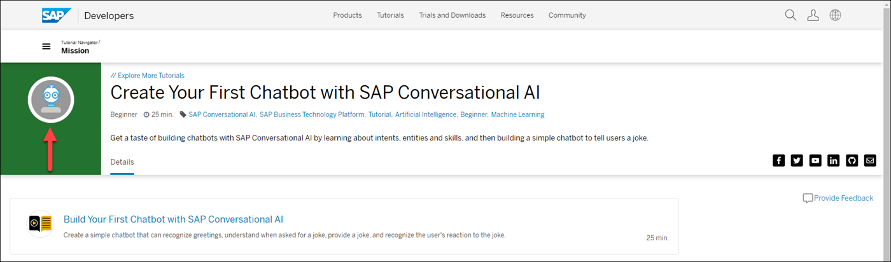

You now see the list of tutorials you must finish to complete this mission, in this case, just a single tutorial called **Build Your First Chatbot with SAP Conversational AI**.

You can also see, in the top-left corner, the badge you will earn if you complete the mission.

[DONE]
[ACCORDION-END]

[ACCORDION-BEGIN [Step 6: ](Open tutorial)]
Open the tutorial **Build Your First Chatbot with SAP Conversational AI**.

The top part of the tutorial is made up of the following:

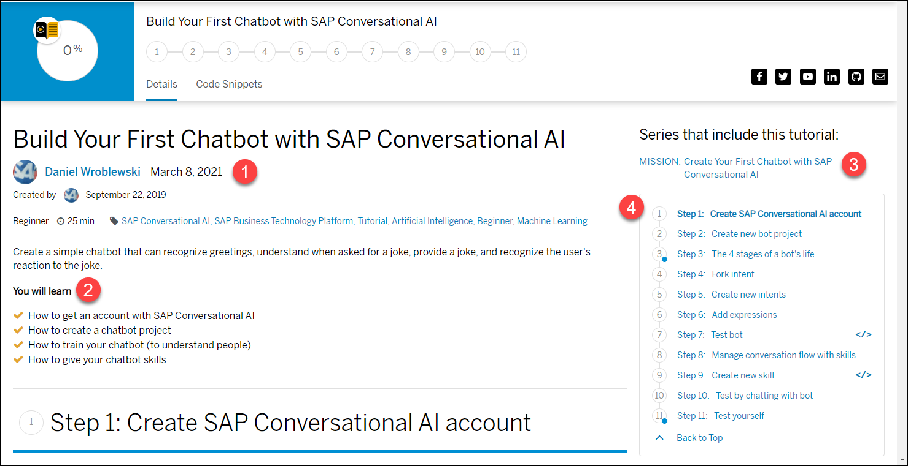

1. Basic information about the tutorial

    - Title
    - Description
    - Level
    - Time to complete
    - Who wrote it (with link to their GitHub account)

2. The main skills you will learn

3. The mission/group that contains this tutorial (and navigation buttons to the next and previous tutorials).

4. Links to the steps inside this tutorial, so you can quickly see what steps make up the tutorial.

    Steps with a small blue circle show steps that have a question for you to answer.

    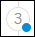

[DONE]
[ACCORDION-END]

[ACCORDION-BEGIN [Step 7: ](See your progress)]

While you are doing the tutorial, you can see your progress in a couple of ways.

If you have been clicking the buttons as you complete this tutorial until here, you will see:

- At the top, the percentage completion.

    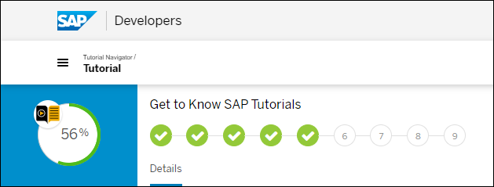

- At the top and the side, the steps that you have completed.

    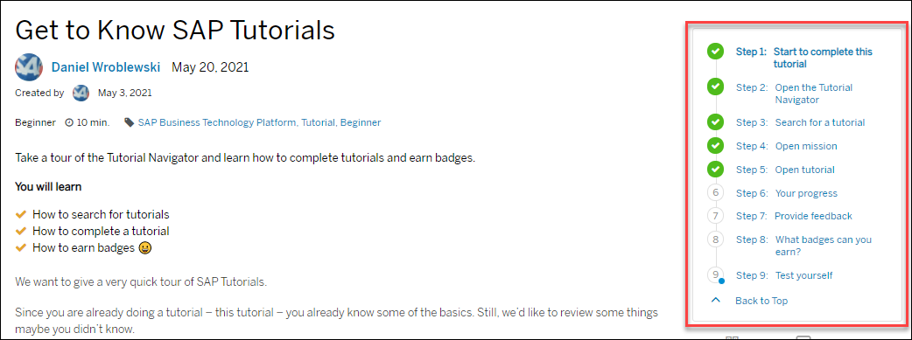

[DONE]
[ACCORDION-END]

[ACCORDION-BEGIN [Step 8: ](Provide feedback)]

While you are doing the tutorial, you have the option of providing feedback to:

- Get help doing a tutorial, by opening up a question in Answers in the SAP Community.

- Tell us how we can improve a tutorial, by opening up an issue in our GitHub repository.

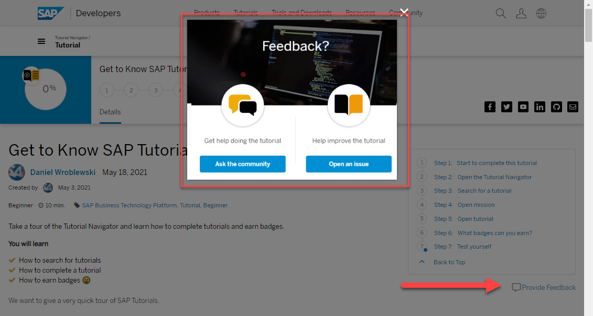

[DONE]
[ACCORDION-END]

[ACCORDION-BEGIN [Step 9: ](What badges can you earn?)]
Every mission in the Tutorial Navigator can earn you a badge. To see all the missions, open the [Tutorial Navigator](https://developers.sap.com/tutorial-navigator.html) and then filter by mission.

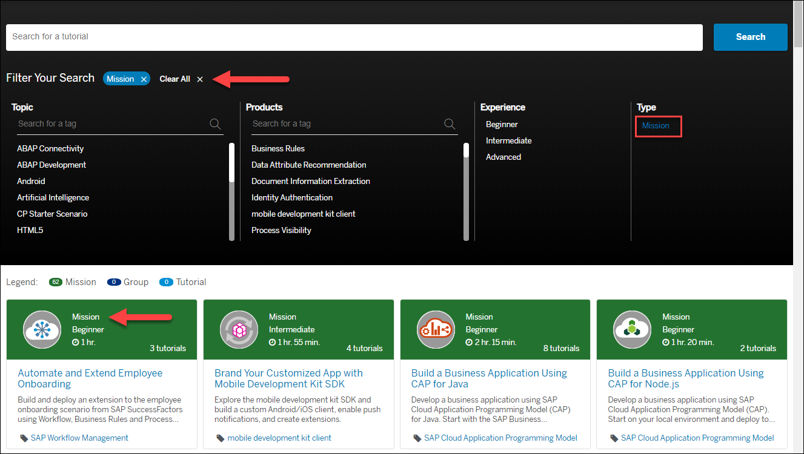

You can also see all available badges -- not just tutorials but also community missions -- on the [badges](https://community.sap.com/resources/missions-badges) page.

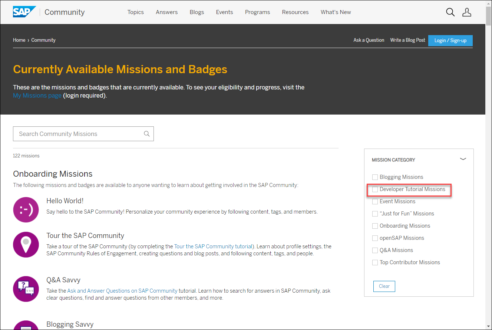

On the right of the badges page, you can filter the badges, including to see only tutorial-related badges.

The badges you earn appear in the **Earned Missions** tab of your [SAP profile](https://people.sap.com/#missions:earned).

[DONE]
[ACCORDION-END]

[ACCORDION-BEGIN [Step 10: ](Test yourself)]

Now that you toured the Tutorial Navigator, you can get credit for doing this tutorial by clicking all the **Done** buttons in the steps above, and answering the following question.

[VALIDATE_7]
[ACCORDION-END]

---

---
