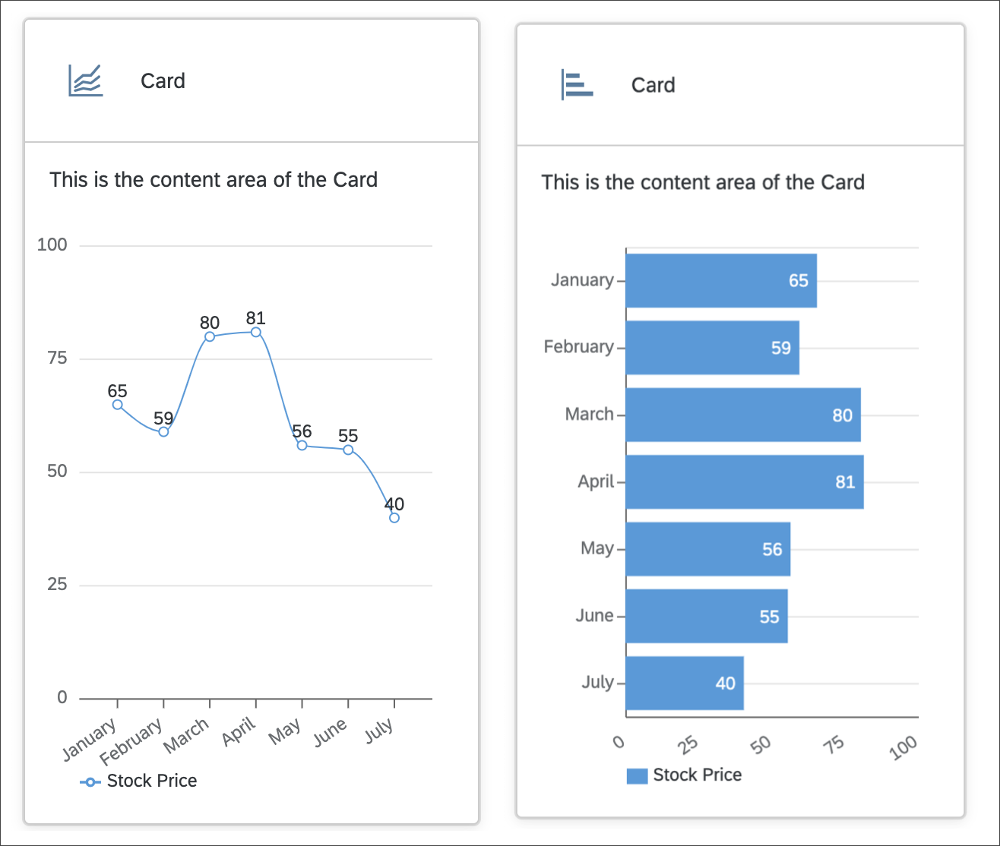

# Integrate Charts and Conditional Rendering
<!-- description --> Display data in charts using UI5 Web Components for React.

## You will learn
-  How to install and import charts
-  Learn about charts in UI5 web components
-  How to add dynamic rendering

## Intro
UI5 Web Components for React also comes with a chart library. In this tutorial, you will integrate two chart types and add data to them. Also you will learn how to conditionally render components, and how React handles updates to the DOM and single components.

---

### Install module and import charts

1. Install the chart library of UI5 Web Components for React.

    ```Shell
     npm install @ui5/webcomponents-react-charts
    ```

2. Then, import `LineChart` and `BarChart` into `MyApp.jsx`.

    ```JavaScript / JSX
    import { BarChart, LineChart } from "@ui5/webcomponents-react-charts";
    ```


### Add charts to Card component

1. Start with the `LineChart`. You can add it underneath the `Text` component. Then pass the `dimensions` and `measures` prop with an empty array as value.

    ```JavaScript / JSX
    <Text style={spacing.sapUiContentPadding}>
      This is the content area of the Card
    </Text>
    <LineChart measures={[]} dimensions={[]} />
    ```

    Now you should see a placeholder for the `LineChart` within the `Card` content. The reason for this is that the chart has not received any data and therefore the placeholder is displayed.

2. Add data to your component, since `data` is static you can define it outside of the component, right above your `MyApp` component.

    ```JavaScript / JSX
    const dataset = [
      {
        month: "January",
        data: 65
      },
      {
        month: "February",
        data: 59
      },
      {
        month: "March",
        data: 80
      },
      {
        month: "April",
        data: 81
      },
      {
        month: "May",
        data: 56
      },
      {
        month: "June",
        data: 55
      },
      {
        month: "July",
        data: 40
      }
    ];
    ```

3. Now add the `dataset` to your `LineChart` and configure the `dimensions` and `measures` props.

    ```JavaScript / JSX
    <LineChart
      dimensions={[{ accessor: "month" }]}
      measures={[{ accessor: "data", label: "Stock Price" }]}
      dataset={dataset}
    />
    ```

    Congratulation, you implemented your first Chart component.

    

4. Add a `BarChart` to the `Card`.

    We want the same data just with a different representation, therefore you can use the same props as you did with the `LineChart`.

    ```JavaScript / JSX
    <BarChart
      dimensions={[{ accessor: "month" }]}
      measures={[{ accessor: "data", label: "Stock Price" }]}
      dataset={dataset}
    />
    ```

    Two charts are rendered now with equal datasets but different representation.

Your `MyApp.jsx` component should look like this:

```JavaScript / JSX
import React from "react";
import { Card, CardHeader, Text } from "@ui5/webcomponents-react";
import { spacing } from "@ui5/webcomponents-react-base";
import { BarChart, LineChart } from "@ui5/webcomponents-react-charts";

const dataset = [
  {
    month: "January",
    data: 65
  },
  {
    month: "February",
    data: 59
  },
  {
    month: "March",
    data: 80
  },
  {
    month: "April",
    data: 81
  },
  {
    month: "May",
    data: 56
  },
  {
    month: "June",
    data: 55
  },
  {
    month: "July",
    data: 40
  }
];

export function MyApp() {
  const handleHeaderClick = () => {
    alert("Header clicked");
  };
  return (
    <div>
      <Card
        header={
          <CardHeader
            titleText="Card"
            interactive
            onClick={handleHeaderClick}
          />
        }
        style={{ width: "300px" }}
      >
        <Text style={spacing.sapUiContentPadding}>
          This is the content area of the Card
        </Text>
        <LineChart
          dimensions={[{ accessor: "month" }]}
          measures={[{ accessor: "data", label: "Stock Price" }]}
          dataset={dataset}
        />
        <BarChart
          dimensions={[{ accessor: "month" }]}
          measures={[{ accessor: "data", label: "Stock Price" }]}
          dataset={dataset}
        />
      </Card>
    </div>
  );
}
```  


### Add conditional rendering

Two charts in one `Card` is a bit too much, don't you think? It would be nicer if the charts could be toggled by clicking on the header. Let's implement that!

1. First add a state. It should control, which chart is going to be rendered. Use the [State Hook logic](https://reactjs.org/docs/hooks-state.html) to implement the state and set `"lineChart"` as default value. Don't forget to import `useState` from React, otherwise you will get an error.
    - Import the `useState` function in the header of the `MyApp.jsx` file (replace the current import of React).
    ```JavaScript / JSX
      import React, { useState } from "react";
    ```
    - Use the `useState` function in the right after you start to define the `MyApp` function (before the click handler).
    ```JavaScript / JSX
      const [toggleCharts, setToggleCharts] = useState("lineChart");
    ```

2. By clicking on the `CardHeader` the state should be set corresponding to the chart which should be displayed.

    Rewrite your `onClick` function so it will handle this logic.
    ```JavaScript / JSX
    const handleHeaderClick = () => {
      if (toggleCharts === "lineChart") {
        setToggleCharts("barChart");
      } else {
        setToggleCharts("lineChart");
      }
    };
    ```
3. To only render the current chart, add the following lines to the render of the component:
    ```JavaScript / JSX
    <Card
      header={
        <CardHeader
          titleText="Card"
          interactive
          onClick={handleHeaderClick}
        />
      }
      style={{ width: "300px" }}
    >
        <Text style={spacing.sapUiContentPadding}>
            This is the content area of the Card
        </Text>
        {toggleCharts === "lineChart" ? (
          <LineChart
            dimensions={[{ accessor: "month" }]}
            measures={[{ accessor: "data", label: "Stock Price" }]}
            dataset={dataset}
          />
        ) : (
          <BarChart
            dimensions={[{ accessor: "month" }]}
            measures={[{ accessor: "data" }]}
            dataset={dataset}
          />
        )}
    </Card>
    ```

    Done! Now you can toggle between charts by clicking on the header of the `Card`.

4. You can further improve your `CardHeader` component by using the `avatar` `prop` and adding an `Icon` to it.

    Add the following import to your component:
    ```JavaScript / JSX
    import { Card, CardHeader, Text, Icon } from "@ui5/webcomponents-react";
    ```

    Icons can be imported altogether (`import '@ui5/webcomponents-icons/dist/AllIcons.js';`), but to reduce bundle size and for better maintainability, it's recommended importing each icon on its own:

    ```JavaScript / JSX
    import lineChartIcon from '@ui5/webcomponents-icons/dist/line-chart.js';
    import barChartIcon from '@ui5/webcomponents-icons/dist/horizontal-bar-chart.js';
    ```

    The `Icons` should also be conditionally rendered. Luckily, this is easy:

    Add the `avatar` prop to the `CardHeader`, which receives an `Icon` as value:

    ```JavaScript / JSX
    <CardHeader
      ...
      avatar={<Icon name={lineChartIcon} />}
    />
    ```

    Then, change the `name` prop of the `Icon` to the following:
    ```JavaScript / JSX
    <CardHeader
       avatar={ <Icon name={ toggleCharts === "lineChart" ? lineChartIcon : barChartIcon } /> }
       ...
     />
    ```

    Here we go! Now the `Card` also changes the `Icon` by clicking on the header.

    


If something went wrong you can compare your component to this code snippet:
```JavaScript / JSX
import React, { useState } from "react";
import { Card, CardHeader, Text, Icon } from "@ui5/webcomponents-react";
import { spacing } from "@ui5/webcomponents-react-base";
import { BarChart, LineChart } from "@ui5/webcomponents-react-charts";
import lineChartIcon from "@ui5/webcomponents-icons/dist/line-chart.js";
import barChartIcon from "@ui5/webcomponents-icons/dist/horizontal-bar-chart.js";

const dataset = [
  {
    month: "January",
    data: 65,
  },
  {
    month: "February",
    data: 59,
  },
  {
    month: "March",
    data: 80,
  },
  {
    month: "April",
    data: 81,
  },
  {
    month: "May",
    data: 56,
  },
  {
    month: "June",
    data: 55,
  },
  {
    month: "July",
    data: 40,
  },
];

export function MyApp() {
  const [toggleCharts, setToggleCharts] = useState("lineChart");
  const handleHeaderClick = () => {
    if (toggleCharts === "lineChart") {
      setToggleCharts("barChart");
    } else {
      setToggleCharts("lineChart");
    }
  };
  return (
    <div>
      <Card
        header={
          <CardHeader
            titleText="Card"
            interactive
            onClick={handleHeaderClick}
            avatar={
              <Icon
                name={
                  toggleCharts === "lineChart" ? lineChartIcon : barChartIcon
                }
              />
            }
          />
        }
        style={{ width: "300px" }}
      >
        <Text style={spacing.sapUiContentPadding}>
          This is the content area of the Card
        </Text>
        {toggleCharts === "lineChart" ? (
          <LineChart
            dimensions={[{ accessor: "month" }]}
            measures={[{ accessor: "data", label: "Stock Price" }]}
            dataset={dataset}
          />
        ) : (
          <BarChart
            dimensions={[{ accessor: "month" }]}
            measures={[{ accessor: "data", label: "Stock Price" }]}
            dataset={dataset}
          />
        )}
      </Card>
    </div>
  );
}
```


### Update a component in React - Loading Indicator

One of the main advantages of React is how UI updates are handled. React will only re-render the component if the state of the component has changed. So it will not update the whole UI, but only the component that is affected by changes.

1. In order to demonstrate this behavior, add a new `state` (right after the definition of the previous state).

    ```JavaScript / JSX
      const [loading, setLoading] = useState(false);
    ```

2. Then edit your `handleHeaderClick` function like this:

    ```JavaScript / JSX
    const handleHeaderClick = () => {
        if (toggleCharts === "lineChart") {
          setLoading(true);
          setTimeout(() => {
            setLoading(false);
            setToggleCharts("barChart");
          }, 2000);
        } else {
          setLoading(true);
          setTimeout(() => {
            setLoading(false);
            setToggleCharts("lineChart");
          }, 2000);
        }
    };
    ```

3. Add `loading` to both of your charts.

    ```JavaScript / JSX
    <LineChart
      dimensions={[{ accessor: "month" }]}
      measures={[{ accessor: "data", label: "Stock Price" }]}
      dataset={dataset}
      loading={loading}
    />
    ```

    ```JavaScript / JSX
    <BarChart
      dimensions={[{ accessor: "month" }]}
      measures={[{ accessor: "data", label: "Stock Price" }]}
      dataset={dataset}
      loading={loading}
    />
    ```

This updates the component every time you switch between charts and simulates a data call.

As you can see, only the component affected by the `state` is updated, and the rest stays the same. If you're working with data, you most probably will need a loading indicator. All UI5 web components that are able to display data have a `loading` prop and therefore also a loading indicator.


### Add dynamic header and text

To make your `Card` look cleaner and to give the user the information that the header is clickable, you can add some logic to your component.

1. Add a dynamic content `Text`

    The content text is not really informative. Let's change that and display the type of the chart. Add the following constants to your component (after the event handler):

    ```JavaScript / JSX
    const contentTitle = toggleCharts === 'lineChart' ? 'Line Chart' : 'Bar Chart';
    const switchToChart = toggleCharts === 'lineChart' ? 'Bar Chart' : 'Line Chart';
    ```

2. Change the title and add a subtitle to your `Card`

    First change the value of `titleText` to something that explains the content of the `Card` (e.g., `"Stock Price"`).
    Then add a `subtitleText` prop. Here you can give the users the information that they can switch between charts by clicking the header.

    ```JavaScript / JSX
    <Card
      header={
        <CardHeader
          titleText="Stock Prices"
          subtitleText={`Click here to switch to ${switchToChart}`}
          interactive
          onClick={handleHeaderClick}
          avatar={
            <Icon
              name={
                toggleCharts === "lineChart" ? lineChartIcon : barChartIcon
              }
            />
          }
        />
      }
      style={{ width: "300px" }}
    >
      <Text style={spacing.sapUiContentPadding}>{contentTitle}</Text>
      {toggleCharts === "lineChart" ? (
        <LineChart
          dimensions={[{ accessor: "month" }]}
          measures={[{ accessor: "data", label: "Stock Price" }]}
          dataset={dataset}
          loading={loading}
        />
      ) : (
        <BarChart
          dimensions={[{ accessor: "month" }]}
          measures={[{ accessor: "data", label: "Stock Price" }]}
          dataset={dataset}
          loading={loading}
        />
      )}
    </Card>
    ```

---
