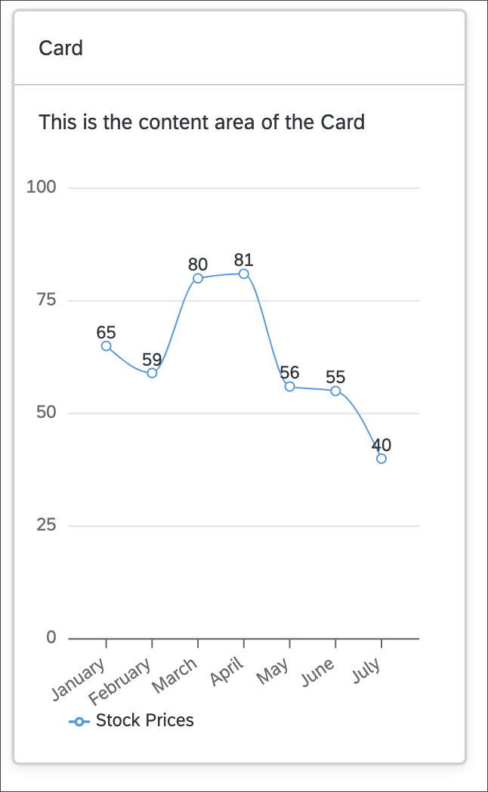

# Integrate Charts and Conditional Rendering
<!-- description --> Display data in charts using UI5 Web Components for React.

## You will learn
-  How to install and import charts
-  Learn about charts in UI5 Web Components for React
-  How to add dynamic rendering

## Intro
UI5 Web Components for React also comes with a chart library. In this tutorial, you will integrate two chart types and add data to them. Also, you will learn how to conditionally render components, and how React handles updates to the DOM and single components.

---

### Install module and import charts

1. Install the chart library of UI5 Web Components for React.

    ```Shell
     npm install @ui5/webcomponents-react-charts
    ```

    > **Note:**
    When facing issues with installing, please ensure you're using the same [minor version](https://semver.org/#summary) as the other `@ui5/webcomponents...` packages.

2. Then, import `LineChart` and `BarChart` into `MyApp.tsx`.

    ```TypeScript / TSX
    import { BarChart, LineChart } from "@ui5/webcomponents-react-charts";
    ```


### Add charts to Card component

_Charts only offer limited accessibility support with only basic built-in features, so it’s essential to ensure your implementation meets the accessibility standards of your application!_

1. Start with the `LineChart`. You can add it underneath the `Text` component. Then pass the `dimensions` and `measures` prop with an empty array as value.

    ```TypeScript / TSX
     <Text style={{ padding: "var(--sapContent_Space_S)" }}>
       This is the content area of the Card
     </Text>
     <LineChart measures={[]} dimensions={[]} />
    ```

    Now you should see a placeholder for the `LineChart` within the `Card` content. The reason for this is that the chart has not received any data and therefore the placeholder is displayed.

2. Add data to your component. Since `data` is static you can define it outside the component, right above your `MyApp` component.

    ```TypeScript / TSX
    const dataset = [
      {
        month: "January",
        data: 65
      },
      {
        month: "February",
        data: 59
      },
      {
        month: "March",
        data: 80
      },
      {
        month: "April",
        data: 81
      },
      {
        month: "May",
        data: 56
      },
      {
        month: "June",
        data: 55
      },
      {
        month: "July",
        data: 40
      }
    ];
    ```

3. Now add the `dataset` to your `LineChart` and configure the `dimensions` and `measures` props.

    ```TypeScript / TSX
     <LineChart
       dimensions={[{ accessor: "month" }]}
       measures={[{ accessor: "data", label: "Price" }]}
       dataset={dataset}
     />
    ```

    Congratulation, you implemented your first Chart component.

    

4. Add a `BarChart` to the `Card`.

    We want the same data just with a different representation, therefore you can use the same props as you did with the `LineChart`.

    ```TypeScript / TSX
    <BarChart
       dimensions={[{ accessor: "month" }]}
       measures={[{ accessor: "data", label: "Price" }]}
       dataset={dataset}
    />
    ```

    Two charts are rendered now with equal datasets but different representation.

Your `MyApp.tsx` component should look like this:

```TypeScript / TSX
import { Card, CardHeader, Text } from "@ui5/webcomponents-react";
import { BarChart, LineChart } from "@ui5/webcomponents-react-charts";

const dataset = [
  {
    month: "January",
    data: 65,
  },
  {
    month: "February",
    data: 59,
  },
  {
    month: "March",
    data: 80,
  },
  {
    month: "April",
    data: 81,
  },
  {
    month: "May",
    data: 56,
  },
  {
    month: "June",
    data: 55,
  },
  {
    month: "July",
    data: 40,
  },
];

export function MyApp() {
  const handleHeaderClick = () => {
    alert("Header clicked");
  };
  return (
    <div>
      <Card
        header={
          <CardHeader
            titleText="Card"
            interactive
            onClick={handleHeaderClick}
          />
        }
        style={{ width: "300px" }}
      >
        <Text style={{ padding: "var(--sapContent_Space_S)" }}>
          This is the content area of the Card
        </Text>
        <LineChart
          dimensions={[{ accessor: "month" }]}
          measures={[{ accessor: "data", label: "Price" }]}
          dataset={dataset}
        />
        <BarChart
          dimensions={[{ accessor: "month" }]}
          measures={[{ accessor: "data", label: "Price" }]}
          dataset={dataset}
        />
      </Card>
    </div>
  );
}
```


### Add conditional rendering

Two charts in one `Card` is a bit too much, don't you think? It would be nicer if the charts could be toggled by clicking on the header. Let's implement that!

1. First add a state. It should control, which chart is going to be rendered. Use the [State Hook logic](https://react.dev/reference/react/useState) to implement the state and set `"lineChart"` as default value. Don't forget to import `useState` from React, otherwise you will get an error.
    - Import the `useState` function in the header of the `MyApp.tsx` file.
    ```TypeScript / TSX
      import { useState } from "react";
    ```
    - Use the `useState` function in the right after you start to define the `MyApp` function (before the click handler).
    ```TypeScript / TSX
      const [toggleCharts, setToggleCharts] = useState("lineChart");
    ```

2. By clicking on the `CardHeader` the state should be set corresponding to the chart which should be displayed.

    Rewrite your `onClick` function so it will handle this logic.
    ```TypeScript / TSX
    const handleHeaderClick = () => {
      if (toggleCharts === "lineChart") {
        setToggleCharts("barChart");
      } else {
        setToggleCharts("lineChart");
      }
    };
    ```
3. To only render the current chart, add the following lines to the render of the component:
    ```TypeScript / TSX
    <Card
      header={
        <CardHeader
          titleText="Card"
          interactive
          onClick={handleHeaderClick}
        />
      }
      style={{ width: "300px" }}
    >
        <Text style={spacing.sapUiContentPadding}>
            This is the content area of the Card
        </Text>
        {toggleCharts === "lineChart" ? (
          <LineChart
            dimensions={[{ accessor: "month" }]}
            measures={[{ accessor: "data", label: "Price" }]}
            dataset={dataset}
          />
        ) : (
          <BarChart
            dimensions={[{ accessor: "month" }]}
            measures={[{ accessor: "data", label: "Price" }]}
            dataset={dataset}
          />
        )}
    </Card>
    ```

    Done! Now you can toggle between charts by clicking on the header of the `Card`.

4. You can further improve your `CardHeader` component by using the `avatar` `prop` and adding an `Icon` to it.

    Add the following import to your component:
    ```TypeScript / TSX
    import { Card, CardHeader, Text, Icon } from "@ui5/webcomponents-react";
    ```

    Icons can be imported altogether (`import '@ui5/webcomponents-icons/dist/AllIcons.js';`), but to reduce bundle size and for better maintainability, it's recommended importing each icon on its own:

    ```TypeScript / TSX
    import lineChartIcon from '@ui5/webcomponents-icons/dist/line-chart.js';
    import barChartIcon from '@ui5/webcomponents-icons/dist/horizontal-bar-chart.js';
    ```

    The `Icons` should also be conditionally rendered. Luckily, this is easy:

    Add the `avatar` prop to the `CardHeader`, which receives an `Icon` as value:

    ```TypeScript / TSX
    <CardHeader
      ...
      avatar={<Icon name={lineChartIcon} />}
    />
    ```

    Then, change the `name` prop of the `Icon` to the following:
    ```TypeScript / TSX
    <CardHeader
       avatar={ <Icon name={ toggleCharts === "lineChart" ? lineChartIcon : barChartIcon } /> }
       ...
     />
    ```

    Here we go! Now the `Card` also changes the `Icon` by clicking on the header.

    


If something went wrong you can compare your component to this code snippet:
```TypeScript / TSX
import lineChartIcon from "@ui5/webcomponents-icons/dist/line-chart.js";
import barChartIcon from "@ui5/webcomponents-icons/dist/horizontal-bar-chart.js";
import { useState } from "react";
import { Card, CardHeader, Text, Icon } from "@ui5/webcomponents-react";
import { BarChart, LineChart } from "@ui5/webcomponents-react-charts";

const dataset = [
  {
    month: "January",
    data: 65,
  },
  {
    month: "February",
    data: 59,
  },
  {
    month: "March",
    data: 80,
  },
  {
    month: "April",
    data: 81,
  },
  {
    month: "May",
    data: 56,
  },
  {
    month: "June",
    data: 55,
  },
  {
    month: "July",
    data: 40,
  },
];

export function MyApp() {
  const [toggleCharts, setToggleCharts] = useState("lineChart");
  const [loading, setLoading] = useState(false);

  const handleHeaderClick = () => {
    if (toggleCharts === "lineChart") {
      setLoading(true);
      setTimeout(() => {
        setLoading(false);
        setToggleCharts("barChart");
      }, 2000);
    } else {
      setLoading(true);
      setTimeout(() => {
        setLoading(false);
        setToggleCharts("lineChart");
      }, 2000);
    }
  };

  return (
    <div>
      <Card
        header={
          <CardHeader
            titleText="Card"
            interactive
            avatar={
              <Icon
                name={
                  toggleCharts === "lineChart" ? lineChartIcon : barChartIcon
                }
              />
            }
            onClick={handleHeaderClick}
          />
        }
        style={{ width: "300px" }}
      >
        <Text style={{ padding: "var(--sapContent_Space_S)" }}>
          This is the content area of the Card
        </Text>
        {toggleCharts === "lineChart" ? (
          <LineChart
            dimensions={[{ accessor: "month" }]}
            measures={[{ accessor: "data", label: "Price" }]}
            dataset={dataset}
          />
        ) : (
          <BarChart
            dimensions={[{ accessor: "month" }]}
            measures={[{ accessor: "data", label: "Price" }]}
            dataset={dataset}
          />
        )}
      </Card>
    </div>
  );
}
```


### Update a component in React - Loading Indicator

One of React's main advantages is its efficient rendering mechanism: a component re-renders only when its state changes or when it receives new props from its parent. So it will not update the whole UI, but only components affected by changes.

1. In order to demonstrate this behavior, add a new `state` (right after the definition of the previous state).

    ```TypeScript / TSX
      const [loading, setLoading] = useState(false);
    ```

2. Then edit your `handleHeaderClick` function like this:

    ```TypeScript / TSX
    const handleHeaderClick = () => {
        if (toggleCharts === "lineChart") {
          setLoading(true);
          setTimeout(() => {
            setLoading(false);
            setToggleCharts("barChart");
          }, 2000);
        } else {
          setLoading(true);
          setTimeout(() => {
            setLoading(false);
            setToggleCharts("lineChart");
          }, 2000);
        }
    };
    ```

3. Add `loading` to both of your charts.

    ```TypeScript / TSX
    <LineChart
      dimensions={[{ accessor: "month" }]}
      measures={[{ accessor: "data", label: "Price" }]}
      dataset={dataset}
      loading={loading}
    />
    ```

    ```TypeScript / TSX
    <BarChart
      dimensions={[{ accessor: "month" }]}
      measures={[{ accessor: "data", label: "Price" }]}
      dataset={dataset}
      loading={loading}
    />
    ```

This updates the component every time you switch between charts and simulates a data call.

As you can see, only the component affected by the `state` is updated, and the rest stays the same. If you're working with data, you most probably will need a loading indicator. All UI5 web components that are able to display data have a `loading` prop and therefore also a loading indicator.


### Add dynamic header and text

To make your `Card` look cleaner and to give the user the information that the header is clickable, you can add some more logic to your component.

1. Add a dynamic content `Text`

    The content text is not really informative. Let's change that and display the type of the chart. Add the following constants to your component (e.g. after the state definitions):

    ```TypeScript / TSX
    const contentTitle = toggleCharts === 'lineChart' ? 'Line Chart' : 'Bar Chart';
    const switchToChart = toggleCharts === 'lineChart' ? 'Bar Chart' : 'Line Chart';
    ```

2. Change the title and add a subtitle to your `Card`

    First change the value of `titleText` to something that explains the content of the `Card` (e.g., `"Prices"`).
    Then add a `subtitleText` prop. Here you can give the users the information that they can switch between charts by clicking the header.

    ```TypeScript / TSX
      <Card
        header={
          <CardHeader
            titleText="Prices"
            subtitleText={`Click here to switch to ${switchToChart}`}
            interactive
            avatar={
              <Icon
                name={
                  toggleCharts === "lineChart" ? lineChartIcon : barChartIcon
                }
              />
            }
            onClick={handleHeaderClick}
          />
        }
        style={{ width: "300px" }}
      >
        <Text style={{ padding: "var(--sapContent_Space_S)" }}>
          {contentTitle}
        </Text>
        {toggleCharts === "lineChart" ? (
          <LineChart
            dimensions={[{ accessor: "month" }]}
            measures={[{ accessor: "data", label: "Price" }]}
            dataset={dataset}
            loading={loading}
          />
        ) : (
          <BarChart
            dimensions={[{ accessor: "month" }]}
            measures={[{ accessor: "data", label: "Price" }]}
            dataset={dataset}
            loading={loading}
          />
        )}
      </Card>
    ```
3. Add accessibility attributes to the `Icon`

    If the `header` alone does not sufficiently describe the currently visible `Icon`, you can define an `accessibleName`. Its value will be applied as the `aria-label` of the internal element, which screen readers will pick up.
    In case the `header` already explains the content and the icon is purely decorative, you can set its `mode` to `"Decorative"`, so it will be ignored by screen readers.
    
    ```
      <Icon
        name={
          toggleCharts === "lineChart" ? lineChartIcon : barChartIcon
        }
        accessibleName={contentTitle}
      />
    ```
---
