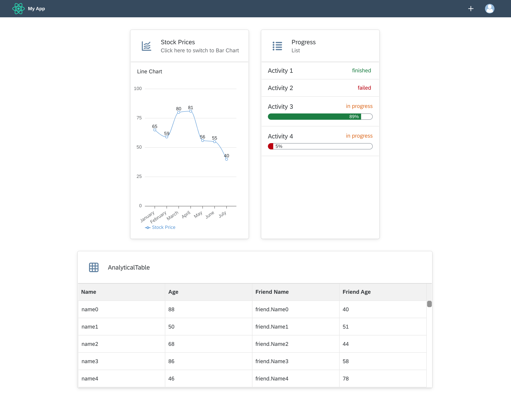

## Details
### You will learn
-  How to use the `ShellBar` component
-  How to use the `AnalyticalTable` component
-  How to style components

So far, you have built your first `Card` component. Now to take things further, it's time to build something bigger. In this step, you will learn how different components work together by building an analytical dashboard.

---

[ACCORDION-BEGIN [Step 1: ](Add necessary imports)]
To make things easier, first import all the components you will need in this step. Just copy the code below and replace the previous imported components in `MyApp.jsx`.

```JavaScript / JSX
import {
  Avatar,
  Card,
  Text,
  ShellBar,
  ShellBarItem,
  List,
  StandardListItem,
  ValueState,
  ProgressIndicator,
  Title,
  TitleLevel,
  FlexBox,
  FlexBoxJustifyContent,
  FlexBoxWrap,
  FlexBoxDirection,
  AnalyticalTable,
  Icon
} from "@ui5/webcomponents-react";
```

[DONE]
[ACCORDION-END]

[ACCORDION-BEGIN [Step 2: ](Add a ShellBar)]

The `ShellBar` is the central navigation element in your Web Application and should therefore be visible on all pages.

> Again, you can try it out on the [Storybook](https://sap.github.io/ui5-webcomponents-react/?path=/story/ui5-web-components-shellbar--generated-default-story).

1. Start with adding the `ShellBar` above your `Card` component and add a `primaryTitle` prop.

    ```JavaScript / JSX
    <ShellBar primaryTitle="My App" />
    ```

2. Add some more properties

    The logo of the application should be displayed and also a profile picture would be nice.

    Use the `logo` and `profile` prop to achieve this. The `logo` prop accepts either an `img` tag or the `Avatar` component, the `profile` prop only accepts the `Avatar` component. First add the `logo` prop like this:

    ```JavaScript / JSX
     <ShellBar logo={} primaryTitle="My App" />
    ```

    Then pass the `profile` prop like this:

    ```JavaScript / JSX
    <ShellBar
      logo={}
      profile={<Avatar image="" />}
      primaryTitle="My App"
    />
    ```

    You can use your own image, use an URL to an image or simply download the images below and add them to your `public` folder in your project.

    [`reactLogo.png`](https://github.com/SAPDocuments/Tutorials/raw/master/tutorials/ui5-webcomponents-react-dashboard/reactLogo.png)

    [`profilePictureExample.png`](https://github.com/SAPDocuments/Tutorials/raw/master/tutorials/ui5-webcomponents-react-dashboard/profilePictureExample.png)

    ```JavaScript / JSX
    <ShellBar
      logo={}
      profile={<Avatar image="profilePictureExample.png" />}
      primaryTitle={"My App"}  
    />
    ```

3. Add custom elements

    By passing a `ShellBarItem` as `child` you are able to add custom elements to your `ShellBar`. The element is basically a `Button` with responsive behavior and styling adapted to the `ShellBar`.

    ```JavaScript / JSX
    <ShellBar
      logo={}
      profile={<Avatar image="profilePictureExample.png" />}
      primaryTitle={"My App"}>
       <ShellBarItem icon="add" text="Add" />
    </ShellBar>
    ```

    That is strange -- when you render your component, the `ShellBarItem` is not shown.

    Every `Icon` that is used in a component has to be imported manually. All available icons can be found [here](https://sapui5.hana.ondemand.com/test-resources/sap/m/demokit/iconExplorer/webapp/index.html#/overview/SAP-icons).

    Add this line to your imports:

    ```JavaScript / JSX
    import "@ui5/webcomponents-icons/dist/add.js";
    ```

    Now your `ShellBarItem` shows up at the right side of the `ShellBar`.

    

Your component should look like this:

```JavaScript / JSX
import React, { useState } from "react";
import {
  Avatar,
  Card,
  Text,
  ShellBar,
  ShellBarItem,
  List,
  StandardListItem,
  ValueState,
  ProgressIndicator,
  Title,
  TitleLevel,
  FlexBox,
  FlexBoxJustifyContent,
  FlexBoxWrap,
  FlexBoxDirection,
  AnalyticalTable,
  Icon
} from "@ui5/webcomponents-react";
import { spacing } from "@ui5/webcomponents-react-base";
import { BarChart, LineChart } from "@ui5/webcomponents-react-charts";
import "@ui5/webcomponents-icons/dist/line-chart.js";
import "@ui5/webcomponents-icons/dist/horizontal-bar-chart.js";
import "@ui5/webcomponents-icons/dist/add.js";
import "@ui5/webcomponents-icons/dist/list.js";
import "@ui5/webcomponents-icons/dist/table-view.js";

export function MyApp() {
  const [toggleCharts, setToggleCharts] = useState("lineChart");
  const [loading, setLoading] = useState(false);
  const contentTitle =
    toggleCharts === "lineChart" ? "Line Chart" : "Bar Chart";
  const switchToChart =
    toggleCharts === "lineChart" ? "Bar Chart" : "Line Chart";

  const handleHeaderClick = () => {
    if (toggleCharts === "lineChart") {
      setLoading(true);
      setTimeout(() => {
        setLoading(false);
        setToggleCharts("barChart");
      }, 2000);
    } else {
      setLoading(true);
      setTimeout(() => {
        setLoading(false);
        setToggleCharts("lineChart");
      }, 2000);
    }
  };
  const dataset = [
    {
      month: "January",
      data: 65
    },
    {
      month: "February",
      data: 59
    },
    {
      month: "March",
      data: 80
    },
    {
      month: "April",
      data: 81
    },
    {
      month: "May",
      data: 56
    },
    {
      month: "June",
      data: 55
    },
    {
      month: "July",
      data: 40
    }
  ];
  return (
    <div>
      <ShellBar
        logo={}
        profile={<Avatar image="profilePictureExample.png" />}
        primaryTitle="My App"
      >
        <ShellBarItem icon="add" text="Add" />
      </ShellBar>
        <Card
          avatar={
            <Icon
              name={
                toggleCharts === "lineChart"
                  ? "line-chart"
                  : "horizontal-bar-chart"
              }
            />
          }
          heading="Stock Price"
          style={{ width: "300px" }}
          headerInteractive
          onHeaderClick={handleHeaderClick}
          subheading={`Click here to switch to ${switchToChart}`}
        >
          <Text style={spacing.sapUiContentPadding}>{contentTitle}</Text>
          {toggleCharts === "lineChart" ? (
            <LineChart
              dimensions={[{ accessor: "month" }]}
              measures={[{ accessor: "data", label: "Stock Price" }]}
              dataset={dataset}
              loading={loading}
            />
          ) : (
            <BarChart
              dimensions={[{ accessor: "month" }]}
              measures={[{ accessor: "data", label: "Stock Price" }]}
              dataset={dataset}
              loading={loading}
            />
          )}
        </Card>
    </div>
  );
}
```

[DONE]
[ACCORDION-END]
[ACCORDION-BEGIN [Step 3: ](Add a List)]

1. To wrap the `List` add a `Card` (right after the first one).

    ```JavaScript / JSX
    <Card
        heading="Progress"
        subheading="List"
        style={{ width: "300px" }}
        avatar={<Icon name="list" />}
    >
    </Card>
    ```

2. Add the list `Icon` to your imports.

    ```JavaScript / JSX
    import "@ui5/webcomponents-icons/dist/list.js";
    ```

3. Add the `List` component as child of the `Card`.

    ```JavaScript / JSX
    <List></List>
    ```

4. To render elements of the list, use the `StandardListItem` and pass a `string` as child.

    ```JavaScript / JSX
     <List>
       <StandardListItem>Activity 1</StandardListItem>
     </List>
    ```

5. The user should know the status of the activities. Add the `info` prop to the `StandardListItem`. To visualize if the status is neutral, positive or negative, also add the `infoState` prop.

    ```JavaScript / JSX
     <StandardListItem info="finished" infoState={ValueState.Success}>
       Activity 1
     </StandardListItem>
     <StandardListItem info="failed" infoState={ValueState.Error}>
       Activity 2
     </StandardListItem>
    ```

6. Now add two more activities, one that is almost finished and one which has just started.

    For this we need the `ProgressIndicator` and `Title` component. The `Title` receives the `level` prop, it is working like the corresponding HTML elements.

    The `ProgressIndicator` is given two props:

    - `value`: The value, which indicates the progress
    - `valueState`: The value-state (color) of the indicator  

    ```JavaScript / JSX
    <StandardListItem info="in progress" infoState={ValueState.Warning}>
        <Title level={TitleLevel.H5}>Activity 3</Title>
        <ProgressIndicator value={89} valueState={ValueState.Success} />
    </StandardListItem>
    <StandardListItem info="in progress" infoState={ValueState.Warning}>
        <Title level={TitleLevel.H5}>Activity 4</Title>
        <ProgressIndicator value={5} valueState={ValueState.Error} />
    </StandardListItem>
    ```

7.  The components are shown but they don't fit inside the row and overflow.

    To fix this, first adjust the height of the `StandardListItem`. Then, pass a `style` prop to the component to use the default [React `inlineStyle` syntax](https://reactjs.org/docs/dom-elements.html) and then wrap your `Title` and `ProgressIndicator` inside of a `FlexBox` component.
    The `FlexBox` implements most of the [`CSS Flexbox`](https://www.w3schools.com/css/css3_flexbox.asp) behavior without being forced to actually use CSS or other styling methods.

    The finished `List` component should now look like this:

    ```JavaScript / JSX
    <List>
      <StandardListItem info="finished" infoState={ValueState.Success}>
        Activity 1
      </StandardListItem>
      <StandardListItem info="failed" infoState={ValueState.Error}>
        Activity 2
      </StandardListItem>
      <StandardListItem
        info="in progress"
        infoState={ValueState.Warning}
        style={{ height: "80px" }}
      >
        <FlexBox direction={FlexBoxDirection.Column}>
          <Title level={TitleLevel.H5}>Activity 3</Title>
          <ProgressIndicator value={89} valueState={ValueState.Success} />
        </FlexBox>
      </StandardListItem>
      <StandardListItem
        info="in progress"
        infoState={ValueState.Warning}
        style={{ height: "80px" }}
      >
        <FlexBox direction={FlexBoxDirection.Column}>
          <Title level={TitleLevel.H5}>Activity 4</Title>
          <ProgressIndicator value={5} valueState={ValueState.Error} />
        </FlexBox>
      </StandardListItem>
    </List>
    ```

Now the components inside the card fit (we'll arrange the cards themselves later):


[DONE]
[ACCORDION-END]
[ACCORDION-BEGIN [Step 4: ](Add an AnalyticalTable)]

1. The last tile should contain a `AnalyticalTable` component. Again, create a `Card` to wrap the Table and set the `max-width` to `900px`.

    ```JavaScript / JSX
    <Card heading="AnalyticalTable" style={{maxWidth: "900px"}} avatar={<Icon name="table-view" />}>
      <AnalyticalTable />
    </Card>
    ```

    Also import the `table-view` `Icon`.

    ```JavaScript / JSX
    import "@ui5/webcomponents-icons/dist/table-view.js";
    ```
2. Add data and columns to the table. The `columns` prop expects an array of objects that include at least the `accessor` to the data. The value of `Header` will be shown as column header.

    You can create your own data or just use the code below and paste it right after the definition of the `labels` of the chart.

    ```JavaScript / JSX
    const tableData = new Array(500).fill(null).map((_, index) => {
      return {
        name: `name${index}`,
        age: Math.floor(Math.random() * 100),
        friend: {
          name: `friend.Name${index}`,
          age: Math.floor(Math.random() * 100)
        }
      };
    });

    const tableColumns = [
      {
        Header: "Name",
        accessor: "name" // String-based value accessors!
      },
      {
        Header: "Age",
        accessor: "age"
      },
      {
        Header: "Friend Name",
        accessor: "friend.name"
      },
      {
        Header: "Friend Age",
        accessor: "friend.age"
      }
    ];
    ```

3. Display the data by replacing the current table with.

    ```JavaScript / JSX
    <AnalyticalTable
      data={tableData}
      columns={tableColumns} />
    ```

    

3. Add more properties

    You can add many more properties to the `AnalyticalTable` component. For example you can group the columns with `groupable`, search for entries in a column with `filterable`, and change the row height with `rowHeight`.

    The default visible rows count is at 15. This number is a bit to high for a dashboard table. Reduce the `visibleRows` count to 5 by setting the corresponding prop.

    ```JavaScript / JSX
    <AnalyticalTable
      data={tableData}
      columns={tableColumns}
      visibleRows={5}/>
    ```

[DONE]
[ACCORDION-END]
[ACCORDION-BEGIN [Step 5: ](Dashboard layout)]

At the moment, the dashboard doesn't really look like a dashboard. The components are way too close to each other and not aligned correctly. Let's change that.

1. Add padding to each `Card` and the `ShellBar`

    To add a padding to the cards, you can use `spacing` again. Inside of the style property [spread](https://developer.mozilla.org/en-US/docs/Web/JavaScript/Reference/Operators/Spread_syntax) the `spacing` object and append the style. Do this for each `Card` component.

    ```JavaScript / JSX
    <Card
      style={{ width: "300px", ...spacing.sapUiContentPadding }}
      avatar={<Icon name={toggleCharts === "lineChart" ? "line-chart" : "horizontal-bar-chart"} />}
      heading="Stock Price"
      headerInteractive
      onHeaderClick={handleHeaderClick}
      subheading={`Click here to switch to ${switchToChart}`}
    >
    ```

    ```JavaScript / JSX
    <Card heading="Progress" subheading="List" style={{ width: "300px", ...spacing.sapUiContentPadding }} avatar={<Icon name="list" />}>
    ```

    ```JavaScript / JSX
    <Card heading="AnalyticalTable" subheading="List" style={{ width: "900px", ...spacing.sapUiContentPadding }} avatar={<Icon name="table-view" />}>
    ```

2. Align the elements

    To properly align the tiles, use a `FlexBox` component and wrap your `Cards` inside of it. Use the `justifyContent` prop to center align all elements and `wrap` to make them move to the next line if not enough space is available, also apply the `style` prop to add a padding to the whole content area.

    ```JavaScript / JSX
    <FlexBox
        justifyContent={FlexBoxJustifyContent.Center}
        wrap={FlexBoxWrap.Wrap} >
        style={spacing.sapUiContentPadding}
        ...
    </FlexBox>
    ```

Your component should now look like this:

!

```JavaScript / JSX
import React, { useState } from "react";
import {
  Avatar,
  Card,
  Text,
  ShellBar,
  ShellBarItem,
  List,
  StandardListItem,
  ValueState,
  ProgressIndicator,
  Title,
  TitleLevel,
  FlexBox,
  FlexBoxJustifyContent,
  FlexBoxWrap,
  FlexBoxDirection,
  AnalyticalTable,
  Icon
} from "@ui5/webcomponents-react";
import { spacing } from "@ui5/webcomponents-react-base";
import { BarChart, LineChart } from "@ui5/webcomponents-react-charts";
import "@ui5/webcomponents-icons/dist/line-chart.js";
import "@ui5/webcomponents-icons/dist/horizontal-bar-chart.js";
import "@ui5/webcomponents-icons/dist/add.js";
import "@ui5/webcomponents-icons/dist/list.js";
import "@ui5/webcomponents-icons/dist/table-view.js";

export function MyApp() {
  const [toggleCharts, setToggleCharts] = useState("lineChart");
  const [loading, setLoading] = useState(false);
  const contentTitle =
    toggleCharts === "lineChart" ? "Line Chart" : "Bar Chart";
  const switchToChart =
    toggleCharts === "lineChart" ? "Bar Chart" : "Line Chart";
  const tableData = new Array(500).fill(null).map((_, index) => {
    return {
      name: `name${index}`,
      age: Math.floor(Math.random() * 100),
      friend: {
        name: `friend.Name${index}`,
        age: Math.floor(Math.random() * 100)
      }
    };
  });

  const tableColumns = [
    {
      Header: "Name",
      accessor: "name" // String-based value accessors!
    },
    {
      Header: "Age",
      accessor: "age"
    },
    {
      Header: "Friend Name",
      accessor: "friend.name"
    },
    {
      Header: "Friend Age",
      accessor: "friend.age"
    }
  ];
  const handleHeaderClick = () => {
    if (toggleCharts === "lineChart") {
      setLoading(true);
      setTimeout(() => {
        setLoading(false);
        setToggleCharts("barChart");
      }, 2000);
    } else {
      setLoading(true);
      setTimeout(() => {
        setLoading(false);
        setToggleCharts("lineChart");
      }, 2000);
    }
  };
  const dataset = [
    {
      month: "January",
      data: 65
    },
    {
      month: "February",
      data: 59
    },
    {
      month: "March",
      data: 80
    },
    {
      month: "April",
      data: 81
    },
    {
      month: "May",
      data: 56
    },
    {
      month: "June",
      data: 55
    },
    {
      month: "July",
      data: 40
    }
  ];
  return (
    <div>
      <ShellBar
        logo={}
        profile={<Avatar image="profilePictureExample.png" />}
        primaryTitle="My App"
      >
        <ShellBarItem icon="add" text="Add" />
      </ShellBar>
      <FlexBox
        justifyContent={FlexBoxJustifyContent.Center}
        wrap={FlexBoxWrap.Wrap}
        style={spacing.sapUiContentPadding}
      >
        <Card
          avatar={
            <Icon
              name={
                toggleCharts === "lineChart"
                  ? "line-chart"
                  : "horizontal-bar-chart"
              }
            />
          }
          heading="Stock Price"
          style={{ width: "300px" }}
          headerInteractive
          onHeaderClick={handleHeaderClick}
          subheading={`Click here to switch to ${switchToChart}`}
        >
          <Text style={spacing.sapUiContentPadding}>{contentTitle}</Text>
          {toggleCharts === "lineChart" ? (
            <LineChart
              dimensions={[{ accessor: "month" }]}
              measures={[{ accessor: "data", label: "Stock Price" }]}
              dataset={dataset}
              loading={loading}
            />
          ) : (
            <BarChart
              dimensions={[{ accessor: "month" }]}
              measures={[{ accessor: "data", label: "Stock Price" }]}
              dataset={dataset}
              loading={loading}
            />
          )}
        </Card>
        <Card
          heading="Progress"
          subheading="List"
          style={{ width: "300px", ...spacing.sapUiContentPadding }}
          avatar={<Icon name="list" />}
        >
          <List>
            <StandardListItem info="finished" infoState={ValueState.Success}>
              Activity 1
            </StandardListItem>
            <StandardListItem info="failed" infoState={ValueState.Error}>
              Activity 2
            </StandardListItem>
            <StandardListItem
              info="in progress"
              infoState={ValueState.Warning}
              style={{ height: "80px" }}
            >
              <FlexBox direction={FlexBoxDirection.Column}>
                <Title level={TitleLevel.H5}>Activity 3</Title>
                <ProgressIndicator value={89} valueState={ValueState.Success} />
              </FlexBox>
            </StandardListItem>
            <StandardListItem
              info="in progress"
              infoState={ValueState.Warning}
              style={{ height: "80px" }}
            >
              <FlexBox direction={FlexBoxDirection.Column}>
                <Title level={TitleLevel.H5}>Activity 4</Title>
                <ProgressIndicator value={5} valueState={ValueState.Error} />
              </FlexBox>
            </StandardListItem>
          </List>
        </Card>
        <Card
          heading="AnalyticalTable"
          style={{ maxWidth: "900px", ...spacing.sapUiContentPadding }}
          avatar={<Icon name="table-view" />}
        >
          <AnalyticalTable
            data={tableData}
            columns={tableColumns}
            visibleRows={5}
          />
        </Card>
      </FlexBox>
    </div>
  );
}
```


[VALIDATE_1]
[ACCORDION-END]

---
