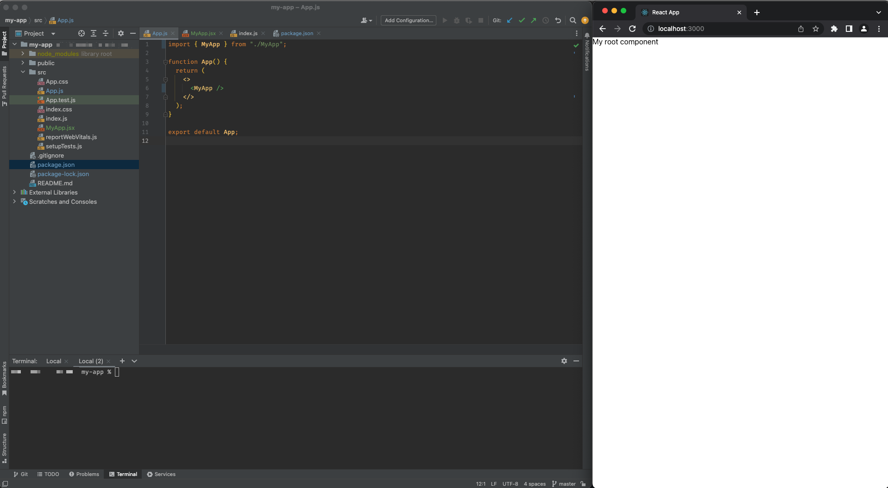

## Prerequisites
  - [React](https://www.npmjs.com/package/react) and [React-DOM](https://www.npmjs.com/package/react-dom) (**16.8.0 or higher**)
  - [Node.js](https://nodejs.org/) - **version 12 or later** (check the version with `node -v`)


## Details
### You will learn
-  How to create a new React application
-  How to connect the application with UI5 web components for React


React is a great front end development tool for building Single Page Applications. UI5 Web Components for React is providing a SAP Fiori-compliant React implementation by leveraging the [UI5 Web Components](https://github.com/SAP/ui5-webcomponents). SAP Fiori provides a consistent and holistic user experience for SAP software. By creating visually pleasing designs with a strong focus on ease of use, the experience is intuitive and simple, across all devices.

This first tutorial will start by creating a React Application which is able to consume UI5 Web Components for React.

---

[ACCORDION-BEGIN [Step : ](Bootstrap the app with create-react-app)]

Navigate to a folder where you want to create your Web App and open a terminal there. Then use the following command:

```sh
npx create-react-app my-app
cd my-app
```

 [Here](https://facebook.github.io/create-react-app/) you can find out more about `create-react-app`.

[DONE]
[ACCORDION-END]
[ACCORDION-BEGIN [Step : ](Install the `ui5-webcomponents-react` npm module)]

To add the UI5 Web Components for React components library open the terminal in your project folder and execute this command:
```sh
npm install @ui5/webcomponents-react --save
```

[DONE]
[ACCORDION-END]
[ACCORDION-BEGIN [Step : ](Create your new root component)]

1. Open the current directory with an editor of your choice (e.g. Visual Studio Code).
1. Inside of your project folder, navigate to `src`. There, create a new file and name it `MyApp.jsx`.
2. Now, add the following lines of code to `MyApp.jsx`.

    ```JSX
    import React from "react";

    export function MyApp() {
      return <div>My root component</div>;
    }
    ```

> **Structure of a React component:** This is a very simple component, but it already shows you the basic structure of all components. The file starts with the import statements in the first few lines. Then, the component will be defined as a function (or as a [class](https://reactjs.org/docs/react-component.html)). This function starts the definitions of the props and the logic, we'll add them in a later tutorial, and ends by returning JSX or HTML components in a return statement.

With this you created your first `React` component. To actually render the component you will have to add it to your `src/App.js`.

[DONE]
[ACCORDION-END]
[ACCORDION-BEGIN [Step : ](Embed your new component)]

3. In `App.js` remove everything inside of the `<div>`. You can also delete the `className` property and the `import` of the logo and `"./App.css"` as they are not needed anymore for this tutorial.
4. Import your created component

    ```JSX
    import { MyApp } from "./MyApp";
    ```
5. Add the component to the `return` value of `App()`

    ```JSX
    function App() {
      return (
        <div>
          <MyApp />
        </div>
      );
    }
    ```

[DONE]
[ACCORDION-END]

[ACCORDION-BEGIN [Step : ](Make your App able to consume UI5 Web Components for React components)]

In `src/App.js` import the `ThemeProvider`

```JSX
import { ThemeProvider } from "@ui5/webcomponents-react/lib/ThemeProvider";
```

Then wrap your application's root component inside of the `ThemeProvider`

```JSX
return (
  <div>
    <ThemeProvider withToastContainer>
      <MyApp />
    </ThemeProvider>
  </div>
);
```

Your `App.js` file should now look like this:

```JSX
import React from "react";
import { MyApp } from "./MyApp";
import { ThemeProvider } from "@ui5/webcomponents-react/lib/ThemeProvider";

function App() {
  return (
    <div>
      <ThemeProvider withToastContainer>
        <MyApp />
      </ThemeProvider>
    </div>
  );
}

export default App;
```


[DONE]
[ACCORDION-END]

[ACCORDION-BEGIN [Step : ](Launch the app to start developing)]
Now you can start the App in development mode. Execute the following command from the root directory of the project

```sh
npm start
```

Open <http://localhost:3000> to view it in the browser.


The page will automatically reload if you make changes to the code. You will see the build errors and lint warnings in the console.

> **Tip:** You can put a browser window next to the editor in your screen to see the changes live in action.
    !

[VALIDATE_1]
[ACCORDION-END]

---
