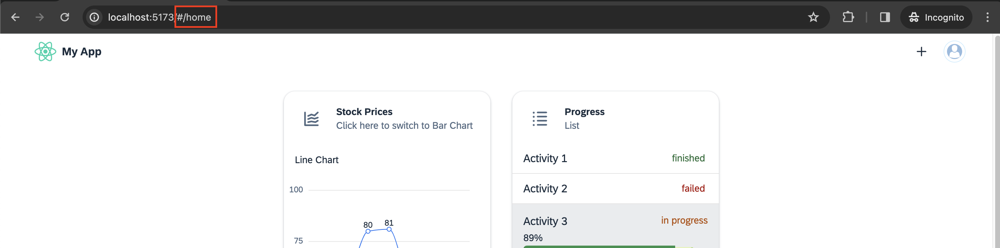
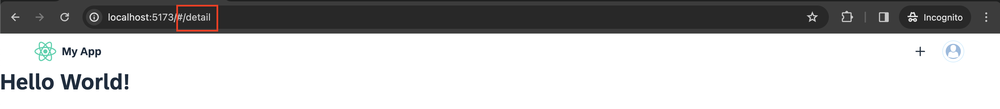

## Details
### You will learn
-  How to refactor code into different React components
-  How to create multiple pages
-  How to use routing


In this tutorial, you will learn how to create routes to different paths of your application. For this you will create a new page and set up routing between the page and the dashboard.

---

[ACCORDION-BEGIN [Step 1: ](Create a Detail page)]
In `src` create a `Detail.jsx` file.

Inside of that file, create the `Detail` component that will return a title to your liking.

```JavaScript / JSX
import React from "react";
import { Title } from "@ui5/webcomponents-react";

export function Detail() {
  return <Title>Hello World!</Title>;
}
```

[DONE]
[ACCORDION-END]
[ACCORDION-BEGIN [Step 2: ](Add Router)]

1. Install `react-router-dom`.

    [React Router](https://reacttraining.com/react-router/web/guides/quick-start) is a collection of navigational components that compose declaratively with your application.

    Execute the following line in the terminal in your root location of the project.

    ```Shell
    npm install react-router-dom --save
    ```

2. Import `HashRouter` in `src/App.js`.

    ```JavaScript / JSX
    import { HashRouter } from "react-router-dom";
    ```

    And wrap your root component inside of it:

    ```JavaScript / JSX
    <HashRouter>
      <ThemeProvider>
        <MyApp />
      </ThemeProvider>
    </HashRouter>
    ```

    > You can replace your `div` with the `HashRouter` as the `HashRouter` also functions as container.

[DONE]
[ACCORDION-END]
[ACCORDION-BEGIN [Step 3: ](Create Home component)]

1. In `src`, create a new `Home.jsx` file.

    For now only create a `Home` component that returns `null`.

    ```JavaScript / JSX
    import React from "react";

    export function Home() {
      return null;
    }
    ```

2. Refactor `MyApp.jsx`.

    Some refactoring is necessary now. Extract every component and the corresponding logic except for the `ShellBar` from `MyApp.jsx` and move it to `Home.jsx`.

    `MyApp.jsx` should now look like this:

    ```JavaScript / JSX
    import React from "react";
    import { Avatar, ShellBar, ShellBarItem } from "@ui5/webcomponents-react";
    import "@ui5/webcomponents-icons/dist/add.js";

    export function MyApp() {
      return (
        <div>
          <ShellBar
            logo={}
            profile={
              <Avatar>
                
              </Avatar>
            }
            primaryTitle="My App"
          >
            <ShellBarItem icon="add" text="Add" />
          </ShellBar>
        </div>
      );
    }
    ```

    And `Home.jsx` like this:

    ```JavaScript / JSX
    import React, { useState } from "react";
    import {
      AnalyticalTable,
      Card,
      CardHeader,
      FlexBox,
      FlexBoxDirection,
      FlexBoxJustifyContent,
      FlexBoxWrap,
      Icon,
      List,
      ProgressIndicator,
      StandardListItem,
      Text,
      Title,
      TitleLevel,
      ValueState
    } from "@ui5/webcomponents-react";
    import { spacing } from "@ui5/webcomponents-react-base";
    import { BarChart, LineChart } from "@ui5/webcomponents-react-charts";
    import "@ui5/webcomponents-icons/dist/line-chart.js";
    import "@ui5/webcomponents-icons/dist/horizontal-bar-chart.js";
    import "@ui5/webcomponents-icons/dist/list.js";
    import "@ui5/webcomponents-icons/dist/table-view.js";

    const dataset = [
      {
        month: "January",
        data: 65
      },
      {
        month: "February",
        data: 59
      },
      {
        month: "March",
        data: 80
      },
      {
        month: "April",
        data: 81
      },
      {
        month: "May",
        data: 56
      },
      {
        month: "June",
        data: 55
      },
      {
        month: "July",
        data: 40
      }
    ];

    const tableData = new Array(500).fill(null).map((_, index) => {
      return {
        name: `name${index}`,
        age: Math.floor(Math.random() * 100),
        friend: {
          name: `friend.Name${index}`,
          age: Math.floor(Math.random() * 100)
        }
      };
    });

    const tableColumns = [
      {
        Header: "Name",
        accessor: "name" // String-based value accessors!
      },
      {
        Header: "Age",
        accessor: "age"
      },
      {
        Header: "Friend Name",
        accessor: "friend.name"
      },
      {
        Header: "Friend Age",
        accessor: "friend.age"
      }
    ];

    export function Home() {
      const [toggleCharts, setToggleCharts] = useState("lineChart");
      const [loading, setLoading] = useState(false);
      const contentTitle =
        toggleCharts === "lineChart" ? "Line Chart" : "Bar Chart";
      const switchToChart =
        toggleCharts === "lineChart" ? "Bar Chart" : "Line Chart";
      const handleHeaderClick = () => {
        if (toggleCharts === "lineChart") {
          setLoading(true);
          setTimeout(() => {
            setLoading(false);
            setToggleCharts("barChart");
          }, 2000);
        } else {
          setLoading(true);
          setTimeout(() => {
            setLoading(false);
            setToggleCharts("lineChart");
          }, 2000);
        }
      };
      return (
        <div>
          <FlexBox
            justifyContent={FlexBoxJustifyContent.Center}
            wrap={FlexBoxWrap.Wrap}
            style={spacing.sapUiContentPadding}
          >
            <Card
              header={
                <CardHeader
                  titleText="Stock Prices"
                  subtitleText={`Click here to switch to ${switchToChart}`}
                  interactive
                  onClick={handleHeaderClick}
                  avatar={
                    <Icon
                      name={
                        toggleCharts === "lineChart"
                          ? "line-chart"
                          : "horizontal-bar-chart"
                      }
                    />
                  }
                />
              }
              style={{ width: "300px", ...spacing.sapUiContentPadding }}
            >
              <Text style={spacing.sapUiContentPadding}>{contentTitle}</Text>
              {toggleCharts === "lineChart" ? (
                <LineChart
                  dimensions={[{ accessor: "month" }]}
                  measures={[{ accessor: "data", label: "Stock Price" }]}
                  dataset={dataset}
                  loading={loading}
                />
              ) : (
                <BarChart
                  dimensions={[{ accessor: "month" }]}
                  measures={[{ accessor: "data" }]}
                  dataset={dataset}
                  loading={loading}
                />
              )}
            </Card>
            <Card
              header={
                <CardHeader
                  titleText="Progress"
                  subtitleText="List"
                  avatar={<Icon name="list" />}
                />
              }
              style={{ width: "300px", ...spacing.sapUiContentPadding }}
            >
              <List>
                <StandardListItem
                  additionalText="finished"
                  additionalTextState={ValueState.Success}
                >
                  Activity 1
                </StandardListItem>
                <StandardListItem
                  additionalText="failed"
                  additionalTextState={ValueState.Error}
                >
                  Activity 2
                </StandardListItem>
                <StandardListItem
                  additionalText="in progress"
                  additionalTextState={ValueState.Warning}
                  style={{ height: "80px" }}
                >
                  <FlexBox direction={FlexBoxDirection.Column}>
                    <Title level={TitleLevel.H5}>Activity 3</Title>
                    <ProgressIndicator value={89} valueState={ValueState.Success} />
                  </FlexBox>
                </StandardListItem>
                <StandardListItem
                  additionalText="in progress"
                  additionalTextState={ValueState.Warning}
                  style={{ height: "80px" }}
                >
                  <FlexBox direction={FlexBoxDirection.Column}>
                    <Title level={TitleLevel.H5}>Activity 4</Title>
                    <ProgressIndicator value={5} valueState={ValueState.Error} />
                  </FlexBox>
                </StandardListItem>
              </List>
            </Card>
            <Card
              header={
                <CardHeader
                  titleText="AnalyticalTable"
                  avatar={<Icon name="table-view" />}
                />
              }
              style={{ maxWidth: "900px", ...spacing.sapUiContentPadding }}
            >
              <AnalyticalTable
                data={tableData}
                columns={tableColumns}
                visibleRows={5}
              />
            </Card>
          </FlexBox>
        </div>
      );
    }
    ```

[DONE]
[ACCORDION-END]
[ACCORDION-BEGIN [Step 4: ](Import Router components)]

1. In `MyApp.jsx`, import `Routes`, `Route` and `Navigate` from `react-router-dom` and the `Home` and `Detail` components.

    ```JavaScript / JSX
    import { Routes, Route, Navigate } from "react-router-dom";
    import { Home } from "./Home";
    import { Detail } from "./Detail";
    ```

2. Wrap your `ShellBar` component inside of [Fragments](https://reactjs.org/docs/fragments.html) and set up paths with `Routes` and the component (`element`) displayed respectively.

    ```JavaScript / JSX
    return (
      <>
        <ShellBar
          logo={}
          profile={
            <Avatar>
              
            </Avatar>
          }
          primaryTitle="My App"
        >
          <ShellBarItem icon="add" text="Add" />
        </ShellBar>
        <Routes>
          <Route path="/home" element={<Home />} />
          <Route path="/detail" element={<Detail />} />
          <Route path="/" element={<Navigate replace to="/home" />} />
        </Routes>
      </>
    );
    ```

The `Navigate` component will redirect the user if the URL doesn't match any given paths.

Your current URL now displays the `#/home` path. If you replace `home` with `detail`, you will be routed to the detail page.





[DONE]
[ACCORDION-END]
[ACCORDION-BEGIN [Step 5: ](Handle navigation)]

Except for changing the URL of the App the user doesn't have options to navigate to the `Detail` page. The page could contain some more information about activities and should therefore be connected to the `Progress Card`.

1. Go into your `Home` component and add `interactive` and `onClick={handleProgressHeaderClick}` to your second `CardHeader` component.

    ```JavaScript / JSX
    <Card
      header={
        <CardHeader
          titleText="Progress"
          subtitleText="List"
          avatar={<Icon name="list" />}
          interactive
          onClick={handleProgressHeaderClick}
        />
      }
      style={{ width: "300px", ...spacing.sapUiContentPadding }}
    >
    ```

2. Define the `handleProgressHeaderClick` function as follows. And import the `useNavigate` hook from `react-router-dom`.

    ```JavaScript / JSX
    import { useNavigate } from "react-router-dom";
    ```
    ```JavaScript / JSX
    const navigate = useNavigate();
    const handleProgressHeaderClick = () => {
      navigate("/detail");
    };
    ```

    Now it is possible to navigate to the `Details` component, but right now, there is no way to go back except for the back button of the browser and typing in the URL manually.

3. Navigate back to the Home Screen

    Normally when you click on the Logo of the app, it should send you back to your `Home` screen. Let's implement that.

    Go into your `MyApp.jsx` file where your `ShellBar` is located and add an `onLogoClick` prop. The function is almost the same as for the `onHeaderClick`, but this time the destination should be the default page.

    ```JavaScript / JSX
    const navigate = useNavigate();
    const handleLogoClick = () => {
      navigate("./");
    };
    ```

    ```JavaScript / JSX
    <ShellBar
      logo={}
      profile={<Avatar image="profilePictureExample.png" />}
      primaryTitle="My App"
      onLogoClick={handleLogoClick}
    >
    ```

[VALIDATE_1]
[ACCORDION-END]
[ACCORDION-BEGIN [Step 6: ](Code overview)]

If needed, you can compare your files with the following code references:

`MyApp.jsx`:

```JavaScript / JSX
import React from "react";
import { Avatar, ShellBar, ShellBarItem } from "@ui5/webcomponents-react";
import "@ui5/webcomponents-icons/dist/add.js";
import { Routes, Route, Navigate } from "react-router-dom";
import { useNavigate } from "react-router-dom";
import { Home } from "./Home";
import { Detail } from "./Detail";

export function MyApp() {
  const navigate = useNavigate();
  const handleLogoClick = () => {
    navigate("./");
  };
  return (
    <>
      <ShellBar
        logo={}
        profile={
          <Avatar>
            
          </Avatar>
        }
        primaryTitle="My App"
        onLogoClick={handleLogoClick}
      >
        <ShellBarItem icon="add" text="Add" />
      </ShellBar>
      <Routes>
        <Route path="/home" element={<Home />} />
        <Route path="/detail" element={<Detail />} />
        <Route path="/" element={<Navigate replace to="/home" />} />
      </Routes>
    </>
  );
}
```

`Home.jsx`:

```JavaScript / JSX
import React, { useState } from "react";
import { useNavigate } from "react-router-dom";
import {
  AnalyticalTable,
  Card,
  CardHeader,
  FlexBox,
  FlexBoxDirection,
  FlexBoxJustifyContent,
  FlexBoxWrap,
  Icon,
  List,
  ProgressIndicator,
  StandardListItem,
  Text,
  Title,
  TitleLevel,
  ValueState
} from "@ui5/webcomponents-react";
import { spacing } from "@ui5/webcomponents-react-base";
import { BarChart, LineChart } from "@ui5/webcomponents-react-charts";
import "@ui5/webcomponents-icons/dist/line-chart.js";
import "@ui5/webcomponents-icons/dist/horizontal-bar-chart.js";
import "@ui5/webcomponents-icons/dist/list.js";
import "@ui5/webcomponents-icons/dist/table-view.js";

const dataset = [
  {
    month: "January",
    data: 65
  },
  {
    month: "February",
    data: 59
  },
  {
    month: "March",
    data: 80
  },
  {
    month: "April",
    data: 81
  },
  {
    month: "May",
    data: 56
  },
  {
    month: "June",
    data: 55
  },
  {
    month: "July",
    data: 40
  }
];

const tableData = new Array(500).fill(null).map((_, index) => {
  return {
    name: `name${index}`,
    age: Math.floor(Math.random() * 100),
    friend: {
      name: `friend.Name${index}`,
      age: Math.floor(Math.random() * 100)
    }
  };
});

const tableColumns = [
  {
    Header: "Name",
    accessor: "name" // String-based value accessors!
  },
  {
    Header: "Age",
    accessor: "age"
  },
  {
    Header: "Friend Name",
    accessor: "friend.name"
  },
  {
    Header: "Friend Age",
    accessor: "friend.age"
  }
];

export function Home() {
  const [toggleCharts, setToggleCharts] = useState("lineChart");
  const [loading, setLoading] = useState(false);
  const navigate = useNavigate();
  const handleProgressHeaderClick = () => {
    navigate("/detail");
  };
  const contentTitle =
    toggleCharts === "lineChart" ? "Line Chart" : "Bar Chart";
  const switchToChart =
    toggleCharts === "lineChart" ? "Bar Chart" : "Line Chart";
  const handleHeaderClick = () => {
    if (toggleCharts === "lineChart") {
      setLoading(true);
      setTimeout(() => {
        setLoading(false);
        setToggleCharts("barChart");
      }, 2000);
    } else {
      setLoading(true);
      setTimeout(() => {
        setLoading(false);
        setToggleCharts("lineChart");
      }, 2000);
    }
  };
  return (
    <div>
      <FlexBox
        justifyContent={FlexBoxJustifyContent.Center}
        wrap={FlexBoxWrap.Wrap}
        style={spacing.sapUiContentPadding}
      >
        <Card
          header={
            <CardHeader
              titleText="Stock Prices"
              subtitleText={`Click here to switch to ${switchToChart}`}
              interactive
              onClick={handleHeaderClick}
              avatar={
                <Icon
                  name={
                    toggleCharts === "lineChart"
                      ? "line-chart"
                      : "horizontal-bar-chart"
                  }
                />
              }
            />
          }
          style={{ width: "300px", ...spacing.sapUiContentPadding }}
        >
          <Text style={spacing.sapUiContentPadding}>{contentTitle}</Text>
          {toggleCharts === "lineChart" ? (
            <LineChart
              dimensions={[{ accessor: "month" }]}
              measures={[{ accessor: "data", label: "Stock Price" }]}
              dataset={dataset}
              loading={loading}
            />
          ) : (
            <BarChart
              dimensions={[{ accessor: "month" }]}
              measures={[{ accessor: "data" }]}
              dataset={dataset}
              loading={loading}
            />
          )}
        </Card>
        <Card
          header={
            <CardHeader
              titleText="Progress"
              subtitleText="List"
              avatar={<Icon name="list" />}
              interactive
              onClick={handleProgressHeaderClick}
            />
          }
          style={{ width: "300px", ...spacing.sapUiContentPadding }}
        >
          <List>
            <StandardListItem
              additionalText="finished"
              additionalTextState={ValueState.Success}
            >
              Activity 1
            </StandardListItem>
            <StandardListItem
              additionalText="failed"
              additionalTextState={ValueState.Error}
            >
              Activity 2
            </StandardListItem>
            <StandardListItem
              additionalText="in progress"
              additionalTextState={ValueState.Warning}
              style={{ height: "80px" }}
            >
              <FlexBox direction={FlexBoxDirection.Column}>
                <Title level={TitleLevel.H5}>Activity 3</Title>
                <ProgressIndicator value={89} valueState={ValueState.Success} />
              </FlexBox>
            </StandardListItem>
            <StandardListItem
              additionalText="in progress"
              additionalTextState={ValueState.Warning}
              style={{ height: "80px" }}
            >
              <FlexBox direction={FlexBoxDirection.Column}>
                <Title level={TitleLevel.H5}>Activity 4</Title>
                <ProgressIndicator value={5} valueState={ValueState.Error} />
              </FlexBox>
            </StandardListItem>
          </List>
        </Card>
        <Card
          header={
            <CardHeader
              titleText="AnalyticalTable"
              avatar={<Icon name="table-view" />}
            />
          }
          style={{ maxWidth: "900px", ...spacing.sapUiContentPadding }}
        >
          <AnalyticalTable
            data={tableData}
            columns={tableColumns}
            visibleRows={5}
          />
        </Card>
      </FlexBox>
    </div>
  );
}
```

[DONE]
[ACCORDION-END]

---
